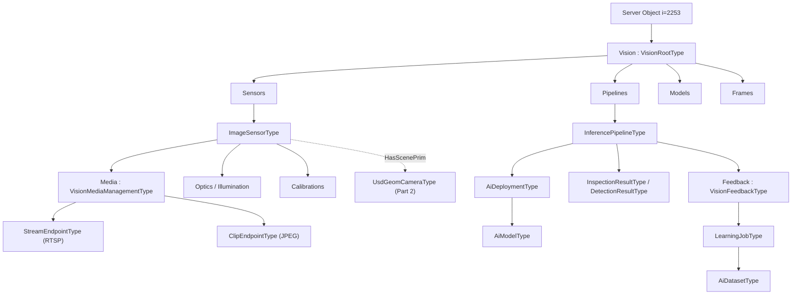

# OPC UA — Vision

> Status: Working-group draft (Release 0.1.0). This document, together with `Opc.Ua.Vision.NodeSet2.xml` and `Opc.Ua.Vision.NodeIds.csv`, defines an OPC UA information model for **machine vision and robotics vision systems**: the sensors, the media they emit, the AI that interprets them, the results they produce, and the path by which corrected results flow back in. It is deliberately **sim/real symmetric** — one model describes a physical camera and a simulated sensor in a renderer such as NVIDIA Isaac Sim identically.
>
> Nothing here is normative, official, or endorsed by the OPC Foundation, the Alliance for OpenUSD, EMVA, DMSC, IDTA or NVIDIA; namespace URIs and NodeIds are **provisional** and for prototyping only. The prior art, the gaps this model fills, and the decisions those gaps forced are recorded in the companion research report, [`OPC-UA-Vision-Research.md`](OPC-UA-Vision-Research.md).

---

## 1 Scope

This specification defines an OPC UA information model that lets a Server describe:

- **what sensors it has** — physical or simulated — and their imaging parameters;
- **where their media can be obtained** — a live stream, a still clip — without carrying pixels over OPC UA;
- **how they are calibrated** and in which coordinate frames their output is expressed;
- **what AI runs on them**, whether that inference happens on the Server or somewhere else entirely;
- **what results they produce**, with content that is actually defined rather than left to the application;
- **how a consumer feeds information back**, including corrections that become training data.

### 1.1 Motivation

Two OPC UA machine vision companion specifications already exist, and a robotics one. None of them describes the four things above. OPC 40100-1 orchestrates jobs but states that result content is *"application-specific and not defined at this time"*. OPC 40100-2 models lenses and lamps in detail but adds **no members at all** to its image sensor type. OPC 40010-1 contains no vision, camera, perception or calibration types whatsoever. And no OPC UA specification describes an AI model. The evidence for each of these statements, with quotations and section numbers, is in [the research report](OPC-UA-Vision-Research.md).

The consequence is that every vision integration is bespoke: two Servers can be fully conformant to the existing specifications and still be mutually unintelligible.

### 1.2 Motivating use cases

- **Inspection.** A fixed camera measures a part. The verdict, the characteristics behind it, and the frame it was computed from are all published, so a downstream system can act on the verdict *and* audit it.
- **Vision-guided robotics.** A camera on a robot flange detects parts in a bin and publishes 6-DoF pick poses in a named frame, with the hand-eye calibration that makes those poses meaningful.
- **Off-server AI.** Inference runs on an edge GPU or in a cloud service. The Server publishes results it did not compute, and clients consume them through exactly the same contract.
- **Synthetic data and learning.** A simulated sensor renders a scene, ground truth is captured as a dataset, a model is trained and promoted, and operator corrections from the production line flow back into the next dataset.
- **Live viewing.** An operator opens the camera's RTSP stream, optionally with detections drawn on it.

### 1.3 What this specification does not do

- It does **not** carry pixels on its default path. Media is brokered by reference (§6); an optional, size-gated inline facet exists for single stills only.
- It does **not** replace GenICam, GigE Vision, USB3 Vision or CoaXPress. Those move and configure image data at the device layer; this model sits above them and borrows their vocabulary without depending on them (Annex E).
- It does **not** define an inspection *program* or *recipe* format. A `RecipeId` identifies one; its content is out of scope, as it is in OPC 40100-1.
- It does **not** require OPC 40100, OPC 40010, DI, Machinery or the OpenUSD models. Interop with each is an optional profile (Annexes C and D).

### 1.4 Capabilities and versioning

Release 0.1.0 covers sensors, media endpoints, frames and calibration, AI model/dataset/deployment/pipeline, results, feedback, and the learning loop. The NodeSet declares exactly one `RequiredModel` — the base OPC UA namespace — so a Server can adopt it without pulling in any companion model.

---

## 2 Normative references

- **OPC 10000-3, -4, -5** — Address Space Model, Services, Information Model. The base UA namespace is the only required model. `Server.ServerCapabilities.MaxByteStringLength` (OPC 10000-5) bounds inline media delivery (§6.4).
- **OPC 10000-6** — Mappings. The channel's negotiated `MaxMessageSize` and the Session's `MaxResponseMessageSize` further bound inline delivery (§6.4).
- **ISO 9787:2013** — *Robots and robotic devices — Coordinate systems and motion nomenclatures*. Source of the frame roles in `VisionFrameRoleEnum`.
- **ISO 14253-1** — *Geometrical product specifications — Inspection by measurement*. Source of the uncertainty semantics and the coverage factor in §5.10 and §7.2.
- **RFC 2326** — Real-Time Streaming Protocol 1.0. The mandatory default streaming protocol (§6.2). RTSP 2.0 (RFC 7826) is **not** backward compatible with 1.0 and is an optional additional protocol; `StreamEndpointType.ProtocolVersion` distinguishes them.
- **ISO/IEC 10918** — JPEG. The mandatory default clip format (§6.2).

Informative alignments — GenICam SFNC and PFNC, QIF (ISO 23952), ROS 2 `vision_msgs`, IDTA 02058/02059/02060 — are listed in Annex E. They are **not** normative references and impose no dependency.

---

## 3 Terms, definitions and abbreviations

| Term | Definition |
|---|---|
| **Sensor** | A source of imagery or range data, physical or simulated. Modelled as `VisionSensorType`. |
| **Media endpoint** | A described access point at which media can be obtained. Modelled as `MediaEndpointType`. |
| **Clip** | A single still image associated with a moment or a result. |
| **Stream** | Continuous media, obtained by leasing a session. |
| **Inline delivery** | The optional publication of an encoded clip as an OPC UA `ByteString`, subject to a size limit. |
| **Result** | A published outcome of interpreting sensor data — an inspection verdict or a set of detections. |
| **Characteristic** | One measured property of an inspected part, with nominal, actual, tolerance and uncertainty. |
| **Detection** | One detected instance, with a class, a score, and geometry. |
| **Deployment** | A model made executable at a stated location. |
| **On-server / off-server inference** | Whether the computation happens in the Server's process or elsewhere. Distinguished by `VisionInferenceLocationEnum`, and by nothing else. |
| **Sim/real symmetry** | The property that a physical and a simulated sensor expose the same members with the same meaning. |
| **PFNC** | Pixel Format Naming Convention (EMVA GenICam). Used for pixel format strings. |
| **SFNC** | Standard Features Naming Convention (EMVA GenICam). Used for acquisition parameter names. |
| **TCP** | Tool centre point (ISO 9787). A frame role, not the transport protocol. |

---

## 4 Overview and concepts

### 4.1 The layered contract

This model occupies one layer of a stack it does not attempt to own:

```text
   Enterprise / lifecycle        Asset Administration Shell, MES, MLOps
        ^
   THIS SPECIFICATION            sensors - media endpoints - AI - results - feedback
        ^                        (semantics and control plane)
   Device control API            GenICam: GenApi, SFNC, PFNC, GenTL, GenDC
        ^
   Pixel transport               GigE Vision, USB3 Vision, CoaXPress, MIPI CSI-2
```

A Server implementing this model almost always uses GenICam internally to talk to its cameras. That is invisible here by design, and is why `VisionSensorType.DeviceUri` exists: it lets a client correlate the semantic sensor with the transport-level device without this model reaching down into it.

### 4.2 Discovery (normative)

A conforming Server **shall** expose exactly one well-known Object `Vision` of type `VisionRootType` as a component of the Server Object (`i=2253`), with BrowseName `1:Vision`. It contains:

- `Sensors` (Mandatory) — every `VisionSensorType` instance;
- `Pipelines`, `Models`, `Frames`, `LearningJobs` (Optional).

A client therefore starts at `Server/Vision/Sensors` and follows references outward. This mirrors the discovery pattern of *OPC UA — OpenUSD Bindings*.

### 4.3 Sim/real symmetry (normative)

Every `VisionSensorType` instance **shall** declare `RealityKind`. A Server **shall not** vary the meaning, units or semantics of any other member based on its value. A sensor whose `RealityKind` is `Simulated` or `Hybrid` **shall** additionally implement `IVisionSimulatedType`, which names the simulator and the scene prim being rendered.

The intent is that a client written against `VisionSensorType` works unchanged against a physical camera, against its digital twin, and against a purely synthetic sensor used to generate training data.

### 4.4 Architecture



---

## 5 Information model

### 5.1 `VisionRootType : BaseObjectType`

The single entry point (§4.2). Holds the five folders and nothing else.

### 5.2 `VisionSensorType : BaseObjectType` (abstract)

The base of everything that senses.

| Member | Type | Rule | Meaning |
|---|---|---|---|
| `SensorId` | String | M | Unique within the Server |
| `RealityKind` | `VisionRealityKindEnum` | M | Physical, Simulated or Hybrid |
| `Modality` | `VisionSensorModalityEnum` | M | Area2D, Line2D, Depth3D, Thermal, … |
| `Manufacturer`, `Model`, `SerialNumber` | — | O | Nameplate |
| `DeviceUri` | String | O | Transport-level device identity, e.g. a GigE Vision device id |
| `FrameId` | String | O | This sensor's own camera frame |
| `Media` | `VisionMediaManagementType` | **M** | Media endpoints and their control surface |
| `Optics` | `OpticsType` | O | The lens |
| `Illumination` | `IlluminationType` | O | The light source |
| `Calibrations` | Folder | O | `VisionCalibrationType` instances |

`Media` is mandatory because a sensor a client cannot obtain imagery from is not usefully described.

### 5.3 `ImageSensorType : VisionSensorType`

The 2-D imaging sensor, and the layer OPC 40100-2 leaves empty. Acquisition parameters use **GenICam SFNC 2.8 names and semantics**, and `PixelFormat` uses **PFNC** naming, so that a Server bridging a GenICam device maps them one-to-one and a client that knows SFNC needs no translation table.

Mandatory: `Width`, `Height`, `PixelFormat`. Optional: `ExposureTime` (microseconds), `Gain`, `AcquisitionFrameRate`, `TriggerMode`, `TriggerSource`, `OffsetX`, `OffsetY`, `BinningHorizontal`, `BinningVertical`, `ReverseX`, `ReverseY`, and `Intrinsics`.

Borrowing the names is deliberate; taking a dependency is not. Nothing here requires a GenICam device.

### 5.4 `Depth3DSensorType : VisionSensorType`

Depth and point-cloud sensing: `MinDepth`, `MaxDepth`, `DepthScale`, `Baseline`, `PointsPerFrame`. Point clouds are large and are obtained through a media endpoint, never read as an OPC UA array.

### 5.5 `OpticsType` and `IlluminationType`

Lens and light-source description. Member names are aligned with the `ILensType`, `ILampType` and `ILightingControllerType` of OPC 40100-2, so a Server implementing both models reports one set of values under two vocabularies rather than maintaining two.

### 5.6 Frames and calibration

`CoordinateFrameType` names a frame, gives it a `Role` from the ISO 9787 vocabulary, and links it to its `ParentFrame`. Frames form a tree, so a client can compose a chain from a camera frame to a world frame.

`VisionCalibrationType` (abstract) carries the provenance a client needs to decide whether to trust a calibration: `CalibrationId`, `PerformedAt`, `Valid`, `ResidualError`, `Method`.

- `IntrinsicCalibrationType` adds `Intrinsics`.
- `ExtrinsicCalibrationType` adds `Mount` (`EyeInHand`, `EyeToHand`, `Fixed`), `SourceFrame`, `TargetFrame` and `Transform`.

**Design note.** ISO 9787 standardises *which* frames exist; **no** ISO, IEC, VDI or ANSI standard defines the hand-eye calibration *procedure*. Only the outcome is portable, so this model carries the outcome — the transform, the arrangement it applies to, and its residual — and says nothing about how it was obtained.

### 5.7 `IVisionSimulatedType : BaseInterfaceType`

Applied to a simulated or hybrid sensor. Mandatory `SimulatorUri`, `StageIdentifier` and `PrimPath`; optional `GroundTruthAvailable` and `RandomizationSeed`. `StageIdentifier` and `PrimPath` reuse the identity contract of the OpenUSD specifications verbatim, so a synthetic sensor is addressable in exactly the terms a scene already uses (Annex C).

### 5.8 DataTypes

Enumerations: `VisionRealityKindEnum`, `VisionStreamProtocolEnum`, `VisionClipFormatEnum`, `VisionVideoCodecEnum`, `VisionEndpointStateEnum`, `VisionEndpointAuthenticationEnum`, `VisionInferenceLocationEnum`, `VisionAcceleratorKindEnum`, `VisionResultEvaluationEnum`, `VisionToleranceStatusEnum`, `VisionFeedbackPurposeEnum`, `VisionCalibrationMountEnum`, `VisionFrameRoleEnum`, `VisionDistortionModelEnum`, `VisionSensorModalityEnum`, `VisionLearningJobStateEnum`, `VisionDatasetSourceEnum`.

Structures: `VisionPose3DDataType`, `VisionBoundingBox2DDataType`, `VisionBoundingBox3DDataType`, `VisionImageReferenceDataType`, `VisionIntrinsicsDataType`, `VisionDetectionDataType`, `VisionCharacteristicDataType`, `VisionStreamSessionDataType`, `VisionTensorSignatureDataType`.

Full field-level detail — DataType, ValueRank, ModellingRule, structure fields, enumeration values and Method signatures — is in the generated Annex A. Units and orderings for every quantity are fixed normatively in §5.10.

### 5.9 ReferenceTypes

Each ReferenceType subtypes `NonHierarchicalReferences`. The following constraints are **normative**; a Server **shall not** use these ReferenceTypes with other SourceNode or TargetNode types.

| ReferenceType | InverseName | SourceNode | TargetNode | Cardinality |
|---|---|---|---|---|
| `HasCalibration` | `IsCalibrationOf` | `VisionSensorType` | `VisionCalibrationType` | 0..n, at most one *valid* per calibration kind |
| `MountedOn` | `HasMounted` | `VisionSensorType` | `CoordinateFrameType` | 0..1 |
| `HasScenePrim` | `IsScenePrimOf` | `VisionSensorType` | a materialized camera prim (Annex C) | 0..1 |
| `UsesModel` | `IsUsedByPipeline` | `AiDeploymentType` | `AiModelType` | **exactly 1** |
| `ProducedBy` | `Produces` | `VisionResultType` | `InferencePipelineType` | 0..1 |

The following are **normative**:

- An `AiDeploymentType` instance **shall** have exactly one `UsesModel` reference to an `AiModelType` instance. This is the only defined path from a result to the model artefact and its `Digest`, and §12.6 depends on it.
- A `VisionResultType` instance **shall** identify its producer either by the `Pipeline` Property or by a `ProducedBy` reference. Where both are present they **shall** designate the same `InferencePipelineType` instance; a client **shall** treat the `ProducedBy` reference as authoritative.
- Where a sensor is calibrated, it **shall** carry a `HasCalibration` reference to each applicable calibration in addition to listing it under `Calibrations`.

### 5.10 Units, encodings and conventions (normative)

Every physical quantity in this model is fixed here. A Server **shall** use these units and orderings, and **shall not** substitute others.

| Member or field | Unit / encoding |
|---|---|
| `ImageSensorType.ExposureTime` | microseconds |
| `ImageSensorType.Width`, `Height`, `OffsetX`, `OffsetY` | pixels |
| `VisionPose3DDataType.Position` | metres, ordered (x, y, z) |
| `VisionPose3DDataType.Orientation` | **unit quaternion ordered (x, y, z, w)** |
| `VisionPose3DDataType.Covariance` | row-major 6×6 over (x, y, z, rx, ry, rz), rotations in radians; an **empty array** means not reported |
| `VisionBoundingBox2DDataType` | pixels; origin is the **top-left** pixel; `Rotation` is **degrees clockwise** about the box centre |
| `VisionBoundingBox3DDataType.Size` | metres, ordered (x, y, z) |
| `VisionIntrinsicsDataType.Fx`, `Fy`, `Cx`, `Cy` | pixels, in the top-left-origin image frame |
| `OpticsType.FocalLength` | millimetres |
| `OpticsType.WorkingDistance`, `MinimumWorkingDistance` | metres |
| `IlluminationType.Wavelength` | nanometres |
| `IlluminationType.RelativeIntensity`, `Quality` | percent (0–100) |
| `Depth3DSensorType.MinDepth`, `MaxDepth`, `Baseline` | metres |
| `StreamEndpointType.Bitrate` | bits per second |
| `StreamEndpointType.FrameRate`, `ImageSensorType.AcquisitionFrameRate` | frames per second |
| `Confidence`, `VisionDetectionDataType.Confidence` | 0.0 to 1.0 inclusive |
| `ClipEndpointType.Quality` | 0 to 100, format-defined |
| `MaxInlineClipSize`, `MaxInlineFeedbackImageSize`, `SizeBytes` | bytes |
| `PixelFormat` | a GenICam **PFNC** name, e.g. `Mono8`, `BayerRG12`, `RGB8` |
| `DigestAlgorithm` | an IANA hash-function name; the default is `SHA-256` |

**Measurement uncertainty.** `VisionCharacteristicDataType.Uncertainty` is the **expanded** uncertainty at **coverage factor k = 2** (approximately 95 %), per ISO 14253-1, expressed in the same unit as `Actual`. A value of `0` means uncertainty is not reported, and a Server that does not evaluate uncertainty **shall** report `0` rather than a guess. Without a fixed coverage factor the §7.2 `NotDecidable` rule would not be reproducible between Servers, so a Server **shall not** report uncertainty at another coverage factor.

**Distortion coefficient ordering.** `VisionIntrinsicsDataType.DistortionCoefficients` **shall** be ordered per `DistortionModel`:

| `DistortionModel` | Ordering |
|---|---|
| `None` | empty array |
| `BrownConrady` | k1, k2, p1, p2, k3 (further radial terms k4, k5, k6 may follow) |
| `KannalaBrandt` | k1, k2, k3, k4 |
| `RationalPolynomial` | k1, k2, p1, p2, k3, k4, k5, k6 |
| `Other` | undefined; a client **shall not** attempt to undistort |

**Structure field optionality.** The structures of this specification are plain structures: every field is always encoded. Optionality is expressed by explicit `Has…` Boolean fields. Where a `Has…` field is `false`, the corresponding field **shall** be encoded with default values and a client **shall** ignore its content. Where a field has no `Has…` companion, the sentinel for "not reported" is: empty array (`Covariance`, `DistortionCoefficients`), `0` (`Uncertainty`), empty `ByteString` (`Digest`), or empty `String` (`TrackId`, `Uri`).

**NodeId-valued Properties.** A Property whose DataType is `NodeId` (`Sensor`, `Pipeline`, `Deployment`, `ParentFrame`, `SourceFrame`, `TargetFrame`, `PreferredStreamEndpoint`, `PreferredClipEndpoint`, `Dataset`, `BaseModel`, `CandidateModel`) **shall** contain either a NodeId resolvable in the same Server or a null NodeId. A null NodeId means "not set"; a Server **shall not** use a non-null NodeId that does not resolve.

---

## 6 Media endpoints (normative)

### 6.1 The default path

**Media is obtained out-of-band.** OPC UA describes and controls the endpoint; the bytes travel over RTSP or HTTP. This preserves the layering of §4.1, keeps OPC UA payloads small, and keeps subscription semantics meaningful.

### 6.2 Mandatory defaults

A Server claiming the *VIS-Media-Rtsp* facet **shall** expose, for every sensor, at least one `StreamEndpointType` instance whose `StreamProtocol` is **`Rtsp`**. A Server claiming the *VIS-Media-Jpeg* facet **shall** expose, for every sensor, at least one `ClipEndpointType` instance whose `ClipFormat` is **`Jpeg`**. Both facets are required by *VIS-Base* (§11), so for any conformant Server both hold.

Every other protocol (`Rtsps`, `WebRtc`, `Srt`, `Hls`, `Mjpeg`, `GenDc`) and every other format (`Png`, `Tiff`, `Bmp`, `WebP`, `GenDc`) is **optional**. A client may therefore assume, without negotiation, that RTSP and JPEG are available.

`Rtsp` is value 0 of `VisionStreamProtocolEnum` and `Jpeg` is value 0 of `VisionClipFormatEnum`; the repository validator enforces both, so the guarantee cannot drift. The `StreamEndpoints` and `ClipEndpoints` folders each declare a `MandatoryPlaceholder` member, so the requirement is discoverable from the type and not only from this clause.

RTSP means **RTSP/1.0 (RFC 2326)** unless `ProtocolVersion` says otherwise. RTSP 2.0 is not backward compatible, so a Server offering only 2.0 **shall not** claim *VIS-Media-Rtsp*.

### 6.3 Selecting and configuring endpoints

`VisionMediaManagementType` holds `StreamEndpoints` and `ClipEndpoints` folders, the `PreferredStreamEndpoint` and `PreferredClipEndpoint` pointers, and the Methods defined in §6.5.

**Endpoint selection (normative).** `GetStreamEndpoint` and `GetClip` each take an `Endpoint` argument. When it is null the Server **shall** use `PreferredStreamEndpoint` / `PreferredClipEndpoint`; when that pointer is also null the Server **shall** select the first endpoint in the corresponding folder, in BrowseName order, that satisfies the request. Both Methods return the `Endpoint` actually used, so the choice is never ambiguous to the caller.

Where `GetClip.Format` and the selected endpoint's `ClipFormat` differ, the **argument wins**: the Server either transcodes or returns `Bad_NotSupported` (§6.5). `Jpeg` is always supported by at least one endpoint (§6.2).

`PreferredProtocol` on `GetStreamEndpoint` is advisory: the Server returns what it can serve, which is at minimum RTSP.

### 6.4 Optional inline clip delivery

A `ClipEndpointType` **may** additionally publish the encoded image inline, so that clients can `Read` it or, more usefully, **subscribe to it with a MonitoredItem**. The value changes once per acquisition, which suits one-image-per-inspected-part operation.

This facet is governed by five rules:

1. **The out-of-band path remains the default.** Inline delivery is optional, is declared by the *VIS-Media-Inline* facet, and a Server is fully conformant without it. `InlineDeliveryEnabled` states whether it is active.
2. **Size is bounded, and the bound is a Server capability.** A Server implementing this facet **shall** publish `Server.ServerCapabilities.MaxByteStringLength`, and `MaxInlineClipSize` **shall not** exceed it. A Server **shall not** publish an inline clip larger than `MaxInlineClipSize`. Where a Session's `MaxResponseMessageSize`, or the channel's negotiated `MaxMessageSize`, is smaller than `MaxInlineClipSize`, the Server **shall** treat that Session as though `MaxInlineClipSize` were the smaller value and apply rule 3 accordingly. `MaxByteStringLength` is a Server-wide capability rather than a per-Session negotiated value; this rule is what makes one published bound safe for Sessions with differing message limits.
3. **Overflow is explicit.** When the encoded image exceeds the effective limit of rule 2, the Server **shall** set the `LatestClip` StatusCode to **`Bad_EncodingLimitsExceeded`** and **shall not** truncate. The client **shall** fall back to `LatestClipMetadata.Uri`, which remains valid.
4. **Correlation is defined.** A Server **shall** update `LatestClip` and `LatestClipMetadata` so that both reflect the same acquisition, and where both are reported in a Subscription they **shall** be reported in the same NotificationMessage. A client **shall** use `LatestClipMetadata.Timestamp` together with `Digest` as the correlation key, and **shall not** assume that two independently received values belong to the same frame.
5. **Initial and disabled states are defined.** Before the first acquisition a Server **shall** report both `LatestClip` and `LatestClipMetadata` with StatusCode `Bad_NoDataAvailable`. Where `InlineDeliveryEnabled` is `false` the Server **shall** report `LatestClip` with StatusCode `Bad_NotSupported`; `LatestClipMetadata` remains readable.

A Server **should** offer a reduced-resolution or reduced-quality thumbnail profile that fits the limit, rather than persistently returning `Bad_EncodingLimitsExceeded`.

`GetClip` follows the same discipline: it always returns a descriptor carrying a `Uri`, and returns bytes in `InlineImage` only when `RequestInline` is true **and** the encoded image fits.

**Inline delivery is not a video path.** It exists for single stills. A client that wants continuous imagery uses a `StreamEndpointType`.

### 6.5 Media Method definitions (normative)

Argument order is as declared in Annex A. A null or empty argument means "not specified" unless stated otherwise. A Server **shall** return the listed StatusCode when the stated condition holds, and **shall not** return `Good` in that case.

**`GetStreamEndpoint(Endpoint, ProfileName, PreferredProtocol) → (Session, Endpoint)`** — leases a stream. `Endpoint` null selects per §6.3; `ProfileName` empty selects the endpoint's default profile. The returned `Session.Uri` **may** embed a single-use or time-limited credential, which is why it is a Method result and not a browsable Variable. A Server **shall** set `Session.ExpiresAt` and **shall** expire the lease then, even if `ReleaseStreamEndpoint` is never called.

| StatusCode | Condition |
|---|---|
| `Bad_NotFound` | `Endpoint` is non-null but is not a `StreamEndpointType` of this sensor |
| `Bad_InvalidArgument` | `ProfileName` is non-empty and unknown to the selected endpoint |
| `Bad_ResourceUnavailable` | `ActiveSessions` has reached `MaxSessions` |
| `Bad_NotSupported` | no endpoint can serve `PreferredProtocol` and the caller rejected the fallback |
| `Bad_UserAccessDenied` | the caller is not authorized for media access (§12.1) |

**`ReleaseStreamEndpoint(SessionToken)`** — ends a lease. Releasing an already-expired or already-released token is **not** an error: a Server **shall** return `Good`, so a client's cleanup path is idempotent.

| StatusCode | Condition |
|---|---|
| `Bad_NotFound` | `SessionToken` was never issued by this Server |

**`ConfigureStreamEndpoint(Endpoint, Codec, Width, Height, FrameRate, Bitrate)`** — changes encoding parameters. A Server **shall** either apply the request exactly, or clamp each unsupported value to the nearest supported one and return `Good_Clamped`, or reject with `Bad_OutOfRange`. It **shall not** silently apply a different value and return `Good`. The effective values are readable on the endpoint afterwards.

| StatusCode | Condition |
|---|---|
| `Good_Clamped` | one or more values were clamped to a supported value |
| `Bad_NotFound` | `Endpoint` is not a `StreamEndpointType` of this sensor |
| `Bad_OutOfRange` | a value is unsupported and the Server does not clamp |
| `Bad_NotSupported` | `Codec` is not supported by the endpoint |
| `Bad_InvalidState` | the endpoint has active sessions and cannot be reconfigured |

**`SelectEndpoint(StreamEndpoint, ClipEndpoint)`** — sets the preferred pointers. A null argument leaves that pointer unchanged.

| StatusCode | Condition |
|---|---|
| `Bad_NotFound` | an argument is non-null and does not resolve |
| `Bad_TypeMismatch` | an argument resolves to a node of the wrong endpoint kind |

**`GetClip(Endpoint, ResultId, Timestamp, Format, RequestInline) → (Image, Endpoint, InlineImage)`** — returns the still associated with `ResultId`, or the frame nearest `Timestamp` when `ResultId` is empty. Exactly one selector **shall** be supplied. `Image` is always populated with a resolvable `Uri`; `InlineImage` is populated only when `RequestInline` is true and the encoded image fits the effective limit of §6.4 rule 2, and is otherwise empty with `Image.Uri` still valid.

| StatusCode | Condition |
|---|---|
| `Bad_InvalidArgument` | `ResultId` empty **and** `Timestamp` null, or both supplied |
| `Bad_NotFound` | `ResultId` unknown, or no frame near `Timestamp` within retention |
| `Bad_NotSupported` | `Format` cannot be produced by any clip endpoint of this sensor |
| `Bad_UserAccessDenied` | the caller is not authorized for media access (§12.1) |

### 6.6 Endpoint state model (normative)

`VisionEndpointStateEnum` is used by `MediaEndpointType`, `AiDeploymentType` and `InferencePipelineType`. All transitions are **Server-driven**; no Method sets `State` directly.

| State | Media endpoint | Deployment | Pipeline |
|---|---|---|---|
| `Inactive` | declared, not serving | model not loaded | not bound, or disabled |
| `Ready` | able to serve, no session | model loaded, idle | bound, awaiting a trigger |
| `Active` | at least one session leased | executing inference | producing results |
| `Degraded` | serving below configured quality | exceeding `LatencyBudget` | producing results at reduced quality or rate |
| `Faulted` | unable to serve | model failed to load or execute | unable to produce results |

A Server **shall** report `Degraded` rather than `Active` when it knows the configured quality, latency budget or rate is not being met, and `Faulted` rather than `Inactive` when the cause is a failure rather than configuration.

---

## 7 Result semantics (normative)

This clause is the reason the specification exists. OPC 40100-1, OPC 40001-101 and OPC 40210 all type their result payload as `BaseDataType[]` and decline to define it. This model defines it.

### 7.1 `VisionResultType` (abstract)

Mandatory `ResultId` and `CreationTime`. Optional `Sensor`, `Pipeline`, `Frame` (a `VisionImageReferenceDataType`), and the trust members `ModelVersionUsed`, `Confidence` and `ExplanationUri`.

The trust members are not decoration. Where a deployment falls under a high-risk regime, the question *"which model version produced this decision, and on what basis"* must be answerable from the address space rather than reconstructed from logs (§12.5).

### 7.2 `InspectionResultType`

The machine-vision outcome. Mandatory `Evaluation` and `Characteristics`; optional `PartId` and `RecipeId`.

`VisionResultEvaluationEnum` reuses the value semantics of the OPC 40001-101 `ResultEvaluationEnum` — `Undefined`, `Ok`, `NotOk`, `NotDecidable` — so a client already consuming Machinery results needs no new interpretation rules.

`VisionCharacteristicDataType` mirrors the QIF (ISO 23952) Results field set: `Nominal`, `Actual`, `Deviation`, `LowerTolerance`, `UpperTolerance`, `Unit`, **`Uncertainty`** and `Status`. Units, the sentinel for "not reported", and the coverage factor are fixed in §5.10.

Uncertainty is what makes a verdict reproducible by a third party, and it is the reason `NotDecidable` exists. The rule is normative: where the interval `Actual ± Uncertainty` crosses a tolerance limit, a Server **shall** report `Status = Indeterminate` for that characteristic, and **shall not** assert `Ok` or `NotOk` for the result on the strength of the point estimate alone. Where any characteristic is `Indeterminate`, the result `Evaluation` **shall** be `NotDecidable` unless another characteristic is independently `OutOfTolerance`, in which case it **shall** be `NotOk`. Because §5.10 fixes the coverage factor at k = 2, two conformant Servers presented with the same measurement reach the same verdict.

### 7.3 `DetectionResultType`

The robotics-vision outcome. Mandatory `Detections`; optional `FrameId` naming the frame that detection poses are expressed in.

`VisionDetectionDataType` follows ROS 2 `vision_msgs` conventions: a class label and id, a confidence, an optional 2-D box, an optional 3-D box, an optional 6-DoF `Pose`, and an optional `TrackId`. The `HasBoundingBox2D`, `HasBoundingBox3D` and `HasPose` flags state which geometry is meaningful, and the rule governing them is in §5.10: where a flag is `false` a client **shall** ignore the corresponding field's content.

A pose is only actionable if its frame is known, which is why `VisionPose3DDataType` carries `FrameId` and why §5.6 exists. A Server **shall** populate `FrameId` with the `FrameId` of a `CoordinateFrameType` instance that exists in the same Server.

### 7.4 `SegmentationResultType`

Mandatory `Mask`, a `VisionImageReferenceDataType`. Masks are images and follow the media rules of §6; they are referenced, not inlined into the result.

---

## 8 AI integration (normative)

### 8.1 Model, dataset, deployment

`AiModelType` is a model nameplate: identity, version, framework, format, task kind, digest, provenance, label classes, and input/output tensor signatures. `AiDatasetType` describes training or validation data, including `SourceKind` — `Real`, `Synthetic` or `Mixed` — which is the provenance a reviewer needs when synthetic data is involved. `AiDeploymentType` makes a model executable somewhere.

All three align member-for-member with the IDTA submodel templates **02060** (AI Model Nameplate), **02058** (AI Dataset) and **02059** (AI Deployment), which are currently the only standardised description of an industrial AI model. An Asset Administration Shell can therefore be populated from these nodes without loss (Annex E).

### 8.2 On-server and off-server inference

`AiDeploymentType.InferenceLocation` is mandatory and takes one of `OnServer`, `EdgeOffServer`, `Cloud`, `InSimulator`.

**This property changes where computation happens and therefore the trust boundary. It changes nothing else.** A Server **shall** publish results through the same types, with the same members and the same meaning, regardless of its value. When inference is off-server the Server publishes results it did not compute; a client that does not care where inference ran does not have to look.

For off-server deployments, `EndpointUri` names the inference service and `LatencyBudget` states the latency it is expected to meet, so a client can detect regression rather than merely observing it.

### 8.3 `InferencePipelineType`

Binds a `Sensor` to a `Deployment`, exposes `State` and `Continuous`, holds a `Results` folder and an optional `Feedback` object, and offers `RunInference`, `StartContinuous` and `Stop`.

A Server whose inference is entirely off-server and continuously running may implement none of the three Methods; the pipeline still describes the binding and publishes the results.

### 8.4 Inference Method definitions (normative)

**`RunInference(Timestamp) → (ResultId)`** — runs inference once on the frame nearest `Timestamp`, or on the newest frame when `Timestamp` is null, and returns the identifier of the result produced. The result **shall** exist and be retrievable under `Results` before the Method returns `Good`.

| StatusCode | Condition |
|---|---|
| `Bad_InvalidState` | `State` is `Inactive` or `Faulted` |
| `Bad_NotFound` | no frame exists near `Timestamp` within retention |
| `Bad_ResourceUnavailable` | an off-server deployment is unreachable |
| `Bad_Timeout` | inference exceeded the deployment's `LatencyBudget` and was abandoned |
| `Bad_UserAccessDenied` | the caller is not authorized to trigger inference |

**`StartContinuous()`** and **`Stop()`** — start and stop per-frame inference. Both are **idempotent**: calling `StartContinuous` while `Continuous` is already true, or `Stop` while it is already false, **shall** return `Good` and change nothing.

| StatusCode | Condition |
|---|---|
| `Bad_InvalidState` | `State` is `Inactive` or `Faulted` (`StartContinuous` only) |
| `Bad_ResourceUnavailable` | an off-server deployment is unreachable (`StartContinuous` only) |
| `Bad_UserAccessDenied` | the caller is not authorized |

On success `StartContinuous` **shall** set `Continuous` to true and drive `State` toward `Active`; `Stop` **shall** set `Continuous` to false and drive `State` toward `Ready` (§6.6).

---

## 9 Feedback and the learning loop (normative)

### 9.1 The return path

`VisionFeedbackType` serves three purposes with one surface:

- **Overlay** — submitted geometry is drawn onto the outgoing stream, governed by `OverlayEnabled`, `OverlayStyle` and `OverlayTtl`.
- **Reconciliation** — a downstream verdict is recorded against a result, so what the line concluded can be compared with what the vision system reported.
- **Ground-truth labelling** — a correction is retained as labelled training data.

`VisionFeedbackPurposeEnum` states which applies. The Methods are `SubmitDetections`, `SubmitInspectionResult`, `SubmitCorrection` and `SubmitImageReference`.

### 9.2 Feedback images

Feedback images follow exactly the discipline of §6.4. `SubmitImageReference` — passing a `VisionImageReferenceDataType` — is the **default** path. `SubmitDetections` and `SubmitCorrection` each additionally accept an optional inline `ByteString`, which a Server **shall** accept only within `MaxInlineFeedbackImageSize`, itself bounded as in §6.4 rule 2. An oversized payload **shall** be rejected with **`Bad_EncodingLimitsExceeded`**, and the client **shall** retry by reference.

### 9.3 Closing the loop

`LearningJobType` is where corrections accumulate and become a new model version. Its `State` moves through `Idle`, `Collecting`, `Labelling`, `Training`, `Validating`, `Ready`, `Promoted` or `Failed`, and it links a `Dataset`, a `BaseModel` and a `CandidateModel`.


A Server **may** implement only the capture stages and leave training to an external MLOps system; the state machine is the same either way, and `TriggerTraining` simply reports whether the request was queued.

`PromoteModel` changes what the system decides. A Server **should** require a distinct authorization for it, separate from the authorization that permits ordinary feedback.

### 9.4 Feedback and learning Method definitions (normative)

Every Method in this clause is a **write** and **shall** be authorized independently (§12.5). None of them changes a published result: a correction is recorded alongside the original, never in place of it, so the audit trail is preserved.

**`SubmitDetections(Purpose, Detections, FrameReference, InlineImage)`** and **`SubmitCorrection(ResultId, Purpose, CorrectedDetections, CorrectedCharacteristics, Reason, InlineImage)`** — `InlineImage` is optional and **shall** be accepted only within `MaxInlineFeedbackImageSize`, itself bounded as in §6.4 rule 2. For `SubmitCorrection`, exactly one of `CorrectedDetections` and `CorrectedCharacteristics` **shall** be non-empty, matching the kind of the referenced result.

**`SubmitInspectionResult(ResultId, Evaluation, Characteristics)`** — records a downstream verdict against an existing result for reconciliation.

**`SubmitImageReference(Purpose, Image, ResultId)`** — the default feedback-image path. `ResultId` may be empty when the image is not tied to a result.

| StatusCode | Condition | Applies to |
|---|---|---|
| `Bad_NotFound` | `ResultId` is non-empty and unknown | all four |
| `Bad_InvalidArgument` | `Detections` empty; or `SubmitCorrection` supplies both or neither corrected array | `SubmitDetections`, `SubmitCorrection` |
| `Bad_TypeMismatch` | the corrected array kind does not match the referenced result | `SubmitCorrection` |
| `Bad_EncodingLimitsExceeded` | `InlineImage` exceeds `MaxInlineFeedbackImageSize` | `SubmitDetections`, `SubmitCorrection` |
| `Bad_NotSupported` | `Purpose` is `Overlay` but `OverlayEnabled` is false | `SubmitDetections`, `SubmitImageReference` |
| `Bad_UserAccessDenied` | the caller is not authorized to write feedback | all four |

A Server that accepts a correction with `Purpose = GroundTruthLabel` **shall** either retain it for the associated `LearningJobType` or return `Bad_NotSupported`; it **shall not** return `Good` and discard it, because a client has no other way to learn that its label was dropped.

**`StartCollection()`**, **`StopCollection()`**, **`TriggerTraining() → (Accepted)`**, **`PromoteModel(Deployment) → (PromotedModel)`**

| StatusCode | Condition |
|---|---|
| `Bad_InvalidState` | `StartCollection` when `State` is not `Idle` or `Collecting`; `TriggerTraining` when `State` is not `Collecting` or `Labelling`; `PromoteModel` when `State` is not `Ready` |
| `Bad_NothingToDo` | `TriggerTraining` when `SamplesCollected` is 0 |
| `Bad_NotFound` | `PromoteModel` when `Deployment` is non-null and does not resolve, or `CandidateModel` is null |
| `Bad_UserAccessDenied` | the caller is not authorized; `PromoteModel` requires the distinct authorization of §12.5 |

`StartCollection` and `StopCollection` are idempotent. `TriggerTraining` returns `Accepted = false`, with `Good`, when the Server queued nothing but the request was otherwise valid — for example because an external MLOps system declined it; `LastError` **shall** then carry the reason.

### 9.5 Learning job state model (normative)

| From | Trigger | To |
|---|---|---|
| `Idle` | `StartCollection` | `Collecting` |
| `Collecting` | `StopCollection` | `Labelling` |
| `Collecting`, `Labelling` | `TriggerTraining` (accepted) | `Training` |
| `Training` | Server: training finished | `Validating` |
| `Validating` | Server: candidate met acceptance criteria | `Ready` |
| `Validating` | Server: candidate rejected | `Failed` |
| `Ready` | `PromoteModel` | `Promoted` |
| `Promoted` | `StartCollection` | `Collecting` |
| `Training`, `Validating` | Server: error | `Failed` |
| `Failed` | `StartCollection` | `Collecting` |

Transitions marked *Server* are driven by the Server or its MLOps backend; the rest are Method-driven. A Server **shall not** perform a transition not in this table, and **shall** populate `LastError` on entry to `Failed`. `CandidateModel` **shall** be non-null on entry to `Ready`.

---

## 10 Simulation parity (normative)

A simulated sensor **shall** expose the same members, with the same units and meanings, as a physical one (§4.3). Beyond that:

- `IVisionSimulatedType.PrimPath` **shall** be an absolute, composed-stage prim path, using the same identity contract as the OpenUSD specifications.
- Where the Server also implements *OPC UA — OpenUSD Scene Materialization*, `PrimPath` **shall** resolve to a `UsdGeomCameraType` instance, and the sensor **should** carry a `HasScenePrim` reference to it (Annex C).
- Where `GroundTruthAvailable` is true, results produced from that sensor are simulator ground truth rather than inference output. A Server **shall** make this distinguishable — by pipeline, by `ModelVersionUsed` being absent, or by an explicit convention — so that ground truth is never mistaken for a prediction.
- `RandomizationSeed` **should** be published whenever domain randomization is active, so a dataset can be reproduced.

---

## 11 Profiles and conformance units

| Facet | Requires |
|---|---|
| **VIS-Base** | The well-known `Vision` object, `Sensors`, and at least one sensor with `SensorId`, `RealityKind`, `Modality` and `Media`. Requires *VIS-Media-Rtsp* and *VIS-Media-Jpeg*. |
| **VIS-Sensor-Params** | `ImageSensorType` with `Width`, `Height`, `PixelFormat` |
| **VIS-Optics** | `OpticsType` and/or `IlluminationType` |
| **VIS-Media-Rtsp** | At least one `StreamEndpointType` with `StreamProtocol = Rtsp` and `ProtocolVersion`; `GetStreamEndpoint`, `ReleaseStreamEndpoint` (§6.5) |
| **VIS-Media-Jpeg** | At least one `ClipEndpointType` with `ClipFormat = Jpeg`; `GetClip` (§6.5) |
| **VIS-Media-Inline** | `LatestClip`, `LatestClipMetadata`, `MaxInlineClipSize`, `InlineDeliveryEnabled`, and all five §6.4 rules |
| **VIS-Endpoint-Config** | `ConfigureStreamEndpoint`, `SelectEndpoint` (§6.5) |
| **VIS-Calibration** | `CoordinateFrameType` plus `IntrinsicCalibrationType` and/or `ExtrinsicCalibrationType`, with the §5.9 reference constraints |
| **VIS-Result-Inspection** | `InspectionResultType` with `Evaluation` and `Characteristics`, and the §7.2 uncertainty rule |
| **VIS-Result-Detection** | `DetectionResultType` with `Detections`, and §5.10 pose conventions |
| **VIS-Feedback** | `VisionFeedbackType` with at least `SubmitImageReference`, and the §9.2 and §9.4 rules |
| **VIS-Inference-OnServer** | `InferencePipelineType` with a deployment whose `InferenceLocation` is `OnServer`, and the §5.9 `UsesModel` constraint |
| **VIS-Inference-OffServer** | As above with any other `InferenceLocation`, plus `EndpointUri` |
| **VIS-Simulation** | `IVisionSimulatedType` on every simulated or hybrid sensor (§10) |
| **VIS-Learning** | `LearningJobType`, `SubmitCorrection`, and the §9.5 state model |
| **VIS-Interop-Scene** | Annex C |
| **VIS-Interop-40100** | Annex D |

Facets are independent and additive except where a row states a dependency: *VIS-Base* requires *VIS-Media-Rtsp* and *VIS-Media-Jpeg*, so the §6.2 guarantee holds for every conformant Server. A Server declares the facets it implements; a facet is claimed only when every member and rule it lists is satisfied.

---

## 12 Security

### 12.1 Media credentials are not OPC UA credentials

A media endpoint has its own authentication, stated by `MediaEndpointType.Authentication`. Authorization to browse a sensor does **not** imply authorization to view its stream. A Server **shall** authorize `GetStreamEndpoint` and `GetClip` independently of read access to the sensor's descriptive members.

`Authentication = None` is appropriate only on an isolated network and **should not** be used otherwise.

### 12.2 Leases expire

A `Uri` returned by `GetStreamEndpoint` or `GetClip` **may** embed a credential. It is therefore returned by a Method — auditable and addressed to one caller — and never published as a browsable Variable. A Server **shall** enforce `ExpiresAt` and **shall** bound the number of concurrent leases per session.

### 12.3 URIs are untrusted input

`EndpointUri`, `ArtifactUri`, `ProvenanceUri`, `ExplanationUri` and `VisionImageReferenceDataType.Uri` are server-provided and could direct a client at an arbitrary location — an SSRF-class risk. A client **shall** apply a scheme and host allowlist and **shall** impose resource limits when resolving them. Where a `Digest` is present, a client **shall** verify the fetched bytes against it and **shall** refuse a mismatch. This mirrors the resolver-safety treatment in *OPC UA — OpenUSD Bindings* §9.

### 12.4 Inline payloads are a denial-of-service surface

Inline delivery amplifies payload size by orders of magnitude relative to ordinary Variables. A Server **shall** enforce `MaxInlineClipSize` and `MaxInlineFeedbackImageSize` as bounded in §6.4 rule 2, **shall** enforce a minimum publishing interval on image-bearing MonitoredItems, and **shall** bound their queue size — an image-bearing queue of any depth multiplies memory by the image size, so a Server **should** use a queue size of 1 unless a larger value is explicitly configured. These are normative bounds, not tuning advice.

### 12.5 Feedback and promotion are writes

Every `VisionFeedbackType` Method mutates state: overlays change what operators see, reconciliation changes the record, and corrections change what the next model learns. A Server **shall** require explicit authorization for each, and **should** require a distinct and more restrictive authorization for `LearningJobType.PromoteModel`, which changes what the system decides.

A Server **should** retain an audit record of every correction and promotion, including the caller identity. Where the deployment falls under a high-risk regulatory regime, this record and the §7.1 trust members are what make the decision chain reconstructible.

### 12.6 Off-server inference crosses a trust boundary

When `InferenceLocation` is not `OnServer`, results were computed by a system the OPC UA client cannot inspect. A Server **shall** establish an authenticated, integrity-protected channel to that service, and **should** publish `AiModelType.Digest` so a consumer can confirm which artefact produced the result.

---

## 13 Deliverables and reproducibility

| Artifact | Path |
|---|---|
| This specification | `metaverse-specs/vision/OPC-UA-Vision.md` |
| Research and design rationale | `metaverse-specs/vision/OPC-UA-Vision-Research.md` |
| Base NodeSet | `metaverse-specs/vision/Opc.Ua.Vision.NodeSet2.xml` |
| NodeIds | `metaverse-specs/vision/Opc.Ua.Vision.NodeIds.csv` |
| Annex A (generated node table) | `metaverse-specs/extras/vision/tools/model-reference.md` |
| Generator | `metaverse-specs/extras/vision/tools/build_model.py` |
| Validator | `metaverse-specs/extras/vision/tools/validate_local.py` |
| Robotics addendum | `metaverse-specs/vision/robotics/` |
| Machine-vision addendum | `metaverse-specs/vision/machine-vision/` |

Regenerate and validate from the repository root:

```powershell
python metaverse-specs/extras/vision/tools/build_model.py
python metaverse-specs/extras/vision/tools/validate_local.py
python metaverse-specs/validate_all.py --self-contained
```

The NodeSet and NodeIds are generated and byte-deterministic; do not hand-edit them. The validator additionally enforces two specification invariants that would otherwise be able to drift: that `Rtsp` is value 0 of `VisionStreamProtocolEnum`, and that `Jpeg` is value 0 of `VisionClipFormatEnum`.

---

## Annex A — Information model (generated)

The complete node reference is generated from `Opc.Ua.Vision.NodeSet2.xml` into [`../extras/vision/tools/model-reference.md`](../extras/vision/tools/model-reference.md) and is **authoritative for identifiers and for the model's shape**. It carries, for every type: the DataType, ValueRank and ModellingRule of every member; the field list, DataType and array rank of every structure; the value of every enumeration literal; and the full argument signature of every Method. Clause 5 describes intent and constraints; Annex A is where an implementer reads the exact declarations.

---

## Annex B — Isaac Sim and Omniverse Replicator mapping (informative)

This annex is the vision-side half of the sim/real contract. The scene-side half is Annex C of *OPC UA — OpenUSD Scene Materialization*, and the binding-side view is Annex E of *OPC UA — OpenUSD Bindings*.

### B.1 Why the mapping is anchored on UsdGeom

NVIDIA Isaac Sim is an OpenUSD application. A camera in Isaac Sim is a `UsdGeomCamera` prim, and Part 2 materializes the UsdGeom typed-prim hierarchy into the address space. **`UsdGeomCameraType` is therefore the intersection between OpenUSD and this specification**: the same node is a scene object to Part 2 and a sensor to this model.

That is not incidental. A camera prim's aperture and focal-length attributes *are* the imaging intrinsics, so anchoring the mapping there means the simulator's configuration and the sensor's description are one artefact rather than two that must be kept in step.

### B.2 Sensor and intrinsics

| This specification | Isaac Sim | OpenUSD (Part 2) |
|---|---|---|
| `ImageSensorType` | Camera sensor plus render product | `UsdGeomCameraType` |
| `IVisionSimulatedType.PrimPath` | Camera prim path in the stage | `SdfPath` |
| `VisionIntrinsicsDataType` | derived, see below | `FocalLength`, `HorizontalAperture`, `VerticalAperture`, apertures offsets |
| `ImageSensorType.Width` / `Height` | render product resolution | not on the prim |
| `Depth3DSensorType.MinDepth` / `MaxDepth` | near/far clip | `ClippingRange` |
| `OpticsType.Aperture` | depth-of-field f-stop | `FStop` |
| `OpticsType.WorkingDistance` | focus plane | `FocusDistance` |

Intrinsics are derived rather than stored twice. For a render product of width `W` and height `H`, with pixel coordinates in the **top-left-origin** frame of §5.10:

```text
Fx = FocalLength * W / HorizontalAperture
Fy = FocalLength * H / VerticalAperture
Cx = W / 2 - HorizontalApertureOffset * W / HorizontalAperture
Cy = H / 2 + VerticalApertureOffset   * H / VerticalAperture
```

`Fx` and `Fy` are ratios and are therefore independent of the stage's `metersPerUnit`. `Cx` carries a **minus**: USD's aperture window spans `[-HorizontalAperture/2 + offset, +HorizontalAperture/2 + offset]` in camera space, so a positive offset slides the film in `+x` and moves the principal point **left** in the image. `Cy` carries the opposite sign because the image row axis is inverted relative to USD's `+Y` up.

Resolution belongs to the render product, not the camera prim, which is why `Width` and `Height` live on `ImageSensorType` and not in USD. USD cameras look down −Z with +Y up; a client converting to a computer-vision convention applies the standard 180° rotation about X.

### B.3 Ground truth — Replicator annotators to result types

Replicator attaches annotators to a render product. These are simulation outputs, not scene content, so they map to **results**, not to prims:

| Replicator annotator | This specification |
|---|---|
| `rgb` | a clip or stream payload, referenced by `VisionImageReferenceDataType` |
| `bounding_box_2d_tight`, `bounding_box_2d_loose` | `VisionDetectionDataType.BoundingBox2D` |
| `bounding_box_3d` | `VisionDetectionDataType.BoundingBox3D` and `Pose` |
| `semantic_segmentation`, `instance_segmentation` | `SegmentationResultType.Mask` |
| `distance_to_camera`, `distance_to_image_plane` | `Depth3DSensorType` output |
| `pointcloud` | `Depth3DSensorType` output, via a media endpoint |
| `normals`, `motion_vectors` | auxiliary channels, out of scope |

Class labels come from the `Semantics` applied API schema on prims, which Part 2 materializes as a `UsdApiSchemaType` AddIn. A client can therefore read a stage's label set over OPC UA and know which classes a generated dataset will contain **before** running the simulation — and those labels are the same strings that appear in `AiModelType.LabelClasses` and `VisionDetectionDataType.ClassLabel`.

Because these are ground truth rather than prediction, §10 requires a Server to make them distinguishable from inference output.

### B.4 Datasets and the training loop

| This specification | Isaac Sim |
|---|---|
| `AiDatasetType` with `SourceKind = Synthetic` | Replicator writer output (BasicWriter, COCO, KITTI) |
| `AiDatasetType.SampleCount` | frames written |
| `IVisionSimulatedType.RandomizationSeed` | domain randomization seed |
| `LearningJobType` states `Collecting` → `Training` | a randomization run, then Isaac Lab or an external trainer |
| `AiDeploymentType` with `InferenceLocation = InSimulator` | inference inside the simulator, for closed-loop evaluation |

### B.5 Streaming from a simulator

A simulated sensor still needs a `StreamEndpointType` with `StreamProtocol = Rtsp` and a `ClipEndpointType` with `ClipFormat = Jpeg` (§6.2). A Server backed by Isaac Sim satisfies this by serving the render product through an RTSP encoder, or by bridging the ROS 2 image topic that Isaac Sim's ROS bridge publishes. From the client's side nothing differs from a physical camera — which is the entire point.

### B.6 The sim-to-real loop, end to end

1. Part 2 materializes the cell — geometry, semantic labels, and one or more `UsdGeomCameraType` prims.
2. Part 1 bindings drive live plant state into the stage, so the simulated cell tracks the real one.
3. A `VisionSensorType` with `RealityKind = Simulated` points at the camera prim through `PrimPath` and `HasScenePrim`.
4. Replicator renders and emits annotators; the Server publishes them as results and accumulates an `AiDatasetType` with `SourceKind = Synthetic`.
5. `LearningJobType` trains a `CandidateModel` and promotes it.
6. The promoted model is deployed against the **physical** sensor — same types, same members, `RealityKind = Physical`.
7. Operator corrections from the line arrive through `SubmitCorrection` and seed the next dataset, now `Mixed`.

Step 2 is what makes step 4 worth doing: a randomization run seeded from real plant state produces training data about the cell as it actually is, not as it was authored.

---

## Annex C — OpenUSD Scene interop profile (informative, optional)

A Server that implements both this specification and *OPC UA — OpenUSD Scene Materialization* **should** additionally satisfy:

1. `IVisionSimulatedType.PrimPath` resolves, within the stage named by `StageIdentifier`, to an instance of `UsdGeomCameraType`.
2. The sensor carries a `HasScenePrim` reference to that instance, so a client can navigate from sensor to prim without string resolution.
3. Where both describe the same quantity the values are **converted, not equal** — USD lengths are in world units scaled by the stage's `metersPerUnit`, whereas this model fixes SI units in §5.10:

   ```text
   OpticsType.FocalLength[mm]                 = prim.FocalLength   * metersPerUnit * 100
   OpticsType.WorkingDistance[m]              = prim.FocusDistance * metersPerUnit
   OpticsType.Aperture[f-number]              = prim.FStop
   Depth3DSensorType.MinDepth/MaxDepth[m]     = prim.ClippingRange * metersPerUnit
   ```

   Under no single stage scale would all of these be numerically identical, so a Server **shall** apply the conversion rather than copying the value.
4. `VisionIntrinsicsDataType` is consistent with the prim's aperture and focal-length attributes at the sensor's `Width` and `Height`, per the derivation in B.2.

A Server that implements only this specification uses `PrimPath` as an opaque, portable descriptor and is fully conformant. This profile takes no NodeSet dependency in either direction.

---

## Annex D — OPC 40100 Machine Vision interop profile (informative, optional)

OPC 40100-1 orchestrates a vision system — its state machine, recipes and configurations — and OPC 40100-2 describes its components as assets. This specification describes the sensing, the media, the AI and the result content. The two are complementary, and a Server may expose both.

Where it does, the following alignments apply:

| OPC 40100 | This specification |
|---|---|
| `VisionSystemType` job orchestration and state machine | not duplicated; use OPC 40100-1 |
| `ResultDataType.ResultContent` (undefined) | populate from `InspectionResultType.Characteristics` |
| `ResultDataType.ResultId` | `VisionResultType.ResultId` |
| Recipe identity | `InspectionResultType.RecipeId` |
| OPC 40100-2 `ILensType` | `OpticsType`, member names already aligned |
| OPC 40100-2 `ILampType`, `ILightingControllerType` | `IlluminationType`, member names already aligned |
| OPC 40100-2 `VisionImageSensorType` (no members) | `ImageSensorType` supplies the imaging parameters it lacks |
| OPC 40100-2 `SoftwareComponents` | `AiModelType` for the model specifically |

The intended division is that OPC 40100 answers *"what job is the system running"* and this specification answers *"what did it see, how, and with what model"*. Neither requires the other.

---

## Annex E — Mapping to adjacent standards (informative)

None of the following is a normative reference. Names and field sets were borrowed deliberately so that bridges are mechanical, but no dependency is taken.

### E.1 GenICam — SFNC and PFNC

| This specification | GenICam |
|---|---|
| `ImageSensorType.Width`, `Height`, `OffsetX`, `OffsetY` | SFNC `Width`, `Height`, `OffsetX`, `OffsetY` |
| `ExposureTime`, `Gain`, `AcquisitionFrameRate` | SFNC identically named features |
| `TriggerMode`, `TriggerSource` | SFNC identically named features |
| `BinningHorizontal`, `BinningVertical`, `ReverseX`, `ReverseY` | SFNC identically named features |
| `PixelFormat` string values | PFNC names, e.g. `Mono8`, `BayerRG12`, `RGB8` |
| `VisionSensorType.DeviceUri` | the GenTL device identifier |
| `VisionStreamProtocolEnum.GenDc` | a GenDC container stream |

GenICam configures and streams from the device; this model publishes semantics and brokers endpoints. There is no published GenICam-to-OPC-UA mapping specification, and this annex is not one.

### E.2 QIF — ISO 23952

`VisionCharacteristicDataType` mirrors QIF Results: `Nominal`, `Actual`, `Deviation`, `LowerTolerance`, `UpperTolerance`, `Unit`, `Uncertainty` (per ISO 14253) and `Status`. A QIF document can be produced from an `InspectionResultType` without inventing information. The reverse — a full QIF-to-OPC-UA semantic mapping — does not exist as a standard; OPC 40210 §5.1.3 names QIF as a result format and explicitly defines "only the transport".

### E.3 ROS 2 `vision_msgs`

| This specification | ROS 2 |
|---|---|
| `VisionDetectionDataType` | `vision_msgs/Detection2D`, `Detection3D` |
| `ClassLabel`, `ClassId`, `Confidence` | `ObjectHypothesis` |
| `Pose` with `FrameId` | `ObjectHypothesisWithPose` plus the `header.frame_id` |
| `VisionBoundingBox2DDataType` | `vision_msgs/BoundingBox2D` |
| `VisionBoundingBox3DDataType` | `vision_msgs/BoundingBox3D` |
| `VisionIntrinsicsDataType` | `sensor_msgs/CameraInfo` K, D, and size |
| `SegmentationResultType` | `vision_msgs` segmentation messages |
| `CoordinateFrameType` tree | the TF frame tree |

### E.4 IDTA Asset Administration Shell submodels

| This specification | IDTA template |
|---|---|
| `AiModelType` | **IDTA 02060** AI Model Nameplate |
| `AiDatasetType` | **IDTA 02058** AI Dataset |
| `AiDeploymentType` | **IDTA 02059** AI Deployment |

There is no IDTA submodel template for machine vision, so `VisionSensorType` and the result types have no counterpart. The OPC UA bridge to the AAS, OPC 30270, currently maps AAS V2.0.1 and is slated for replacement; this model therefore aligns by field name rather than depending on that bridge.

### E.5 ISO robotics and metrology

| This specification | Standard |
|---|---|
| `VisionFrameRoleEnum` | ISO 9787:2013 coordinate systems, including the tool centre point |
| `VisionCharacteristicDataType.Uncertainty` | ISO 14253 |
| `ExtrinsicCalibrationType` | no standard defines the hand-eye procedure; only the result is portable |
| Terminology | ISO 8373:2021 robotics vocabulary |
