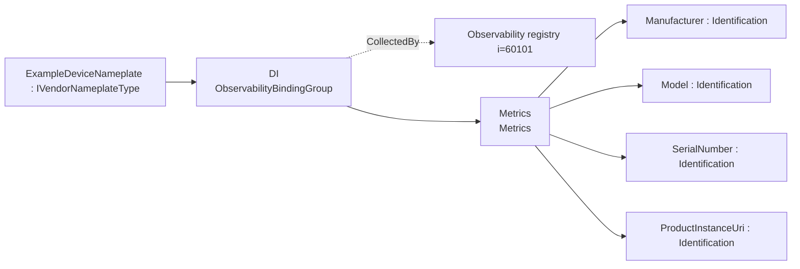
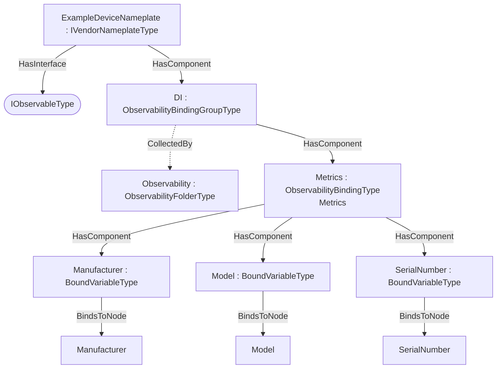

## Scope {#sec-scope}

This addendum defines example **observability export bindings** for `IVendorNameplateType` — 4 bound items across Metrics (Metrics). The DI IVendorNameplateType facet exposes vendor nameplate identity as OTEL resource attributes/dimensions for any device, machine or component that composes it.

## How the bindings are applied {#sec-how-the-bindings-are-applied}

The machine-readable descriptor [`DI.ObservabilityExport.json`](../../../cloud-specs/extras/observability-export/examples/di/DI.ObservabilityExport.json) lists each bound item as a `BrowsePath` from `IVendorNameplateType`, with its observability `Kind` and OTEL `SignalKind`. The generated overlay [`Opc.Ua.DI.ObservabilityExport.NodeSet2.xml`](../../../model/Opc.Ua.DI.ObservabilityExport.NodeSet2.xml) instantiates a compact `ExampleDeviceNameplate` object, applies `IObservableType`, and exposes an `ObservabilityBindingGroup` collected by (`CollectedBy`) the server-wide `Observability` registry.

> **Theoretical instance model.** A compact instance implementing IVendorNameplateType. A pump's Identification object composes the same DI facet, so the Pumps metrics binding extends this one.

Only the bound signals are materialised in the overlay; it is illustrative, not a full companion instance.

## Observability export bindings for `IVendorNameplateType` {#sec-observability-export-bindings-for-ivendornameplatetype}

Bindings for `IVendorNameplateType` in `http://opcfoundation.org/UA/DI/`, per the [Observability Export](spec.md) base specification. Each binding exposes one OTEL signal (`Metrics`, `Logs` or `Traces`) with a deterministic `DataSetClassId`.

### Metrics — Metrics {#sec-metrics-metrics}

*Signal:* OTEL metrics (PublishedDataItems) · *DataSetClassId:* `ac52dde1-e3db-5534-bc44-5b18d9335b72` · *Cardinality:* one DataSet (bound root)

| Field | Kind | BrowsePath | Source type | DataType | OTEL |
|---|---|---|---|---|---|
| Manufacturer | Identification | `/Manufacturer` | `i=68` | LocalizedText | Gauge |
| Model | Identification | `/Model` | `i=68` | LocalizedText | Gauge |
| SerialNumber | Identification | `/SerialNumber` | `i=68` | String | Gauge |
| ProductInstanceUri | Identification | `/ProductInstanceUri` | `i=68` | String | Gauge |

## Where the bindings live {#sec-where-the-bindings-live}

Overview of the observability bindings and their placement on the theoretical instance:

## Deliverables {#sec-deliverables}

| File | Content |
|---|---|
| [`DI.ObservabilityExport.json`](../../../cloud-specs/extras/observability-export/examples/di/DI.ObservabilityExport.json) | Machine-readable ObservabilityExport descriptor (single source). |
| [`Opc.Ua.DI.ObservabilityExport.NodeSet2.xml`](../../../model/Opc.Ua.DI.ObservabilityExport.NodeSet2.xml) | The binding instances on the theoretical `ExampleDeviceNameplate` instance. |

Regenerate from [`cloud-specs/extras/observability-export/examples/`](../../../cloud-specs/extras/observability-export/examples) with `python tools/build_bindings.py di/DI.ObservabilityExport.json tools/ref`.
