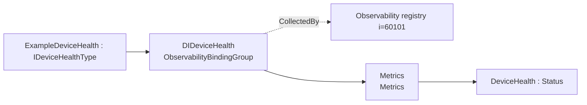
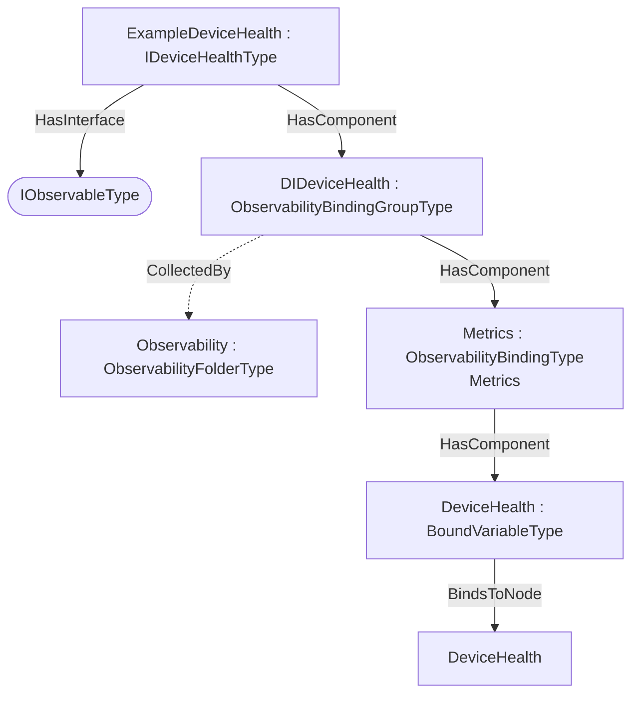

## Scope {#sec-scope}

This addendum defines example **observability export bindings** for `IDeviceHealthType` — 1 bound items across Metrics (Metrics). The DI IDeviceHealthType facet exposes DeviceHealth as an OTEL status gauge. A pump does not compose IDeviceHealthType, so this binding is device-only.

## How the bindings are applied {#sec-how-the-bindings-are-applied}

The machine-readable descriptor [`DI.DeviceHealth.ObservabilityExport.json`](../../../cloud-specs/extras/observability-export/examples/di/DI.DeviceHealth.ObservabilityExport.json) lists each bound item as a `BrowsePath` from `IDeviceHealthType`, with its observability `Kind` and OTEL `SignalKind`. The generated overlay [`Opc.Ua.DIDeviceHealth.ObservabilityExport.NodeSet2.xml`](../../../model/Opc.Ua.DIDeviceHealth.ObservabilityExport.NodeSet2.xml) instantiates a compact `ExampleDeviceHealth` object, applies `IObservableType`, and exposes an `ObservabilityBindingGroup` collected by (`CollectedBy`) the server-wide `Observability` registry.

> **Theoretical instance model.** A compact instance implementing IDeviceHealthType.

Only the bound signals are materialised in the overlay; it is illustrative, not a full companion instance.

## Observability export bindings for `IDeviceHealthType` {#sec-observability-export-bindings-for-idevicehealthtype}

Bindings for `IDeviceHealthType` in `http://opcfoundation.org/UA/DI/`, per the [Observability Export](spec.md) base specification. Each binding exposes one OTEL signal (`Metrics`, `Logs` or `Traces`) with a deterministic `DataSetClassId`.

### Metrics — Metrics {#sec-metrics-metrics}

*Signal:* OTEL metrics (PublishedDataItems) · *DataSetClassId:* `021ecf01-f573-54e1-b4c5-112ced3f846f` · *Cardinality:* one DataSet (bound root)

| Field | Kind | BrowsePath | Source type | DataType | OTEL |
|---|---|---|---|---|---|
| DeviceHealth | Status | `/DeviceHealth` | `i=63` | i=6244 | Gauge |

## Where the bindings live {#sec-where-the-bindings-live}

Overview of the observability bindings and their placement on the theoretical instance:

## Deliverables {#sec-deliverables}

| File | Content |
|---|---|
| [`DI.DeviceHealth.ObservabilityExport.json`](../../../cloud-specs/extras/observability-export/examples/di/DI.DeviceHealth.ObservabilityExport.json) | Machine-readable ObservabilityExport descriptor (single source). |
| [`Opc.Ua.DIDeviceHealth.ObservabilityExport.NodeSet2.xml`](../../../model/Opc.Ua.DIDeviceHealth.ObservabilityExport.NodeSet2.xml) | The binding instances on the theoretical `ExampleDeviceHealth` instance. |

Regenerate from [`cloud-specs/extras/observability-export/examples/`](../../../cloud-specs/extras/observability-export/examples) with `python tools/build_bindings.py di/DI.DeviceHealth.ObservabilityExport.json tools/ref`.
