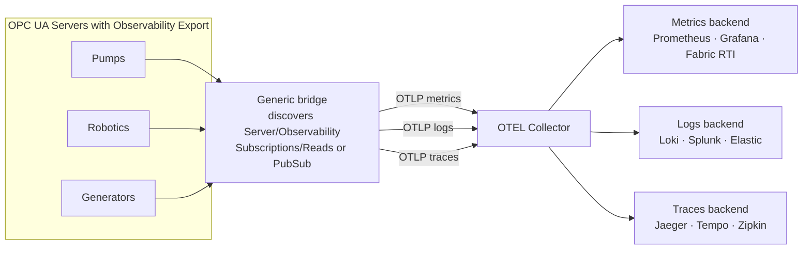
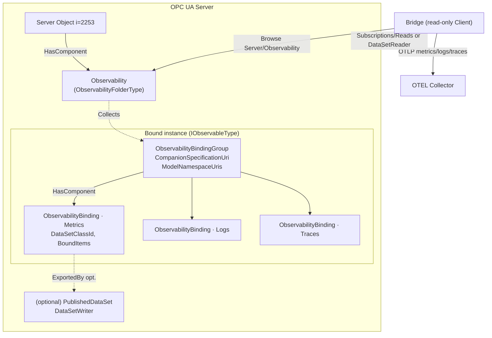
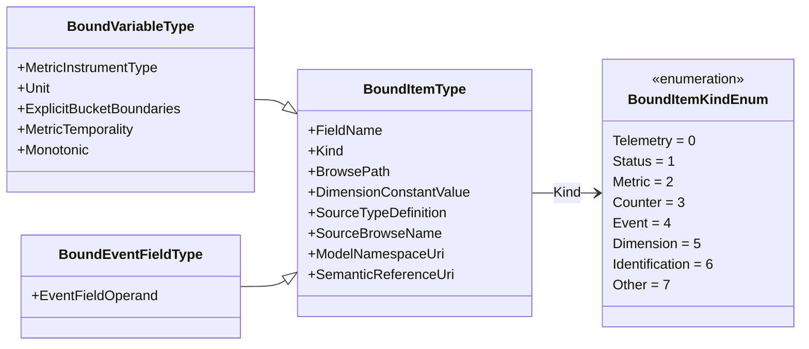
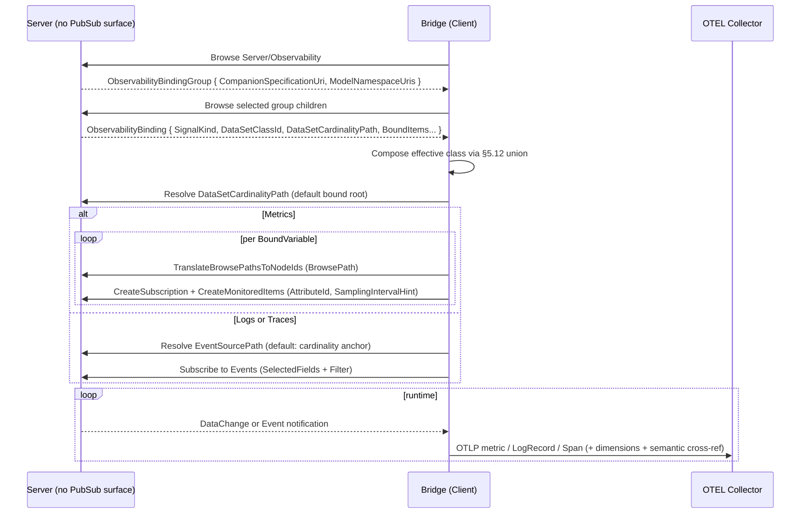
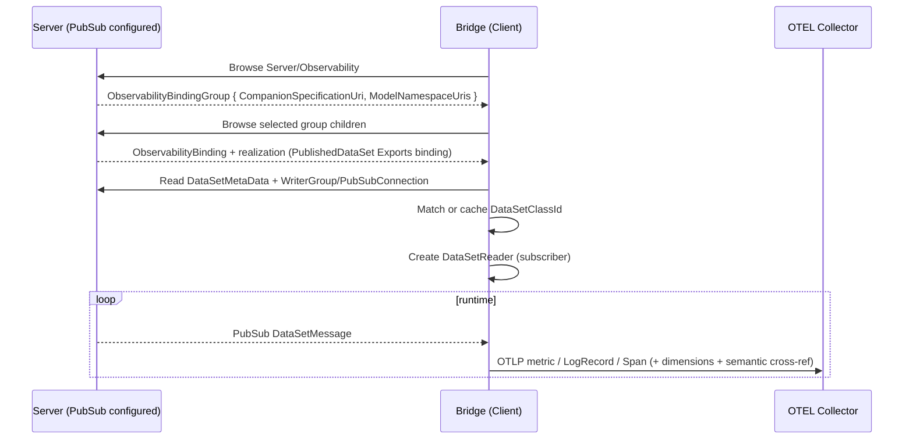

## Scope {#sec-scope}

This specification defines an information model that lets an OPC UA Server, or a companion specification, **declare how the data of any Information Model lands in an observability system** — as metrics, logs and traces — and lets a generic **bridge** discover those declarations and forward the data to that observability system without understanding the domain semantics.

It specifies:

- a discoverable, server-wide **Observability** registry, reachable from the standard **Server Object**, that lists every observability-exporting object;
- an **ObservabilityBinding** that associates a bound Object or type with exactly one **OTEL signal** — a **metric** set, a **log** stream, or a **trace** stream — whose **bound items** are Variables or event fields;
- a normative mapping from those bindings to **OpenTelemetry (OTEL)** — metric instruments, LogRecords and Spans, plus Resource and attribute (dimension) handling — sufficient for a bridge to emit OTEL to an **OTEL Collector** (or directly to any observability backend);
- a **semantic cross‑reference** carried by each bound item back to the model that defines it, retained so it can be **exported to a disconnected consumer** (for example a subscriber that only sees a PubSub message);
- normative rules for locating bound items by **BrowsePath** (RelativePath) so that bindings can be authored once at the type level and resolved per instance;
- normative rules for realizing a binding through classic OPC UA Subscriptions and Reads as the baseline, and through OPC UA PubSub as an optional Part 14 realization where the Server provides it;
- the **Profiles and Conformance Units** for Servers and Clients.

OTEL is the normative reference target because it is the de-facto vendor-neutral wire and data model for metrics, logs and traces; the model is nonetheless **generic** — the same bindings drive any observability backend (§8), since the mapping metadata is expressed in OTEL-shaped but backend-agnostic terms.

It is explicitly **out of scope** to define new PubSub transports, message mappings, security, or the lifecycle of PubSub configuration; these are defined by OPC 10000-14 and referenced here for the optional PubSub realization. It is likewise **out of scope to define a log, event or trace model of its own**: this specification *exports* existing OPC UA sources — Events, OPC 10000‑26 `LogObject` log entries, and OPC 10000‑10 Program executions — rather than redefining how they are represented (§5.13). Invoking or writing to the Server (commands, setpoints, actuation) is out of scope: observability export is **read-only**.

### Motivation {#sec-motivation}

Companion specifications describe *what a thing is*. Getting that thing's live data into an **observability** system — metrics dashboards, log search, distributed tracing — is a separate, repetitive integration problem: someone must decide which Variables are metrics and of what instrument and unit, which event fields become structured log records, which Program or audit events become spans, and how each is labelled. Today this is solved ad-hoc, once per model and once per project, usually by hand-wiring an OPC UA client to a metrics/log agent.

This specification makes the decision **part of the model and discoverable at runtime**. A Server advertises, per bound object, exactly which nodes to observe and how they map to OTEL; a generic **bridge** — a read-only Client whose only job is to forward OPC UA data into an observability system — discovers the binding, uses classic Subscriptions/Reads as the baseline (or PubSub where the Server has realized the same binding as Part 14 configuration), and emits OTEL metrics, logs and spans. The bridge needs to understand *OTEL* and the *routing role*, not the pump, the robot or the generator.

### Motivating use cases {#sec-motivating-use-cases}

The practical value is that a **single generic bridge** can light up observability for many machines with *no domain-specific code*: the Server has already decided which signals matter and what they mean. A consumer recognizes and routes the data by its OTEL signal and its stable `DataSetClassId`, not by knowing the pump, the robot or the generator. The use cases below are illustrative; product names are examples only and imply no endorsement.



**Factory-floor metrics to OpenTelemetry and Grafana.** The Metrics binding declares which Variables are metrics — with their OTEL instrument type, unit and histogram buckets — and which items are dimensions. A bridge subscribes to the metric set and emits OTEL metrics to an OTEL Collector, which drives Grafana (or any metrics backend) for live factory-operations dashboards. Because the OTEL semantics are carried in the model, the same bridge lights up dashboards for a new machine or a new vendor with no per-model wiring.

**Structured logs from OPC UA events.** A Logs binding maps selected event fields of a notifier to OTEL LogRecords, with a message template, severity and timestamp. A bridge subscribes to the events and emits structured OTEL logs to any log backend (Loki, Splunk, Elastic), each record carrying the companion-model field names and the binding's dimensions as attributes.

**Traces from Program and audit events.** A Traces binding maps a Program state machine's executions — or correlated audit events — to OTEL spans, with trace/span identity, timing and status. A bridge emits spans to a tracing backend (Jaeger, Tempo, Zipkin), so an operation on the floor (a recipe run, a maintenance job) becomes a first-class trace correlated with the metrics and logs around it.

**Egress to any observability stack.** Because the mapping metadata is OTEL-shaped but backend-agnostic, the same bindings drive other stacks — Prometheus remote-write, Splunk HEC, Microsoft Fabric Real-Time Intelligence, or an Apache Arrow lakehouse — by a thin adapter in the bridge (§8). Where the Server realizes the binding over PubSub (Part 14), the same egress is a fan-out of `DataSetMessage`s.

## Overview and concepts {#sec-overview-and-concepts}

### The two‑layer contract {#sec-the-two-layer-contract}

An observability binding carries two distinct kinds of metadata, and keeping them separate is the central design idea:

1. **Routing / OTEL metadata — for the bridge.** The binding's `SignalKind` says *which OTEL signal this serves* (metrics, logs, traces); the per‑item `Kind` says *how to forward this value* (a metric time series, a dimension, a log/trace field). For metrics the routing metadata also includes the OTEL instrument (`MetricInstrumentType`), unit, histogram buckets and temporality; for logs the `LogTemplate`/severity/timestamp field names; for traces the span name, identity, timing and status field names. A bridge configures itself from routing metadata alone, for any domain.
2. **Semantic metadata — for the consumer.** Each bound item also retains a **cross‑reference back to the model** that defines it: the source `TypeDefinition`, the namespace‑qualified `BrowseName`, the `ModelNamespaceUri`, and — where available — a dictionary entry (OPC 10000‑19, IRDI/CDD). This is what lets a *disconnected* consumer, holding only a PubSub message or an OTEL data point, recover what the value *means*.

The bridge never needs the semantic layer to do its job; it forwards it verbatim (as OTEL attributes / Part 14 FieldMetaData) so the ultimate consumer can use it.

### Discovery {#sec-discovery}

A Server exposes a server-wide `Observability` Object of [`ObservabilityFolderType`](#sec-observabilityfoldertype) as a component of the standard **Server Object** (`i=2253`); it is the discovery entry point. The registry references, through non-hierarchical [`Collects`](#sec-collects) references, every [`ObservabilityBindingGroupType`](#sec-observabilitybindinggrouptype) Object in the Server. A Client browses `Server/Observability`, follows `Collects` to the groups, and browses each group's [`ObservabilityBindingType`](#sec-observabilitybindingtype) children.

Each [`ObservabilityBindingGroupType`](#sec-observabilitybindinggrouptype) is a `HasComponent` child of the [`IObservableType`](#sec-iobservabletype) Object instance it describes, and that Object is the group's single hierarchical parent. `Collects` is non-hierarchical so the group can remain hierarchically contained by the bound instance while still being reachable from the registry; this avoids a second hierarchical parent and prevents a registry→group→instance hierarchy loop. Given a group, a Client browses the inverse `CollectedBy` reference back to the registry. The group carries `CompanionSpecificationUri` and `ModelNamespaceUris` for namespace matching, and it remains the BrowseName collision boundary for the bindings on that instance.

There is a single kind of registry entry; there is no notion of selectable "scenarios" or "profiles". A Server that exports observability data exposes the `Observability` registry and one group per (companion specification × observable instance).

### Realization (hybrid) {#sec-realization-hybrid}

A binding **declares** intent; whether and how it is realized over the wire is separate.

**A conforming Server is not required to implement OPC UA PubSub.** The default and most common case is a Server with **no PubSub configuration surface at all**: this specification references Part 14 *types* to describe an optional realization, but never requires *instances* of them — no `PublishSubscribe` object, `PublishedDataSet`, `DataSetWriter` or `WriterGroup` need exist. On such a Server a bridge reads a binding through **classic Subscriptions and Reads** (§6); this is the baseline realization.

Where a Server does implement PubSub, a binding **may** additionally be realized as Part 14 configuration (a `PublishedDataSet` and `DataSetWriter`), linked from the binding by [`ExportedBy`](#sec-exportedby); the realizing node points back with inverse `Exports`. The bridge then consumes the DataSet as a subscriber. Either way, the bridge emits the same OTEL.

### Architecture {#sec-architecture}



## Information model {#sec-information-model}

The full node reference — every type, member, DataType and well-known instance — is generated in **[Annex A](#anx-a)**. This clause states the intent and the normative rules. All types are defined in this specification's own namespace `http://opcfoundation.org/UA/ObservabilityExport/` (which requires the base OPC UA namespace); NodeIds are draft.

The model uses non-hierarchical ReferenceTypes for cross-links that must not affect containment: `BindsToNode` links a bound item to the source Variable, event source or Program it exposes; `ExportedBy`/`Exports` links a binding to its optional Part 14 PubSub realization; `HasBaseBinding` links a derived or composed binding to a locally present base binding; and `Collects`/`CollectedBy` links the `Observability` registry to the instance-contained `ObservabilityBindingGroup` Objects.

### ObservabilityFolderType {#sec-observabilityfoldertype}

The server-wide `Observability` registry is an [`ObservabilityFolderType`](#sec-observabilityfoldertype) Object exposed as a component of the **Server Object**. It references, through [`Collects`](#sec-collects), every [`ObservabilityBindingGroupType`](#sec-observabilitybindinggrouptype) in the Server. A Client follows those references to the groups and browses each group's `<ObservabilityBinding>` children. No query Method is defined — Browse and Read already provide enumeration and selection, and requiring a Method would burden the classic Servers that are the common case.

*Table - ObservabilityFolderType Definition* {#tbl-observabilityfoldertype-definition defines=ObservabilityFolderType}

| **Attribute** | **Value** |  |  |  |  |
| --- | --- | --- | --- | --- | --- |
| BrowseName | 1:ObservabilityFolderType |  |  |  |  |
| IsAbstract | False |  |  |  |  |

| **References** | **Node Class** | **BrowseName** | **DataType** | **TypeDefinition** | **Other** |
| --- | --- | --- | --- | --- | --- |
| Subtype of the 0:FolderType defined in OPC 10000-5 |  |  |  |  |  |

| **Conformance Units** |  |  |  |  |  |
| --- | --- | --- | --- | --- | --- |
| OBS-Discovery |  |  |  |  |  |

#### ObservabilityBindingGroupType {#sec-observabilitybindinggrouptype}

An [`ObservabilityBindingGroupType`](#sec-observabilitybindinggrouptype) is the per-companion-specification anchor contained by the [`IObservableType`](#sec-iobservabletype) Object instance it describes. Its `CompanionSpecificationUri` (Mandatory) is a stable **specification-level** identifier, not a namespace URI: a companion specification may define several namespace URIs across modules, versions or profiles, and those URIs are therefore not a unique group key. `ModelNamespaceUris` (Mandatory) lists all namespace URIs the companion specification defines or covers so a Client can match the group to the namespaces it knows. Each group is `CollectedBy` the server-wide `Observability` registry; the registry `Collects` the groups.

Because sibling groups are contained by the same instance, an instance **shall not** expose two sibling groups with the same `CompanionSpecificationUri`; and because sibling Objects must also have distinct BrowseNames, each group's BrowseName **shall** be stable and unique among that instance's groups. Bindings are named only within their group, so two companion specifications may use the same binding BrowseName without colliding.

*Table - ObservabilityBindingGroupType Definition* {#tbl-observabilitybindinggrouptype-definition defines=ObservabilityBindingGroupType}

| **Attribute** | **Value** |  |  |  |  |
| --- | --- | --- | --- | --- | --- |
| BrowseName | 1:ObservabilityBindingGroupType |  |  |  |  |
| IsAbstract | False |  |  |  |  |

| **References** | **Node Class** | **BrowseName** | **DataType** | **TypeDefinition** | **Other** |
| --- | --- | --- | --- | --- | --- |
| Subtype of the 0:FolderType defined in OPC 10000-5 |  |  |  |  |  |
| 0:HasProperty | Variable | CompanionSpecificationUri | 0:String | 0:PropertyType | M |
| 0:HasProperty | Variable | ModelNamespaceUris | 0:String[] | 0:PropertyType | M |
| 0:HasComponent | Object | <ObservabilityBinding> |  | ObservabilityBindingType | OP |

| **Conformance Units** |  |  |  |  |  |
| --- | --- | --- | --- | --- | --- |
| OBS-BindingGrouping |  |  |  |  |  |

### ObservabilityBindingType {#sec-observabilitybindingtype}

An [`ObservabilityBindingType`](#sec-observabilitybindingtype) represents exactly one observability binding — one OTEL signal (a metric set, a log stream, or a trace stream) for one bound target. `SignalKind` (Mandatory, an [`ObservabilitySignalKindEnum`](#sec-observabilitysignalkindenum)) selects the signal — `Metrics`, `Logs` or `Traces` (§5.6). `ConfigurationVersion` aligns the binding with the `ConfigurationVersion` of its schema so a consumer can detect change. `DataSetClassId` (Mandatory) is the stable Part 14 class identity for the binding and already encodes the signal kind (§5.7). `DataSetCardinalityPath` (Optional) selects the cardinality level for instances of that class; when omitted, the cardinality level is the bound root.

The bound items are exposed **both** as browsable `<BoundItem>` objects **and** as a compact `BoundItems` array of [`BoundItemDataType`](#sec-bounditemdatatype); when both are present they **shall** carry equivalent bound-item information (the same members and values). The bound items are homogeneous per binding: Variables for a metric set, event fields for a log or trace stream.

`DataSetMetaData` (Optional) exposes the Part 14 `DataSetMetaDataType` schema offline (§5.8). For log and trace bindings, `EventSourcePath` (Optional) identifies the event notifier; when omitted, the notifier is the cardinality anchor (the bound root when `DataSetCardinalityPath` is omitted). `Filter` (Optional, a `ContentFilter`) is the event where-clause. The OTEL mapping members (`Log*`, `Span*`, and the per-item metric members) are described in §5.13. Where PubSub is configured, this binding references the realizing Part 14 node with [`ExportedBy`](#sec-exportedby).

*Table - ObservabilityBindingType Definition* {#tbl-observabilitybindingtype-definition defines=ObservabilityBindingType}

| **Attribute** | **Value** |  |  |  |  |
| --- | --- | --- | --- | --- | --- |
| BrowseName | 1:ObservabilityBindingType |  |  |  |  |
| IsAbstract | False |  |  |  |  |

| **References** | **Node Class** | **BrowseName** | **DataType** | **TypeDefinition** | **Other** |
| --- | --- | --- | --- | --- | --- |
| Subtype of the 0:BaseObjectType defined in OPC 10000-5 |  |  |  |  |  |
| 0:HasProperty | Variable | SignalKind | ObservabilitySignalKindEnum | 0:PropertyType | M |
| 0:HasProperty | Variable | ConfigurationVersion | 0:ConfigurationVersionDataType | 0:PropertyType | O |
| 0:HasProperty | Variable | DataSetClassId | 0:Guid | 0:PropertyType | M |
| 0:HasProperty | Variable | BaseDataSetClassIds | 0:Guid[] | 0:PropertyType | O |
| 0:HasProperty | Variable | DataSetCardinalityPath | 0:RelativePath | 0:PropertyType | O |
| 0:HasProperty | Variable | DataSetMetaData | 0:DataSetMetaDataType | 0:PropertyType | O |
| 0:HasProperty | Variable | EventSourcePath | 0:RelativePath | 0:PropertyType | O |
| 0:HasProperty | Variable | Filter | 0:ContentFilter | 0:PropertyType | O |
| 0:HasProperty | Variable | LogTemplate | 0:String | 0:PropertyType | O |
| 0:HasProperty | Variable | LogSeverityFieldName | 0:String | 0:PropertyType | O |
| 0:HasProperty | Variable | LogBodyFieldName | 0:String | 0:PropertyType | O |
| 0:HasProperty | Variable | LogTimestampFieldName | 0:String | 0:PropertyType | O |
| 0:HasProperty | Variable | SpanNameTemplate | 0:String | 0:PropertyType | O |
| 0:HasProperty | Variable | SpanNameFieldName | 0:String | 0:PropertyType | O |
| 0:HasProperty | Variable | TraceIdFieldName | 0:String | 0:PropertyType | O |
| 0:HasProperty | Variable | SpanIdFieldName | 0:String | 0:PropertyType | O |
| 0:HasProperty | Variable | ParentSpanIdFieldName | 0:String | 0:PropertyType | O |
| 0:HasProperty | Variable | SpanStartTimeFieldName | 0:String | 0:PropertyType | O |
| 0:HasProperty | Variable | SpanEndTimeFieldName | 0:String | 0:PropertyType | O |
| 0:HasProperty | Variable | SpanStatusFieldName | 0:String | 0:PropertyType | O |
| 0:HasProperty | Variable | SpanKind | 0:String | 0:PropertyType | O |
| 0:HasProperty | Variable | SpanCorrelationFieldName | 0:String | 0:PropertyType | O |
| 0:HasProperty | Variable | BoundItems | BoundItemDataType[] | 0:PropertyType | O |
| 0:HasComponent | Object | <BoundItem> |  | BoundItemType | OP |

| **Conformance Units** |  |  |  |  |  |
| --- | --- | --- | --- | --- | --- |
| OBS-DataSetCardinality |  |  |  |  |  |
| OBS-DataSetClassIdentity |  |  |  |  |  |
| OBS-BindingInheritance |  |  |  |  |  |

#### DataSet cardinality (normative) {#sec-dataset-cardinality-normative}

`DataSetCardinalityPath` names the cardinality anchor. A Server **shall** produce one DataSet instance for each matched instance of the `DataSetCardinalityPath`. If it is omitted, the cardinality anchor is the bound root and the binding produces one DataSet for that bound root. If the path resolves to multiple nodes, each resolved node is a separate cardinality anchor and therefore produces a separate DataSet.

The binding's `DataSetClassId` is unchanged by cardinality expansion and **shall** be shared by all produced DataSets. In PubSub realizations this means one DataSet class and, typically, one `DataSetWriter` per produced DataSet instance; in classic realizations the bridge creates the equivalent set of Subscriptions/MonitoredItems per cardinality anchor while retaining the same class identity. Because placeholder segments below the anchor expand per instance, the produced DataSets share the `DataSetClassId` but their concrete `DataSetMetaData` (field set and `ConfigurationVersion`) is per instance and may differ in field count (§5.7).

Illustrative cases:

| Binding shape | Result |
|---|---|
| `DataSetCardinalityPath` omitted on a single pump bound root | One metric DataSet for that pump. |
| `DataSetCardinalityPath = /MotionDevices/<MotionDevice>` on a three-robot cell | Three DataSets, one per MotionDevice, all with the same `DataSetClassId`; `<Axis>/ActualPosition` expands to per-axis fields **within** each device DataSet. |
| `DataSetCardinalityPath = /MotionDevices/<MotionDevice>` with a bound item two placeholder levels below the anchor on a robot with 6 power trains × 1 motor | One DataSet per MotionDevice; the two sub-anchor placeholders expand to 6 `MotorTemperature` fields per device, all sharing the one `DataSetClassId`. Placeholder levels compose multiplicatively. |

BrowsePaths at or above the cardinality anchor select which content instances are produced. Placeholders strictly below the cardinality anchor do **not** create additional DataSets; they expand to disambiguated fields within that DataSet according to the BrowsePath resolution rules (§5.10).

The **shape** of a produced DataSet is the resolved field set for one cardinality anchor. For the metric binding of a `MotionDevice` `Robot_1` (6 axes, 6 motors), the bridge produces one DataSet of this shape (see the Robotics addendum for the full worked resolution):

```text
DataSet "Robot_1 · Metrics"   (one DataSetClassId, shared by every MotionDevice DataSet)
  AxisActualPosition_Axis_1 … AxisActualPosition_Axis_6            Gauge · deg
  MotorTemperature_PowerTrain_1_Motor_1 … _PowerTrain_6_Motor_1    Gauge · Cel
  SpeedOverride                                                    Gauge · %
```

A different topology (for example a 4-axis SCARA) yields the same `DataSetClassId` but a DataSet with fewer fields; a subscriber recognizes the class regardless of the per-instance field count.

### BoundItemType and its subtypes {#sec-bounditemtype-and-its-subtypes}

A [`BoundItemType`](#sec-bounditemtype-and-its-subtypes) describes one metric, dimension, or event field. It **shall** carry a `FieldName` and a `Kind` (a [`BoundItemKindEnum`](#sec-bounditemkindenum)). It locates its source in one of two ways (§5.10) and carries the semantic cross-reference (§5.4). [`BoundVariableType`](#sec-boundvariabletype) binds a Variable exposed as a metric field and adds the OTEL metric members (`MetricInstrumentType`, `Unit`, `ExplicitBucketBoundaries`, `MetricTemporality`, `Monotonic`); a bound item may instead be a metric dimension (`Kind = Dimension`, optionally with a `DimensionConstantValue`). [`BoundEventFieldType`](#sec-boundeventfieldtype) binds an event field of a log or trace stream, selected by a `SimpleAttributeOperand`; its `BrowsePath` is relative to the event `SourceTypeDefinition`, not to the AddressSpace instance.



*Table - BoundItemType Definition* {#tbl-bounditemtype-definition defines=BoundItemType}

| **Attribute** | **Value** |  |  |  |  |
| --- | --- | --- | --- | --- | --- |
| BrowseName | 1:BoundItemType |  |  |  |  |
| IsAbstract | False |  |  |  |  |

| **References** | **Node Class** | **BrowseName** | **DataType** | **TypeDefinition** | **Other** |
| --- | --- | --- | --- | --- | --- |
| Subtype of the 0:BaseObjectType defined in OPC 10000-5 |  |  |  |  |  |
| 0:HasProperty | Variable | FieldName | 0:String | 0:PropertyType | M |
| 0:HasProperty | Variable | Kind | BoundItemKindEnum | 0:PropertyType | M |
| 0:HasProperty | Variable | AttributeId | 0:UInt32 | 0:PropertyType | O |
| 0:HasProperty | Variable | BrowsePath | 0:RelativePath | 0:PropertyType | O |
| 0:HasProperty | Variable | StartingNode | 0:NodeId | 0:PropertyType | O |
| 0:HasProperty | Variable | SourceNodeId | 0:NodeId | 0:PropertyType | O |
| 0:HasProperty | Variable | SamplingIntervalHint | 0:Duration | 0:PropertyType | O |
| 0:HasProperty | Variable | IndexRange | 0:NumericRange | 0:PropertyType | O |
| 0:HasProperty | Variable | SourceTypeDefinition | 0:NodeId | 0:PropertyType | O |
| 0:HasProperty | Variable | SourceBrowseName | 0:QualifiedName | 0:PropertyType | O |
| 0:HasProperty | Variable | ModelNamespaceUri | 0:String | 0:PropertyType | O |
| 0:HasProperty | Variable | DataSetFieldId | 0:Guid | 0:PropertyType | O |
| 0:HasProperty | Variable | SourceBindingClassId | 0:Guid | 0:PropertyType | O |
| 0:HasProperty | Variable | SemanticReferenceUri | 0:String | 0:PropertyType | O |
| 0:HasProperty | Variable | DimensionConstantValue | 0:String | 0:PropertyType | O |

| **Conformance Units** |  |  |  |  |  |
| --- | --- | --- | --- | --- | --- |
| OBS-BrowsePathResolution |  |  |  |  |  |
| OBS-SemanticCrossReference |  |  |  |  |  |

### Semantic cross-reference (normative) {#sec-semantic-cross-reference-normative}

Each bound item **shall** retain enough information to identify the model node it exposes independently of the live AddressSpace — as applicable to its NodeClass:

- `SourceTypeDefinition` — the TypeDefinition NodeId of the source node, or for [`BoundEventFieldType`](#sec-boundeventfieldtype), the event TypeDefinition against which the field operand is evaluated;
- `SourceBrowseName` — its namespace-qualified BrowseName;
- `ModelNamespaceUri` — the namespace URI of the model that defines it;
- optionally, `SemanticReferenceUri` — a portable external semantic identifier for the item (an IRDI/CDD, e.g. the identifier of a OPC 10000-19 dictionary entry). A Server that models the dictionary linkage natively **may** additionally place a `HasDictionaryEntry` reference on the browsable `BoundItem`; `SemanticReferenceUri` is the carrier used in the compact form and for propagation, so the linkage survives export.

These values are **derivable from the AddressSpace** and a generating tool **should** populate them mechanically to avoid drift.

The semantic Properties carry the **Optional** ModellingRule on [`BoundItemType`](#sec-bounditemtype-and-its-subtypes) at the type definition so one base type can serve bound Variables and bound event fields even though different subsets apply to different NodeClasses. This does not make the applicable values optional for a conforming instance: the *Semantic Cross-Reference* conformance unit (§7) requires a Server that exposes a binding to populate the applicable subset per NodeClass — `SourceTypeDefinition`, `SourceBrowseName` and `ModelNamespaceUri` for a bound **Variable**; and `SourceTypeDefinition` (the event type), `SourceBrowseName` and `ModelNamespaceUri` for a bound **event field**.

#### Propagation to Part 14 FieldMetaData (Part 14 realization) {#sec-propagation-to-part-14-fieldmetadata-part-14-realization}

When a binding is realized as a Part 14 `PublishedDataSet`, for every bound item the Server **shall**:

1. set the corresponding `FieldMetaData.dataSetFieldId` to the item's `DataSetFieldId`;
2. add to `FieldMetaData.properties` the KeyValuePairs `ModelNamespaceUri`, `SourceBrowseName`, `SourceTypeDefinition`, `BrowsePath` and, where present, `SemanticReferenceUri`, `SourceBindingClassId` (so a disconnected subscriber can recognize fields inherited from a base facet class) and `EventFieldOperand`; and
3. ensure the `DataSetMetaData` namespace and DataType tables describe any non-standard DataTypes used.

The property keys **shall** match the corresponding [`BoundItemType`](#sec-bounditemtype-and-its-subtypes) or [`BoundItemDataType`](#sec-bounditemdatatype) member names above, so a consumer can map each `FieldMetaData` property back to the binding model without a separate lookup. As a result the PubSub stream is **self-describing**. This requirement is a Conformance Unit (§7).

### Propagation to Part 14 configuration (normative) {#sec-propagation-to-part-14-configuration-normative}

Where PubSub is configured, the Server **shall** propagate the binding into Part 14 configuration as follows:

1. create or identify one `PublishedDataSet` for each DataSet instance produced by `DataSetCardinalityPath`;
2. set each `DataSetMetaData.dataSetClassId` and `PublishedDataSet.DataSetClassId` to the binding's shared `DataSetClassId`;
3. for any exposed `DataSetMetaData`, set `ConfigurationVersion` to the binding's `ConfigurationVersion`;
4. for any exposed `DataSetMetaData`, populate `FieldMetaData` from the `BoundItems` as specified in §5.4;
5. for `SignalKind = Metrics`, realize the DataSet as `PublishedDataItemsType` and map each [`BoundVariableType`](#sec-boundvariabletype) or data [`BoundItemDataType`](#sec-bounditemdatatype) entry to a published data Variable;
6. for `SignalKind = Logs` or `Traces`, realize the DataSet as `PublishedEventsType`, map [`BoundEventFieldType`](#sec-boundeventfieldtype) / `EventFieldOperand` entries to `SelectedFields`, map `EventSourcePath` to the `EventNotifier` (default: the cardinality anchor), and map `Filter` to the PublishedEvents `Filter`.

Applicable only where the Server implements PubSub.

### Signal kind and granularity (normative) {#sec-signal-kind-and-granularity-normative}

An [`ObservabilityBindingType`](#sec-observabilitybindingtype) **shall** expose exactly one `SignalKind`. The `BoundItems` of the binding **shall** be homogeneous for that signal; a single binding **shall not** mix metric Variables and event fields as peer content. An [`ObservabilityBindingGroupType`](#sec-observabilitybindinggrouptype) may contain multiple bindings when an instance exports several signals (e.g. a Metrics binding **and** a Logs binding). This class is the granularity at which class identity, configuration versioning and subscriber recognition are defined: per signal kind, per bound ObjectType, per major version.

For `SignalKind = Metrics`, the DataSet is a data DataSet: grouped Variable values modeled by Part 14 `PublishedDataItemsType`. The fields are [`BoundVariableType`](#sec-boundvariabletype) objects, or [`BoundItemDataType`](#sec-bounditemdatatype) entries whose source locators identify Variables.

For `SignalKind = Logs` or `Traces`, the DataSet is an event DataSet modeled by Part 14 `PublishedEventsType`. `EventSourcePath` names the event notifier to subscribe to; if absent, the notifier is the cardinality anchor. The fields are [`BoundEventFieldType`](#sec-boundeventfieldtype) objects, or [`BoundItemDataType`](#sec-bounditemdatatype) entries with `EventFieldOperand`, and they map to PublishedEvents `SelectedFields`. `Filter` carries the optional Part 14 event where-clause. Logs and Traces differ only in the OTEL mapping applied by the bridge (§5.13.2, §5.13.3).

### DataSetClassId (normative) {#sec-datasetclassid-normative}

`DataSetClassId` **shall** be a Version-5 UUID as defined by RFC 4122, computed over the canonical UTF-8 string:

```text
ObservabilityExport|<AppliesToType>|<SignalKind>|<MajorVersion>
```

The namespace UUID **shall** be the fixed UUID `8d3280be-2bf7-5ab1-9898-15a237192577`, defined by this specification as `uuid5(URL, "http://opcfoundation.org/UA/ObservabilityExport/DataSetClass")`.

`AppliesToType` is the namespace-qualified BrowseName of the concrete *binding target* (a TypeDefinitionNode) encoded as `<namespaceUri>;<Name>`. `SignalKind` is the binding's signal kind expressed as the exact [`ObservabilitySignalKindEnum`](#sec-observabilitysignalkindenum) name — `Metrics`, `Logs` or `Traces` (§5.6). `MajorVersion` is the binding's `ConfigurationVersion.MajorVersion` expressed as a base-10 integer without leading zeroes. If the binding does not expose `ConfigurationVersion`, `MajorVersion` **shall** be taken as `1` (equivalently, an absent `ConfigurationVersion` is treated as `{MajorVersion = 1, MinorVersion = 0}`). Because a browsing subscriber recomputes `DataSetClassId` from the binding's exposed attributes, a binding whose `MajorVersion` is **not** `1` **shall** expose `ConfigurationVersion`.

Because the calculation is deterministic, every Server publishing the same signal kind, binding target and major version **shall** compute the same `DataSetClassId`. A semantics-agnostic subscriber can therefore recognize the *class* from `DataSetClassId` alone, without browsing the Server. The identity grain is per `(AppliesToType × SignalKind × MajorVersion)`: because `SignalKind` is part of the identity, a metric set, a log stream and a trace stream for the same bound target and major version are **distinct** classes with distinct `DataSetClassId`s.

`DataSetClassId` identifies the *semantic* class — the signal kind applied to a binding target at a major version — and is a routing and recognition key, **not** a guarantee of a fixed field layout. When `DataSetCardinalityPath` leaves placeholder segments below the cardinality anchor (§5.2.1), the concrete `DataSetMetaData` may differ in field count between instances of the same class. A consumer that requires the exact field layout **shall** read each DataSet's `DataSetMetaData` (§5.8) rather than infer it from `DataSetClassId`.

A derived or composed binding keeps its own deterministic `DataSetClassId` and additionally advertises the base classes it extends or composes with `BaseDataSetClassIds` (§5.12).

### DataSetMetaData exposure {#sec-datasetmetadata-exposure}

A binding **may** expose `DataSetMetaData` carrying the DataSet fields plus `dataSetClassId` and `configurationVersion`. When present, it **shall** be consistent with the binding's `BoundItems`, `DataSetClassId`, `SignalKind` and `ConfigurationVersion`. This lets a subscriber or offline tool obtain the class schema without browsing the bound model or reading the runtime PubSub configuration.

### IObservableType {#sec-iobservabletype}

An Interface a model may apply (via `HasInterface`) to advertise that it exports observability data. It contains the Object's per-`CompanionSpecificationUri` [`ObservabilityBindingGroupType`](#sec-observabilitybindinggrouptype) components directly — typically one for a single-specification instance — rather than a separate container; sibling group BrowseNames are unique (§5.1.1). Each contained group is `CollectedBy` the server-wide `Observability` registry. Applying the Interface at the **type** level, with type-level BrowsePath bindings, is the recommended way for a companion specification to adopt this specification without changing its own types' semantics.

*Table - IObservableType Definition* {#tbl-iobservabletype-definition defines=IObservableType}

| **Attribute** | **Value** |  |  |  |  |
| --- | --- | --- | --- | --- | --- |
| BrowseName | 1:IObservableType |  |  |  |  |
| IsAbstract | True |  |  |  |  |

| **References** | **Node Class** | **BrowseName** | **DataType** | **TypeDefinition** | **Other** |
| --- | --- | --- | --- | --- | --- |
| Subtype of the 0:BaseInterfaceType defined in OPC 10000-5 |  |  |  |  |  |
| 0:HasComponent | Object | <ObservabilityBindingGroup> |  | ObservabilityBindingGroupType | OP |

| **Conformance Units** |  |  |  |  |  |
| --- | --- | --- | --- | --- | --- |
| OBS-BindingGrouping |  |  |  |  |  |

### Locating bound items — BrowsePath resolution (normative) {#sec-locating-bound-items-browsepath-resolution-normative}

A bound item locates its source node in one of two ways:

- **BrowsePath (recommended).** `BrowsePath` is a `RelativePath` resolved from `StartingNode` (default: the *bound root*). Because it is relative, a single binding authored on a **type** applies to **every instance**: the Server resolves it per instance with TranslateBrowsePathsToNodeIds. This is the recommended mechanism and the form emitted by the authoring tool. For [`BoundEventFieldType`](#sec-boundeventfieldtype), the `BrowsePath` segments select an event field relative to `SourceTypeDefinition`, the event TypeDefinition, and may be represented directly as `EventFieldOperand`.
- **Absolute NodeId.** `SourceNodeId` (and the `BindsToNode` reference on the browsable form) identifies the node directly, for server-specific or instance-specific bindings. It is not used to select event fields inside a PublishedEvents DataSet.

*Binding targets* are TypeDefinitionNodes — ObjectTypes, Interface facets, or AddInTypes; because `HasInterface` is applied to the instance and `HasAddIn` is hierarchical (a subtype of `HasComponent`), type-level BrowsePaths still resolve against the instance using the same `HierarchicalReferences` (`i=33`) traversal.

Resolution rules a Server **shall** apply:

1. If a BrowsePath does not resolve on a given instance (an absent Optional component), the item is **omitted** for that instance; this is **not** an error.
2. `DataSetCardinalityPath` is resolved first from the bound root (or defaults to the bound root). If it matches multiple nodes, each matched node is a separate cardinality anchor and produces a separate DataSet instance.
3. A bound-item BrowsePath that matches multiple nodes at or above the cardinality anchor participates in selecting the produced content instances; it shall not be collapsed into multiple fields of one DataSet.
4. A bound-item BrowsePath that matches multiple nodes strictly below a cardinality anchor (a placeholder such as `<Rating>`, or an array of components) expands to one bound field per match within that DataSet; `FieldName` is made unique by appending the matched BrowseName or another deterministic path-derived suffix.
5. For an event field, the path targets a field of the event TypeDefinition; the notifier is identified by `EventSourcePath`, not by the field `BrowsePath`.
6. Type-level BrowsePaths and `DataSetCardinalityPath` resolve against the **live** AddressSpace. When the instance structure changes — a cardinality anchor or a placeholder instance is added or removed — the Server/bridge **shall** re-resolve the affected paths and add or remove the corresponding DataSets and fields. A bridge **should** drive this re-evaluation from the Server's **model-change signalling** — subscribing to `GeneralModelChangeEventType` notifications (or observing a changed node version or a bumped DataSet `ConfigurationVersion`) — rather than polling.

### Registry and adoption {#sec-registry-and-adoption}

The `Observability` registry is an [`ObservabilityFolderType`](#sec-observabilityfoldertype) Object under the Server Object and is the discovery entry point. A companion specification adopts this specification by applying [`IObservableType`](#sec-iobservabletype) to a type (or instance) and authoring type-level bindings; the Server then contains one `ObservabilityBindingGroup` per (companion specification × observable instance), each `CollectedBy`-linked to the registry. A Client that supports observability export does not need to know which specification contributed a binding: it browses the registry, follows `Collects` to the serving groups distinguished by `CompanionSpecificationUri`, browses each group's [`ObservabilityBindingType`](#sec-observabilitybindingtype) children, then resolves each binding through the classic baseline or optional PubSub realization.

### Binding inheritance and facet composition (normative) {#sec-binding-inheritance-and-facet-composition-normative}

A binding may be declared on a *binding target* — a **TypeDefinitionNode**; in practice an ObjectType, an Interface (facet) or an AddInType. The target's type-level BrowsePaths resolve against any instance that is-a that type, implements that Interface using `HasInterface`, or composes that AddInType using `HasAddIn`. `HasAddIn` is the core OPC UA ReferenceType `i=17604`, a subtype of `HasComponent`, so AddIn children are reachable by the §5.10 BrowsePath resolution over `HierarchicalReferences` (`i=33`).

Inheritance is uniform across the three OPC UA composition axes: a subtype inherits the bindings of its supertype, a type (or one of its component objects) implementing a facet Interface inherits the facet's bindings, and a host composing an AddIn inherits the AddIn's bindings. A facet implemented by a component object is composed at that component's path.

A derived binding **shall** list only its additional delta fields and **shall** reference the base class lineage with `BaseDataSetClassIds`; it **may** additionally use `HasBaseBinding` when the base binding node is present locally. A derived field with the same `FieldName` as an inherited field **shall** override the inherited field. A binding **shall not** remove an inherited field; every derived binding is a superset of each base binding it extends, which makes base-class field-subset recognition safe.

For a given instance and signal kind, a Server or bridge **shall** compose the effective binding as follows:

1. Collect candidate bindings of the same `SignalKind` from the instance's TypeDefinition and its supertype chain, from each `HasInterface` target type, from each `HasAddIn` child's type, and from each hierarchical **child object** whose TypeDefinition — or an Interface that child implements — declares a binding for that signal kind (this is how a facet implemented by a sub-object, such as a DI `IVendorNameplateType` nameplate on a Machinery `Identification` component, is reached).
2. Each collected binding has a **mount path** — the RelativePath from the composing instance's root to the node that **carries the facet**. For a binding on the bound type itself (**subtype**) or on an **Interface the bound type implements directly** (`HasInterface`), the mount path is **empty**. For a binding carried by a **hierarchical child** — an **AddIn** child (`HasAddIn`) or a **component/child object** whose type or implemented Interface declares it — the mount path is that **child's BrowsePath**. Before unioning, the Server/bridge **shall** re-anchor every path of a collected binding by prefixing the mount path: each bound item's `BrowsePath` (and `StartingNode`), the binding's `DataSetCardinalityPath`, and its `EventSourcePath` are resolved relative to `mountPath + path`.
3. Union the candidates' re-anchored `BoundItems`, applying override-by-`FieldName` so the most-derived contribution wins.
4. Set `SourceBindingClassId` on each composed field **only** for fields inherited from — or overriding a field of — a base facet binding; its value is the **base facet binding's `DataSetClassId`**. Fields the composing binding **defines itself** **omit** `SourceBindingClassId`.
5. Set the composed binding's `BaseDataSetClassIds` to the set of contributing base `DataSetClassId` values.
6. Compute the composed binding's own `DataSetClassId` per §5.7 for the concrete `AppliesToType`.

A base facet binding **may** merge into the composing binding only when its (re-anchored) `DataSetCardinalityPath` resolves to the **same cardinality anchor** as the composing binding. A base binding whose `DataSetCardinalityPath` resolves to a **different or multi-valued** cardinality anchor **shall not** be merged; instead the Server/bridge **shall** expose it as its own DataSet(s) per §5.2.1, still recognizable through the composing binding's `BaseDataSetClassIds`.

A subscriber that understands a base facet selects exactly the composed fields whose `SourceBindingClassId` equals that facet's `DataSetClassId`; a subscriber that understands the full composed class consumes every field.

Guidance: use a subtype binding for is-a refinement, use an Interface facet binding for a contract capability implemented by many types, and use an AddIn binding for a reusable structural block that brings its own sub-objects.

### OTEL mapping (normative) {#sec-otel-mapping-normative}

This clause defines how a bridge maps an [`ObservabilityBindingType`](#sec-observabilitybindingtype) to OpenTelemetry signals. The mapping is expressed in OTEL terms; §8 notes how the same metadata drives other backends.

#### Metrics {#sec-metrics}

For `SignalKind = Metrics`, a bound Variable maps to exactly one OTEL metric instrument. If `MetricInstrumentType` is present it selects the instrument directly and overrides the default; if it is absent, the bridge derives the instrument from the item's `Kind`:

| Bound item `Kind` | Default OTEL metric instrument |
|---|---|
| `Telemetry` | Gauge |
| `Metric` | Gauge |
| `Counter` | Counter (monotonic) |
| `Status` | Gauge (numeric state) — informative |
| other kinds | Not a metric; a bridge may skip the item or treat it as a Gauge. |

`Monotonic` is implied by the selected instrument unless set explicitly: Counter and ObservableCounter instruments are monotonic, while UpDownCounter and Gauge instruments are not. An explicit `Monotonic` **shall not** contradict the selected instrument.

**Metric unit.** The metric unit is `Unit` (a UCUM annotation) when present; otherwise a bridge SHOULD derive it from the source Variable's `EngineeringUnits` (`EUInformation`) where present; otherwise the metric is unitless. `Unit` is also the carrier that survives export to a disconnected consumer.

**Histogram buckets and temporality.** For a Histogram, `ExplicitBucketBoundaries` (Double[]) gives the bucket boundaries. `MetricTemporality` (`Cumulative` or `Delta`) is the aggregation temporality a bridge uses when exporting a Sum (Counter/UpDownCounter) or Histogram data stream. For Gauge instruments temporality does not apply. When `MetricTemporality` is absent, `Cumulative` is assumed for Sum/Histogram instruments, and Gauges report last-value.

#### Logs {#sec-logs}

For `SignalKind = Logs`, the bound event fields are the structured attributes of an OTEL LogRecord. `LogTemplate` is a message template whose `{FieldName}` placeholders reference bound event `FieldName`s; a bridge renders it to the LogRecord Body while still carrying the fields as attributes. Alternatively, `LogBodyFieldName` names a field already carrying the rendered body. A Server should set only one; if both are present, `LogTemplate` takes precedence for the Body and `LogBodyFieldName` is then an ordinary attribute. `LogSeverityFieldName` names the field mapped to the LogRecord SeverityNumber/SeverityText, and `LogTimestampFieldName` names the field mapped to the LogRecord Timestamp. The binding's `Kind = Dimension` items also apply to each log record as attributes.

When the bound severity field already carries an OTEL SeverityNumber (1..24), a bridge uses it directly; otherwise it applies the following recommended mapping from the OPC UA `Severity` UInt16 value:

| OPC UA `Severity` | OTEL SeverityNumber (SeverityText) |
|---|---|
| 1–199 | 5 (DEBUG) |
| 200–399 | 9 (INFO) |
| 400–599 | 13 (WARN) |
| 600–799 | 17 (ERROR) |
| 800–1000 | 21 (FATAL) |

**OPC 10000-26 Log Models as the first-class log source (overlap).** Where a Server implements OPC 10000‑26 (Information Model for Log Models), its `LogObject` is the natural, standardized source for a Logs binding. A `LogObject` emits structured `LogEntry` records — already carrying a timestamp, a `Severity`/`LogLevel`, a message and structured fields — as OPC UA Events that a Client subscribes to. Point the binding's `EventSourcePath` at the `LogObject` and map the `LogEntry` fields directly: the entry timestamp via `LogTimestampFieldName`, the message via `LogBodyFieldName` (so no `LogTemplate` is needed), and the severity via `LogSeverityFieldName`; remaining structured fields become LogRecord attributes. Part 26's coarse `LogLevel` (Trace/Debug/Info/Warn/Error/Fatal) maps onto the OTEL SeverityNumber ranges above more directly than the numeric OPC UA `Severity`; a bridge that recognizes a `LogLevel` field SHOULD use it in preference to the `Severity` table.

This specification and OPC 10000‑26 are **complementary, non-overlapping layers**, not alternatives: Part 26 defines *how a Server represents logs in its AddressSpace* (the `LogObject`/`LogEntry` model and its log-entry Events); this specification defines *how a bridge exports* those logs — and any other event stream — *to an external observability system* as OTEL LogRecords. Observability Export neither defines nor requires a log model of its own: a Part 26 `LogObject`, where present, is simply the preferred `EventSourcePath` for a Logs binding, and any other event notifier remains a valid source where Part 26 is not implemented.

#### Traces {#sec-traces}

For `SignalKind = Traces`, the bound event fields map to an OTEL Span. A trace binding is event-sourced like a log binding — it selects fields from a notifier (`EventSourcePath`, `Filter`) — but a bridge produces a Span rather than a LogRecord. Trace sources are, typically, a `ProgramStateMachineType` execution (a Program run is a span), an `AuditEventType` (a request/response is a span), or a pair of correlated events.

A bridge builds each Span from the binding's members:

- **Name** — `SpanNameFieldName` (a bound field) or `SpanNameTemplate` (a `{FieldName}` template). If neither is set, the bridge uses the event type BrowseName.
- **Identity** — `TraceIdFieldName`, `SpanIdFieldName`, `ParentSpanIdFieldName` name the fields carrying the trace/span/parent ids. When a trace or span id field is absent, the bridge generates one; `ParentSpanIdFieldName` lets a span nest under its caller.
- **Timing** — `SpanStartTimeFieldName` (default: the event Time/SourceTimestamp) and `SpanEndTimeFieldName`. When no end time and no correlation is configured, the event is a **zero-duration** span (a point-in-time span).
- **Correlation** — `SpanCorrelationFieldName` names the field whose value pairs a **start** event with its matching **end** event into one span (for example a Program run id or an audit correlation id). When absent, each event is an independent span.
- **Status** — `SpanStatusFieldName` maps to the Span Status (`Ok`/`Error`/`Unset`); when absent, a bridge derives it from the event `Severity`/`Quality` (e.g. bad quality or Severity ≥ 600 → `Error`).
- **Kind** — `SpanKind` is a constant per binding (`Internal`, `Server`, `Client`, `Producer`, `Consumer`; default `Internal`).

The binding's `Kind = Dimension` items apply to each Span as attributes. Cross-system trace-context propagation (W3C traceparent) between the OPC UA Server and other systems is **out of scope**; the mapping covers producing spans from OPC UA Program/audit/correlated events.

#### Resource and attributes (dimensions) {#sec-resource-and-attributes-dimensions}

Within a binding, every bound item with `Kind = Dimension` is an OTEL **attribute** applied to every metric data point, log record and span the binding produces; dimensions are binding-level in this revision. A dimension's attribute key is its `FieldName`; its value is read from the dimension item's source node through its `BrowsePath` unless `DimensionConstantValue` is set, in which case the dimension is a constant attribute — for example `service.name`. A dimension whose `Kind` is `Identification` (or whose key is a well-known OTEL Resource attribute such as `service.name`, `service.namespace`, `host.name`) **should** be emitted as an OTEL **Resource** attribute rather than a per-data-point attribute; all other dimensions are per-data-point attributes. Non-dimension items are the measured values / event fields.

These OTEL members are Optional and are ignored by signal kinds to which they do not apply; they do not change the `DataSetClassId` derivation.

## Using the model (informative) {#sec-using-the-model-informative}

This clause shows how a **bridge** consumes the model. It is informative; conformance is defined in §7.

### Walkthrough {#sec-walkthrough}

1. **Discover.** Browse `Server/Observability`, follow its `Collects` references to the instance-contained `ObservabilityBindingGroup` Objects, then browse each group's `ObservabilityBinding` children. If starting from an `IObservableType` instance, browse its per-spec groups directly.
2. **Recognize.** If the bridge has prior knowledge of a class, it can recognize an incoming PubSub DataSet realization by `DataSetClassId` alone (signal kind is part of the identity); no browse of the publishing Server is required. If it is browsing, read `DataSetClassId`, `SignalKind`, `DataSetCardinalityPath` and optionally `DataSetMetaData` to learn the schema.
3. **Compose.** Before resolving items, compose the effective class by the §5.12 union algorithm: gather bindings inherited via subtype, `HasInterface` facets and `HasAddIn` children of the same `SignalKind`, then apply override-by-`FieldName` and field provenance tagging.
4. **Realize — classic path (the default).** Resolve `DataSetCardinalityPath` (default: the bound root) to the set of DataSet instances to create. For `SignalKind = Metrics`, resolve each bound Variable `BrowsePath` (or read `SourceNodeId`) with `TranslateBrowsePathsToNodeIds`, then create a Subscription with a MonitoredItem on that node and `AttributeId`, honouring `SamplingIntervalHint`; a bridge may also Read the values directly. For `SignalKind = Logs` or `Traces`, resolve `EventSourcePath` to the notifier (default: the cardinality anchor), subscribe to Events, use the `BoundEventFieldType` / `EventFieldOperand` entries as selected fields, and apply `Filter` where supported. This path needs no PubSub configuration and works on any Server.
5. **Realize — PubSub path (only where PubSub is configured).** If the binding is [`ExportedBy`](#sec-exportedby) a Part 14 node, read the `DataSetMetaData` and the transport from the owning `WriterGroup`/`PubSubConnection`, then create a `DataSetReader`/subscriber.
6. **Emit OTEL.** For each field, emit the OTEL signal per §5.13 (metric instrument, LogRecord, or Span), attach the binding's dimensions as attributes/Resource, and carry the semantic cross-reference so the downstream consumer can interpret it. **No domain knowledge is required.**

### Sequence — classic server (the default) {#sec-sequence-classic-server-the-default}



### Sequence — PubSub-capable server (less common) {#sec-sequence-pubsub-capable-server-less-common}



## Profiles and Conformance Units {#sec-profiles-and-conformance-units}

The following Conformance Units (CUs) are defined; Facets group them for Servers and Clients.

| Conformance Unit | Requirement |
|---|---|
| **OBS-Discovery** | Expose a server-wide `Observability` registry of type [`ObservabilityFolderType`](#sec-observabilityfoldertype) as a component of the Server Object, referencing every `ObservabilityBindingGroup` through `Collects`. |
| **OBS-BindingGrouping** | On each `IObservableType` instance, group bindings under one `ObservabilityBindingGroup` per `CompanionSpecificationUri`; make sibling groups unique by that identifier and BrowseName, have each group `CollectedBy` the registry, and expose `ModelNamespaceUris`. |
| **OBS-BrowsePathResolution** | Author bound items as type-level BrowsePaths and resolve them per instance under the rules of §5.10. |
| **OBS-DataSetCardinality** | Resolve `DataSetCardinalityPath` and create one DataSet instance per matched cardinality anchor while sharing the binding's `DataSetClassId`. |
| **OBS-DataSetClassIdentity** | Compute the deterministic `DataSetClassId` per §5.7 and propagate it to `DataSetMetaData.dataSetClassId` and `PublishedDataSet.DataSetClassId` wherever PubSub realization is configured. |
| **OBS-BindingInheritance** | Compose the effective class by unioning bindings inherited via subtype, `HasInterface` and `HasAddIn` (override by `FieldName`), advertise base classes via `BaseDataSetClassIds`, and tag field provenance with `SourceBindingClassId` (§5.12). |
| **OBS-MetricsMapping** | For a Metrics binding, map bound Variables to OTEL metric instruments per `MetricInstrumentType` (or the Kind default), unit and temporality, and attach `Kind = Dimension` items as attributes/Resource (§5.13.1, §5.13.4). |
| **OBS-LogsMapping** | For a Logs binding, render event bindings to OTEL LogRecords via `LogTemplate`/`LogSeverityFieldName`/`LogBodyFieldName`/`LogTimestampFieldName`, carrying dimensions as attributes (§5.13.2). |
| **OBS-TracesMapping** | For a Traces binding, produce OTEL Spans from Program/audit/correlated events via the `Span*` members (name, identity, timing, correlation, status, kind), carrying dimensions as attributes (§5.13.3). |
| **OBS-MetricRealization** *(optional)* | Realize a Metrics binding as one Part 14 `PublishedDataSet`/`DataSetWriter` per DataSet instance, with `PublishedDataItemsType`. Applicable only where the Server implements PubSub. |
| **OBS-EventDataSetBinding** *(optional)* | Realize a Logs or Traces binding as one Part 14 `PublishedDataSet`/`DataSetWriter` per DataSet instance, with `PublishedEventsType`, mapping `BoundEventFieldType`/`EventFieldOperand` to `SelectedFields`, `EventSourcePath` to the notifier and `Filter` to the event filter. Applicable only where the Server implements PubSub. |
| **OBS-SemanticCrossReference** | Populate the semantic fields on every exposed bound item (`SourceTypeDefinition`/`SourceBrowseName`/`ModelNamespaceUri`, per §5.4). Independent of PubSub. |
| **OBS-PubSubMetaData** *(optional)* | Where a binding is realized over PubSub, propagate the semantic fields into `DataSetMetaData.FieldMetaData` per §5.4.1 and the DataSet-level fields per §5.5. |

**Facets (informative grouping):**

- **Server Observability Facet** — Observability Discovery + Binding Grouping + BrowsePath Resolution + DataSet Cardinality + Semantic Cross-Reference + DataSet Class Identity + Binding Inheritance & Facet Composition (mandatory); Metric Realization + Event DataSet Binding + PubSub MetaData Propagation (as offered, only where PubSub is implemented).
- **Publisher Facet** — Metric Realization and/or Event DataSet Binding, plus PubSub MetaData Propagation where DataSet metadata is exposed.
- **Bridge (Client) Facet** — browse the `Observability` registry, follow `Collects` to groups and bindings, recognize by `DataSetClassId`, compose the effective class by the §5.12 union algorithm, resolve `DataSetCardinalityPath`, realize via the classic path (default) or PubSub where configured, and emit OTEL per the Metrics/Logs/Traces mapping CUs.

## Other observability backends (informative) {#sec-other-observability-backends-informative}

OTEL is the normative mapping target, but the binding metadata is deliberately backend-agnostic — it describes *what the value is* (instrument, unit, temporality, dimension) and *what it means* (semantic cross-reference), not an OTEL-specific wire format. A bridge therefore drives other observability stacks with a thin adapter that consumes the same bindings:

- **Prometheus / Grafana.** Map the metric instrument and unit to a Prometheus metric type; emit `Kind = Dimension` items as labels; a Counter with `Cumulative` temporality maps directly to a Prometheus counter, a Gauge to a gauge, a Histogram to a Prometheus histogram using `ExplicitBucketBoundaries`.
- **Splunk / Elastic (logs).** Emit each Logs LogRecord as an event/document; the rendered `LogTemplate` body, severity and timestamp map to the platform's message/severity/time fields, and every bound field and dimension becomes an indexed field.
- **Jaeger / Tempo / Zipkin (traces).** The §5.13.3 span model maps directly to these tracing backends' span schema (trace/span id, parent, name, timing, status, kind, attributes).
- **Microsoft Fabric Real-Time Intelligence / eventstream.** Stream each DataSet as a self-describing record whose columns are the bound `FieldName`s carrying the semantic cross-reference, so a KQL/eventhouse schema is populated without hand-mapping.
- **Apache Arrow lakehouse.** Shape a metric or event DataSet into a columnar Arrow RecordBatch (one column per bound field, engineering units and semantic references carried as field metadata) for a data lake.

Because the semantic cross-reference travels with every field, any of these destinations recovers the companion-model meaning of each value without connecting to the Server.

## Deliverables and reproducibility {#sec-deliverables-and-reproducibility}

This specification is delivered with:

- `Opc.Ua.ObservabilityExport.NodeSet2.xml` — the information model (the ObservabilityExport namespace, draft NodeIds);
- `Opc.Ua.ObservabilityExport.NodeIds.csv` — the NodeId assignments;
- **[Annex A](#anx-a)** — the generated node reference (always matches the NodeSet);
- per-companion-specification **addenda** (`pumps/`, `robotics/`, `facets/`, `di/`) that apply the bindings to concrete models, each with an instance-overlay NodeSet;
- machine-readable example binding descriptors and generator tooling under `cloud-specs/extras/observability-export/`.
- a non-normative **overview deck** ([README.md](README.md)) summarizing the why, what and how.

The NodeSet, CSV and Annex A are generated from a single source of truth (`cloud-specs/extras/observability-export/tools/build_model.py`); the example overlays and descriptors are generated by `cloud-specs/extras/observability-export/examples/tools/build_bindings.py`. Regeneration is byte-deterministic.

## Information model {#anx-a annex=normative}

```{clause}
kind: annex-a
```

## Information model {#sec-information-model}

The types below are declared by the model. Each clause was generated because no clause of this document named its type; fold them into the prose where they belong.

### BoundVariableType {#sec-boundvariabletype}

A bound Variable exposed as a PubSub DataSet field.

*Table - BoundVariableType Definition* {#tbl-boundvariabletype-definition defines=BoundVariableType}

| **Attribute** | **Value** |  |  |  |  |
| --- | --- | --- | --- | --- | --- |
| BrowseName | 1:BoundVariableType |  |  |  |  |
| IsAbstract | False |  |  |  |  |

| **References** | **Node Class** | **BrowseName** | **DataType** | **TypeDefinition** | **Other** |
| --- | --- | --- | --- | --- | --- |
| Subtype of the BoundItemType |  |  |  |  |  |
| 0:HasProperty | Variable | MetricInstrumentType | MetricInstrumentTypeEnum | 0:PropertyType | O |
| 0:HasProperty | Variable | Unit | 0:String | 0:PropertyType | O |
| 0:HasProperty | Variable | ExplicitBucketBoundaries | 0:Double[] | 0:PropertyType | O |
| 0:HasProperty | Variable | MetricTemporality | MetricTemporalityEnum | 0:PropertyType | O |
| 0:HasProperty | Variable | Monotonic | 0:Boolean | 0:PropertyType | O |

| **Conformance Units** |  |  |  |  |  |
| --- | --- | --- | --- | --- | --- |
| OBS-MetricsMapping |  |  |  |  |  |

### BoundEventFieldType {#sec-boundeventfieldtype}

A bound event field of a log or trace (event-sourced) binding, selected by a Part 14 SimpleAttributeOperand. Its BrowsePath is resolved relative to the event TypeDefinition (SourceTypeDefinition), not the AddressSpace instance; the EventSourcePath on the ObservabilityBinding names the notifier it is selected from.

*Table - BoundEventFieldType Definition* {#tbl-boundeventfieldtype-definition defines=BoundEventFieldType}

| **Attribute** | **Value** |  |  |  |  |
| --- | --- | --- | --- | --- | --- |
| BrowseName | 1:BoundEventFieldType |  |  |  |  |
| IsAbstract | False |  |  |  |  |

| **References** | **Node Class** | **BrowseName** | **DataType** | **TypeDefinition** | **Other** |
| --- | --- | --- | --- | --- | --- |
| Subtype of the BoundItemType |  |  |  |  |  |
| 0:HasProperty | Variable | EventFieldOperand | 0:SimpleAttributeOperand | 0:PropertyType | O |

| **Conformance Units** |  |  |  |  |  |
| --- | --- | --- | --- | --- | --- |
| OBS-LogsMapping |  |  |  |  |  |
| OBS-TracesMapping |  |  |  |  |  |

### BoundItemKindEnum {#sec-bounditemkindenum}

Generic role of a bound item for routing/bridging to an observability backend. It is intentionally domain-agnostic: a bridge maps each Kind to its target signal without understanding the companion-specification semantics.

*Table - BoundItemKindEnum Definition* {#tbl-bounditemkindenum-definition defines=BoundItemKindEnum}

| **Attribute** | **Value** |  |  |  |  |
| --- | --- | --- | --- | --- | --- |
| BrowseName | 1:BoundItemKindEnum |  |  |  |  |
| IsAbstract | False |  |  |  |  |

| **References** | **Node Class** | **BrowseName** | **DataType** | **TypeDefinition** | **Other** |
| --- | --- | --- | --- | --- | --- |
| Subtype of the 0:Enumeration defined in OPC 10000-3 |  |  |  |  |  |
| 0:HasProperty | Variable | EnumStrings | 0:LocalizedText[8] | 0:PropertyType |  |

| **Conformance Units** |  |  |  |  |  |
| --- | --- | --- | --- | --- | --- |
| OBS-BrowsePathResolution |  |  |  |  |  |

### MetricInstrumentTypeEnum {#sec-metricinstrumenttypeenum}

The OpenTelemetry-style metric instrument a bound value maps to. Lets a bridge emit the correct instrument without domain knowledge; complements the coarser BoundItemKindEnum.

*Table - MetricInstrumentTypeEnum Definition* {#tbl-metricinstrumenttypeenum-definition defines=MetricInstrumentTypeEnum}

| **Attribute** | **Value** |  |  |  |  |
| --- | --- | --- | --- | --- | --- |
| BrowseName | 1:MetricInstrumentTypeEnum |  |  |  |  |
| IsAbstract | False |  |  |  |  |

| **References** | **Node Class** | **BrowseName** | **DataType** | **TypeDefinition** | **Other** |
| --- | --- | --- | --- | --- | --- |
| Subtype of the 0:Enumeration defined in OPC 10000-3 |  |  |  |  |  |
| 0:HasProperty | Variable | EnumStrings | 0:LocalizedText[7] | 0:PropertyType |  |

| **Conformance Units** |  |  |  |  |  |
| --- | --- | --- | --- | --- | --- |
| OBS-MetricsMapping |  |  |  |  |  |

### MetricTemporalityEnum {#sec-metrictemporalityenum}

Aggregation temporality of a metric value, so a bridge accumulates or reports it correctly.

*Table - MetricTemporalityEnum Definition* {#tbl-metrictemporalityenum-definition defines=MetricTemporalityEnum}

| **Attribute** | **Value** |  |  |  |  |
| --- | --- | --- | --- | --- | --- |
| BrowseName | 1:MetricTemporalityEnum |  |  |  |  |
| IsAbstract | False |  |  |  |  |

| **References** | **Node Class** | **BrowseName** | **DataType** | **TypeDefinition** | **Other** |
| --- | --- | --- | --- | --- | --- |
| Subtype of the 0:Enumeration defined in OPC 10000-3 |  |  |  |  |  |
| 0:HasProperty | Variable | EnumStrings | 0:LocalizedText[2] | 0:PropertyType |  |

| **Conformance Units** |  |  |  |  |  |
| --- | --- | --- | --- | --- | --- |
| OBS-MetricsMapping |  |  |  |  |  |

### ObservabilitySignalKindEnum {#sec-observabilitysignalkindenum}

The OTEL signal an observability binding exposes: metrics (a Part 14 data DataSet, PublishedDataItems), logs (an event DataSet, PublishedEvents), or traces (spans produced from Program executions, audit events or correlated events). A binding is exactly one signal kind.

*Table - ObservabilitySignalKindEnum Definition* {#tbl-observabilitysignalkindenum-definition defines=ObservabilitySignalKindEnum}

| **Attribute** | **Value** |  |  |  |  |
| --- | --- | --- | --- | --- | --- |
| BrowseName | 1:ObservabilitySignalKindEnum |  |  |  |  |
| IsAbstract | False |  |  |  |  |

| **References** | **Node Class** | **BrowseName** | **DataType** | **TypeDefinition** | **Other** |
| --- | --- | --- | --- | --- | --- |
| Subtype of the 0:Enumeration defined in OPC 10000-3 |  |  |  |  |  |
| 0:HasProperty | Variable | EnumStrings | 0:LocalizedText[3] | 0:PropertyType |  |

| **Conformance Units** |  |  |  |  |  |
| --- | --- | --- | --- | --- | --- |
| OBS-Discovery |  |  |  |  |  |

### BoundItemDataType {#sec-bounditemdatatype}

Machine-readable descriptor of a single bound item: how to LOCATE it (BrowsePath relative to StartingNode, or an absolute SourceNodeId), its routing role (Kind) and the SEMANTIC cross-reference back to the companion model (TypeDefinition, BrowseName, ModelNamespaceUri, SemanticReferenceUri), which is retained so it can be exported to a disconnected consumer.

*Table - BoundItemDataType Definition* {#tbl-bounditemdatatype-definition defines=BoundItemDataType}

| **Attribute** | **Value** |  |  |  |  |
| --- | --- | --- | --- | --- | --- |
| BrowseName | 1:BoundItemDataType |  |  |  |  |
| IsAbstract | False |  |  |  |  |

| **References** | **Node Class** | **BrowseName** | **DataType** | **TypeDefinition** | **Other** |
| --- | --- | --- | --- | --- | --- |
| Subtype of the 0:Structure defined in OPC 10000-3 |  |  |  |  |  |
| 0:HasEncoding | Object | Default Binary |  | 0:DataTypeEncodingType |  |
| 0:HasEncoding | Object | Default XML |  | 0:DataTypeEncodingType |  |

| **Conformance Units** |  |  |  |  |  |
| --- | --- | --- | --- | --- | --- |
| OBS-SemanticCrossReference |  |  |  |  |  |

### BindsToNode {#sec-bindstonode}

Links a BoundItem to the companion-specification Variable, event source or Program in the AddressSpace that it exposes for observability export. The target is the authoritative semantic node; the BoundItem does not copy its meaning.

*Table - BindsToNode Definition* {#tbl-bindstonode-definition defines=BindsToNode}

| **Attribute** | **Value** |  |  |  |  |
| --- | --- | --- | --- | --- | --- |
| BrowseName | 1:BindsToNode |  |  |  |  |
| IsAbstract | False |  |  |  |  |
| InverseName | IsBoundBy |  |  |  |  |
| Symmetric | False |  |  |  |  |

| **References** | **Node Class** | **BrowseName** | **DataType** | **TypeDefinition** | **Other** |
| --- | --- | --- | --- | --- | --- |
| Subtype of the 0:NonHierarchicalReferences |  |  |  |  |  |

| **Conformance Units** |  |  |  |  |  |
| --- | --- | --- | --- | --- | --- |
| OBS-BrowsePathResolution |  |  |  |  |  |

### ExportedBy {#sec-exportedby}

Links an ObservabilityBinding to the optional OPC UA Part 14 PubSub node(s) that export it (a PublishedDataSet, DataSetWriter or DataSetReader) - the concrete OTEL exporter for the binding's signal. Forward 'ExportedBy' reads binding -> exporter; the inverse 'Exports' reads exporter -> binding. Absent (and never required) when the binding is not exported over PubSub - a Server may instead serve the binding over the classic client/server (RPC) interface.

*Table - ExportedBy Definition* {#tbl-exportedby-definition defines=ExportedBy}

| **Attribute** | **Value** |  |  |  |  |
| --- | --- | --- | --- | --- | --- |
| BrowseName | 1:ExportedBy |  |  |  |  |
| IsAbstract | False |  |  |  |  |
| InverseName | Exports |  |  |  |  |
| Symmetric | False |  |  |  |  |

| **References** | **Node Class** | **BrowseName** | **DataType** | **TypeDefinition** | **Other** |
| --- | --- | --- | --- | --- | --- |
| Subtype of the 0:NonHierarchicalReferences |  |  |  |  |  |

| **Conformance Units** |  |  |  |  |  |
| --- | --- | --- | --- | --- | --- |
| OBS-SemanticCrossReference |  |  |  |  |  |

### HasBaseBinding {#sec-hasbasebinding}

Links a derived or composing ObservabilityBinding to a base ObservabilityBinding whose fields it extends or composes (e.g. a Machine binding to the Device-facet binding it builds on). Optional browse convenience used where the base binding node is present in the same AddressSpace; the portable, cross-specification lineage carrier is ObservabilityBinding.BaseDataSetClassIds.

*Table - HasBaseBinding Definition* {#tbl-hasbasebinding-definition defines=HasBaseBinding}

| **Attribute** | **Value** |  |  |  |  |
| --- | --- | --- | --- | --- | --- |
| BrowseName | 1:HasBaseBinding |  |  |  |  |
| IsAbstract | False |  |  |  |  |
| InverseName | IsBaseBindingOf |  |  |  |  |
| Symmetric | False |  |  |  |  |

| **References** | **Node Class** | **BrowseName** | **DataType** | **TypeDefinition** | **Other** |
| --- | --- | --- | --- | --- | --- |
| Subtype of the 0:NonHierarchicalReferences |  |  |  |  |  |

| **Conformance Units** |  |  |  |  |  |
| --- | --- | --- | --- | --- | --- |
| OBS-BindingInheritance |  |  |  |  |  |

### Collects {#sec-collects}

Links the server-wide Observability registry to the ObservabilityBindingGroups it collects. Forward 'Collects' reads registry -> group (the discovery path to every group that exports observability data, across instances and specifications); the inverse 'CollectedBy' reads group -> registry. Non-hierarchical: a group's single hierarchical parent is the IObservableType object that contains it, so this cross-link never forms a hierarchy loop. Distinct from ExportedBy/Exports, which links a binding to its optional Part 14 PubSub exporter.

*Table - Collects Definition* {#tbl-collects-definition defines=Collects}

| **Attribute** | **Value** |  |  |  |  |
| --- | --- | --- | --- | --- | --- |
| BrowseName | 1:Collects |  |  |  |  |
| IsAbstract | False |  |  |  |  |
| InverseName | CollectedBy |  |  |  |  |
| Symmetric | False |  |  |  |  |

| **References** | **Node Class** | **BrowseName** | **DataType** | **TypeDefinition** | **Other** |
| --- | --- | --- | --- | --- | --- |
| Subtype of the 0:NonHierarchicalReferences |  |  |  |  |  |

| **Conformance Units** |  |  |  |  |  |
| --- | --- | --- | --- | --- | --- |
| OBS-Discovery |  |  |  |  |  |

