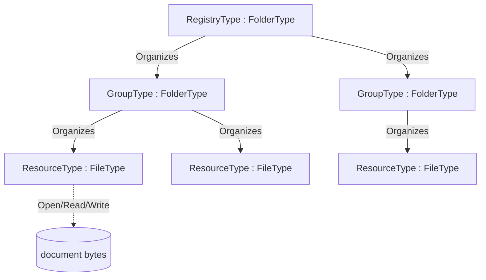

## Scope {#sec-scope}

[xRegistry](https://github.com/xregistry/spec) is a metadata standard for describing registries of related resources — schemas, endpoints, messages, Thing Descriptions and so on — in a uniform way: a **registry** contains **groups**, a group contains **resources**, and a resource has one or more **versions**, each of which has a **document** and a set of **attributes**. xRegistry defines the same information in three interchangeable **representations** (xRegistry primer §7): a directory tree of **files** (the *static file server*), a live **API server**, and a single serialized **document**.

This specification defines *one* mapping of the generic xRegistry structure onto the OPC UA AddressSpace: a registry and its groups are **folders** (`FolderType`) that organize their members, and each resource/version document *is* a **file** (`FileType`) so it is downloaded with the standard OPC UA FileTransfer read (OPC 10000-20) — the AddressSpace *is* the registry:

- a **registry** and each **group** are `FolderType` folders that organize their children; a group is created with the `CreateGroup` (or idempotent `GetOrCreateGroup`) Method on the registry, a resource or version with the `CreateResource` (or idempotent `GetOrCreateResource`) Method on the group, and an entry is removed with its own `Delete` Method (optionally epoch-matched);
- a **resource/version document** is a `FileType` file, whose bytes are read and written with the inherited `Open` / `Read` / `Write` / `Close` Methods;
- xRegistry **attributes** (`xid`, `epoch`, `name`, timestamps, `format`, `contenttype`, …) are OPC UA Properties on those Objects; the extensible **`labels`** are a browsable `AttributesType` container whose `AddAttribute` / `RemoveAttribute` Methods add and remove them as individual Property Variables;
- **federation** links to resources hosted by other registries are OPC UA `ExpandedNodeId` values.

The model is intentionally **abstract**. It defines the reusable base type system (`RegistryType`, `GroupType`, `ResourceType`, `AttributesType`) and the generic behaviours (three-representation symmetry, auto-bootstrap of the structure, attribute configuration, federation). A **domain companion specification** subtypes the base types to add its own group key and resource metadata — for example *OPC UA — Schema Registry* adds a `SchemaGroupType` keyed by an OPC UA namespace URI and a `SchemaFileType` carrying an on-wire `SchemaId`. The same base is designed to carry a future WoT Thing-Description registry without change.

It is explicitly out of scope to re-specify the xRegistry core model or its HTTP API; the OPC UA API for xRegistry — how these nodes are discovered, read and mutated over OPC UA Services — is defined in the companion [*xRegistry — OPC UA API*](xRegistry-OPC-UA-Api.md).

## Overview {#sec-overview}

### The registry *is* folders of files {#sec-the-registry-is-folders-of-files}

xRegistry's static-file-server representation lays a registry out as a directory tree: a directory per group, a document file per resource version, and a sidecar of attributes. OPC UA models exactly this shape with the standard **`FolderType`** (a browsable container that organizes its members) for the registry and its groups, and the **`FileType`** (a file with Methods to open, read, write and close its bytes, OPC 10000-20) for each resource/version document. The physical backing may be a real file-system directory, but the OPC UA types are a plain organizing folder and a file:



Because the resource document is a standard `FileType`, **any** OPC UA Client that can browse folders and read a file can consume a registry with no registry-specific code: browse the folders to discover groups and resources, then `Open`/`Read` a resource file to obtain its document.

### The three representations {#sec-the-three-representations}

xRegistry (primer §7) defines three interchangeable representations of the same information; this model realizes two of them directly and preserves the third:

| xRegistry representation | Realization in this model |
|---|---|
| **Files** / **static file server** — a directory tree of documents + attribute sidecars | The AddressSpace subtree: `FolderType` folders and `FileType` files under the `RegistryType` root. Browse = list; Read = fetch a document. |
| **API server** — a live service that serves and mutates the registry | OPC UA Client/Server services over the same subtree: Browse, Read, `Open`/`Read`/`Write`, `CreateGroup`/`GetOrCreateGroup`/`CreateResource`/`GetOrCreateResource`, the `Delete` Method, and `AddAttribute`/`RemoveAttribute` on each entity's `Labels` container — defined by [*xRegistry — OPC UA API*](xRegistry-OPC-UA-Api.md). |
| **Document** — a single serialized registry document | An OPC UA Read/export of the subtree serializes to the xRegistry JSON document shape (the inverse of importing a document to bootstrap the subtree). |

The three are **symmetric**: the same entity has the same `xid` and identity in every representation, so a resource registered through the API server is immediately visible as a file, and a document imported to bootstrap the AddressSpace is immediately serveable through the API.

### Minimal first — download is mandatory, everything else is optional {#sec-minimal-first-download-is-mandatory-everything-else-is-optional}

An implementation is useful with only the **mandatory** capability and grows from there:

1. **Download a resource document (mandatory).** Given a resource file, `Open` it for reading, `Read` its bytes, `Close`. A domain registry may add a one-call fast path (for example the Schema Registry's Opaque `SchemaId` NodeId). This is the minimum a consumer needs and it is nothing more than standard FileTransfer read (§5.1).
2. **Register a resource (optional).** `CreateResource` (or the idempotent `GetOrCreateResource`) in the target group folder and `Write` the document bytes. The server **auto-bootstraps** the surrounding structure and attributes (§6.5). This is standard FileTransfer write (§5.2).
3. **Materialize and configure the structure (optional).** Beyond the raw file, the server exposes the xRegistry attributes as Properties and the groups as folders, and lets a client refine the extensible labels with `AddAttribute` / `RemoveAttribute` on each entity's `Labels` container (§6). The whole xRegistry structure becomes browsable in the AddressSpace.
4. **Serve the full xRegistry API (optional).** The same subtree is exposed as the xRegistry API server through the OPC UA API of the companion document, including federation to other registries (§7, §8).

A conformant server **shall** support step 1; steps 2–4 are optional and independently adoptable.

## Minimal binding {#sec-minimal-binding}

### Reading a resource document (mandatory) {#sec-reading-a-resource-document-mandatory}

A resource document is the content of a `ResourceType` (a `FileType`). A consumer reads it with the standard FileType Methods (OPC 10000-20 §4.2):

1. `Open(mode = Read)` on the resource file → `fileHandle`.
2. one or more `Read(fileHandle, length)` calls → the document bytes (the `Size` Property bounds the total).
3. `Close(fileHandle)`.

No registry-specific Method is required. A domain registry **may** additionally offer a direct-addressing shortcut that returns the document in a single operation (for example reading a Value Attribute addressed by an Opaque NodeId built from a content fingerprint); such shortcuts are defined by the domain specification and never replace the mandatory FileType read. Such a NodeId addresses *bytes* and is legitimately content-derived; it is not an entity identifier, and an entity's `GroupId` or `ResourceId` is never derived from a document (§6.9).

### Registering a resource (optional) {#sec-registering-a-resource-optional}

A writer registers a document by creating a file in the target group folder and writing the bytes, using the `CreateResource` Method (and `CreateGroup` for a new group):

1. `CreateResource(ResourceId, VersionId, RequestFileOpen = true)` on the target `GroupType` folder → the new resource file's `NodeId`, the assigned `VersionId`, and a write `fileHandle` (or `CreateGroup` first to create a new group). A version is identified by `(ResourceId, VersionId)`: a new `ResourceId` creates the resource with its first version, an existing `ResourceId` with a new `VersionId` creates a new sibling version, and an empty `VersionId` lets the server assign the next versionid. The idempotent `GetOrCreateResource` (and `GetOrCreateGroup`) collapse an existence check and creation into one call, returning the file plus a `Created` flag.
2. one or more `Write(fileHandle, data)` calls with the document bytes.
3. `Close(fileHandle)`.

On `Close` the server **auto-bootstraps** (§6.5): it assigns the entity's `xid`, `epoch`, `CreatedAt`/`ModifiedAt`, and any domain-derived attributes, and links the new file under its group and registry so it is immediately visible in all three representations. A server that is read-only (a published catalogue or a mirror) need not expose `CreateResource`.

### SecureChannel requirements {#sec-securechannel-requirements}

Every operation that creates, modifies or deletes registry content or metadata shall be accepted only over an OPC UA SecureChannel using `MessageSecurityMode` `SignAndEncrypt`. This requirement applies to `CreateGroup`, `GetOrCreateGroup`, `CreateResource`, `GetOrCreateResource`, FileType `Open` for writing, `Write`, the `Close` that commits written content, `Delete`, `AddAttribute`, `RemoveAttribute`, and domain-specific Methods that change version selection, enablement or other registry state. Roles and Permissions remain independently applicable and may impose stricter authorization.

Registry reads should use a secured channel. An implementation may expose read-only Browse, Read and FileType `Open`/`Read`/`Close` operations over `MessageSecurityMode` `None` when its deployment policy permits this. A client using such an endpoint shall not infer authenticity, integrity or confidentiality for the returned registry metadata or document bytes.

## Types the prose does not introduce {#sec-types-not-introduced}

The abstract base namespace is `http://opcfoundation.org/UA/xRegistry/`. Draft numeric NodeIds use the provisional `63000+` block; final NodeIds are assigned by the OPC Foundation. The four base ObjectTypes and their members are the normative node reference in Annex A. This clause describes their intent. Every Variable in the model has an explicit TypeDefinition: fixed attributes are `PropertyType` Variables, and each dynamic label is a `PropertyType` Variable under an `AttributesType` container (§6.6). A server **shall** set each group's, resource's and version's BrowseName to its identifier (`GroupId` / `ResourceId` / `VersionId`) so a client selects and filters entities directly from Browse results without a Read per candidate; the [*xRegistry — OPC UA API*](xRegistry-OPC-UA-Api.md) relies on this for read-free collection filtering. §6.9 defines how a `GroupId` and a `ResourceId` are constructed and requires a human-readable `Name` beside each.

### RegistryType {#sec-registrytype}

`RegistryType` is a subtype of `FolderType` and is the registry root — a folder that organizes the groups it contains. It creates a group through its `CreateGroup` Method (or the idempotent `GetOrCreateGroup`); a group is removed with the group's own `Delete` Method. Its Properties carry the registry-level xRegistry attributes: the Mandatory `RegistryId` and the optional `SpecVersion` (the xRegistry spec version), plus the common attributes of §6.4. The `Capabilities` document (xRegistry `/capabilities`) is exposed **two ways**: as a component `FileType` object (`Capabilities`, the raw JSON read with `Open`/`Read`/`Close`) and as a typed Variable (`CapabilitiesInfo`) of the `RegistryCapabilitiesDataType` Structure (§6.7) whose fixed fields a client reads in one Variant value without parsing JSON. The `Model` document (xRegistry `/model`) is exposed only as a `FileType` object, because the OPC UA AddressSpace type system (the ObjectTypes and their members) is the structural equivalent of the model, so no structured DataType is defined for it. Its `<Group>` OptionalPlaceholder declares that its folder members are `GroupType` instances. A domain registry subtypes `RegistryType` (for example `SchemaRegistryType`) and constrains `<Group>` to its own group type.

*Table - RegistryType Definition* {#tbl-registrytype-definition defines=RegistryType}

| **Attribute** | **Value** |  |  |  |  |
| --- | --- | --- | --- | --- | --- |
| BrowseName | 1:RegistryType |  |  |  |  |
| IsAbstract | False |  |  |  |  |

| **References** | **Node Class** | **BrowseName** | **DataType** | **TypeDefinition** | **Other** |
| --- | --- | --- | --- | --- | --- |
| Subtype of the 0:FolderType defined in OPC 10000-5 |  |  |  |  |  |
| 0:HasProperty | Variable | RegistryId | 0:String | 0:PropertyType | M |
| 0:HasProperty | Variable | SpecVersion | 0:String | 0:PropertyType | O |
| 0:HasComponent | Object | Capabilities |  | 0:FileType | O |
| 0:HasComponent | Object | Model |  | 0:FileType | O |
| 0:HasProperty | Variable | CapabilitiesInfo | RegistryCapabilitiesDataType | 0:PropertyType | O |
| 0:HasProperty | Variable | Xid | 0:String | 0:PropertyType | O |
| 0:HasProperty | Variable | Epoch | 0:UInt32 | 0:PropertyType | O |
| 0:HasProperty | Variable | Name | 0:String | 0:PropertyType | O |
| 0:HasProperty | Variable | Description | 0:String | 0:PropertyType | O |
| 0:HasProperty | Variable | Documentation | 0:String | 0:PropertyType | O |
| 0:HasComponent | Object | Labels |  | AttributesType | O |
| 0:HasProperty | Variable | CreatedAt | 0:DateTime | 0:PropertyType | O |
| 0:HasProperty | Variable | ModifiedAt | 0:DateTime | 0:PropertyType | O |
| 0:Organizes | Object | <Group> |  | GroupType | OP |
| 0:HasComponent | Method | CreateGroup |  |  | O |
| 0:HasComponent | Method | GetOrCreateGroup |  |  | O |

| **Conformance Units** |  |  |  |  |  |
| --- | --- | --- | --- | --- | --- |
| XREG-Registry |  |  |  |  |  |

### GroupType {#sec-grouptype}

`GroupType` is a subtype of `FolderType` and is a group folder — an entry of an xRegistry `GROUPS` collection. It carries the Mandatory `GroupId` and `Name` and the common attributes of §6.4, and its `<Resource>` OptionalPlaceholder declares that its members are `ResourceType` files, created through its `CreateResource` Method (or the idempotent `GetOrCreateResource`); a new version of an existing resource is created as a new sibling file keyed by `(ResourceId, VersionId)` through the same Method. The group is removed by its own `Delete(ExpectedEpoch: UInt32)` Method, which deletes the group together with the resources it contains; `ExpectedEpoch` provides the same optimistic-concurrency check as in §6.6 (non-zero and unequal to the group's `Epoch` → `Bad_InvalidState`, no change; `0` disables it). A domain group subtypes `GroupType` to add the **group key** — the group's source identity (§6.9), from which its `GroupId` is constructed: for example `SchemaGroupType` adds a Mandatory `NamespaceUri`.

*Table - GroupType Definition* {#tbl-grouptype-definition defines=GroupType}

| **Attribute** | **Value** |  |  |  |  |
| --- | --- | --- | --- | --- | --- |
| BrowseName | 1:GroupType |  |  |  |  |
| IsAbstract | False |  |  |  |  |

| **References** | **Node Class** | **BrowseName** | **DataType** | **TypeDefinition** | **Other** |
| --- | --- | --- | --- | --- | --- |
| Subtype of the 0:FolderType defined in OPC 10000-5 |  |  |  |  |  |
| 0:HasProperty | Variable | GroupId | 0:String | 0:PropertyType | M |
| 0:HasProperty | Variable | Xid | 0:String | 0:PropertyType | O |
| 0:HasProperty | Variable | Epoch | 0:UInt32 | 0:PropertyType | O |
| 0:HasProperty | Variable | Name | 0:String | 0:PropertyType | M |
| 0:HasProperty | Variable | Description | 0:String | 0:PropertyType | O |
| 0:HasProperty | Variable | Documentation | 0:String | 0:PropertyType | O |
| 0:HasComponent | Object | Labels |  | AttributesType | O |
| 0:HasProperty | Variable | CreatedAt | 0:DateTime | 0:PropertyType | O |
| 0:HasProperty | Variable | ModifiedAt | 0:DateTime | 0:PropertyType | O |
| 0:Organizes | Object | <Resource> |  | ResourceType | OP |
| 0:HasComponent | Method | CreateResource |  |  | O |
| 0:HasComponent | Method | GetOrCreateResource |  |  | O |
| 0:HasComponent | Method | Delete |  |  | O |

| **Conformance Units** |  |  |  |  |  |
| --- | --- | --- | --- | --- | --- |
| XREG-Group |  |  |  |  |  |
| XREG-Identity |  |  |  |  |  |

### ResourceType {#sec-resourcetype}

`ResourceType` is a subtype of `FileType`: the resource/version **document is the file**, read and written through the inherited `Open` / `Read` / `Write` / `Close` Methods. It carries the resource-level xRegistry attributes: the Mandatory `ResourceId` and `Name`, the `VersionId`, the `Format` (the xRegistry format string) and `ContentType` (the document media type), the federation links `ExternalReference` and `ResourceUrl` (§8), and the common attributes of §6.4 (including its `Labels` container, §6.6). It is removed by its own `Delete(ExpectedEpoch: UInt32)` Method, symmetric with `GroupType.Delete` — a resource is a file, and deleting it removes its versions and `Labels`; `ExpectedEpoch` applies the same optimistic-concurrency check (non-zero and unequal to the resource's `Epoch` → `Bad_InvalidState`, no change; `0` disables it). A domain resource subtypes `ResourceType` (for example `SchemaFileType`) to add its own metadata, including the Mandatory Property that carries its source identity (§6.9).

*Table - ResourceType Definition* {#tbl-resourcetype-definition defines=ResourceType}

| **Attribute** | **Value** |  |  |  |  |
| --- | --- | --- | --- | --- | --- |
| BrowseName | 1:ResourceType |  |  |  |  |
| IsAbstract | False |  |  |  |  |

| **References** | **Node Class** | **BrowseName** | **DataType** | **TypeDefinition** | **Other** |
| --- | --- | --- | --- | --- | --- |
| Subtype of the 0:FileType defined in OPC 10000-5 |  |  |  |  |  |
| 0:HasProperty | Variable | ResourceId | 0:String | 0:PropertyType | M |
| 0:HasProperty | Variable | VersionId | 0:String | 0:PropertyType | O |
| 0:HasProperty | Variable | Format | 0:String | 0:PropertyType | O |
| 0:HasProperty | Variable | ContentType | 0:String | 0:PropertyType | O |
| 0:HasProperty | Variable | ExternalReference | 0:ExpandedNodeId | 0:PropertyType | O |
| 0:HasProperty | Variable | ResourceUrl | 0:String | 0:PropertyType | O |
| 0:HasProperty | Variable | Xid | 0:String | 0:PropertyType | O |
| 0:HasProperty | Variable | Epoch | 0:UInt32 | 0:PropertyType | O |
| 0:HasProperty | Variable | Name | 0:String | 0:PropertyType | M |
| 0:HasProperty | Variable | Description | 0:String | 0:PropertyType | O |
| 0:HasProperty | Variable | Documentation | 0:String | 0:PropertyType | O |
| 0:HasComponent | Object | Labels |  | AttributesType | O |
| 0:HasProperty | Variable | CreatedAt | 0:DateTime | 0:PropertyType | O |
| 0:HasProperty | Variable | ModifiedAt | 0:DateTime | 0:PropertyType | O |
| 0:HasComponent | Method | Delete |  |  | O |

| **Conformance Units** |  |  |  |  |  |
| --- | --- | --- | --- | --- | --- |
| XREG-Resource |  |  |  |  |  |
| XREG-Identity |  |  |  |  |  |
| XREG-Federation |  |  |  |  |  |

### Common xRegistry attributes {#sec-common-xregistry-attributes}

Every registry, group and resource carries the common xRegistry attributes as Properties: `Xid` (the relative identifier), `Epoch` (the change counter), `Name`, `Description`, `Documentation`, `CreatedAt` and `ModifiedAt` — each an explicit `PropertyType` Variable — plus an optional **`Labels`** Object of type `AttributesType` (§6.6) that holds the entity's extensible xRegistry `labels`. `Name` is Mandatory on `GroupType` and `ResourceType`, because a group and a resource are what a human browses and a generic tool has only the identifier and the name to display (§6.9); it is Optional on `RegistryType`, whose `RegistryId` is chosen rather than derived. `Xid` is stable across representations and across registries (§8): it identifies the entity independently of the endpoint that currently serves it. `Epoch` increments on every change so a client can detect a stale cache.

### Auto-bootstrap {#sec-auto-bootstrap}

When a resource is created by writing a file (§5.2), the server **shall** materialize the surrounding xRegistry structure without requiring the client to build it explicitly:

- create the group folder if it does not yet exist (a domain registry derives the group key — for example the OPC UA namespace URI — from the document or the create arguments);
- assign the resource its `ResourceId`, constructed from its source identity per §6.9, its initial `VersionId` and a non-empty `Name`, and set `Format` / `ContentType` from the create context or by inspecting the document;
- assign `Xid`, `Epoch = 1`, and `CreatedAt` = `ModifiedAt` = now;
- link the file under its group and the group under the registry so the entity is immediately visible as a file, through the API, and in a serialized document.

Subsequent `Write`s or `AddAttribute` / `RemoveAttribute` calls (on the entity's `Labels` container) update `ModifiedAt` and increment `Epoch`. Auto-bootstrap makes the minimal write path (`CreateResource` + `Write`) sufficient to populate a fully-formed registry entry; a client that needs finer control uses `AddAttribute` / `RemoveAttribute` afterwards.

### AttributesType {#sec-attributestype}

The extensible xRegistry `labels` (and any other dynamic extension attributes) are modelled as an **`AttributesType`** container rather than a single array Property, so each label is an individually browsable, readable and enumerable node and cannot collide with an entity's fixed attribute BrowseNames. `AttributesType` (a subtype of `BaseObjectType`) has:

- an OptionalPlaceholder `<Attribute>` `PropertyType` Variable — a server materializes one `PropertyType` Variable per present label, whose BrowseName is the label key and whose value is the label string; and
- the `AddAttribute(Key: String, Value: String, ExpectedEpoch: UInt32)` and `RemoveAttribute(Key: String, ExpectedEpoch: UInt32)` Methods, which add/update and remove those Variables and increment the owning entity's `Epoch`; success or failure is conveyed by the Method Call StatusCode (they return no output). `ExpectedEpoch` provides optimistic concurrency: when it is non-zero and does not equal the owning entity's current `Epoch`, the Method fails `Bad_InvalidState` and makes no change; `0` disables the check.

This follows the established OPC UA extensible-container pattern (a container ObjectType with an OptionalPlaceholder member plus Add/Remove Methods, as used for dynamic parameter/property sets), and is the OPC UA form of an xRegistry `PATCH` of an entity's `labels`. Each entity exposes one such container as its `Labels` component (§6.4); the labels are deleted together with the entity. A server that does not allow post-creation configuration need not expose the Methods. An `AddIn`/interface composition (`HasAddIn`/`HasInterface`) is a viable alternative for attaching the container; the component form is used here for simplicity.

*Table - AttributesType Definition* {#tbl-attributestype-definition defines=AttributesType}

| **Attribute** | **Value** |  |  |  |  |
| --- | --- | --- | --- | --- | --- |
| BrowseName | 1:AttributesType |  |  |  |  |
| IsAbstract | False |  |  |  |  |

| **References** | **Node Class** | **BrowseName** | **DataType** | **TypeDefinition** | **Other** |
| --- | --- | --- | --- | --- | --- |
| Subtype of the 0:BaseObjectType defined in OPC 10000-5 |  |  |  |  |  |
| 0:HasProperty | Variable | <Attribute> | 0:String | 0:PropertyType | OP |
| 0:HasComponent | Method | AddAttribute |  |  | O |
| 0:HasComponent | Method | RemoveAttribute |  |  | O |

| **Conformance Units** |  |  |  |  |  |
| --- | --- | --- | --- | --- | --- |
| XREG-Attributes |  |  |  |  |  |

### RegistryCapabilitiesDataType {#sec-registrycapabilitiesdatatype}

`RegistryCapabilitiesDataType` is a Structure DataType that carries the fixed fields of the xRegistry `/capabilities` document, so a client reads a registry's advertised capabilities as one typed Variant value (the `RegistryType.CapabilitiesInfo` Variable, §6.1) without parsing the `Capabilities` file JSON. Its fields mirror the xRegistry capabilities schema: `Flags` (`String[]`, the enabled request-flag names), `Mutable` (`String[]`, the mutable entity kinds), `Pagination` (`Boolean`), `ShortSelf` (`Boolean`), `SpecVersions` (`String[]`), `StickyVersions` (`Boolean`), `EnforceCompatibility` (`Boolean`), `Apis` (`String[]`) and `Schemas` (`String[]`). xRegistry allows vendor-defined capability keys; a server that advertises such extension keys conveys them through the raw `Capabilities` file, which remains the authoritative document. The typed value is a convenience view of the standard fields.

*Table - RegistryCapabilitiesDataType Definition* {#tbl-registrycapabilitiesdatatype-definition defines=RegistryCapabilitiesDataType}

| **Attribute** | **Value** |  |  |  |  |
| --- | --- | --- | --- | --- | --- |
| BrowseName | 1:RegistryCapabilitiesDataType |  |  |  |  |
| IsAbstract | False |  |  |  |  |

| **References** | **Node Class** | **BrowseName** | **DataType** | **TypeDefinition** | **Other** |
| --- | --- | --- | --- | --- | --- |
| Subtype of the 0:Structure defined in OPC 10000-3 |  |  |  |  |  |
| 0:HasEncoding | Object | Default Binary |  | 0:DataTypeEncodingType |  |
| 0:HasEncoding | Object | Default JSON |  | 0:DataTypeEncodingType |  |

| **Conformance Units** |  |  |  |  |  |
| --- | --- | --- | --- | --- | --- |
| XREG-Capabilities |  |  |  |  |  |

### Collection ordering {#sec-collection-ordering}

xRegistry `GROUPS`, resource and version collections are **unordered maps keyed by id**; the registry does not prescribe a stored order for their entries, and version order is conveyed by attributes (`ancestor`, `createdat`, `defaultversionid`), not by position. OPC UA correspondingly defines no ordered-collection interface, so this model uses none: the order in which a Browse returns a folder's members is server-defined and **not** significant. A client that needs a specific presentation order applies the xRegistry `?sort` hint itself, ordering the Browse results client-side by an attribute it reads (for example `VersionId` or `CreatedAt`). A server that requires a deterministic domain order MAY add its own index Property to the entities, but the base model does not mandate one.

### Entity identifiers and names {#sec-entity-identifiers-and-names}

**Source identity.** Every group and every resource has a **source identity**: the domain-defined string that names *what* the entity is — an OPC UA namespace URI, an authored asset identifier, a W3C Thing identifier, a DataType BrowseName. A domain companion specification **shall** name exactly one source identity for each of its group types and resource types and **shall** expose it verbatim as a Mandatory Property of that type. The source identity is the authoritative name of the entity; `GroupId` and `ResourceId` are the **symbolic identifiers** derived from it.

**An identifier is never derived from a document.** `GroupId` and `ResourceId` **shall not** be derived from a resource document, or from any digest, fingerprint or hash of one. A resource is a stable umbrella over its versions, so its identifier is invariant while its document changes from version to version. A content fingerprint — the Schema Registry `SchemaId`, an artifact digest — is **version-level** metadata that identifies bytes, and is never an entity identifier.

**Construction.** A `GroupId` or `ResourceId` **shall** be constructed from the entity's source identity as follows. The result is a dot-separated token that reads like a reverse-DNS symbol, for example `org.contoso.assets.pump`.

1. Split the source identity into an *authority* and a *path*. For an absolute URI with an authority component the authority is the host, together with the port when one is present, and the path is the URI path; the scheme, userinfo, query and fragment are discarded. For a URN the authority is empty and the path is the URN split on `:`, so the leading `urn` survives as the first label and a URN never aliases a bare path. Otherwise the authority is empty and the path is the source identity split on `/`.
2. Reverse the authority's `.`-separated labels — `contoso.org` becomes `org`, `contoso` — appending the port, where present, as a further label.
3. Percent-decode each path segment and discard the empty ones.
4. Normalize each label: replace every run of characters outside `A-Z a-z 0-9 _ . -` with a single `-`; collapse runs of `-` and runs of `.`; strip leading and trailing `-` and `.`; discard a label that becomes empty. Letter case is preserved.
5. Join the surviving labels with `.`.
6. If no label survives, the identifier is `_`. Step 4 guarantees that every surviving label begins with a letter, a digit or `_`, so the result always satisfies the xRegistry start-character rule.
7. If the result is longer than 128 characters, drop trailing labels — never the first — until it is at most 119 characters long; if that first label is itself longer than 119 characters, truncate it to 119 and strip any trailing `-` or `.`. Then append the disambiguator of step 8. The first label is kept because it carries the reverse-DNS root, which is the part a reader recognizes; dropping it would reduce a long identity to little more than its disambiguator.
8. Where step 7 truncated the result, or where the result would collide case-insensitively with an existing sibling in the same collection, append `.` followed by the first eight lower-case hexadecimal characters of the SHA-256 of the UTF-8 encoding of the **exact source identity**. The disambiguator is a function of the identity, not of any document, so it does not change when a new version is written.

The output alphabet is `A-Z a-z 0-9 _ . -`, a strict subset of the characters xRegistry permits in a `<SINGULAR>id`, chosen so that one identifier is simultaneously safe in a URL, on a command line, and as a file name in the static-file-server representation (§4.2). `VersionId` is outside this construction: version identifiers follow the xRegistry version-id rules and are assigned by the registry.

**Resolution is one-way.** The construction is lossy — distinct source identities can normalize to the same token, which is what step 8 resolves. A consumer that holds a source identity computes the identifier in closed form and confirms it by reading the entity's source-identity Property. A consumer that holds only an identifier resolves the entity by matching that Property within the collection. An implementation **shall not** attempt to recover a source identity by inverting the construction.

**Name and DisplayName.** Every group and every resource **shall** expose a non-empty `Name`; where the source identity is itself readable, `Name` **shall** be the exact, unnormalized source identity. A server **shall** set each group's and resource's BrowseName to its identifier and its DisplayName to its `Name`, so a client that browses the registry with a generic OPC UA tool sees the symbolic identifier and the human-readable name without reading a single Property.

Worked examples, using the source identities of the domain registries built on this base:

| Source identity | Symbolic identifier | `Name` |
|---|---|---|
| `http://contoso.org/UA/Pumps/` | `org.contoso.UA.Pumps` | `http://contoso.org/UA/Pumps/` |
| `http://opcfoundation.org/UA/` | `org.opcfoundation.UA` | `http://opcfoundation.org/UA/` |
| `pump.usda` | `pump.usda` | `pump.usda` |
| `textures/albedo.png` | `textures.albedo.png` | `textures/albedo.png` |
| `pkg.usdz[tex/a.png]` | `pkg.usdz-tex.a.png` | `pkg.usdz[tex/a.png]` |
| `urn:dev:ops:32473-pump-01` | `urn.dev.ops.32473-pump-01` | `Pump 01` |
| `https://contoso.org/things/pump-01` | `org.contoso.things.pump-01` | `Pump 01` |

## The xRegistry API over OPC UA {#sec-the-xregistry-api-over-opc-ua}

The AddressSpace subtree is simultaneously the xRegistry **API server**: each xRegistry operation is realized natively by OPC UA Services over the same nodes. The full OPC UA API — reading, listing, creating, updating and deleting registries, groups, resources, versions and their documents and attributes, together with the request flags and error handling — is defined in the companion [*xRegistry — OPC UA API*](xRegistry-OPC-UA-Api.md), the OPC UA API binding of xRegistry. In summary:

| xRegistry operation | OPC UA operation |
|---|---|
| List a registry/group/resource collection | Browse the corresponding `FolderType` folder |
| Read a resource document | `Open`/`Read`/`Close` the `ResourceType` file (or a domain fast path) |
| Read an entity's attributes | Read the Properties of the Object (and its `Labels` container) |
| Create a resource or version | `CreateResource` / `GetOrCreateResource` (+ `CreateGroup` / `GetOrCreateGroup`) then `Write` |
| Update an entity's labels | `AddAttribute` / `RemoveAttribute` on the entity's `Labels` container |
| Delete an entity | the entity's own `Delete(ExpectedEpoch)` Method on the group/resource node |
| Export a subtree as a document | Read/serialize the subtree to the xRegistry document shape |

## Federation {#sec-federation}

xRegistry federation (primer §8) lets one registry reference resources hosted by another. A key xRegistry rule is that an entity's identity (`xid`, `groupid`, `resourceid`) is **stable across registries**, while the **URL authority identifies the serving endpoint, not the resource** — so the same resource federated from two endpoints keeps one identity but is reachable at two URLs. OPC UA models this precisely with `ExpandedNodeId` (OPC 10000-3 §8.2.3), whose `ServerUri` identifies the hosting endpoint and whose `NamespaceUri` + `Identifier` identify the entity independently of it.

A federated resource is represented locally by a `ResourceType` whose `ExternalReference` Property (an `ExpandedNodeId`) points to the resource in the remote registry: the `ServerUri` is the remote registry's OPC UA endpoint, and the `NamespaceUri` + `Identifier` are the remote group/resource identity. The `ResourceUrl` Property carries the same link in string form (the xRegistry `<RESOURCE>url`) — for example an `opc.tcp` endpoint plus a browse path, or an HTTP URL for a non-OPC-UA registry. A client resolves a federated resource by connecting to the `ServerUri` endpoint and browsing/reading the referenced node, exactly as it would a local one. Annex B specifies the resolution algorithm.

## Conformance {#sec-conformance}

An implementation conforms to this base model if it exposes a `RegistryType` root (or a domain subtype) under which groups are projected as `FolderType` folders and resources as `ResourceType` files, and it supports the **mandatory** capability of §4.3 — reading a resource document through the FileType Methods (§5.1). It **may** additionally support registration (§5.2), structure materialization and attribute configuration (§6), the xRegistry API mapping (§7) and federation (§8); each is optional and independently conformant.

A domain companion specification conforms if its registry, group and resource types are subtypes of `RegistryType`, `GroupType` and `ResourceType` respectively and it does not weaken the mandatory read capability.

The conformance units below are testable against a Server. The `XREG` prefix is the short name of this specification, so a unit identifier is unique across companion specifications.

| Conformance unit | Requirement |
|---|---|
| **XREG-Registry** (base) | Expose a `RegistryType` root that organizes its groups, with `SpecVersion` and the registry capabilities (§6.1). |
| **XREG-Group** | Project each group as a `GroupType` folder organizing its resources, keyed by the group key (§6.2). |
| **XREG-Resource** | Project each resource and version as a `ResourceType`, whose document **is** the file, read through the inherited `Open`/`Read`/`Close` (§5.1, §6.3). |
| **XREG-Identity** | Give every group and resource a symbolic `GroupId` / `ResourceId` built from its source identity by the construction of §6.9, a non-empty `Name`, a BrowseName equal to the identifier and a DisplayName equal to the `Name`, and expose the source identity itself as a Mandatory Property. |
| **XREG-Attributes** | Expose an entity's extensible attributes through `AttributesType`, added and removed with `AddAttribute`/`RemoveAttribute`, incrementing the owning entity's `Epoch` (§6.6). |
| **XREG-Registration** | Create and delete groups, resources and versions through `CreateGroup`, `GetOrCreateGroup`, `CreateResource`, `GetOrCreateResource` and `Delete` (§5.2, §7). |
| **XREG-Capabilities** | Populate `RegistryCapabilitiesDataType` so a Client can discover which optional capabilities the registry supports (§6.7). |
| **XREG-Federation** | Resolve a resource the registry does not host through `ResourceUrl` / `ExternalReference` (§8). |

`XREG-Registry`, `XREG-Group`, `XREG-Resource` and `XREG-Identity` together are the baseline; the rest are independently optional.

## NodeSet validation {#sec-nodeset-validation}

The NodeSet, CSV and Annex A are generated from `tools/build_model.py`. The local validator (`tools/validate_local.py`) checks XML well-formedness, unique NodeIds, that each ObjectType has a `HasSubtype` back-reference to its base (`FolderType` / `FileType` / `BaseObjectType`), that members carry a `HasModellingRule` and a `HasTypeDefinition`, and that the CSV and NodeSet agree. Domain NodeSets that extend this base declare it as a `<RequiredModel>` and reference its types by namespace-qualified NodeId.

---

## Information model {#anx-a annex=normative}

```{clause}
kind: annex-a
```

## Federation resolution via ExpandedNodeId (informative) {#anx-b annex=normative}

A client resolves a federated resource as follows:

1. Read the federated `ResourceType`'s `ExternalReference` Property (an `ExpandedNodeId`).
2. If its `ServerUri` is empty or equal to the local server, the target is local: resolve `NamespaceUri` + `Identifier` to a local NodeId and read it as in §5.1.
3. Otherwise the target is remote: obtain the endpoint URL for `ServerUri` (from the local server's `Server` Object `ServerArray`/namespace metadata, from a discovery server, or from the `ResourceUrl` string), open a secure channel and session to that endpoint, translate `NamespaceUri` to the remote `NamespaceIndex`, and read the referenced resource file there with the FileType Methods of §5.1.
4. `ResourceUrl` provides the same link for non-OPC-UA registries: an HTTP `<RESOURCE>url` is fetched with HTTP; an `opc.tcp` URL encodes the endpoint and a browse path to the resource file.

Because `xid`, `groupid` and `resourceid` are stable across registries while the `ServerUri`/URL authority identifies only the endpoint, a resource federated from several registries keeps a single identity and can be de-duplicated by `xid` even though it is reachable through several `ExternalReference`/`ResourceUrl` links.
