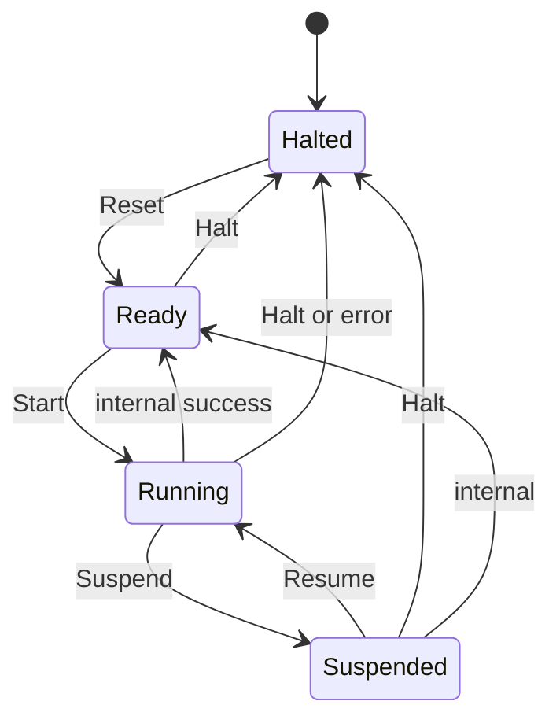
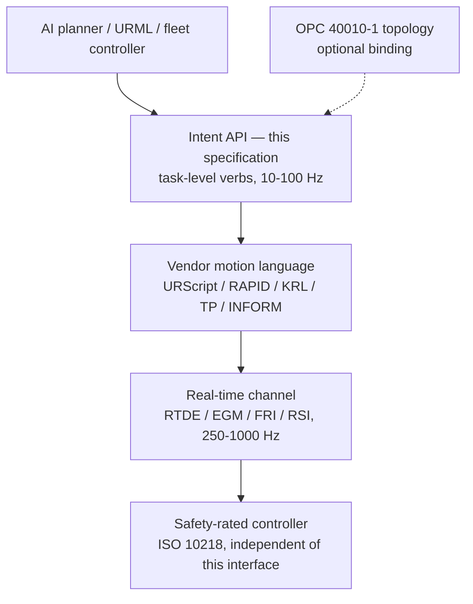
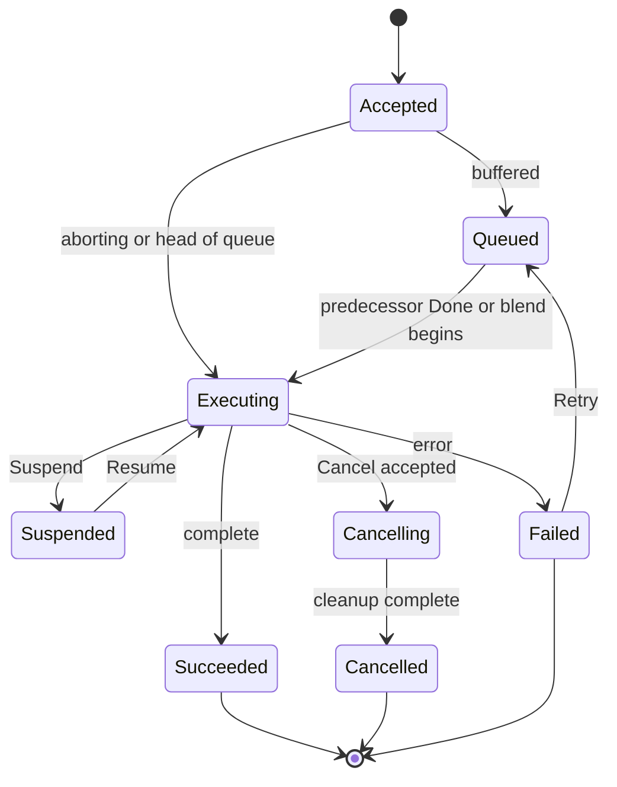

# Research — An OPC UA Specification for Robot Control via an Intent API

**Scope.** Source material for a specification to be drafted in `metaverse-specs/`, standardising a
task-level *intent* interface for robots on OPC UA. Triggered by the robotics intent API merged into
the .NET OPC UA stack ([`OPCFoundation/UA-.NETStandard#4127`](https://github.com/OPCFoundation/UA-.NETStandard/pull/4127),
from [issue #3827](https://github.com/OPCFoundation/UA-.NETStandard/issues/3827)).

**Status.** Research only. No design decisions are made here; §11 lists what must be decided before a plan.

---

## 1 Executive summary

OPC 40010-1 *Robotics* defines a rich robot **topology** and **no motion verbs at all**. Its entire
actuation surface is two state machines (`SystemOperation`, `TaskControl`) plus a controller `Programs`
directory — you can start, stop and load a program, but you cannot say *"move to this pose"*. Everything
above that line is vendor-proprietary. That gap is real, it is acknowledged in OPC 40010-1's own scope
clause, and it is what the .NET stack filled unilaterally in an application-owned namespace.

Five findings shape what the specification should be.

1. **The .NET API is a synchronous request/response façade.** It has no operation handle, no progress,
   no server-side cancel, no queueing. It is a *vocabulary* contribution, not a lifecycle contribution.
   The lifecycle is the hard part and it is entirely unsolved there (§2.3).

2. **A feared collision does not exist.** The widely repeated claim that OPC 40010 Parts 2 (Skills) and
   3 (Motion Program) are in development is **not supported by primary evidence** — the OPC Foundation
   reference index lists only Part 1 (§9). What *does* exist is a stalled 2020 prototype from the VDMA
   **SOArc** working group under a different namespace, `http://opcfoundation.org/UA/Skills/`. That is
   prior art to reference, not an obstacle.

3. **URML is not a standard.** It is a solo, pre-1.0, single-maintainer project. It is a legitimate
   *consumer* of an OPC UA intent API and a useful sanity check on vocabulary, but it cannot be a
   normative reference, and the specification must not be shaped to fit it (§4).

4. **OPC UA already has the async pattern, and it is Part 10 `ProgramStateMachineType`.** Per-invocation
   instances with NodeId handles, `ProgramTransitionEventType` for progress, `FinalResultData` for
   results. The critical trap: the OPC UA `Cancel` **service** cancels a *request*, not an *operation* —
   a robot commanded to move keeps moving (§6.4). This distinction must be stated normatively.

5. **Safety is a hard boundary, not a caveat.** ISO 10218-1/-2:2025 (in force 1 April 2025) absorbed
   ISO/TS 15066 and added cybersecurity requirements. An OPC UA method call carries **no** safety rating;
   OPC 40010-1 §7.7.1 says so in its own text. The specification must declare itself non-safety-rated,
   scope itself to Automatic / Automatic External modes, and state that a "stop" request implies **no**
   IEC 60204-1 stop category (§8).

**The shape that follows from this**: a *task-level* intent layer, explicitly above the vendor motion
language and explicitly below the safety system, using Part 10 program semantics for lifecycle,
`ThreeDFrame` for pose, PLCopen `BufferMode` for queueing, and OPC 40010-1 as an optional topology
binding rather than a required model.

---

## 2 The trigger: what the .NET stack actually shipped

### 2.1 Provenance

PR #4096 was **closed and split** into #4123–#4127. The robotics slice **#4127 is merged**
(SHA `ae241b6625a8580ec4b3b324ef110acd729df7b4`). Authored by `marcschier`.

The PR body states the design position verbatim:

> OPC 40010 1.02 defines a rich robot **topology** but **no motion verbs at all** — its actuation surface
> is the SystemOperation and TaskControl state machines plus a Controller `Programs` directory.

It closes this in **two tiers, and never presents the second as standard**:

| Tier | Content | Namespace |
|---|---|---|
| 1 — normative | OPC 40010-1 state machines, topology, condition monitoring | `http://opcfoundation.org/UA/Robotics/` |
| 2 — opt-in, non-normative | motion verbs | application-owned |

Tier 2 members are resolved **by BrowseName**, deliberately, so that a consumer such as URML needs no
NodeId mapping file. **The specification the user wants is the standardisation of Tier 2.**

### 2.2 The verb set as implemented

`src/Opc.Ua.Robotics/RoboticsOperationConventions.cs`, namespace `Opc.Ua.Robotics.Operations`:

| Verb | Request record |
|---|---|
| `MoveTo` | `MoveToRequest(ThreeDFrame TargetFrame, double? SpeedFraction, double? BlendRadius, EUInformation? BlendRadiusUnits)` |
| `MoveJ` | `JointMoveRequest(ArrayOf<double> JointTargets, EUInformation JointUnits, double? SpeedFraction)` |
| `MoveL` | `LinearMoveRequest(ThreeDFrame, double LinearSpeed, EUInformation LinearSpeedUnits, double? Acceleration, EUInformation? AccelerationUnits)` |
| `Grasp` | `GraspRequest(double? ForceNewtons, double? Width, EUInformation? WidthUnits, RoboticsApproach Approach)` |
| `Release` | `ReleaseRequest(RoboticsReleaseMode Mode, ThreeDFrame? TargetFrame)` |
| `PickFrom` / `PlaceAt` | `PickPlaceRequest(string StationOrLocationIdentifier, string ObjectClass, ArrayOf<KeyValuePair> Attributes, double? ForceNewtons)` |
| `SwapTool` | `ToolChangeRequest` |
| `SetOutput` | `OutputRequest(string, Variant)` |
| `CallProgram` | `ProgramCallRequest(string, ArrayOf<Variant>)` |

Enums: `RoboticsReleaseMode { Drop, Place, Handover }`, `RoboticsApproach { Default, ToolZ, Top, Side }`.
Universal result: `RoboticsOperationResult(ServiceResult, string? Message, ArrayOf<Variant>? Outputs)`.
Extension point: `AddOperation<TRequest,TResponse>`.

Server registration is `IRoboticsOperationsBuilder`
(`src/Opc.Ua.Robotics.Server/Builders/RoboticsOperationsBuilders.cs`); client resolution is
BrowseName-based (`src/Opc.Ua.Robotics.Client/Operations/RoboticsOperationsClient.cs`).

### 2.3 What it does not have — the central design problem

The model is **synchronous request/response**. There is:

- no operation handle or ID returned to the caller;
- no progress feedback;
- no server-side cancellation (`CancellationToken` is client-side only — it abandons the *wait*, not the
  *motion*);
- no queueing, buffering or blending semantics between successive commands;
- no notion of who currently owns the robot.

A `MoveL` across a two-metre workcell takes seconds. A `PickFrom` may take a minute. Holding an OPC UA
`Call` open for that duration collides with session timeouts (§6.1). **This is the single largest thing
the specification must add**, and nothing in the .NET implementation constrains how.

### 2.4 Issue #3827 — what it is and is not

Opened by `@idoco2003` (the URML author) as **outreach**, not a requirements document. `marcschier`
replied that specification changes go through OPC Foundation working groups via **Mantis** (Robot CS
area), and proposed "an extension library (common, client, server) for robotics in this repo,
implementing the standard, and then a simplified binding (AI accessible) in URML". Still open, assigned
to `marcschier`.

Conspicuously **not** discussed in the thread: ROS 2, VDA 5050, ISO 9787/8373, PackML, MTP, euROBIN.
The thread is therefore weak evidence of requirements and should not be treated as a design input.

---

## 3 The gap in OPC 40010-1

Published, v1.02, namespace `http://opcfoundation.org/UA/Robotics/`.

**Actuation surface, in full:**

| Type | NodeId | Methods |
|---|---|---|
| `OperationStateMachineType` | i=1006 | `Start() → Status:Int32`, `Stop(StopMode:Int32) → Status:Int32` |
| `SystemOperationStateMachineType` | i=1021 | adds `GetReady()`, `StandDown()` |
| `TaskControlStateMachineType` | i=1025 | adds `LoadByName`, `LoadByNodeId`, `UnloadByName` |

States: **Idle(1) → Ready(2) → Executing(3)**.
`PossibleStopModes`: OnPath(1), EndOfCycle(2), ProcessStop(3), QuickStop(4), EndOfInstruction(5).
Status codes: 0 OK, 1 `E_SystemState`, 2 `E_UnexpectedError`, 3 `E_ActiveAlarm`, 4 `E_AcknowledgeRequired`.
ReferenceTypes: `Controls`, `Moves`, `Requires`, `IsDrivenBy`, `IsConnectedTo`, `HasSafetyStates`, `HasSlave`.

That is the whole of it. You can load a program by name and start it. **There is no pose, no target, no
TCP concept, no tool frame, and no motion verb.**

OPC 40010-1 §4.1 lists as out of scope for Part 1, in its own words, *"a state machine to inform about
the status of task controls and to interact via methods"* — the gap is acknowledged, and deferred to
"future parts" that (§9) do not demonstrably exist.

---

## 4 URML — a reality check

[`URML-MARS/URML`](https://github.com/URML-MARS/URML), urml.dev, Apache-2.0.

**Disambiguation matters**: it is **"Universal Robot Language"**, not "Universal Robot *Modeling*
Language". At least three unrelated things share the acronym.

| Property | Finding |
|---|---|
| Governance | `GOVERNANCE.md` states **"One person"** |
| Version | v0.1.0, pre-1.0 |
| Contributors | zero external |
| Third-party runtimes | zero |
| Serialization | YAML only (`.urml.yaml`) |
| Primitives | 27 — core (12), profile-scoped (12), capability-gated (3) |
| Pose | `{x, y, z?, yaw?, pitch?, roll?}` — **Euler, not quaternion**; SI units; force in Newtons |
| Composition | `sequence`, `branch`, `parallel`, `retry`, `on_error` |
| Validation | five passes: argument typing → capability → safety-envelope → variable-binding → compliance policy |

**Two corrections to widely circulated claims:**

- URML has **no `moveJ` / `moveL`**. It has only `move_to`; joint-vs-Cartesian is explicitly delegated to
  the substrate. Web sources asserting otherwise are confusing URML with UR Script. The .NET stack's
  `MoveJ`/`MoveL` therefore go **beyond** URML rather than implementing it.
- URML's `call_program` explicitly names OPC UA `ControlProgram` method nodes as a motivating case — so
  the interest is genuine and bidirectional.

**Assessment.** URML is an aspiring standard with one maintainer. It is a valid *reference implementation
target* and a useful cross-check that the verb vocabulary is AI-consumable. It must not be a normative
reference, and its omissions (no joint/Cartesian distinction) must not propagate into the specification.

---

## 5 State of the art

### 5.1 Comparison matrix

| Dimension | VDA 5050 v3 | PLCopen MC | ROS 2 actions | OPC 10031-4 / 40001-3 Jobs | OPC UA Part 10 Programs | .NET intent API |
|---|---|---|---|---|---|---|
| Command identity | `actionId` (UUID) | FB instance | goal UUID | `JobOrderID` | Program instance NodeId | **none** |
| Async | yes | yes (`Busy`/`Active`) | yes | yes | yes | **no** |
| Progress | `actionStatus` in state msg | `Busy`/`Active` bits | `feedback` topic | status events | `ProgramTransitionEventType` | **no** |
| Cancel | `cancelOrder` instant action | `MC_Stop`, `mcAborting` | `cancel_goal` → `CANCELING` | `Abort` / `Stop` / `Cancel` | `Halt()` | **no** |
| Queueing | base/horizon graph | **`BufferMode`** | manual | `JobOrderList` + priority | — | **no** |
| Blending | — | **`mcBlending*`** | `blend_radius` | — | — | `BlendRadius` param |
| Concurrency | **`blockingType`** | `Active` ⊆ `Busy` | — | — | — | — |
| Capability discovery | **factsheet** | — | — | `WorkMaster` | — | BrowseName presence |
| Terminal result | `actionResult` string | `Done` pulse | result msg | `ISA95JobResponseDataType` | `FinalResultData` | return value |

Each column contributes something the others lack. The specification should be assembled from the best
of each rather than modelled on any one.

### 5.2 VDA 5050 — the closest widely-adopted analogue

AGV fleet protocol over MQTT. Its concurrency and capability models are the most directly reusable.

**`blockingType`** — a 2×2 matrix of *driving allowed* × *parallel execution allowed*:

| Value | Driving | Parallel | Meaning |
|---|---|---|---|
| `NONE` | yes | yes | pure background |
| `SOFT` | no | yes | vehicle stops, other actions may overlap |
| `SINGLE` | yes | no | drives on, but exclusive among actions |
| `HARD` | no | no | exclusive access to the robot |

Instant actions are **always** `NONE`.

**`actionStatus`** lifecycle: `WAITING → INITIALIZING → RUNNING → PAUSED → FINISHED | FAILED | RETRIABLE`.
`RETRIABLE` (v3) with `retry` / `skipRetry` instant actions is a genuinely good idea largely absent from
OPC UA precedent.

**Order model**: `orderId` + monotonically increasing `orderUpdateId`; a node/edge graph where each element
carries a `released` flag splitting it into an immutable **base** and a mutable **horizon**. The base
cannot be changed — the fleet controller must assume it is already executing. A lower `orderUpdateId`
yields `OUTDATED_ORDER_UPDATE`. This is a well-tested answer to "how do you extend a running mission over
an unreliable link".

**Factsheet** (`protocolFeatures.mobileRobotActions[]`) declares, per action: `actionScopes`
(`INSTANT|NODE|EDGE|ZONE`), `pauseAllowed`, `cancelAllowed`, permitted `blockingTypes`, and typed
`actionParameters`. **This is machine-readable capability declaration and it is exactly what an intent API
needs** — in OPC UA it becomes properties on the Method node rather than a JSON document.

### 5.3 PLCopen Motion Control — the queueing model nothing else has

`MC_BufferMode`:

| Value | Name | Semantics |
|---|---|---|
| 0 | `mcAborting` | abort running command immediately; predecessor raises `CommandAborted` |
| 1 | `mcBuffered` | queue; start when predecessor reaches `Done` |
| 2 | `mcBlendingLow` | blend at the **lower** of the two velocities |
| 3 | `mcBlendingPrevious` | blend at predecessor's endpoint velocity |
| 4 | `mcBlendingNext` | blend at successor's start velocity |
| 5 | `mcBlendingHigh` | blend at the **higher** — max throughput |

In all blending modes the axis never decelerates to zero at the boundary; the predecessor fires `Done`
when *blending begins*, and `CommandAborted` is **not** raised.

The output-signal discipline is equally valuable: `Active ⊆ Busy` distinguishes **queued** from
**commanding** — a distinction ROS 2 actions lack, and one an OPC UA state machine should expose as an
explicit sub-state. `Done` and `CommandAborted` are one-scan pulses; `Error` latches.

### 5.4 ROS 2 actions — the cancellation semantics

Goal / result / feedback, over `send_goal`, `cancel_goal`, `get_result` services plus `feedback` and
`status` topics. Client-generated goal UUID. States: `ACCEPTED → EXECUTING → SUCCEEDED | CANCELED | ABORTED`,
with an explicit **`CANCELING`** state during cleanup, and the server permitted to **reject** a cancel
(e.g. past a point of no return). That rejection right is important for a robot: some motions cannot be
safely abandoned mid-flight.

MoveIt contributes `MotionSequenceItem.blend_radius` [m] — `0` = buffered, `>0` = corner blending, the
same abstraction as PLCopen `TransitionParameter`.

### 5.5 ISA-95 job control — the best OPC UA precedent

OPC 10031-4 / OPC 40001-3, `ISA95JobOrderReceiverObjectType`. Methods: `Store`, `StoreAndStart`, `Start`,
`RevokeStart`, `Update`, `Pause`, `Resume`, `Abort`, `Stop`, `Cancel`, `Clear`. `JobOrderList` is a live
queue with `Priority : Int16`; `MaxDownloadableJobOrders` advertises capacity.

States: `NotAllowedToStart ↔ AllowedToStart → Running ↔ Interrupted → Ended`, plus `Aborted`;
`Interrupted` splits into `Suspended` (external) and `Held` (automatic). Note the clean separation of
`Cancel` (pre-execution, removes from queue) from `Abort` (during execution) from `Clear` (post-mortem
cleanup) — three different verbs for three genuinely different acts, which most APIs conflate.

Deployed in OPC 40501-1 Machine Tools, so it is proven at this granularity.

### 5.6 MTP and the Capability–Skill–Service model

**MTP** (VDI/VDE/NAMUR 2658) has a published OPC UA companion spec, **OPC 40081**, and is genuinely
deployed in the process industry. Its service model — a parameterised service with an ISA-88/PackML
state machine, typed in/out/config/report parameters — is the most mature industrial analogue to an
intent API.

**PackML** (OPC 30050) contributes the richest execution lifecycle in any OPC UA companion spec: 17
states, with the distinction between `Held` (orderly operator pause, position preserved), `Suspended`
(resource unavailability) and `Aborted` (emergency). Transitional *acting* states (`Starting`,
`Completing`, `Stopping`) model the graceful handshake where a controller cannot transition instantly —
directly applicable to a robot decelerating.

**CSS** (Plattform Industrie 4.0) fixes the vocabulary:

| Term | Meaning |
|---|---|
| **Capability** | implementation-independent specification of what can be done |
| **Skill** | the executable implementation on a specific asset |
| **Service** | the invocable interface through which the skill is offered |

An intent API is, in this vocabulary, precisely a **service** layer over **skills**, discovered by
**capability**. Using these three words correctly costs nothing and buys alignment with IDTA-02020
(*Capability Description*, published) and the OPC 30270 AAS ↔ OPC UA bridge.

Academic lineage: Bøgh et al. 2012 *"Does your Robot have Skills?"*; Pedersen et al. 2016
(DOI `10.1016/j.rcim.2015.04.002`) — which found **~10 well-designed skills cover most logistics tasks**,
a useful sanity check on the .NET stack's 10 verbs. SkiROS2 ([arXiv:2306.17030](https://arxiv.org/abs/2306.17030))
is the most complete open implementation; skills carry `preConditions`, `holdConditions`, `postConditions`.

### 5.7 Vendor motion languages — what must be implementable

| Feature | UR | ABB | KUKA | FANUC | Yaskawa | Kawasaki |
|---|---|---|---|---|---|---|
| Joint move | `movej` | `MoveJ` / `MoveAbsJ` | `PTP` | `J` | `MOVJ` | `JMOVE` |
| Linear move | `movel` | `MoveL` | `LIN` | `L` | `MOVL` | `LMOVE` |
| Circular move | `movec` | `MoveC` | `CIRC` | `C` | `MOVC` | `CMOVE` |
| Blend / zone | `r` [m] | `zonedata` fine/z0–z200 | `$APO` C_PTP/C_DIS/C_VEL/C_ORI | `CNT0–100`, `CR` [mm] | `PL=0..8` | `ACCURACY` |
| Tool frame | `set_tcp()` | `tooldata` | `$TOOL` | `UT[n]` | `TOOL#` | `TOOL n` |
| Work frame | offsets | `wobjdata` | `$BASE` | `UF[n]` | `BASE#` | `WORK n` |
| Real-time channel | RTDE 500 Hz | EGM 250 Hz | FRI 1 kHz / RSI 250 Hz | — | MotoROS2 100 Hz | — |

**Universal common denominator**: joint move, linear move, circular move, a speed, an acceleration, a
blend/zone, a tool frame, a work frame, and an exact-stop option. Every vendor has all nine.

**Blending is the awkward one.** ABB `zonedata` is a six-field structure decoupling TCP path zone from
orientation zone; KUKA offers four different blend criteria; FANUC, Yaskawa and Kawasaki expose only a
unitless relative scale. The portable abstraction is `termination: exact | blend` plus an optional
`blendRadius` in millimetres, with vendors on relative scales requiring a speed-dependent mapping. The
specification should say the radius is a **request, not a guarantee**.

**Latency reality**: OPC UA runs at 10–100 Hz with 10–30 ms non-deterministic round-trip. Vendor
real-time channels run at 250–1000 Hz. **The intent API cannot and must not attempt servo-level control**,
trajectory streaming, force loops or conveyor tracking. It sits above the vendor language and is
translated into it. This belongs in the "what this specification does not do" clause.

Note also that **all major vendors now ship OPC 40010-1** — but supervisory only (program load/start/stop),
confirming both the gap and the demand.

---

## 6 The hard problem: long-running operations in OPC UA

### 6.1 The constraint

Part 4 §5.12.2 sets **no** maximum method execution time, but:

> If the Method is invoked in the context of a Session and the Session is terminated, the results of the
> Method's execution cannot be returned to the Client and are discarded. **This is independent of the task
> actually performed at the Server.**

That last sentence is the whole problem in one line: the transport can give up while the robot keeps
moving. `TimeoutHint` in `RequestHeader` is a *hint*, not an obligation. In practice, session watchdogs,
SecureChannel re-keying and TCP timeouts stack such that a method blocking beyond ~30–60 s will fail the
session. There is **no** mechanism for a method to emit progress within a single `Call`.

Part 10 §4.1 states the OPC Foundation's own conclusion:

> Programs model more complex and stateful functionality in the system. For example, a method call may be
> used to perform a calculation or reset a counter. A Program is used to run and control a batch process,
> execute a machine tool part program, or manage a domain download.

### 6.2 `ProgramStateMachineType` (Part 10)

Nine transitions, each firing `ProgramTransitionEventType` **and** `AuditProgramTransitionEventType`.

Structure: `Creatable`, `Deletable`, `AutoDelete`, `RecycleCount`, `InstanceCount`, `MaxInstanceCount`,
`ProgramDiagnostic2DataType`, the four state objects, nine transition objects, five
`OptionalPlaceholder` methods, and `FinalResultData`.

- **Progress** — `ProgramTransitionEventType.IntermediateResult` is an Object aggregating arbitrary
  Variables at the instant of transition (percent complete, current step, sensor readings). Subscribing to
  it is the standard OPC UA progress mechanism. Any Variable on the instance can additionally be polled by
  MonitoredItem for smooth progress.
- **Result** — `FinalResultData` persists after termination until the instance is deleted. Results are
  **not** the return value of `Start()`.
- **Handle** — with `Creatable = True`, the client calls `ObjectCreate` and receives a unique NodeId per
  invocation; `AutoDelete = False` keeps it alive for result inspection. This is OPC UA's native
  "get a handle, watch it, collect the result" pattern.
- **Diagnostics** — `ProgramDiagnostic2DataType` records `createSessionId`, `createClientName`,
  `lastMethodCall`, `lastMethodSessionId`, input/output values and `lastMethodReturnStatus`. **This
  provides command provenance for free** — which is exactly what a multi-client robot needs for arbitration
  and audit.

### 6.3 The queueing gap

**No OPC UA companion specification defines motion-level command queuing or blending.** ISA-95 job control
gives a coarse job-level queue with priority; nothing gives PLCopen `BufferMode`, motion blending, or
VDA 5050 append-to-running-order semantics. Confirmed by direct search across published specs.

If the intent specification adopts `BufferMode` as a first-class parameter, it is filling a documented,
industry-wide gap — and one PLCopen has already solved well enough to be worth copying rather than
redesigning.

### 6.4 Cancellation — a trap that must be stated normatively

| | `Cancel` **service** (Part 4 §5.7.5) | `Halt()` / `Abort()` **methods** |
|---|---|---|
| Layer | protocol / transport | application / information model |
| Effect | discards the pending service response (`Bad_RequestCancelledByClient`) | stops the real-world operation |
| Robot | **keeps moving** | stops |

The `Cancel` service takes a `requestHandle` and cancels the *message transaction*. It is for abandoning a
slow Read or Browse. **Calling it on a motion request abandons the answer, not the motion.** A
specification that does not say this plainly will produce implementations that believe they have a stop
button and do not.

---

## 7 Spatial foundations

All core spatial types are in Part 5, namespace `http://opcfoundation.org/UA/`, added in v1.05.

| Type | NodeId | Definition |
|---|---|---|
| `RationalNumber` | i=18806 | `Numerator:Int32`, `Denominator:UInt32` |
| `Vector` | i=18807 | abstract |
| `ThreeDVector` | i=18808 | `X`, `Y`, `Z` : Double |
| `CartesianCoordinates` | i=18809 | abstract |
| `ThreeDCartesianCoordinates` | i=18810 | `X`, `Y`, `Z` : Double |
| `Orientation` | i=18811 | abstract |
| `ThreeDOrientation` | i=18812 | `A`, `B`, `C` : Double |
| `Frame` | i=18813 | abstract |
| **`ThreeDFrame`** | **i=18814** | `CartesianCoordinates` + `Orientation` — 48 bytes, no optional fields |

VariableTypes: `ThreeDCartesianCoordinatesType` i=18774, `ThreeDOrientationType` i=18779 (both confirmed
from RSL NodeSet references).

**Three findings that must become normative text:**

1. **There is no quaternion type anywhere in OPC UA** — not in core, RSL, GPOS, or Robotics. Orientation is
   three Euler doubles. Given ABB's `robtarget` carries a quaternion and most robotics stacks are
   quaternion-internally, either a conversion rule or a new DataType is required. This is a real decision
   (§11).

2. **`A`/`B`/`C` are semantically undefined in core.** The only normative assignment is in RSL
   (OPC 10000-210), per **ISO 9787**: `A` = roll about X, `B` = pitch about Y, `C` = yaw about Z, intrinsic
   active rotation. A specification using `ThreeDOrientation` without restating this is ambiguous.

3. **Units are not in the wire format.** `ThreeDFrame` carries no units. RSL attaches `LengthUnit` and
   `AngleUnit` as `EUInformation` properties **on the VariableType**. A Method argument typed
   `ThreeDFrame` therefore has **no** unit channel — units must be fixed normatively or carried
   alongside. Relevant `EUInformation` (i=887) codes: metre `MTR`=5067858, millimetre `MMT`=5066068,
   radian `C81`=4405297, degree `DD`=17476, metre/second `MTS`=5067859.

**No handedness or axis convention is stated anywhere** in core OPC UA or OPC 40010. The specification
must state it explicitly (right-handed, and the up-axis).

**Critically: OPC 40010-1 has no TCP or tool-frame concept.** Every vendor has one; the companion spec
does not. An intent API that says "move to this pose" is meaningless without defining *what* moves to it.
Frame definition is therefore not optional groundwork — it is a prerequisite.

Relevant vocabulary is fixed by **ISO 8373** (pose, path, trajectory, task, TCP, workspace, end effector)
and coordinate systems by **ISO 9787** (world / base / mechanical-interface / tool / object). Both should
be normative references.

---

## 8 Safety — the boundary conditions

### 8.1 What changed in 2025

ISO 10218-1:2025 and ISO 10218-2:2025 were published February 2025, in force **1 April 2025** — the first
major revision since 2011.

| | 2011 | 2025 |
|---|---|---|
| Collaborative requirements | separate ISO/TS 15066:2016 | **absorbed**; TS 15066 withdrawn as standalone |
| Terminology | "collaborative robot" | **"collaborative application"** — robot + task + environment |
| Cybersecurity | absent | **present, where it affects safety** |
| Functional safety | general PL d / Cat 3 | per-function PLr/SIL table; deviation needs justification |

Two consequences for a networked command API. First, only an *application* can be collaborative, so an
intent API commands a collaborative application, not a "cobot". Second, **a networked external command
interface is precisely the attack surface the new cybersecurity clauses address** — the specification's
security clause is a safety-relevant artefact, not boilerplate.

### 8.2 Operational modes and single point of control

`OperationalModeEnumeration` (OPC 40010-1 §10.4, Table 120) — **read-only status**; OPC 40010-1 defines
**no** method to command a mode change, because mode selection is a safety function executed by
safety-rated means (key switch, interlock).

| Mode | Value | Constraint |
|---|---|---|
| Other | 0 | boot, uncalibrated, safety failure |
| Manual reduced speed (T1) | 1 | TCP ≤ **250 mm/s**, three-position enabling device held |
| Manual high speed (T2) | 2 | program verification only, enabling device, guarding in place |
| Automatic | 3 | no persons in safeguarded space |
| **Automatic external** | 4 | *"with external control, e.g. by a PLC"* — **this is the intent API's mode** |

**Single point of control** (ISO 10218-2 §5.2) requires that a remote command source be mutually exclusive
with local manual control, by safety-rated means.

### 8.3 Can OPC UA be safety-rated?

A plain OPC UA method call: **no**, categorically. The only route is **OPC 10000-15 Safety /
IEC 62541-15:2025** (published Feb 2025; OPC Foundation v1.05.04, 2024-10-15), a SafetyProvider /
SafetyConsumer black-channel layer over ordinary OPC UA. Whether it certifies safety-rated *method
invocation* (as opposed to variable exchange) is **not confirmed** — treat all method calls as
non-safety-rated.

OPC 40010-1 §7.7.1 states it directly:

> The safety state is for informational purpose only and not intended for use with functional safety
> applications as defined in IEC 61508.

### 8.4 Draft normative text

Adapted from the research, suitable as a starting point:

> This specification defines a **non-safety-rated** application interface. The Methods defined herein are
> processed by the robot controller as application-level requests and do not constitute, and **shall not**
> be used as, safety functions as defined in IEC 61508 or safety communication as defined in
> IEC 61784-3 / IEC 62541-15. The safety functions of the robot system — emergency stop, protective stop,
> speed monitoring, force limiting and enabling device control — are implemented in safety-rated hardware
> and firmware independent of this interface and remain effective regardless of its state.
>
> This interface is applicable only when the robot system is in **Automatic** or **Automatic External**
> operational mode, with the safeguarded space secured or an appropriate collaborative technique active,
> and with local manual control authority excluded by safety-rated means consistent with the
> single-point-of-control requirement.
>
> A stop request issued via this interface is an application-level request. It does **not** guarantee any
> IEC 60204-1 Stop Category behaviour. The stop category is determined solely by the robot controller's
> safety system.

**Repo-convention check**: every one of these is observable against a legal implementation — a server can
be seen to refuse commands outside Automatic modes — so they satisfy the "executable normative statement"
rule.

---

## 9 Is there a collision? — verification result

The claim that **OPC 40010 Part 2 (Skills)** and **Part 3 (Motion Program)** are in development was
tested against primary sources and **is not supported**.

| Claim | Verdict | Evidence |
|---|---|---|
| OPC 40010-1 published v1.02 | ✅ **confirmed** | `reference.opcfoundation.org` index; NodeSet in `OPCFoundation/UA-Nodeset:Robotics/` |
| OPC 40010-2 "Skills" | ❌ **no evidence** | absent from the OPC Foundation reference index; no NodeSet, branch, PR or issue in `UA-Nodeset`; not in VDMA public listings |
| OPC 40010-3 "Motion Program" | ❌ **no evidence** | term does not appear in any OPC Foundation public robotics document |

What exists instead is forward-looking boilerplate — OPC 40010-1 §4.1 *"in future parts…"* and the
Foundation robotics page *"subsequent parts will extend…"* — plus a genuine but stalled prototype:

**[`opcua-skills/skill-nodeset`](https://github.com/opcua-skills/skill-nodeset)** — from the **SOArc**
VDMA/OPC Foundation joint working group, namespace `http://opcfoundation.org/UA/Skills/`, **version
0.0.5, dated 2020-08-01, no commits since**. Its README calls itself *"a first draft of a possible skill
model"*. Backed by Profanter et al., *"A Hardware-Agnostic OPC UA Skill Model for Robot Manipulators and
Tools"*, IEEE ETFA 2019. It contributes a `SkillStateMachineType` with Start/Halt/Reset/Resume/Suspend.

Sources asserting active Part 2/3 development trace back to an AI-generated blog with no primary
citations. **Confidence that a numbered Part 2 is in formal development: LOW (15–20%).**

**Consequences.** (a) No collision blocks this work. (b) The `http://opcfoundation.org/UA/Skills/`
namespace is claimed — do not reuse it. (c) SOArc's prior art should be cited, since a future OPC UA
skills effort would likely resume from it. (d) The one gap public research cannot close is whether an
internal VDMA working draft exists; that is a question for the VDMA robotics contact, and is a
prerequisite before proposing anything through Mantis.

---

## 10 Recommended shape (for the plan, not a decision)

### 10.1 Layering

The specification occupies exactly one band. Everything below it is out of scope; the safety layer is
beside and beneath it and is never mediated by it.

### 10.2 Lifecycle

Part 10 program semantics, extended with the two things Part 10 lacks — an explicit **Queued** sub-state
(from PLCopen `Active ⊆ Busy`), and a **Cancelling** state with a server right of refusal (from ROS 2):

### 10.3 Elements to assemble

| Need | Borrow from | Form in OPC UA |
|---|---|---|
| Operation handle | Part 10 `Creatable` + `ObjectCreate` | per-invocation instance NodeId |
| Progress | Part 10 | `ProgramTransitionEventType.IntermediateResult` |
| Result | Part 10 | `FinalResultData` |
| Provenance / arbitration | Part 10 | `ProgramDiagnostic2DataType` |
| Queueing & blending | PLCopen `BufferMode` | enum argument on every motion Method |
| Concurrency | VDA 5050 `blockingType` | property on the Method node |
| Capability declaration | VDA 5050 factsheet | properties: `cancelAllowed`, `pauseAllowed`, permitted buffer modes |
| Retry | VDA 5050 `RETRIABLE` | terminal-but-resumable state |
| Cancel vs abort vs clear | ISA-95 job control | three distinct Methods |
| Pose | Part 5 `ThreeDFrame` + RSL/ISO 9787 | with units and handedness fixed normatively |
| Vocabulary | CSS + ISO 8373 | capability / skill / service used correctly |

### 10.4 Fit with the repository

The **`vision/` spec is the working template**: `OPC-UA-Vision.md` plus a companion
`OPC-UA-Vision-Research.md` rationale document plus a `robotics/` addendum with a generated instance
overlay. That is a strong precedent for exactly this deliverable shape — and notably, Vision references
OPC 40010-1 *without* taking it as a `RequiredModel`, which is the right precedent for keeping the intent
spec standalone.

Conventions to follow: `<spec>/OPC-UA-<Name>.md` + `Opc.Ua.<Name>.NodeSet2.xml` + `.NodeIds.csv`;
generator at `extras/metaverse-specs/<spec>/tools/build_model.py`; validator registered in
`extras/metaverse-specs/validate_all.py`; NodeId ranges by kind (ObjectTypes 1001+, DataTypes 3001+/3050+,
ReferenceTypes 4001+, encodings 5001+, Variables 6001+, entry-point Object 7001).

---

## 11 Open questions — to resolve before planning

1. **Verb set** — standardise the .NET stack's 10 verbs as-is, or redesign? `PickFrom`/`PlaceAt` take a
   `StationOrLocationIdentifier` **string**, which is a second source of truth against any modelled
   station node and conflicts with the repo's "one source of truth per fact" rule.
2. **Orientation** — accept Euler `ThreeDOrientation` (ISO 9787 A/B/C) and require conversion, or define a
   quaternion DataType? Interoperability versus alignment with existing OPC UA practice.
3. **Units** — fix normatively (metres, radians) or carry `EUInformation` per argument as the .NET API
   does? The former is simpler and testable; the latter matches RSL.
4. **Lifecycle weight** — full Part 10 per-invocation instances (expressive, heavy: `ObjectCreate`,
   node lifetime management) versus a lighter handle-plus-status-variable design?
5. **Scope of composition** — single intents only, or sequences/graphs à la VDA 5050 base/horizon? The
   latter is a large increase in scope.
6. **Relationship to OPC 40010-1** — optional interop annex (Vision precedent) or hard `RequiredModel`?
7. **Namespace** — must avoid `.../UA/Robotics/` and `.../UA/Skills/`.
8. **VDMA** — is there a non-public working draft? Only the VDMA robotics contact can close this, and it
   bears on whether this is a submission or an independent draft.
9. **Gripper / tool scope** — `Grasp`/`Release` imply an end-effector model that OPC 40010-1 does not
   provide. In scope, or deferred?
10. **URML's role** — informative annex demonstrating a binding, or no mention at all? Given its
    single-maintainer status, an informative annex is the most it can support.

---

## 12 Key sources

| Source | Relevance |
|---|---|
| [`OPCFoundation/UA-.NETStandard#4127`](https://github.com/OPCFoundation/UA-.NETStandard/pull/4127) | the merged intent API; SHA `ae241b6625a8580ec4b3b324ef110acd729df7b4` |
| [`OPCFoundation/UA-.NETStandard#3827`](https://github.com/OPCFoundation/UA-.NETStandard/issues/3827) | originating issue, still open |
| [`OPCFoundation/UA-Nodeset:Robotics/`](https://github.com/OPCFoundation/UA-Nodeset/tree/master/Robotics) | OPC 40010-1 v1.02 NodeSet |
| [`OPCFoundation/UA-Nodeset:Schema/Opc.Ua.Types.bsd`](https://github.com/OPCFoundation/UA-Nodeset/blob/master/Schema/Opc.Ua.Types.bsd) | `ThreeDFrame` and spatial type definitions |
| [OPC 10000-10 Programs](https://reference.opcfoundation.org/specs/OPC-10000-10/4) | the async pattern |
| [OPC 10000-4 §5.7.5 / §5.12.2](https://reference.opcfoundation.org/specs/OPC-10000-4/5.12.2) | Cancel service vs Call semantics |
| [OPC 40010-1 §4.1, §7.7.1, §10.4](https://reference.opcfoundation.org/specs/OPC-40010-1/4) | scope exclusions, safety disclaimer, operational modes |
| [OPC 10031-4 job control](https://reference.opcfoundation.org/specs/OPC-10031-4/6) | ISA-95 submit/track/abort precedent |
| [OPC 40081 MTP](https://reference.opcfoundation.org/specs/OPC-40081/) | parameterised service invocation, deployed |
| [`VDA5050/VDA5050`](https://github.com/VDA5050/VDA5050) | v3 schemas: `blockingType`, `actionStatus`, factsheet |
| [ROS 2 actions design](https://design.ros2.org/articles/actions.html) | goal/feedback/cancel semantics |
| [`URML-MARS/URML`](https://github.com/URML-MARS/URML) | the consuming DSL |
| [`opcua-skills/skill-nodeset`](https://github.com/opcua-skills/skill-nodeset) | SOArc prior art, stalled at v0.0.5 |
| [Plattform I4.0 CSS](https://www.plattform-i40.de/IP/Redaktion/EN/Downloads/Publikation/CapabilitiesSkillsServices.pdf) | capability / skill / service vocabulary |
| [SkiROS2 arXiv:2306.17030](https://arxiv.org/abs/2306.17030) | reference skill implementation |
| ISO 10218-1/-2:2025, ISO 9787, ISO 8373 | safety, coordinate systems, vocabulary |
| `metaverse-specs/vision/` | structural template in this repository |

---

## 13 Confidence assessment

| Finding | Confidence | Basis |
|---|---|---|
| .NET intent API surface and its synchronous limitation | **High** | source read directly at a known merge SHA |
| OPC 40010-1 has no motion verbs | **High** | full type inventory enumerated; PR body concurs |
| No OPC 40010-2/-3 in formal development | **Medium-High** | authoritative index + repo both negative; cannot rule out a non-public draft |
| URML is single-maintainer, pre-1.0, no `moveJ`/`moveL` | **High** | repository and `GOVERNANCE.md` inspected; contradicts secondary sources, which were wrong |
| Part 10 is the idiomatic async pattern | **High** | normative text quoted from Part 10 and Part 4 |
| Cancel service ≠ operation cancellation | **High** | direct quotation from Part 4 |
| No OPC UA spec defines motion queueing/blending | **Medium-High** | search across published specs; absence is harder to prove |
| Spatial type NodeIds and `ThreeDFrame` layout | **High** | verified from `.bsd` and cross-checked against two NodeSets |
| No quaternion type in OPC UA | **High** | searched core, RSL, GPOS, Robotics |
| A/B/C = roll/pitch/yaw only via RSL / ISO 9787 | **Medium-High** | RSL is the only normative assignment found |
| OPC UA method calls are non-safety-rated | **High** | OPC 40010-1 §7.7.1 quoted verbatim |
| Whether OPC UA Safety certifies *method* invocation | **Low** | not resolved; conservative position adopted |
| Vendor motion primitives and blending | **High** | vendor documentation; strong convergence |
| OPC UA latency 10–30 ms, 10–100 Hz | **Medium** | consistent across sources, deployment-dependent |
| ISO 10218:2025 content | **Medium** | standards are paywalled; from secondary summaries and cross-references |

**Overall: Medium-High.** The technical foundations — API surface, OPC UA patterns, spatial types,
vendor landscape — are verified against primary sources. The two soft spots are paywalled ISO content
(summarised second-hand) and the unprovable negative about non-public VDMA drafts. Neither changes the
recommended shape; both are flagged as pre-plan actions.
