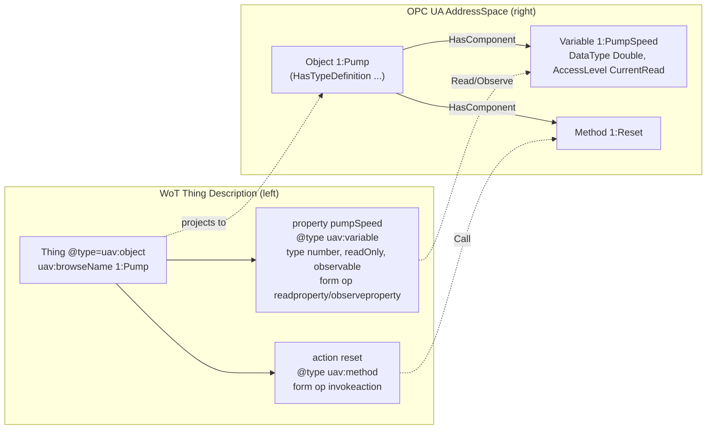

# OPC UA — Web of Things (WoT) Binding

**Release 1.10 — Draft (standalone revision of OPC 10101 v1.00)**
**Namespace:** `http://opcfoundation.org/UA/WoT-Binding/`
**Prefix:** `uav`
**Publication date:** 2026-07-20

> Status: Experimental working-group draft. This document is a complete, standalone re-authoring of the OPC UA companion specification for Web of Things connectivity, written in original prose. It preserves every namespace, prefix, term, and normative behaviour of the published baseline and adds a collision-safe model and platform vocabulary together with a bidirectional NodeSet2 conversion. It is **not** an addendum: it can be read on its own. Nothing here is normative, official, or endorsed by the OPC Foundation or the W3C; the use of `opcfoundation.org` namespace URIs is for prototyping only. The authoritative published baseline is [OPC 10101 — OPC UA for WoT Binding](https://reference.opcfoundation.org/specs/OPC-10101/); where this draft and the published baseline disagree on a preserved term, the published baseline governs.

---

## 1 Scope

This specification defines how a [W3C Web of Things Thing Description](https://www.w3.org/TR/wot-thing-description11/) (TD) and Thing Model (TM) describe an OPC UA interface, and how an OPC UA information model expressed as a NodeSet2 document and a Thing Description or Thing Model are converted into one another.

It has three layers, each usable on its own:

- A **preserved protocol binding** that lets a Thing Description carry enough metadata for a client to open a session with an OPC UA Server, select a security configuration, and Read, Write, Observe (monitor), or Call a datapoint. This layer is byte-for-byte compatible with the published baseline vocabulary and semantics.
- A **model and platform vocabulary** that lets a Thing Model express the structural facts of an OPC UA type — composition, references, groups, units, scaling, configuration, metadata, and modelling rules — so that a Thing Model is a faithful, tool-processable projection of an ObjectType.
- A **bidirectional NodeSet2 conversion** with a preservation envelope, so that any OPC UA construct that has no native WoT representation survives a round trip exactly, and any construct that does have a native representation is readable without decoding the envelope.

Out of scope: the OPC UA wire protocol itself (defined by OPC 10000-6), transport security key management, and the domain semantics of any particular companion specification. This binding references the Variables, Methods, and types that a domain model already defines; it does not re-model process data.

### 1.1 Differences from the published OPC 10101 v1.00

This document re-authors [OPC 10101 v1.00](https://reference.opcfoundation.org/specs/OPC-10101/) in original prose and, on top of the preserved baseline, makes the following substantive additions. It is otherwise backward compatible: a Thing Description written against v1.00 remains valid here.

- **Preserved baseline (unchanged behaviour).** Every namespace, prefix and term of the published vocabulary, and every service, URI, access-level and security mapping, is preserved byte-for-byte and only re-worded (Section 5). The `uav` prefix and its namespace are unchanged. Where this draft and the published baseline disagree on a preserved term, the published baseline governs.
- **Event mapping (new).** An explicit mapping of OPC UA events (`BaseEventType` subtypes) to WoT event affordances, anchored by `uav:isEvent`, including the standard event fields and `subscribeevent`/`unsubscribeevent` realized by OPC UA event MonitoredItems (Section 8). The published baseline had no event mapping.
- **Model and platform vocabulary (new).** A collision-safe vocabulary that lets a Thing Model record the structural facts of an OPC UA type — composition, references, groups, units, scaling, configuration, metadata, inheritance and modelling rules (Section 6) — so a Thing Model is a faithful, tool-processable projection of an ObjectType, not only a client-facing description.
- **Exact NodeSet2 round trip and preservation (new).** A bidirectional NodeSet2 ↔ WoT conversion with defined round-trip invariants (Section 9) and a digest-verified `uav:nodeSet` preservation envelope (Section 10) that makes any OPC UA construct without a native WoT form survive a round trip exactly, while natively representable constructs stay readable without decoding the envelope.
- **Implementer guidance (new).** Independent conformance units and recommended profiles (Section 11), a deterministic standard-library validator, worked examples, and an iterative implementer walkthrough (Annex D) covering both conversion directions.

## 2 Normative and informative references

- [OPC 10101 — OPC UA for WoT Binding](https://reference.opcfoundation.org/specs/OPC-10101/) — the published baseline that this document re-authors and preserves.
- [OPC 10000-3](https://reference.opcfoundation.org/specs/OPC-10000-3/) — Address Space Model (NodeClasses, attributes, references, modelling rules).
- [OPC 10000-4](https://reference.opcfoundation.org/specs/OPC-10000-4/) — Services (Read, Write, Call, and the Subscription/MonitoredItem services used for Observe).
- [OPC 10000-5](https://reference.opcfoundation.org/specs/OPC-10000-5/) — Information Model (BaseEventType and the standard event fields).
- [OPC 10000-6](https://reference.opcfoundation.org/specs/OPC-10000-6/) — Mappings, in particular the string encoding of `NodeId`, `QualifiedName`, and `ExpandedNodeId`, and the NodeSet2 XML schema.
- [OPC 10000-7](https://reference.opcfoundation.org/specs/OPC-10000-7/) — Profiles and Conformance Units.
- [W3C Web of Things (WoT) Thing Description 1.1](https://www.w3.org/TR/wot-thing-description11/) — the TD and TM information model, security schemes, forms, and links.
- [W3C Web of Things (WoT) Binding Templates](https://www.w3.org/TR/wot-binding-templates/) — the pattern this binding follows for protocol- and payload-specific annotation.
- [QUDT](http://qudt.org/) — quantity kinds and units, reused for physical semantics.
- [RFC 3986](https://www.rfc-editor.org/rfc/rfc3986) — URI syntax and percent-encoding.
- [RFC 4648](https://www.rfc-editor.org/rfc/rfc4648) — Base16 and Base64 data encodings.
- [RFC 6901](https://www.rfc-editor.org/rfc/rfc6901) — JSON Pointer.

## 3 Terms, definitions, and conventions

### 3.1 Normative keywords

The keywords **shall**, **shall not**, **should**, **should not**, and **may** are used deliberately and carry their usual normative meaning. **shall** and **shall not** state absolute requirements; **should** and **should not** state strong recommendations that may be waived with good reason; **may** states an option.

### 3.2 JSON-LD conventions

A Thing Description and a Thing Model are JSON-LD 1.1 documents. Every example in this specification declares an `@context` array whose entries bind the base WoT Thing Description context, the `uav` prefix to the namespace of Section 4, and the companion context document [`opc-ua-wot-binding.context.jsonld`](opc-ua-wot-binding.context.jsonld). A `uav` member is written in prefixed form, for example `uav:browseName`. The structural constraints of the `uav` members and of the preservation envelope are stated by [`opc-ua-wot-binding.schema.json`](opc-ua-wot-binding.schema.json) and validated by [`tools/validate_local.py`](tools/validate_local.py).

### 3.3 Abbreviations

- **TD** — Thing Description, the description of a concrete Thing (an OPC UA Object or an OPC UA Server interface).
- **TM** — Thing Model, a reusable, class-level template (an OPC UA ObjectType or VariableType).
- **NodeSet2** — the XML serialization of an OPC UA information model defined by OPC 10000-6.

## 4 Namespace and prefix

The terms this specification adds to a Thing Description are identified by the namespace

```text
http://opcfoundation.org/UA/WoT-Binding/
```

and the prefix **uav** is bound to that namespace. Both the namespace URI and the prefix are preserved unchanged from the published baseline. A conforming document **shall** bind `uav` to exactly this URI and **shall not** rebind the prefix to any other namespace.

## 5 Preserved OPC 10101 vocabulary and service mappings

This section restates the published baseline vocabulary and its service, URI, and security mappings. Every term, value, and rule below is preserved; only the wording is original.

### 5.1 Node and path terms

| Term | Where used | Type | Meaning |
| --- | --- | --- | --- |
| `uav:id` | in `href` context and on an affordance | string | The `NodeId` value in the string form of OPC 10000-6, identifying the UA Node an affordance targets. |
| `uav:browsePath` | in a form, or on an affordance | string | The browse path of a UA Node as a string, following OPC 10000-4 Annex A.2, starting at the root of the address space, for example `/Objects/1:Machine/1:Pressure`. |
| `uav:browseName` | at Thing level, on a property, or on an action | string | The originating `BrowseName` of the UA Node: the Object or ObjectType at Thing level, and the Variable or Method at affordance level, in `namespaceIndex:name` form. |

### 5.2 Type-annotation terms

The `@type` of a Thing or affordance is annotated to record which NodeClass it projects.

| Term | Applies to | Projects |
| --- | --- | --- |
| `uav:object` | `@type` at Thing level of a TD | a UA Object |
| `uav:objectType` | `@type` at Thing level of a TM | a UA ObjectType (this is why the document is a Thing Model) |
| `uav:variable` | `@type` of a TD property | a UA Variable |
| `uav:variableType` | `@type` of a TM property | a UA VariableType |
| `uav:method` | `@type` of an action | a UA Method |

`uav:objectType` and `uav:variableType` are only meaningful in a Thing Model.

### 5.3 Component reference terms

| Term | Type | Meaning |
| --- | --- | --- |
| `uav:hasComponent` | array of string | One or more `NodeId` values of child Nodes; equivalent to a forward `HasComponent` reference. |
| `uav:componentOf` | array of string | One or more `NodeId` values of parent Nodes; equivalent to an inverse `HasComponent` reference. |

### 5.4 Data-model mapping terms

These terms map a runtime datapoint of a Thing to an external OPC UA Node or type. They are used at property level and **shall not** appear at form level.

| Term | Type | Meaning |
| --- | --- | --- |
| `uav:mapToNodeId` | string | The `NodeId` of an external target UA Node (for example a UA Variable) that the property's runtime data maps to. |
| `uav:mapToType` | string | The `NodeId` of an external target UA type that the property's runtime data maps to. |
| `uav:mapByFieldPath` | string | Used only together with `uav:mapToType`. When the target type is a Structure, names the field within that type to which the runtime data maps. |

### 5.5 URI, base, and href rules

The OPC UA client/server address of a Thing follows this grammar:

```text
opc.tcp://<address>:<port>[/<resourcePath>]/?id=<nodeId>
```

where `<address>` is the Server endpoint address, `<port>` is the Server port, `<resourcePath>` is an optional endpoint resource path, and `<nodeId>` is the target `NodeId`.

The following percent-encoding rules **shall** be applied to `<nodeId>` to keep the URI unambiguous under RFC 3986: every `#` **shall** be written as `%23` and every `&` **shall** be written as `%26`. When the whole URI is transmitted, all non-ASCII characters **shall** first be encoded as UTF-8 bytes and each byte then percent-encoded.

The address may be given whole in a form `href`, or split into the Thing-level `base` (the Server location only) and a per-form `href` that is relative to `base` and carries only the `?id=` fragment. When a namespace is resolved in the `@context` (Section 5.8), its index may be used directly in the `NodeId`, for example `href: "/?id=ns=10;i=12345"`.

### 5.6 Service mappings (Read, Write, Observe, Call)

The OPC UA Service that an interaction uses is expressed by the standard WoT `op` term. The mapping is fixed:

| `op` value | OPC UA Service |
| --- | --- |
| `readproperty` | Read |
| `writeproperty` | Write |
| `observeproperty` | Monitor (a Subscription MonitoredItem, per OPC 10000-4) |
| `invokeaction` | Call |

When the Server's default serialization is used, a form's `contentType` **should** be `application/octet-stream`.

Access is expressed with the standard WoT DataSchema and PropertyAffordance terms: a readable Variable carries `readproperty` and, when subscribable, `observeproperty` with `observable: true`; a read-only Variable sets `readOnly: true`; a writable Variable carries `writeproperty`; a write-only Variable sets `writeOnly: true`.

### 5.7 Security schemes

An OPC UA Server's endpoint security may be described implicitly with the standard WoT schemes or explicitly with the OPC UA schemes.

- `nosec` — the standard WoT scheme, used when the Server offers a single endpoint with `securityMode` `None` and `securityPolicy` `None`.
- `auto` — the standard WoT scheme, used to signal that the Server offers several endpoints and the client is expected to call `GetEndpoints` and choose one during session establishment.
- `uav:channelsec` — the OPC UA secure-channel scheme. It carries `uav:securityMode` (one of `None`, `Sign`, `SignAndEncrypt`) and `uav:securityPolicy` (one of `None`, `Basic256Sha256`, `Aes128_Sha256_RsaOaep`, `Aes256_Sha256_RsaPss`; the outdated `Basic256` and `Basic128Rsa15` remain permitted but are not recommended).
- `uav:authentication` — the OPC UA user-authentication scheme. It carries `uav:userIdentityToken` (one of `Anonymous`, `UserName`, `Certificate`, `IssuedToken`) and, when the token is `IssuedToken`, an optional `uav:issueToken` that references another security scheme (for example an `oauth2` scheme) in the same document.

The two OPC UA schemes are combined with the standard WoT `combo` scheme using `allOf`. Credentials such as passwords and certificates are never carried in a Thing Description; they are supplied out of band. A worked example is [`examples/01-opcua-td-pump.jsonld`](examples/01-opcua-td-pump.jsonld).

### 5.8 Namespaces in the @context

When a Thing Description exposes `BrowseName` or `browsePath` values from more than one OPC UA namespace, each such namespace **should** be declared in the `@context` and bound to a prefix equal to its namespace index, so that a reader can resolve the index used in a `NodeId` or a qualified `BrowseName`.

### 5.9 Address-space example

The figure below reads left-to-right: a short WoT Thing Description sample on the **left** and the OPC UA AddressSpace Nodes and References it projects to on the **right**. A UA Object `1:Pump` with a UA Variable `1:PumpSpeed` (`HasComponent`, `Double` `DataType`, `AccessLevel` `CurrentRead`) and a UA Method `1:Reset` becomes a Thing whose `@type` is `uav:object`; its property `pumpSpeed` (`@type uav:variable`) and action `reset` (`@type uav:method`) carry the browse names and the Read/Observe/Call forms.



**How to read it.** The Thing maps to the `Object` (`uav:browseName` → `BrowseName`); the property maps to the `Variable` with its `readproperty`/`observeproperty` forms realized as OPC UA Read and Subscription MonitoredItem services, and `readOnly`/`observable` reflect the Variable's `AccessLevel`; the action maps to the `Method`, invoked by the `invokeaction` form. The `HasComponent` References that hold the members are recovered from the containment terms (Section 5.3) or the model links (Section 6.2). References, NodeClasses, and attributes map in full as described in Section 9.1, and a complete worked instance is [`examples/01-opcua-td-pump.jsonld`](examples/01-opcua-td-pump.jsonld).

## 6 Model and platform vocabulary

This section adds terms that let a Thing Model record the structural facts of an OPC UA type that the preserved vocabulary alone does not capture. Every term is collision-safe with the base WoT context and with the preserved vocabulary, and each is documented below with the concept it expresses, **when and why** it represents an OPC UA model fact, its normative usage, and a short, explained example. Each term's domain, range, and conflict rules are also tabulated in Section 7.

### 6.1 Composition and events

**`uav:isComposite`** (boolean) — declares that a type is *composite*: an OPC UA ObjectType that is meaningfully decomposed into named sub-components rather than being a single leaf. It is an OPC UA model fact because a composite type owns child Objects/Variables through `HasComponent` References; a converter uses the flag to decide whether to walk and materialize the parts (Section 6.3) or treat the type as atomic. A composite type **shall** declare its parts through the containment terms of Section 6.3 and the link terms of Section 6.2.

```jsonc
"@type": ["tm:ThingModel", "uav:objectType"], "uav:isComposite": true, "uav:contains": ["Impeller"]
```

*Explanation.* The Thing Model is a composite ObjectType with one directly contained part named `Impeller`; a converter expands that part into a component sub-node rather than a scalar value.

**`uav:isEvent`** (boolean) — on a WoT event affordance, declares that the affordance projects an OPC UA event (a type derived from `BaseEventType`, OPC 10000-5) rather than an ad-hoc notification. This is an OPC UA model fact whenever the source model defines an EventType; the flag is the anchor of the event mapping of Section 8 and tells a consumer to realize subscription with event MonitoredItems.

```jsonc
"events": { "overTemperature": { "uav:isEvent": true, "uav:browseName": "1:OverTemperatureEventType" } }
```

*Explanation.* `overTemperature` is not a plain notification: it projects the `1:OverTemperatureEventType` EventType, so `subscribeevent` becomes an OPC UA event MonitoredItem.

### 6.2 Links and references

References between types are carried on WoT `links`. The `rel` value selects the kind of OPC UA Reference, and two `uav` members qualify it. These terms exist because an OPC UA type graph is more than containment: types reference each other hierarchically and non-hierarchically, and a faithful Thing Model must record which Reference type connects them.

- **`rel: uav:capability`** — the linked resource is a capability the type exposes (an interface-like mix-in), projecting to a `HasInterface`-style facet.
- **`rel: uav:componentModel`** — the linked resource is the Thing Model of a contained sub-component (a strong, owned `HasComponent` part).
- **`rel: uav:reference`** — the linked resource is referenced non-hierarchically, without a specific reference type.
- **`rel: uav:typedReference`** — the linked resource is referenced by a specific OPC UA reference type named in `uav:refType`.
- **`rel: uav:componentOf`** — the linked resource is the **parent** (container) of this Thing or type; it projects to an inverse `HasComponent` (a `HasComponent` from the parent to this node). It lets a Thing Description author select the parent under which its projected instance is exposed (used by [WoT Connectivity](../WoT-Connectivity/OPC-UA-WoT-Connectivity.md) §7.3); the link is directional, naming the parent, and a materializer resolves the target and creates the OPC UA `HasComponent` Reference.
- **`uav:refName`** (string) — the browse name a reference is exposed under on the referencing type; unique among the references of one type.
- **`uav:refType`** (string) — the reference type of a `uav:typedReference`, given as a `NodeId` or a reference-type browse name.

```jsonc
"links": [
  { "rel": "uav:componentModel", "href": "./impeller.tm.jsonld", "uav:refName": "Impeller", "uav:refType": "HasComponent" },
  { "rel": "uav:typedReference", "href": "./motor.tm.jsonld", "uav:refName": "Drive", "uav:refType": "nsu=...;i=4002" },
  { "rel": "uav:componentOf", "href": "urn:machine:line-01" }
]
```

*Explanation.* The first link owns an `Impeller` component (`HasComponent`); the second references a `Motor` through a specific reference type exposed as `Drive`; the third states that this Thing is a component of the machine `urn:machine:line-01`, so its projected Object becomes a `HasComponent` child of that machine instead of a top-level node.

### 6.3 Containment

**`uav:contains`** (array of string) — on a composite type, the `uav:refName` values of the sub-components it directly contains. **`uav:containedIn`** (string) — on a contained type, the name of the single composite that contains it. Together they record the OPC UA composition graph (the tree of `HasComponent` ownership) explicitly and symmetrically, so a converter can rebuild the parent/child edges and detect a broken model. Containment **shall** be acyclic and each side **shall** match the other (Section 7).

```jsonc
// composite:            // part:
"uav:contains": ["Impeller"]   "uav:containedIn": "PumpType"
```

*Explanation.* `PumpType` contains a part reached by the `Impeller` link, and the part declares it is contained in `PumpType`; the reciprocal pair is what a validator checks for a consistent `HasComponent` tree.

### 6.4 Type identity and naming

**`uav:congruentType`** (string) — the `NodeId` (or IRI) of a type that is structurally congruent with this one: a shared, co-typed definition used to reconcile two models that describe the same OPC UA type. It is a model fact when the same ObjectType is authored in two places and must be recognized as one. **`uav:nameNamespace`** (absolute IRI) — the naming namespace against which the type's local names are resolved; it corresponds to the OPC UA namespace that qualifies the type's BrowseNames and **shall** be an absolute IRI.

```jsonc
"uav:nameNamespace": "http://example.com/demo/pump#",
"uav:congruentType": "nsu=http://example.com/demo/pump;i=1001"
```

*Explanation.* The type's local names resolve within the `pump#` naming namespace, and it is declared congruent with the OPC UA type `i=1001` so a tool can merge the two definitions.

### 6.5 Units, quantity kinds, and scaling

**`uav:unitProperty`** (RFC 6901 JSON Pointer) — a canonical JSON Pointer that locates the string property carrying the engineering unit of a value; it corresponds to the OPC UA `EngineeringUnits` fact of an `AnalogUnitType`. Quantity kinds are expressed with QUDT (for example `qudt-quantitykind:AngularVelocity`) and are not given a `uav` term. **`uav:scaleFactor`** (number, non-zero) — the linear factor relating the raw transport value to the engineering value; the direction is fixed as `engineering = raw * scaleFactor`. **`uav:decimalPlaces`** (integer ≥ 0) — the number of fractional decimal places retained after scaling. These capture the analog-scaling model facts a raw transport value needs to become an engineering value.

```jsonc
"pumpSpeed": { "type": "number", "unit": "qudt-quantitykind:AngularVelocity",
  "uav:unitProperty": "/properties/pumpSpeed/unit", "uav:scaleFactor": 0.1, "uav:decimalPlaces": 2 }
```

*Explanation.* A raw reading of `2500` becomes `250.0` rpm (`2500 × 0.1`, two decimals); the unit string is located by the JSON Pointer, and the quantity kind is angular velocity.

### 6.6 Groups and membership

**`uav:propertyGroups`, `uav:eventGroups`, `uav:actionGroups`** (arrays of group objects) — declare named groups of properties, events, and actions respectively; each group object has a required `title` and may carry a `description` and a `uav:semanticId`. **`uav:memberOf`** (string) — on a property, event, or action, the `title` of the group it belongs to. Groups project to OPC UA grouping/organizing folders (or a `FunctionalGroupType`-style facet), so they record a model fact about how a type presents its members. Group titles **shall** be globally unique across all three group kinds of a type, and a `uav:memberOf` value **shall** name a group of the matching kind (Section 7).

```jsonc
"uav:propertyGroups": [{ "title": "Operational" }],
"pumpSpeed": { "uav:memberOf": "Operational" }
```

*Explanation.* `pumpSpeed` is presented under the `Operational` property group, which a converter can expose as an organizing folder over the projected Variables.

### 6.7 Metadata, semantics, and configuration

**`uav:metadata`** (JSON value) — an opaque object of implementation- or vendor-defined annotations, carried verbatim; it preserves model facts a converter does not interpret. **`uav:semanticId`** (absolute IRI) — a stable semantic identifier for a type, affordance, or group, corresponding to the OPC UA semantic-reference (`HasDictionaryEntry`-style) fact. **`uav:propertyConfiguration`, `uav:actionConfiguration`, `uav:eventConfiguration`** (JSON values) — opaque, per-affordance configuration objects, carried verbatim. Opaque members **shall** be carried unchanged and **shall not** cause a consumer to reject a document (Section 7).

```jsonc
"uav:semanticId": "http://example.com/ontology/Pump",
"uav:metadata": { "revision": 3, "maintainer": "Modeling WG" }
```

*Explanation.* The type carries a stable semantic identity and a verbatim metadata bag; a converter preserves both even though it does not act on the metadata.

### 6.8 Inheritance and open content

**`uav:includeInherited`** (boolean) — whether the Thing Model is understood to include the members it inherits from its supertypes (`true`) or only the members it declares itself (`false`); this maps to whether a projection walks the OPC UA supertype chain. **`uav:additionalProperties`** (boolean) — whether instances may carry members beyond those the model declares (`true`, open content) or not (`false`, closed content), corresponding to whether the ObjectType is extensible.

```jsonc
"uav:includeInherited": true, "uav:additionalProperties": false
```

*Explanation.* The model spans inherited members, and instances are closed: a validator rejects any instance member the type does not declare.

### 6.9 Generic mapping terms and modelling rules

**`uav:externalSchema`** (string) — a URI or path to an external schema that defines a custom DataType or payload encoding the affordance uses; it records the model fact that a member's DataType is not inline. **`uav:modellingRule`** (string) — the OPC UA modelling rule of a member; its value **shall** be exactly one of `Mandatory`, `Optional`, `MandatoryPlaceholder`, or `OptionalPlaceholder` (OPC 10000-3). The modelling rule is the single most important type-level model fact: it decides whether an instance must, may, or may repeatedly instantiate the member.

```jsonc
"serialNumber": { "uav:modellingRule": "Mandatory" },
"stage":        { "uav:modellingRule": "MandatoryPlaceholder" }
```

*Explanation.* Every instance must carry a `serialNumber`; `stage` is a placeholder that expands, per instance, into one or more uniquely named `stage` members.

### 6.10 Preservation envelope term

**`uav:nodeSet`** (object) — the preservation envelope defined in Section 10. It carries the authoritative, byte-exact NodeSet2 baseline of the type or Thing, so any OPC UA construct without a native WoT representation survives a round trip exactly (Section 9). When present it is authoritative and a consumer **shall** verify its digest before use.

```jsonc
"uav:nodeSet": { "@type": "uav:nodeSet", "contentType": "application/opcua-nodeset+xml",
  "encoding": "base64", "sha256": "…", "data": "…" }
```

*Explanation.* The envelope pins the exact NodeSet2 bytes and their SHA-256, letting a converter recover the original model losslessly while native `uav` members remain readable without decoding it.

## 7 Validation rules

A document that uses the vocabulary of Section 6 **shall** satisfy the following rules. A consumer that finds a violation **shall** treat the document as invalid rather than silently repairing it.

**Per-term domain and range.**

| Term | Domain (where it may appear) | Range / allowed values |
| --- | --- | --- |
| `uav:isComposite` | type (TM root) | boolean |
| `uav:isEvent` | event affordance | boolean |
| `uav:capability`, `uav:componentModel`, `uav:reference`, `uav:typedReference`, `uav:componentOf` | a link `rel` value | the literal term |
| `uav:refName` | a link | non-empty string, unique among a type's links |
| `uav:refType` | a `uav:typedReference` link | `NodeId` or reference-type browse name |
| `uav:contains` | composite type | array of `uav:refName` values declared on the same type |
| `uav:containedIn` | contained type | the name of exactly one composite |
| `uav:congruentType` | type | `NodeId` or absolute IRI |
| `uav:nameNamespace` | type | absolute IRI |
| `uav:scaleFactor` | property | number, non-zero |
| `uav:decimalPlaces` | property | integer, `>= 0` |
| `uav:propertyGroups`, `uav:eventGroups`, `uav:actionGroups` | type | array of group objects, each with a non-empty `title` |
| `uav:memberOf` | property, event, or action | the `title` of a declared group of the matching kind |
| `uav:unitProperty` | property | non-empty RFC 6901 JSON Pointer to a string property |
| `uav:metadata`, `uav:propertyConfiguration`, `uav:actionConfiguration`, `uav:eventConfiguration` | as named | any JSON value |
| `uav:semanticId` | type, affordance, or group | absolute IRI |
| `uav:includeInherited`, `uav:additionalProperties` | type | boolean |
| `uav:externalSchema` | affordance | URI or path |
| `uav:modellingRule` | member | one of `Mandatory`, `Optional`, `MandatoryPlaceholder`, `OptionalPlaceholder` |

**Cross-cutting rules.**

- **Unique group titles.** The `title` of every group is globally unique across `uav:propertyGroups`, `uav:eventGroups`, and `uav:actionGroups` of a type. Two groups **shall not** share a title.
- **Membership target.** A `uav:memberOf` value **shall** name a group of the matching kind: a property's `uav:memberOf` **shall** name a `uav:propertyGroups` title, an event's an `uav:eventGroups` title, and an action's an `uav:actionGroups` title.
- **Containment consistency.** If a composite `A` lists refName `b` in `uav:contains`, the type reached by the link named `b` **shall** declare `uav:containedIn: "A"`; conversely every `uav:containedIn: "A"` **shall** be matched by an entry in `A`'s `uav:contains`.
- **Parent link direction.** A `rel: uav:componentOf` link names the **parent** (container) of this Thing or type: it projects to an OPC UA `HasComponent` Reference *from the linked (parent) node to this node* (equivalently an inverse `HasComponent` from this node to its parent). A materializer **shall** resolve the link `href` to the parent node and create that Reference; it **shall not** invert the direction.
- **Cycle-safety.** The containment graph induced by `uav:contains` / `uav:containedIn` **shall** be acyclic; a type **shall not** transitively contain itself.
- **Scale direction and rounding.** The engineering value is computed as `raw * scaleFactor`; when `uav:decimalPlaces` is present, the engineering value is rounded to that many fractional decimal places after scaling. Consumers **shall not** apply the factor in the inverse direction.
- **Unit pointer.** `uav:unitProperty` **shall** be a canonical RFC 6901 JSON Pointer that resolves, within the same document, to a string-valued property.
- **Absolute IRIs.** `uav:semanticId` and `uav:nameNamespace` **shall** be absolute IRIs (they have a scheme).
- **Opaque objects.** `uav:metadata` and the three configuration members are opaque: a consumer that does not understand them **shall** carry them unchanged and **shall not** reject a document for their content.
- **Placeholders.** A member whose `uav:modellingRule` is `MandatoryPlaceholder` or `OptionalPlaceholder` is a template that expands, per instance, to zero or more uniquely named members; an optional non-placeholder member is omitted per instance when absent.

## 8 Thing Description and Thing Model mapping

A Thing Model is the class-level projection and a Thing Description is the instance-level projection of the same OPC UA constructs.

- **ObjectType maps to a Thing Model.** An ObjectType becomes a TM whose `@type` includes `uav:objectType`; its InstanceDeclarations become the TM's affordances with a `uav:modellingRule`.
- **Object maps to a Thing Description.** An Object becomes a TD whose `@type` includes `uav:object`; a TD may reference the TM of its type through a `tm:instanceOf` style link and carries concrete values and forms.
- **Variables map to properties.** A UA Variable or the declaration of a VariableType member becomes a WoT property with `@type` `uav:variable` (TD) or `uav:variableType` (TM), a `type` from the DataType, and `readOnly` / `writeOnly` / `observable` from the AccessLevel.
- **Methods map to actions.** A UA Method becomes a WoT action with `@type` `uav:method`; its input and output arguments become the action's `input` and `output` DataSchemas.
- **OPC UA events map to WoT events.** An EventType (derived from `BaseEventType`) becomes a WoT event affordance with `uav:isEvent: true`; the event's fields become the event `data` schema, the standard fields (`EventId`, `EventType`, `SourceNode`, `Time`, `Severity`, `Message`) map to the corresponding `data` properties, and `uav:eventConfiguration` carries opaque delivery configuration. Subscription uses the WoT `subscribeevent` / `unsubscribeevent` operations, realized by OPC UA event MonitoredItems. This event mapping is new in this document.
- **Links and references.** Non-hierarchical and typed references map to `links` as in Section 6.2; hierarchical component references map to `uav:hasComponent` / `uav:componentOf` (Section 5.3) or, at model level, to `uav:contains` / `uav:containedIn`.
- **Custom DataTypes and encodings.** A custom DataType maps to a WoT DataSchema; where the schema cannot be expressed inline, `uav:externalSchema` points to its definition and, for a Structure, `uav:mapByFieldPath` addresses a field.
- **Placeholders and optionality.** Modelling rules map to `uav:modellingRule`; placeholder members are templates (Section 7) and optional members are omitted per instance when absent.

## 9 NodeSet2 and WoT conversion

Conversion is bidirectional. Every NodeClass, attribute, reference, and value has a **native readable mapping** so that a consumer can act on a Thing Description without decoding any envelope. Constructs that have no faithful native representation are preserved exactly by the envelope of Section 10.

### 9.1 Native readable mapping

| OPC UA construct | WoT projection |
| --- | --- |
| Object (NodeClass) | Thing / nested Thing, `@type` `uav:object` |
| Variable | property, `@type` `uav:variable` |
| Method | action, `@type` `uav:method` |
| ObjectType | Thing Model, `@type` `uav:objectType` |
| VariableType | property in a TM, `@type` `uav:variableType` |
| DataType | WoT DataSchema; custom types via `uav:externalSchema` |
| ReferenceType | link `rel` `uav:typedReference` with `uav:refType` |
| View | link (`rel` `collection`) grouping the viewed Nodes |
| `NodeId` | `uav:id` |
| `BrowseName` | `uav:browseName` |
| `DisplayName` | `title` |
| `Description` | `description` |
| `DataType` + `ValueRank` + `ArrayDimensions` | `type` and array `items` of the DataSchema |
| `AccessLevel` | `readOnly` / `writeOnly` / `observable` |
| `Value` | property value or `const` / `default` |
| `HasComponent` / `HasProperty` (forward) | `uav:hasComponent`, or a component `link` |
| `HasComponent` (inverse) | `uav:componentOf` |
| Other references | link with `rel` `uav:typedReference` and `uav:refType` |
| Modelling rule (`Mandatory` `i=78`, `Optional` `i=80`, `MandatoryPlaceholder` `i=11510`, `OptionalPlaceholder` `i=11508`) | `uav:modellingRule` |
| Namespace table | `@context` prefix bindings keyed by namespace index |
| Events (`BaseEventType` subtypes) | event affordance with `uav:isEvent: true` |

### 9.2 Preservation envelope

When a `uav:nodeSet` envelope is present it is **authoritative**: it carries the canonical NodeSet2 XML of the type or Thing as base64, together with its content type, encoding, SHA-256 digest, and preservation profile version. A consumer **shall** verify the digest against the decoded bytes before using the envelope, and **shall** treat the decoded NodeSet2 as the baseline model.

### 9.3 Overlay and conflict rules

When both the envelope and native members are present, the native members **overlay** the decoded baseline according to these rules:

- A native member that adds information absent from the baseline (for example a `title`, a `uav:semanticId`, or a group membership) is applied as an addition.
- A native member that restates a baseline fact **shall** be consistent with it; an inconsistent native member (for example a `uav:browseName` that differs from the baseline `BrowseName`, or a `uav:modellingRule` that differs from the baseline modelling rule) is a **conflict**.
- A consumer that detects a conflict **shall** report an error and **shall not** silently choose one side.

### 9.4 Synthesis when the envelope is absent

When no envelope is present, a converter synthesizes a NodeSet2 from the native members. NodeIds that the native members do not supply are **generated deterministically**: the same input Thing Description or Thing Model always yields the same NodeIds, derived from a stable hash of the target namespace URI and the member's browse path so that repeated conversions are byte-identical. The converter **shall** report the result's **lossless-subset status**: whether every native member was represented (a lossless subset) or whether some WoT construct had no NodeSet2 representation.

### 9.5 Roundtrip invariants and unknown-member preservation

- **NodeSet2 → WoT → NodeSet2.** When the envelope is retained, the canonical NodeSet2 recovered from the envelope is byte-identical to the input; native edits that Section 9.3 permits are the only allowed differences.
- **WoT → NodeSet2 → WoT.** A Thing Description or Thing Model converted to a synthesized NodeSet2 and back reproduces every native member and every `uav` member unchanged.
- **Unknown members.** A converter **shall** carry through unchanged any JSON-LD member it does not recognize, at every level of the document, so that vocabulary it does not implement survives a round trip.

## 10 Preservation envelope format

The `uav:nodeSet` envelope is a JSON object with these members:

| Member | Required | Value |
| --- | --- | --- |
| `@type` | yes | the constant `uav:nodeSet` |
| `contentType` | yes | the media type of the decoded bytes, for example `application/opcua-nodeset+xml` |
| `encoding` | yes | the constant `base64` (RFC 4648 section 4) |
| `sha256` | yes | the lower-case hexadecimal SHA-256 digest of the **decoded** bytes |
| `data` | yes | the base64 encoding of the canonical NodeSet2 XML bytes |
| `profileVersion` | recommended | the preservation profile version, for example `1.0` |

The decoded bytes **shall** be a well-formed XML document whose root element is `UANodeSet` in the namespace `http://opcfoundation.org/UA/2011/03/UANodeSet.xsd`. A worked example is [`examples/03-nodeset-preservation-envelope.jsonld`](examples/03-nodeset-preservation-envelope.jsonld).

## 11 Conformance units and profiles

A Server, a Thing Description author, or a converter declares conformance to the units it implements. The units are independent; a profile is a named set of units.

| Unit | Requirement |
| --- | --- |
| **WoT-ProtocolBinding** | The preserved protocol binding of Section 5: URI/base/href, the four service mappings, access levels, and the security schemes. |
| **WoT-NativeMapping** | The native readable mapping of Section 9.1 for every listed NodeClass, attribute, and reference. |
| **WoT-NodeSetPreservation** | The `uav:nodeSet` envelope of Section 10, including digest verification. |
| **WoT-ExactRoundtrip** | The roundtrip invariants of Section 9.5, including unknown-member preservation. |
| **WoT-EventMapping** | The OPC UA event to WoT event mapping of Section 8. |
| **WoT-ModelVocabulary** | The model and platform vocabulary of Section 6 and its validation rules in Section 7. |
| **WoT-ExternalResolver** | Resolution of `uav:externalSchema`, `uav:mapToType`, `uav:mapToNodeId`, and cross-document links. |

Recommended profiles:

- **WoT-Reader** — WoT-ProtocolBinding and WoT-NativeMapping. The minimum for a client that reads a Thing Description and talks to the Server.
- **WoT-Modeller** — WoT-Reader plus WoT-ModelVocabulary and WoT-EventMapping. For tools that author or interpret Thing Models.
- **WoT-Converter** — WoT-Modeller plus WoT-NodeSetPreservation and WoT-ExactRoundtrip. For tools that convert between NodeSet2 and WoT losslessly.

## Annex A — JSON-LD context and schema (informative)

The machine-readable vocabulary is [`opc-ua-wot-binding.context.jsonld`](opc-ua-wot-binding.context.jsonld); it binds the `uav` prefix and declares every term of Sections 5, 6, and 10. The structural constraints are [`opc-ua-wot-binding.schema.json`](opc-ua-wot-binding.schema.json), a JSON Schema (2020-12) that validates the `uav` members and the preservation envelope in addition to the base Thing Description schema.

## Annex B — Examples (informative)

- [`examples/01-opcua-td-pump.jsonld`](examples/01-opcua-td-pump.jsonld) — a Thing Description using the preserved Read, Write, Observe, Call, and security vocabulary.
- [`examples/02-thing-model-pump.jsonld`](examples/02-thing-model-pump.jsonld) — a Thing Model using the model and platform vocabulary.
- [`examples/03-nodeset-preservation-envelope.jsonld`](examples/03-nodeset-preservation-envelope.jsonld) — a preservation envelope carrying a canonical NodeSet2 baseline.
- [`examples/04-type-reference-modelling-rule.jsonld`](examples/04-type-reference-modelling-rule.jsonld) — a Thing Model exercising type, reference, and modelling-rule mappings.

## Annex C — Validation (informative)

Run the deterministic, standard-library validator from the repository root:

```bash
python wot-specs/WoT-Binding/tools/validate_local.py
```

It confirms that every artifact parses, that the context declares every documented `uav` term, that each example declares the `uav` context, that each preservation envelope's base64 and SHA-256 are valid and decode to a well-formed `UANodeSet`, that internal relative references resolve, and that no forbidden vendor prefix, namespace, or legacy modelling-language name appears.

## Annex D — Implementer walkthrough (informative)

This annex walks an implementer through both conversion directions for the pump example, step by step, using concise snippets rather than full files. The source files are [`examples/02-thing-model-pump.jsonld`](examples/02-thing-model-pump.jsonld) (the `PumpType` Thing Model) and [`examples/01-opcua-td-pump.jsonld`](examples/01-opcua-td-pump.jsonld) (a `Pump` Thing Description).

### D.1 Forward: Thing Model → OPC UA types

**Step 1 — Root type.** The TM root `@type` selects the NodeClass. `uav:objectType` → an `ObjectType`; `uav:browseName` becomes its `BrowseName`, `uav:nameNamespace` its namespace.

```jsonc
"@type": ["tm:ThingModel", "uav:objectType"], "uav:browseName": "1:PumpType", "uav:isComposite": true
```

→ `ObjectType 1:PumpType` (composite; its parts follow from `uav:contains` / links).

**Step 2 — Property members → Variable declarations.** Each property becomes an instance-declaration `Variable`; `type` → DataType, `uav:modellingRule` → the modelling rule, unit/scaling from Section 6.5.

```jsonc
"pumpSpeed": { "@type": "uav:variableType", "uav:browseName": "1:PumpSpeed",
  "type": "number", "uav:modellingRule": "Mandatory", "uav:scaleFactor": 0.1 }
```

→ `Variable 1:PumpSpeed` (`DataType Double`, `HasModellingRule Mandatory`, scaling 0.1). A `MandatoryPlaceholder` property (for example `stage`) becomes a placeholder declaration.

**Step 3 — Action members → Method declarations.** `uav:method` → a `Method`; its `input`/`output` schemas become `InputArguments`/`OutputArguments`.

```jsonc
"reset": { "@type": "uav:method", "uav:browseName": "1:Reset", "uav:modellingRule": "Optional" }
```

→ `Method 1:Reset` (`HasModellingRule Optional`).

**Step 4 — Event members → EventTypes.** An affordance with `uav:isEvent: true` projects an EventType derived from `BaseEventType`; its `data` schema becomes the event fields (Section 8).

**Step 5 — References.** `links` become References: `uav:componentModel` → `HasComponent` (the `Impeller` part), `uav:typedReference` → the `uav:refType` reference, `uav:reference`/`uav:capability` → non-hierarchical/`HasInterface` references, `uav:componentOf` → the parent `HasComponent` (Section 6.2). `uav:contains` / `uav:containedIn` rebuild the `HasComponent` ownership tree.

**Step 6 — Groups and modelling rules.** `uav:propertyGroups` etc. become organizing folders over the members; the modelling rules from Step 2/3 govern how instances of `PumpType` are built.

### D.2 Forward: Thing Description → OPC UA instance

**Step 1 — Root object.** `uav:object` → an `Object`; a `tm:instanceOf`/`links rel=type` to `PumpType` sets its `HasTypeDefinition`.

```jsonc
"@type": ["Thing", "uav:object"], "uav:browseName": "1:Pump", "uav:id": "nsu=...;s=Pump"
```

→ `Object 1:Pump` (`HasTypeDefinition PumpType`, `NodeId` from `uav:id`).

**Step 2 — Properties → Variables with values and forms.** Each TD property is a `Variable`; `readOnly`/`writeOnly`/`observable` set the `AccessLevel`; each `form` compiles to a service call.

```jsonc
"pumpSpeed": { "@type": "uav:variable", "uav:id": "nsu=...;s=PumpSpeed", "readOnly": true,
  "observable": true, "forms": [{ "op": ["readproperty","observeproperty"] }] }
```

→ `Variable 1:PumpSpeed` (`AccessLevel CurrentRead`); `readproperty` → Read, `observeproperty` → a Subscription MonitoredItem.

**Step 3 — Actions → Methods; events → event MonitoredItems.** `uav:method` actions become callable `Method` instances (`invokeaction` → Call); `uav:isEvent` events are subscribed via event MonitoredItems (`subscribeevent`).

**Step 4 — Parent placement.** With no parent link, the `Object` is `Organizes`d under `Objects`; a `rel: uav:componentOf` link makes it a `HasComponent` child of the resolved parent (Section 6.2).

### D.3 Reverse: OPC UA AddressSpace / NodeSet2 → Thing Model / Thing Description

The reverse is the mirror image; a converter walks the NodeSet2 and emits `uav` terms, preserving anything without a native form in a `uav:nodeSet` envelope (Section 10).

**Step 1 — Classify the root.** An `ObjectType` → a TM with `@type uav:objectType`; an `Object` → a TD with `@type uav:object`. Emit `uav:browseName` from `BrowseName`, `title` from `DisplayName`, `description` from `Description`.

**Step 2 — Members → affordances.** Each `HasComponent`/`HasProperty` `Variable` → a property (`uav:variable`/`uav:variableType`); each `Method` → an action; each `GeneratesEvent` EventType → an event with `uav:isEvent: true`. Emit `type` from `DataType` + `ValueRank`, `readOnly`/`observable` from `AccessLevel`, and `uav:modellingRule` from the `HasModellingRule` target.

```text
Variable 1:PumpSpeed (DataType Double, CurrentRead, Mandatory)
→ "pumpSpeed": { "@type":"uav:variableType", "type":"number", "readOnly":true, "uav:modellingRule":"Mandatory" }
```

**Step 3 — References → links / containment.** `HasComponent` (forward) → `uav:contains` / a `uav:componentModel` link; `HasComponent` (inverse) → a `uav:componentOf` link; a typed Reference → a `uav:typedReference` link with `uav:refType`; other non-hierarchical References → `uav:reference`/`uav:capability`.

**Step 4 — Units, scaling, groups, semantics.** An `AnalogUnitType` `EngineeringUnits` Property → `uav:unitProperty` + a QUDT quantity kind; scaling Properties → `uav:scaleFactor` / `uav:decimalPlaces`; organizing folders → `uav:propertyGroups`/`memberOf`; `HasDictionaryEntry`-style references → `uav:semanticId`.

**Step 5 — Preserve the exact baseline.** Emit a `uav:nodeSet` envelope carrying the canonical NodeSet2 bytes, content type, `base64` encoding, and SHA-256 digest so that `NodeSet2 → WoT → NodeSet2` is byte-identical (Section 9.5). Any construct with no native `uav` mapping survives only through this envelope; everything with a native mapping stays readable without decoding it.

**Roundtrip check.** Converting `PumpType` to a TM and back reproduces every member declaration, modelling rule, unit, reference and group; converting the retained envelope back yields the original NodeSet2 byte-for-byte.
