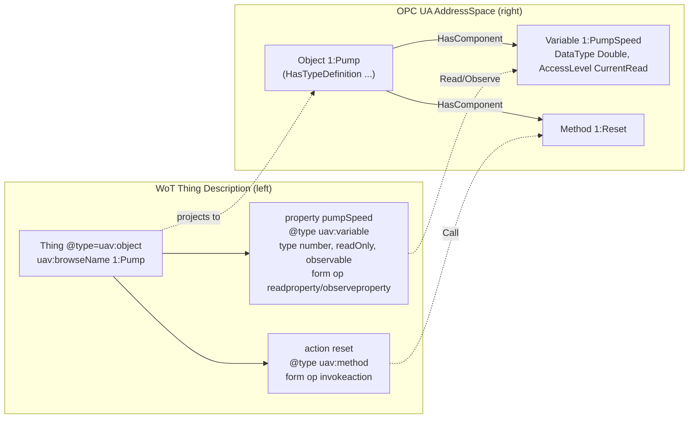

# OPC UA — Web of Things (WoT) Binding

**Release 1.10 — Draft (standalone revision of OPC 10101 v1.00)**
**Namespace:** `http://opcfoundation.org/UA/WoT-Binding/`
**Prefix:** `uav`
**Publication date:** 2026-07-20

> Status: Experimental working-group draft. This document supersedes [OPC 10101 — OPC UA for WoT Binding](https://reference.opcfoundation.org/specs/OPC-10101/) as a complete, standalone specification. It preserves the published namespace, prefix, terms, and normative behaviour while adding a collision-safe model and platform vocabulary together with bidirectional NodeSet2 conversion. It is **not** an addendum: it can be read on its own. Nothing here is normative, official, or endorsed by the OPC Foundation or the W3C; the use of `opcfoundation.org` namespace URIs is for prototyping only.

---

## 1 Scope

This specification defines how a [W3C Web of Things Thing Description](https://www.w3.org/TR/wot-thing-description11/) (TD) and Thing Model (TM) describe an OPC UA interface, and how an OPC UA information model expressed as a NodeSet2 document and a Thing Description or Thing Model are converted into one another.

It has three layers, each usable on its own:

- A **preserved protocol binding** that lets a Thing Description carry enough metadata for a client to open a session with an OPC UA Server, select a security configuration, and Read, Write, Observe (monitor), or Call a datapoint. This layer is byte-for-byte compatible with the published baseline vocabulary and semantics.
- A **model and platform vocabulary** that lets a Thing Model express the structural facts of an OPC UA type — composition, references, groups, units, scaling, configuration, metadata, and modelling rules — so that a Thing Model is a faithful, tool-processable projection of an ObjectType.
- A **bidirectional NodeSet2 conversion** whose default `uav:nodes` projection covers the complete UANodeSet schema without an opaque envelope. The `uav:nodeSet` envelope is reserved for explicit byte-exact archival or a future construct that a converter cannot represent.

Out of scope: the OPC UA wire protocol itself (defined by OPC 10000-6), transport security key management, and the domain semantics of any particular companion specification. This binding references the Variables, Methods, and types that a domain model already defines; it does not re-model process data.

### 1.1 Differences from the published OPC 10101 v1.00

This document supersedes [OPC 10101 v1.00](https://reference.opcfoundation.org/specs/OPC-10101/), preserves its namespace, `uav` prefix, vocabulary, service mappings, URI rules, access-level mapping, and security mapping (Section 5), and adds the following substantive capabilities. A Thing Description written against v1.00 remains valid here.

- **Event mapping (new).** An explicit mapping of OPC UA events (`BaseEventType` subtypes) to WoT event affordances, anchored by the `uav:eventType` type annotation and the `uav:isEvent` flag, including the standard event fields and `subscribeevent`/`unsubscribeevent` realized by OPC UA event MonitoredItems (Section 8). The published baseline had no event mapping.
- **Model and platform vocabulary (new).** A collision-safe vocabulary that lets a Thing Model record the structural facts of an OPC UA type — composition, references, groups, units, scaling, configuration, metadata, inheritance and modelling rules (Section 6) — so a Thing Model is a faithful, tool-processable projection of an ObjectType, not only a client-facing description.
- **Exact NodeSet2 round trip and preservation (new).** A bidirectional NodeSet2 ↔ WoT conversion with defined round-trip invariants (Section 9), a versioned and schema-complete `uav:nodes` projection, pointer-addressed preservation of unmapped WoT JSON members in standard NodeSet `Extensions`, and an exceptional digest-verified `uav:nodeSet` byte archive (Section 10).
- **Implementer guidance (new).** Independent conformance units and recommended profiles (Section 11), a deterministic standard-library validator, worked examples, and an iterative implementer walkthrough (Annex D) covering both conversion directions.

## 2 Normative and informative references

- [OPC 10101 — OPC UA for WoT Binding](https://reference.opcfoundation.org/specs/OPC-10101/) — the published version superseded by this specification.
- [OPC 10000-3](https://reference.opcfoundation.org/specs/OPC-10000-3/) — Address Space Model (NodeClasses, attributes, references, modelling rules).
- [OPC 10000-4](https://reference.opcfoundation.org/specs/OPC-10000-4/) — Services (Read, Write, Call, and the Subscription/MonitoredItem services used for Observe).
- [OPC 10000-5](https://reference.opcfoundation.org/specs/OPC-10000-5/) — Information Model (BaseEventType and the standard event fields).
- [OPC 10000-6](https://reference.opcfoundation.org/specs/OPC-10000-6/) — Mappings, in particular the string encoding of `NodeId`, `QualifiedName`, and `ExpandedNodeId`, and the NodeSet2 XML schema.
- [OPC 10000-7](https://reference.opcfoundation.org/specs/OPC-10000-7/) — Profiles and Conformance Units.
- [W3C Web of Things (WoT) Thing Description 1.1](https://www.w3.org/TR/wot-thing-description11/) — the TD and TM information model, security schemes, forms, and links.
- [W3C Web of Things (WoT) Binding Templates](https://www.w3.org/TR/wot-binding-templates/) — the pattern this binding follows for protocol- and payload-specific annotation.
- [QUDT](http://qudt.org/) — quantity kinds and units, reused for physical semantics.
- [RFC 3986](https://www.rfc-editor.org/rfc/rfc3986) — URI syntax and percent-encoding.
- [RFC 4648](https://www.rfc-editor.org/rfc/rfc4648) — Base16 and Base64 data encodings.
- [RFC 6901](https://www.rfc-editor.org/rfc/rfc6901) — JSON Pointer.

## 3 Terms, definitions, and conventions

### 3.1 Normative keywords

The keywords **shall**, **shall not**, **should**, **should not**, and **may** are used deliberately and carry their usual normative meaning. **shall** and **shall not** state absolute requirements; **should** and **should not** state strong recommendations that may be waived with good reason; **may** states an option.

### 3.2 JSON-LD conventions

A Thing Description and a Thing Model are JSON-LD 1.1 documents. Every example in this specification declares an `@context` array whose entries bind the base WoT Thing Description context, the `uav` prefix to the namespace of Section 4, and the companion context document [`opc-ua-wot-binding.context.jsonld`](opc-ua-wot-binding.context.jsonld). A `uav` member is written in prefixed form, for example `uav:browseName`. The structural constraints of the `uav` members, native projection, and exceptional preservation envelope are stated by [`opc-ua-wot-binding.schema.json`](opc-ua-wot-binding.schema.json) and validated by [`tools/validate_local.py`](tools/validate_local.py).

### 3.3 Abbreviations

- **TD** — Thing Description, the description of a concrete Thing (an OPC UA Object or an OPC UA Server interface).
- **TM** — Thing Model, a reusable, class-level template (an OPC UA ObjectType or VariableType).
- **NodeSet2** — the XML serialization of an OPC UA information model defined by OPC 10000-6.

## 4 Namespace and prefix

The terms this specification adds to a Thing Description are identified by the namespace

```text
http://opcfoundation.org/UA/WoT-Binding/
```

and the prefix **uav** is bound to that namespace. Both the namespace URI and the prefix are preserved unchanged from the published baseline. A conforming document **shall** bind `uav` to exactly this URI and **shall not** rebind the prefix to any other namespace.

## 5 Preserved OPC 10101 vocabulary and service mappings

This section defines the preserved OPC 10101 vocabulary and its service, URI, access-level, and security mappings.

### 5.1 Node and path terms

| Term | Where used | Type | Meaning |
| --- | --- | --- | --- |
| `uav:id` | in `href` context and on an affordance | string | The identity of the UA Node an affordance targets, given as an **ExpandedNodeId** in the string form of OPC 10000-6 (Section 5.1.1). |
| `uav:browsePath` | in a form, or on an affordance | string | The browse path of a UA Node as a string, following OPC 10000-4 Annex A.2, starting at the root of the address space, for example `/Objects/1:Machine/1:Pressure`. |
| `uav:browseName` | at Thing level, on a property, or on an action | string | The originating `BrowseName` of the UA Node: the Object or ObjectType at Thing level, and the Variable or Method at affordance level, in `namespaceIndex:name` form. |

#### 5.1.1 Portable identity (ExpandedNodeId)

A persisted or interchanged Thing Description or Thing Model **shall** identify UA Nodes and types portably, so that a document keeps referring to the same Nodes even after a Server reorders its namespace table. Every NodeId-valued term — `uav:id`, each entry of `uav:hasComponent` and `uav:componentOf`, `uav:mapToNodeId`, `uav:mapToType`, and any NodeId-valued `uav:refType` (Section 6.2) — **shall** be written as an OPC 10000-6 **ExpandedNodeId** string that names its namespace by URI:

```text
nsu=<NamespaceUri>;<idtype>=<id>
```

for example `nsu=http://example.com/demo/pump;s=Pump` or `nsu=http://example.com/demo/pump;i=1001`. For a Node in the base OPC UA namespace (namespace 0) the canonical namespace-0 form `i=<id>` **may** be used without an `nsu=` prefix, for example the `HasOrderedComponent` ReferenceType `i=49`.

A document **shall not** use the session-local `ns=<index>` form in any of these terms, because the namespace index is only meaningful within a single Server session and is invalidated by a namespace-table reordering. A client resolves each `nsu=<NamespaceUri>` to the target Server's current namespace index at session establishment, reading the Server `NamespaceArray` (OPC 10000-5), before issuing a request. A namespace index still appears legitimately in three places that this identity rule does not govern: the qualified `BrowseName` and `browsePath` form `namespaceIndex:name` (for example `1:Pump`), which a reader resolves through the `@context` prefix bindings (Section 5.8); the NodeSet-local `nodeId` and reference fields inside `uav:nodes`, which resolve through that projection's `namespaceUris`; and the canonical NodeSet2 XML carried by a `uav:nodeSet` preservation envelope (Sections 9 and 10), which resolves its indices through its own `NamespaceUris` table.

#### 5.1.2 NamespaceUri-qualified model names

An OPC UA model-definition concept — for example a ReferenceType, ObjectType, VariableType, EventType, or DataType — may additionally be described by its NamespaceUri-qualified BrowseName. This Binding writes that semantic lookup hint as a **compact model name**:

```text
<prefix>:<BrowseName>
```

The non-numeric `prefix` **shall** be bound in the active `@context` to the exact NamespaceUri that qualifies the BrowseName. The prefix `ua` is reserved for `http://opcfoundation.org/UA/`; for example `ua:HasOrderedComponent` denotes the ReferenceType whose BrowseName is `HasOrderedComponent` in the base OPC UA namespace. A companion model may use a domain prefix such as `isa:MaterialClassType` when `isa` is bound to that model's NamespaceUri.

A compact model name is a Binding string convention resolved through JSON-LD context prefix bindings; it is not a NodeId and is not authoritative identity. This specification uses it directly as the `rel` of a typed Reference and in `uav:mapToTypeName` and `uav:congruentTypeName`. It **shall not** replace an ExpandedNodeId for an arbitrary Object, Variable, Method, or other instance Node, because multiple instances may have the same NamespaceUri-qualified BrowseName.

An author:

1. **shall** bind the prefix to the defining NamespaceUri and **shall not** use a numeric prefix (numeric `namespaceIndex:name` remains the lexical form of `uav:browseName`);
2. **should** provide the compact model name whenever it makes a model concept easier to understand;
3. **shall** also provide the definitive ExpandedNodeId where this specification requires one (`uav:mapToType`) or where lookup may be unavailable or ambiguous;
4. **shall not** assume that textual equality of two compact names proves identity, because different documents may bind different prefixes to the same NamespaceUri.

A consumer resolves the prefix to a NamespaceUri, searches the loaded model definitions for the expected NodeClass and that NamespaceUri-qualified BrowseName, and uses the result only when exactly one candidate exists. If no candidate or more than one candidate exists, the consumer **shall** use the accompanying ExpandedNodeId; if no definitive identifier is available, it **shall** report an unresolved or ambiguous model concept and **shall not** invent a NodeId. When the compact model name and ExpandedNodeId resolve to different Nodes, the document is invalid.

`uav:semanticId` identifies external/domain semantics, while a compact model name identifies an OPC UA model-definition Node. `uav:nameNamespace` declares the naming namespace of the type being authored; it does not by itself identify another model concept.

### 5.2 Type-annotation terms

The `@type` of a Thing or affordance is annotated to record which NodeClass it projects.

| Term | Applies to | Projects |
| --- | --- | --- |
| `uav:object` | `@type` at Thing level of a TD | a UA Object |
| `uav:objectType` | `@type` at Thing level of a TM | a UA ObjectType (this is why the document is a Thing Model) |
| `uav:variable` | `@type` of a TD property | a UA Variable |
| `uav:variableType` | `@type` of a TM property | a UA VariableType |
| `uav:method` | `@type` of an action | a UA Method |
| `uav:eventType` | `@type` of an event affordance | a UA EventType (a subtype of `BaseEventType`, OPC 10000-5) |

`uav:objectType` and `uav:variableType` are only meaningful in a Thing Model. `uav:eventType` annotates an event affordance that projects a UA EventType; because an OPC UA event is always defined by a type derived from `BaseEventType`, it is meaningful in both a Thing Model and a Thing Description. `uav:eventType` is the type-annotation counterpart of the `uav:isEvent` flag (Section 6.1): the annotation records the projected NodeClass in `@type`, exactly as the other rows of this table do, while `uav:isEvent` is the boolean anchor of the event mapping (Section 8). When an event affordance carries `uav:eventType` in its `@type`, it **shall** be treated as projecting a UA EventType and `uav:isEvent` **shall not** be `false`; an author **should** set both for symmetry. A converter treats an event affordance as an EventType projection when either `uav:eventType` or `uav:isEvent: true` is present.

### 5.3 Component reference terms

| Term | Type | Meaning |
| --- | --- | --- |
| `uav:hasComponent` | array of string | One or more **ExpandedNodeId** values (Section 5.1.1) of child Nodes; equivalent to a forward `HasComponent` reference, and covering every subtype of `HasComponent` for parent-child discovery. |
| `uav:componentOf` | array of string | One or more **ExpandedNodeId** values (Section 5.1.1) of parent Nodes; equivalent to an inverse `HasComponent` reference, and covering every subtype of `HasComponent` for parent-child discovery. |

**Component subtypes.** `uav:hasComponent` and `uav:componentOf` record parent-child ownership uniformly across `HasComponent` **and all of its subtypes** (for example `HasOrderedComponent`). A consumer that only needs to *discover* the children (or the parent) of a Node treats every `HasComponent`-derived reference the same way and reads these terms directly. When the exact subtype semantics matter — for example the ordering guaranteed by `HasOrderedComponent` — the document **shall** additionally record the reference as a typed link (Section 6.2): a `links` entry whose `rel` is the ReferenceType's compact model name and whose `uav:refName` names the reference. The link **should** also carry the ReferenceType's ExpandedNodeId in `uav:refType`; it **shall** do so when compact-name lookup may be unavailable or ambiguous. Reverse conversion recreates the exact subtype from that typed link; when no typed link is present for a listed component, conversion uses plain `HasComponent`.

```jsonc
// Two ordered stages: discoverable through uav:hasComponent, and pinned to
// HasOrderedComponent by its semantic model name, with i=49 as the definitive fallback.
"uav:hasComponent": [
  "nsu=http://example.com/demo/pump;s=Stage_1",
  "nsu=http://example.com/demo/pump;s=Stage_2"
],
"links": [
  { "rel": "ua:HasOrderedComponent", "href": "nsu=http://example.com/demo/pump;s=Stage_1",
    "uav:refType": "i=49", "uav:refName": "Stage_1" },
  { "rel": "ua:HasOrderedComponent", "href": "nsu=http://example.com/demo/pump;s=Stage_2",
    "uav:refType": "i=49", "uav:refName": "Stage_2" }
]
```

*Explanation.* Both stages appear in `uav:hasComponent`, so any consumer can enumerate the children without knowing the reference subtype. The two typed links use `ua:HasOrderedComponent` directly as their relation and `i=49` as the definitive fallback, so a converter recreates ordered components rather than plain `HasComponent`; a document that omitted the typed links would round-trip the stages as plain `HasComponent`.

### 5.4 Data-model mapping terms

These terms map a runtime datapoint of a Thing to an external OPC UA Node or type. They are used at property level and **shall not** appear at form level.

| Term | Type | Meaning |
| --- | --- | --- |
| `uav:mapToNodeId` | string | The **ExpandedNodeId** (Section 5.1.1) of an external target UA Node (for example a UA Variable) that the property's runtime data maps to. |
| `uav:mapToType` | string | The **ExpandedNodeId** (Section 5.1.1) of an external target UA type that the property's runtime data maps to. |
| `uav:mapToTypeName` | string | The compact model name (Section 5.1.2) of the same external target UA type. It is a semantic lookup hint and **shall** be accompanied by `uav:mapToType`. |
| `uav:mapByFieldPath` | string | Used only together with `uav:mapToType`. When the target type is a Structure, names the field within that type to which the runtime data maps. |

```jsonc
"uav:mapToTypeName": "pump:MeasurementDataType",
"uav:mapToType": "nsu=http://example.com/demo/pump;i=3010",
"uav:mapByFieldPath": "Value"
```

*Explanation.* The compact name conveys which model concept is intended; the ExpandedNodeId remains definitive for runtime DataType resolution and field decoding.

### 5.5 URI, base, and href rules

The OPC UA client/server address of a Thing follows this grammar:

```text
opc.tcp://<address>:<port>[/<resourcePath>]/?id=<nodeId>
```

where `<address>` is the Server endpoint address, `<port>` is the Server port, `<resourcePath>` is an optional endpoint resource path, and `<nodeId>` is the target Node identity, written as an **ExpandedNodeId** (Section 5.1.1).

The following percent-encoding rules **shall** be applied to `<nodeId>` to keep the URI unambiguous under RFC 3986: every `#` **shall** be written as `%23` and every `&` **shall** be written as `%26`. When the whole URI is transmitted, all non-ASCII characters **shall** first be encoded as UTF-8 bytes and each byte then percent-encoded. These rules apply to the whole ExpandedNodeId, including the characters of an `nsu=<NamespaceUri>` prefix.

The address may be given whole in a form `href`, or split into the Thing-level `base` (the Server location only) and a per-form `href` that is relative to `base` and carries only the `?id=` fragment. The `<nodeId>` in `?id=` **shall** be the same portable ExpandedNodeId form required by Section 5.1.1, for example `href: "/?id=nsu=http://example.com/demo/pump;s=PumpSpeed"`; a document **shall not** use the session-local `ns=<index>` form here. A client resolves the `nsu=<NamespaceUri>` to the addressed Server's current namespace index (Section 5.8) at session establishment, so the reference survives a namespace-table reordering. A Node in the base OPC UA namespace **may** use the canonical `i=<id>` form.

### 5.6 Service mappings (Read, Write, Observe, Call)

The OPC UA Service that an interaction uses is expressed by the standard WoT `op` term. The mapping is fixed:

| `op` value | OPC UA Service |
| --- | --- |
| `readproperty` | Read |
| `writeproperty` | Write |
| `observeproperty` | Monitor (a Subscription MonitoredItem, per OPC 10000-4) |
| `invokeaction` | Call |

When the Server's default serialization is used, a form's `contentType` **should** be `application/octet-stream`.

Access is expressed with the standard WoT DataSchema and PropertyAffordance terms: a readable Variable carries `readproperty` and, when subscribable, `observeproperty` with `observable: true`; a read-only Variable sets `readOnly: true`; a writable Variable carries `writeproperty`; a write-only Variable sets `writeOnly: true`.

### 5.7 Security schemes

An OPC UA Server's endpoint security may be described implicitly with the standard WoT schemes or explicitly with the OPC UA schemes.

- `nosec` — the standard WoT scheme, used when the Server offers a single endpoint with `securityMode` `None` and `securityPolicy` `None`.
- `auto` — the standard WoT scheme, used to signal that the Server offers several endpoints and the client is expected to call `GetEndpoints` and choose one during session establishment.
- `uav:channelsec` — the OPC UA secure-channel scheme. It carries `uav:securityMode` (one of `None`, `Sign`, `SignAndEncrypt`) and `uav:securityPolicy` (one of `None`, `Basic256Sha256`, `Aes128_Sha256_RsaOaep`, `Aes256_Sha256_RsaPss`; the outdated `Basic256` and `Basic128Rsa15` remain permitted but are not recommended).
- `uav:authentication` — the OPC UA user-authentication scheme. It carries `uav:userIdentityToken` (one of `Anonymous`, `UserName`, `Certificate`, `IssuedToken`) and, when the token is `IssuedToken`, an optional `uav:issueToken` that references another security scheme (for example an `oauth2` scheme) in the same document.

The two OPC UA schemes are combined with the standard WoT `combo` scheme using `allOf`. Credentials such as passwords and certificates are never carried in a Thing Description; they are supplied out of band. A worked example is [`examples/01-opcua-td-pump.jsonld`](examples/01-opcua-td-pump.jsonld).

### 5.8 Namespaces in the @context

Every NamespaceUri used by a compact model name (Section 5.1.2) **shall** be bound to a stable, non-numeric prefix in the active `@context`; `ua` is reserved for the base OPC UA NamespaceUri. Authors should use recognizable domain prefixes such as `isa`, while a converter that has no authored prefix may generate deterministic `ns1`, `ns2`, and so on from the NodeSet `NamespaceUris` order.

The numeric `namespaceIndex:name` text retained by `uav:browseName` and `uav:browsePath` is a separate OPC UA lexical form. Its numeric namespace index is resolved through the NodeSet/native projection namespace table, not by treating the number as a compact-model-name prefix.

### 5.9 Address-space example

The figure below reads left-to-right: a short WoT Thing Description sample on the **left** and the OPC UA AddressSpace Nodes and References it projects to on the **right**. A UA Object `1:Pump` with a UA Variable `1:PumpSpeed` (`HasComponent`, `Double` `DataType`, `AccessLevel` `CurrentRead`) and a UA Method `1:Reset` becomes a Thing whose `@type` is `uav:object`; its property `pumpSpeed` (`@type uav:variable`) and action `reset` (`@type uav:method`) carry the browse names and the Read/Observe/Call forms.



**How to read it.** The Thing maps to the `Object` (`uav:browseName` → `BrowseName`); the property maps to the `Variable` with its `readproperty`/`observeproperty` forms realized as OPC UA Read and Subscription MonitoredItem services, and `readOnly`/`observable` reflect the Variable's `AccessLevel`; the action maps to the `Method`, invoked by the `invokeaction` form. The `HasComponent` References that hold the members are recovered from the containment terms (Section 5.3) or the model links (Section 6.2). References, NodeClasses, and attributes map in full as described in Section 9.1, and a complete worked instance is [`examples/01-opcua-td-pump.jsonld`](examples/01-opcua-td-pump.jsonld).

## 6 Model and platform vocabulary

This section adds terms that let a Thing Model record the structural facts of an OPC UA type that the preserved vocabulary alone does not capture. Every term is collision-safe with the base WoT context and with the preserved vocabulary, and each is documented below with the concept it expresses, **when and why** it represents an OPC UA model fact, its normative usage, and a short, explained example. Each term's domain, range, and conflict rules are also tabulated in Section 7.

### 6.1 Composition and events

**`uav:isComposite`** (boolean) — declares that a type is *composite*: an OPC UA ObjectType that is meaningfully decomposed into named sub-components rather than being a single leaf. It is an OPC UA model fact because a composite type owns child Objects/Variables through `HasComponent` References; a converter uses the flag to decide whether to walk and materialize the parts (Section 6.3) or treat the type as atomic. A composite type **shall** declare its parts through the containment terms of Section 6.3 and the link terms of Section 6.2.

```jsonc
"@type": ["tm:ThingModel", "uav:objectType"], "uav:isComposite": true, "uav:contains": ["Impeller"]
```

*Explanation.* The Thing Model is a composite ObjectType with one directly contained part named `Impeller`; a converter expands that part into a component sub-node rather than a scalar value.

**`uav:isEvent`** (boolean) — on a WoT event affordance, declares that the affordance projects an OPC UA event (a type derived from `BaseEventType`, OPC 10000-5) rather than an ad-hoc notification. This is an OPC UA model fact whenever the source model defines an EventType; the flag is the anchor of the event mapping of Section 8 and tells a consumer to realize subscription with event MonitoredItems. It is the boolean counterpart of the `uav:eventType` type annotation (Section 5.2): an event affordance annotated with `@type: uav:eventType` **shall not** set `uav:isEvent: false`, and an author **should** set both for symmetry with the other NodeClass annotations.

```jsonc
"events": { "overTemperature": { "@type": "uav:eventType", "uav:isEvent": true, "uav:browseName": "1:OverTemperatureEventType" } }
```

*Explanation.* `overTemperature` is not a plain notification: its `@type` annotation `uav:eventType` (with the matching `uav:isEvent: true` flag) projects the `1:OverTemperatureEventType` EventType, so `subscribeevent` becomes an OPC UA event MonitoredItem.

### 6.2 Links and references

References between types are carried on WoT `links`. A Binding-defined relation such as `uav:componentModel` selects a general mapping, while a NamespaceUri-qualified ReferenceType compact model name may be used directly in `rel` to express an exact OPC UA ReferenceType. These forms exist because an OPC UA type graph is more than containment: types reference each other hierarchically and non-hierarchically, and a faithful Thing Model must record which ReferenceType connects them.

- **`rel: uav:capability`** — the linked resource is a capability the type exposes (an interface-like mix-in), projecting to a `HasInterface`-style facet.
- **`rel: uav:componentModel`** — the linked resource is the Thing Model of a contained sub-component (a strong, owned `HasComponent` part).
- **`rel: uav:reference`** — the linked resource is referenced non-hierarchically, without a specific reference type.
- **`rel: <ReferenceType compact model name>`** — the linked resource is referenced by that exact OPC UA ReferenceType, for example `rel: ua:HasOrderedComponent` or `rel: pump:MaterialReference`. This is also how a subtype of a hierarchical reference is pinned when its exact semantics matter.
- **`rel: uav:componentOf`** — the linked resource is the **parent** (container) of this Thing or type; it projects to an inverse `HasComponent` (a `HasComponent` from the parent to this node). It lets a Thing Description author select the parent under which its projected instance is exposed (used by [WoT Connectivity](../WoT-Connectivity/OPC-UA-WoT-Connectivity.md) §7.3); the link is directional, naming the parent, and a materializer resolves the target and creates the OPC UA `HasComponent` Reference.
- **`uav:refName`** (string) — the browse name a reference is exposed under on the referencing type; unique among the references of one type.
- **`uav:refType`** (string) — the definitive ReferenceType ExpandedNodeId used to disambiguate or resolve the model-name relation. It **shall not** use the session-local `ns=<index>` form; a base-namespace ReferenceType may use `i=<id>`.

If the ReferenceType relation resolves uniquely, `uav:refType` is optional; if lookup is unavailable or ambiguous, `uav:refType` is required. If both are present they **shall** resolve to the same ReferenceType Node.

```jsonc
"links": [
  { "rel": "uav:componentModel", "href": "./impeller.tm.jsonld",
    "uav:refName": "Impeller",
    "uav:refType": "i=47" },
  { "rel": "pump:MaterialReference", "href": "./motor.tm.jsonld",
    "uav:refName": "Drive",
    "uav:refType": "nsu=http://example.com/demo/pump;i=5001" },
  { "rel": "uav:componentOf", "href": "urn:machine:line-01" }
]
```

*Explanation.* The first link owns an `Impeller` component through the Binding's component-model relation; the second references a `Motor` through the companion-defined `pump:MaterialReference`, with the ExpandedNodeId available for definitive resolution; the third targets a concrete parent instance and therefore uses an instance IRI rather than a compact model name.

### 6.3 Containment

**`uav:contains`** (array of string) — on a composite type, the `uav:refName` values of the sub-components it directly contains. **`uav:containedIn`** (string) — on a contained type, the name of the single composite that contains it. Together they record the OPC UA composition graph (the tree of `HasComponent` ownership) explicitly and symmetrically, so a converter can rebuild the parent/child edges and detect a broken model. Containment **shall** be acyclic and each side **shall** match the other (Section 7).

```jsonc
// composite:            // part:
"uav:contains": ["Impeller"]   "uav:containedIn": "PumpType"
```

*Explanation.* `PumpType` contains a part reached by the `Impeller` link, and the part declares it is contained in `PumpType`; the reciprocal pair is what a validator checks for a consistent `HasComponent` tree.

### 6.4 Type identity and naming

**`uav:congruentType`** (string) — the definitive ExpandedNodeId (or an external absolute IRI) of a type that is structurally congruent with this one: a shared, co-typed definition used to reconcile two models that describe the same OPC UA type. **`uav:congruentTypeName`** (string) — the compact model name (Section 5.1.2) of that OPC UA type; when used, it **shall** accompany `uav:congruentType`. **`uav:nameNamespace`** (absolute IRI) — the naming namespace against which this type's local names are resolved; it corresponds to the OPC UA namespace that qualifies the type's BrowseNames and **shall** be an absolute IRI.

```jsonc
"uav:nameNamespace": "http://example.com/demo/pump#",
"uav:congruentTypeName": "pump:PumpType",
"uav:congruentType": "nsu=http://example.com/demo/pump;i=1001"
```

*Explanation.* The type's local names resolve within the `pump#` naming namespace. `pump:PumpType` conveys the model concept, while the ExpandedNodeId definitively identifies the congruent type so independently authored prefixes do not affect comparison.

### 6.5 Units, quantity kinds, and scaling

**`uav:unitProperty`** (RFC 6901 JSON Pointer) — a canonical JSON Pointer that locates the string property carrying the engineering unit of a value; it corresponds to the OPC UA `EngineeringUnits` fact of an `AnalogUnitType`. Quantity kinds are expressed with QUDT (for example `qudt-quantitykind:AngularVelocity`) and are not given a `uav` term. **`uav:scaleFactor`** (number, non-zero) — the linear factor relating the raw transport value to the engineering value; the direction is fixed as `engineering = raw * scaleFactor`. **`uav:decimalPlaces`** (integer ≥ 0) — the number of fractional decimal places retained after scaling. These capture the analog-scaling model facts a raw transport value needs to become an engineering value.

```jsonc
"pumpSpeed": { "type": "number", "unit": "qudt-quantitykind:AngularVelocity",
  "uav:unitProperty": "/properties/pumpSpeed/unit", "uav:scaleFactor": 0.1, "uav:decimalPlaces": 2 }
```

*Explanation.* A raw reading of `2500` becomes `250.0` rpm (`2500 × 0.1`, two decimals); the unit string is located by the JSON Pointer, and the quantity kind is angular velocity.

### 6.6 Groups and membership

**`uav:propertyGroups`, `uav:eventGroups`, `uav:actionGroups`** (arrays of group objects) — declare named groups of properties, events, and actions respectively; each group object has a required `title` and may carry a `description` and a `uav:semanticId`. **`uav:memberOf`** (string) — on a property, event, or action, the `title` of the group it belongs to. Groups project to OPC UA grouping/organizing folders (or a `FunctionalGroupType`-style facet), so they record a model fact about how a type presents its members. Group titles **shall** be globally unique across all three group kinds of a type, and a `uav:memberOf` value **shall** name a group of the matching kind (Section 7).

```jsonc
"uav:propertyGroups": [{ "title": "Operational" }],
"pumpSpeed": { "uav:memberOf": "Operational" }
```

*Explanation.* `pumpSpeed` is presented under the `Operational` property group, which a converter can expose as an organizing folder over the projected Variables.

### 6.7 Metadata, semantics, and configuration

**`uav:metadata`** (JSON value) — an opaque object of implementation- or vendor-defined annotations, carried verbatim; it preserves model facts a converter does not interpret. **`uav:semanticId`** (absolute IRI) — a stable semantic identifier for a type, affordance, or group, corresponding to the OPC UA semantic-reference (`HasDictionaryEntry`-style) fact. **`uav:propertyConfiguration`, `uav:actionConfiguration`, `uav:eventConfiguration`** (JSON values) — opaque, per-affordance configuration objects, carried verbatim. Opaque members **shall** be carried unchanged and **shall not** cause a consumer to reject a document (Section 7).

```jsonc
"uav:semanticId": "http://example.com/ontology/Pump",
"uav:metadata": { "revision": 3, "maintainer": "Modeling WG" }
```

*Explanation.* The type carries a stable semantic identity and a verbatim metadata bag; a converter preserves both even though it does not act on the metadata.

### 6.8 Inheritance and open content

**`uav:includeInherited`** (boolean) — whether the Thing Model is understood to include the members it inherits from its supertypes (`true`) or only the members it declares itself (`false`); this maps to whether a projection walks the OPC UA supertype chain. **`uav:additionalProperties`** (boolean) — whether instances may carry members beyond those the model declares (`true`, open content) or not (`false`, closed content), corresponding to whether the ObjectType is extensible.

```jsonc
"uav:includeInherited": true, "uav:additionalProperties": false
```

*Explanation.* The model spans inherited members, and instances are closed: a validator rejects any instance member the type does not declare.

### 6.9 Generic mapping terms and modelling rules

**`uav:externalSchema`** (string) — a URI or path to an external schema that defines a custom DataType or payload encoding the affordance uses; it records the model fact that a member's DataType is not inline. **`uav:modellingRule`** (string) — the OPC UA modelling rule of a member; its value **shall** be exactly one of `Mandatory`, `Optional`, `MandatoryPlaceholder`, or `OptionalPlaceholder` (OPC 10000-3). The modelling rule is the single most important type-level model fact: it decides whether an instance must, may, or may repeatedly instantiate the member.

```jsonc
"serialNumber": { "uav:modellingRule": "Mandatory" },
"stage":        { "uav:modellingRule": "MandatoryPlaceholder" }
```

*Explanation.* Every instance must carry a `serialNumber`; `stage` is a placeholder that expands, per instance, into one or more uniquely named `stage` members.

### 6.10 Native projection and preservation terms

**`uav:nodes`** (object) — the default, schema-complete native projection defined in Sections 9.2 and 10.1. Its `@type` is `uav:NodeModel`; it carries the UANodeSet root tables and one complete structured record for every node.

```jsonc
"uav:nodes": {
  "@type": "uav:NodeModel", "profileVersion": "1.0",
  "namespaceUris": ["http://example.com/demo/pump"],
  "nodes": [{ "nodeClass": "ObjectType", "nodeId": "ns=1;i=1001",
              "browseName": "1:PumpType", "references": [ ... ] }]
}
```

*Explanation.* This is the normal lossless conversion representation. It is readable JSON, covers every field of the UANodeSet schema, and is reconstructed and compared before a converter claims completeness.

**`uav:nodeSet`** (object) — the exceptional preservation envelope defined in Section 10.3. It carries an authoritative, byte-exact NodeSet2 baseline for explicit archival or a reported fallback when a future/unsupported construct cannot be represented by the supported `uav:NodeModel` profile. A converter **shall not** emit it by default when `uav:nodes` is complete. When present, a consumer **shall** verify its digest before use.

```jsonc
"uav:nodeSet": { "@type": "uav:nodeSet", "contentType": "application/opcua-nodeset+xml",
  "encoding": "base64", "sha256": "…", "data": "…" }
```

*Explanation.* The envelope pins exact NodeSet2 bytes and their SHA-256. It is separate from the native completeness proof and is not required for current UANodeSet constructs.

## 7 Validation rules

A document that uses the vocabulary of Section 6 **shall** satisfy the following rules. A consumer that finds a violation **shall** treat the document as invalid rather than silently repairing it.

**Per-term domain and range.**

| Term | Domain (where it may appear) | Range / allowed values |
| --- | --- | --- |
| `uav:isComposite` | type (TM root) | boolean |
| `uav:isEvent` | event affordance | boolean |
| `uav:eventType` | `@type` of an event affordance | the literal term; requires `uav:isEvent` not `false` |
| `uav:capability`, `uav:componentModel`, `uav:reference`, `uav:componentOf` | a link `rel` value | the literal term |
| ReferenceType compact model name | a link `rel` value | Section 5.1.2 model name resolving to a ReferenceType |
| `uav:refName` | a link | non-empty string, unique among a type's links |
| `uav:refType` | a typed ReferenceType relation or `uav:componentModel` link | definitive ExpandedNodeId (Section 5.1.1) |
| `uav:contains` | composite type | array of `uav:refName` values declared on the same type |
| `uav:containedIn` | contained type | the name of exactly one composite |
| `uav:id`, `uav:hasComponent`, `uav:componentOf`, `uav:mapToNodeId`, `uav:mapToType` | as defined in Sections 5.1, 5.3, 5.4 | ExpandedNodeId (Section 5.1.1) with no `ns=<index>` |
| `uav:mapToTypeName` | property | compact model name of the `uav:mapToType` target; requires `uav:mapToType` |
| `uav:congruentType` | type | ExpandedNodeId or absolute IRI |
| `uav:congruentTypeName` | type | compact model name of the `uav:congruentType` target; requires `uav:congruentType` |
| `uav:nameNamespace` | type | absolute IRI |
| `uav:scaleFactor` | property | number, non-zero |
| `uav:decimalPlaces` | property | integer, `>= 0` |
| `uav:propertyGroups`, `uav:eventGroups`, `uav:actionGroups` | type | array of group objects, each with a non-empty `title` |
| `uav:memberOf` | property, event, or action | the `title` of a declared group of the matching kind |
| `uav:unitProperty` | property | non-empty RFC 6901 JSON Pointer to a string property |
| `uav:metadata`, `uav:propertyConfiguration`, `uav:actionConfiguration`, `uav:eventConfiguration` | as named | any JSON value |
| `uav:semanticId` | type, affordance, or group | absolute IRI |
| `uav:includeInherited`, `uav:additionalProperties` | type | boolean |
| `uav:externalSchema` | affordance | URI or path |
| `uav:modellingRule` | member | one of `Mandatory`, `Optional`, `MandatoryPlaceholder`, `OptionalPlaceholder` |
| `uav:nodes` | TD or TM root | `uav:NodeModel` object with supported `profileVersion` and a complete `nodes` array |
| `uav:nodeSet` | TD or TM root | exceptional envelope of Section 10.3 |

**Cross-cutting rules.**

- **Unique group titles.** The `title` of every group is globally unique across `uav:propertyGroups`, `uav:eventGroups`, and `uav:actionGroups` of a type. Two groups **shall not** share a title.
- **Membership target.** A `uav:memberOf` value **shall** name a group of the matching kind: a property's `uav:memberOf` **shall** name a `uav:propertyGroups` title, an event's an `uav:eventGroups` title, and an action's an `uav:actionGroups` title.
- **Portable identity.** Every NodeId-valued readable term — `uav:id`, each entry of `uav:hasComponent` and `uav:componentOf`, `uav:mapToNodeId`, `uav:mapToType`, a NodeId-valued `uav:refType`, and the `<nodeId>` of a `?id=` href — **shall** be an ExpandedNodeId per Section 5.1.1 and **shall not** use the session-local `ns=<index>` form. This rule does not govern qualified `BrowseName`/`browsePath`, NodeSet-local identities inside `uav:nodes`, or namespace indices inside `uav:nodeSet`; each of those representations carries or resolves through its own namespace table.
- **Model concept names.** Every typed Reference `rel`, `uav:mapToTypeName`, and `uav:congruentTypeName` value **shall** use the compact model-name form of Section 5.1.2, with a non-numeric prefix bound to the defining NamespaceUri. A consumer resolves it against the expected NodeClass; zero or multiple matches require the accompanying ExpandedNodeId, and disagreement between the two forms is an error.
- **Component subtypes.** `uav:hasComponent` / `uav:componentOf` cover `HasComponent` and all of its subtypes for parent-child discovery. When a listed component's exact subtype matters (for example `HasOrderedComponent`), the document **shall** also carry a link whose `rel` is that ReferenceType's compact model name and whose `uav:refName` names the reference; `uav:refType` supplies the definitive ExpandedNodeId when required. A converter recreates the exact subtype from that link and otherwise uses plain `HasComponent` (Section 5.3).
- **Event annotation consistency.** An event affordance annotated with `@type: uav:eventType` **shall not** set `uav:isEvent: false`; the two forms record the same fact (Section 5.2), and a consumer treats an affordance as an EventType projection when either is present.
- **Containment consistency.** If a composite `A` lists refName `b` in `uav:contains`, the type reached by the link named `b` **shall** declare `uav:containedIn: "A"`; conversely every `uav:containedIn: "A"` **shall** be matched by an entry in `A`'s `uav:contains`.
- **Parent link direction.** A `rel: uav:componentOf` link names the **parent** (container) of this Thing or type: it projects to an OPC UA `HasComponent` Reference *from the linked (parent) node to this node* (equivalently an inverse `HasComponent` from this node to its parent). A materializer **shall** resolve the link `href` to the parent node and create that Reference; it **shall not** invert the direction.
- **Cycle-safety.** The containment graph induced by `uav:contains` / `uav:containedIn` **shall** be acyclic; a type **shall not** transitively contain itself.
- **Scale direction and rounding.** The engineering value is computed as `raw * scaleFactor`; when `uav:decimalPlaces` is present, the engineering value is rounded to that many fractional decimal places after scaling. Consumers **shall not** apply the factor in the inverse direction.
- **Unit pointer.** `uav:unitProperty` **shall** be a canonical RFC 6901 JSON Pointer that resolves, within the same document, to a string-valued property.
- **Absolute IRIs.** `uav:semanticId` and `uav:nameNamespace` **shall** be absolute IRIs (they have a scheme).
- **Opaque objects.** `uav:metadata` and the three configuration members are opaque: a consumer that does not understand them **shall** carry them unchanged and **shall not** reject a document for their content.
- **Placeholders.** A member whose `uav:modellingRule` is `MandatoryPlaceholder` or `OptionalPlaceholder` is a template that expands, per instance, to zero or more uniquely named members; an optional non-placeholder member is omitted per instance when absent.

## 8 Thing Description and Thing Model mapping

A Thing Model is the class-level projection and a Thing Description is the instance-level projection of the same OPC UA constructs.

- **ObjectType maps to a Thing Model.** An ObjectType becomes a TM whose `@type` includes `uav:objectType`; its InstanceDeclarations become the TM's affordances with a `uav:modellingRule`.
- **Object maps to a Thing Description.** An Object becomes a TD whose `@type` includes `uav:object`; a TD may reference the TM of its type through a `tm:instanceOf` style link and carries concrete values and forms.
- **Variables map to properties.** A UA Variable or the declaration of a VariableType member becomes a WoT property with `@type` `uav:variable` (TD) or `uav:variableType` (TM), a `type` from the DataType, and `readOnly` / `writeOnly` / `observable` from the AccessLevel. `observable: true` and an `observeproperty` form declare that the TD exposes observation through this binding; their absence does not state that the UA Variable is technically incapable of becoming a MonitoredItem, because OPC UA permits monitoring any Variable for which the Server grants the required access.
- **Methods map to actions.** A UA Method becomes a WoT action with `@type` `uav:method`; its input and output arguments become the action's `input` and `output` DataSchemas.
- **OPC UA events map to WoT events.** An EventType (derived from `BaseEventType`) becomes a WoT event affordance whose `@type` includes `uav:eventType` and that carries `uav:isEvent: true`; the event's fields become the event `data` schema, the standard fields (`EventId`, `EventType`, `SourceNode`, `Time`, `Severity`, `Message`) map to the corresponding `data` properties, and `uav:eventConfiguration` carries opaque delivery configuration. Subscription uses the WoT `subscribeevent` / `unsubscribeevent` operations, realized by OPC UA event MonitoredItems. This event mapping is new in this document.
- **Links and references.** Non-hierarchical and typed references map to `links` as in Section 6.2; hierarchical component references map to `uav:hasComponent` / `uav:componentOf` (Section 5.3) or, at model level, to `uav:contains` / `uav:containedIn`.
- **Custom DataTypes and encodings.** A custom DataType maps to a WoT DataSchema; where the schema cannot be expressed inline, `uav:externalSchema` points to its definition and, for a Structure, `uav:mapByFieldPath` addresses a field.
- **Placeholders and optionality.** Modelling rules map to `uav:modellingRule`; placeholder members are templates (Section 7) and optional members are omitted per instance when absent.

## 9 NodeSet2 and WoT conversion

Conversion is bidirectional. The readable mapping lets a WoT consumer act on a Thing without decoding model records. Alongside it, `uav:nodes` is a versioned, structured projection of the complete UANodeSet schema and is the default lossless conversion form. No NodeClass, attribute, Reference, Value, DataType definition, model-table entry, alias, role permission, or standard UANodeSet extension defined by OPC 10000-3, OPC 10000-5, or the UANodeSet schema requires the opaque envelope of Section 10.3.

### 9.1 Native readable mapping

| OPC UA construct | WoT projection |
| --- | --- |
| Object (NodeClass) | Thing / nested Thing, `@type` `uav:object` |
| Variable | property, `@type` `uav:variable` |
| Method | action, `@type` `uav:method` |
| ObjectType | Thing Model, `@type` `uav:objectType` |
| VariableType | property in a TM, `@type` `uav:variableType` |
| EventType (subtype of `BaseEventType`) | event affordance, `@type` `uav:eventType`, `uav:isEvent: true` |
| DataType | WoT DataSchema; custom types via `uav:externalSchema` |
| ReferenceType | compact model name used directly in link `rel`, with optional/required `uav:refType` fallback |
| View | link (`rel` `collection`) grouping the viewed Nodes |
| `NodeId` | `uav:id` (ExpandedNodeId, Section 5.1.1) |
| `BrowseName` | `uav:browseName` |
| `DisplayName` | `title` |
| `Description` | `description` |
| `DataType` + `ValueRank` + `ArrayDimensions` | `type` and array `items` of the DataSchema |
| `AccessLevel` | `readOnly` / `writeOnly` / `observable` |
| `Value` | property value or `const` / `default` |
| `HasComponent` / `HasProperty` (forward) | `uav:hasComponent`, or a component `link` |
| `HasComponent` (inverse) | `uav:componentOf` |
| `HasComponent` subtype (for example `HasOrderedComponent`) | `uav:hasComponent` for discovery **and** a link whose `rel` is the ReferenceType compact model name, with `uav:refType` when required (Section 5.3) |
| Other typed references | link whose `rel` is the ReferenceType compact model name and whose `uav:refType` is present when required |
| Modelling rule (`Mandatory` `i=78`, `Optional` `i=80`, `MandatoryPlaceholder` `i=11510`, `OptionalPlaceholder` `i=11508`) | `uav:modellingRule` |
| Namespace table | `@context` prefix bindings keyed by namespace index; identity terms name namespaces by URI (Section 5.1.1) |
| Events (`BaseEventType` subtypes) | event affordance, `@type` `uav:eventType`, `uav:isEvent: true` |

### 9.2 Complete native `uav:nodes` projection

A converter from NodeSet2 **shall by default** emit a `uav:nodes` object whose `@type` is `uav:NodeModel` and whose `profileVersion` identifies the projection grammar. Version `1.0` represents:

- the complete `NamespaceUris`, `ServerUris`, `Models`, `Aliases`, root `Extensions`, and `LastModified` fields;
- every top-level and required model entry, including role permissions and access restrictions;
- every node of all eight NodeClasses, in source order;
- every common and NodeClass-specific UANodeSet attribute, localized text, category, documentation, role permission, Reference, method argument, translation, DataType definition field, and Value;
- each arbitrary XML `Value` or `Extension` element as an individual XML fragment, not as an encoded copy of the NodeSet document.

The projection keeps NodeSet-local `ns=<index>` identities together with its own `namespaceUris` table. Those internal values are not persisted AddressSpace identities and are therefore outside the portable-identity rule of Section 5.1.1. The readable `uav:id`, link, and form identities remain URI-qualified ExpandedNodeIds.

Because UANodeSet provides `Extensions` at the document and UANode levels and because arbitrary XML content is representable as an extension fragment, the projection has no exception for a construct defined by the current UANodeSet schema. A converter **shall** reconstruct the projection and compare the result with its source before claiming lossless conversion.

### 9.3 Default and exceptional preservation policy

The native projection is the default:

- If the reconstructed `uav:nodes` model is equivalent to the source NodeSet2, a converter **shall not** emit `uav:nodeSet` merely to prove the round trip.
- A converter **may** emit `uav:nodeSet` when a caller explicitly requests byte-exact archival.
- A converter **may** use `uav:nodeSet` as a last-resort fallback for a future schema revision or unsupported extension that it can demonstrate is not represented by the supported `uav:NodeModel` profile. It **shall** report that fallback.
- A conformance/completeness test **shall** forbid or remove `uav:nodeSet`; a test that succeeds by decoding the envelope does not prove the native mapping complete.

When `uav:nodeSet` is present it is authoritative for the exact XML baseline. A consumer **shall** verify its digest before use. A simultaneously present `uav:nodes` projection and readable members **shall** be consistent with that baseline; a conflict **shall** be reported and **shall not** be silently resolved.

### 9.4 Synthesis from an authored TD or TM

When an authored document has no `uav:nodes`, a converter synthesizes NodeSet2 from the readable members. NodeIds that the document does not supply are generated deterministically from the target namespace URI and browse path. The same document therefore yields the same identities.

Recognized WoT and `uav` facts are represented as NodeSet model facts. A JSON-LD member that the converter does not recognize or cannot map is **not** grounds for a whole-document envelope. Instead, the converter stores only that unmapped value as a `WoTJsonResidue` entry in the root UANodeSet `Extensions` collection (Section 10.2). Each entry identifies the original location by RFC 6901 JSON Pointer and carries the JSON value with an integrity digest. Mapped members **shall not** be copied into the residue.

On conversion back to WoT, the converter first generates the document from OPC UA model facts and then applies each residue entry. A residue entry that targets an already generated member **shall** have the same JSON value; otherwise it is a conflict and the converter **shall** report an error rather than overwrite the OPC UA fact.

### 9.5 Roundtrip invariants

- **NodeSet2 → WoT → NodeSet2 (default).** With `uav:nodeSet` absent, conversion through `uav:nodes` reproduces an equivalent UANodeSet: all model-table data, nodes, attributes, References, values, definitions, aliases, permissions, and extensions are retained. XML formatting or prefix choices need not be byte-identical.
- **WoT → NodeSet2 → WoT.** Every recognized member is regenerated from OPC UA model facts and every unrecognized/unmapped JSON-LD member is restored from pointer-addressed residue with the same JSON value.
- **Explicit byte archive.** When a caller explicitly retains `uav:nodeSet`, decoding it reproduces the original NodeSet2 bytes exactly after digest verification.

## 10 Native projection, residue, and exceptional envelope formats

### 10.1 `uav:nodes`

The `uav:nodes` value is a JSON object:

| Member | Required | Value |
| --- | --- | --- |
| `@type` | yes | the constant `uav:NodeModel` |
| `profileVersion` | yes | the native projection grammar, currently `1.0` |
| `namespaceUris`, `serverUris` | when present in source | ordered URI arrays |
| `models` | when present in source | ordered model-table entries and recursive `requiredModels` |
| `aliases` | when present in source | ordered alias/value records |
| `extensions` | when present in source | ordered XML extension fragments |
| `lastModified` | when present in source | XML Schema `dateTime` |
| `nodes` | yes | ordered complete node records |

Each node record has `nodeClass`, `nodeId`, and `browseName`, followed by the applicable fields of `UANode` and its concrete NodeClass in the UANodeSet schema. The grammar uses lower-camel-case names corresponding to the XSD field names. `references`, localized-text arrays, DataType `definition`, `argumentDescriptions`, and `translations` are structured JSON. `valueXml` and entries of `extensions` contain one well-formed XML element each. A worked example is [`examples/05-native-node-model.jsonld`](examples/05-native-node-model.jsonld).

### 10.2 `WoTJsonResidue` NodeSet Extension

The root UANodeSet `Extensions` collection may contain one `WoTJsonResidue` element in the Binding namespace:

```xml
<uav:WoTJsonResidue
    xmlns:uav="http://opcfoundation.org/UA/WoT-Binding/"
    Version="1.0">
  <uav:Member Pointer="/properties/PumpSpeed/vendor:quality"
      Encoding="base64"
      Sha256="...">eyJtb2RlIjoiZ29vZCJ9</uav:Member>
  <uav:Member Pointer="/links/-"
      LinkRel="tm:extends"
      LinkHref="nsu=http://example.com/base;i=1001"
      Encoding="base64"
      Sha256="...">eyJocmVmbGFuZyI6ImVuIn0=</uav:Member>
</uav:WoTJsonResidue>
```

`Pointer` is an RFC 6901 JSON Pointer into the regenerated WoT document. `Encoding` is `base64`; the decoded bytes are exactly one JSON value; `Sha256` is the lower-case hexadecimal SHA-256 digest of those decoded bytes. A link whose array position is not stable across regeneration uses `Pointer="/links/-"` and the optional selector attributes `LinkRel`, `LinkHref`, `LinkRefType`, and `LinkRefName`; the decoded JSON object then contains only the unmapped link members. The converter matches the regenerated link by those stable identifiers or creates it if the readable mapping did not emit one. It **shall not** address mapped-link extras by the source array index.

A converter **shall** verify the digest, JSON syntax, pointer syntax, size/depth limits, selectors, and conflicts before applying residue. It **shall** store only unmapped members or unmapped submembers, never a copy of the complete TD/TM and never a duplicate of a mapped OPC UA fact. Additional `@context` terms are merged into the regenerated `uav` context object by term name rather than by the authored array position.

### 10.3 Exceptional `uav:nodeSet` envelope

The optional `uav:nodeSet` envelope is a JSON object with these members:

| Member | Required | Value |
| --- | --- | --- |
| `@type` | yes | the constant `uav:nodeSet` |
| `contentType` | yes | the media type of the decoded bytes, for example `application/opcua-nodeset+xml` |
| `encoding` | yes | the constant `base64` (RFC 4648 section 4) |
| `sha256` | yes | the lower-case hexadecimal SHA-256 digest of the **decoded** bytes |
| `data` | yes | the base64 encoding of the canonical NodeSet2 XML bytes |
| `profileVersion` | recommended | the preservation profile version, for example `1.0` |

The decoded bytes **shall** be a well-formed XML document whose root element is `UANodeSet` in the namespace `http://opcfoundation.org/UA/2011/03/UANodeSet.xsd`. This format is not the default conversion representation. An explicit archival example is [`examples/03-nodeset-preservation-envelope.jsonld`](examples/03-nodeset-preservation-envelope.jsonld).

## 11 Conformance units and profiles

A Server, a Thing Description author, or a converter declares conformance to the units it implements. The units are independent; a profile is a named set of units.

| Unit | Requirement |
| --- | --- |
| **WoT-ProtocolBinding** | The preserved protocol binding of Section 5: URI/base/href, the four service mappings, access levels, and the security schemes. |
| **WoT-NativeMapping** | The readable mapping of Section 9.1 and the complete `uav:nodes` projection of Sections 9.2 and 10.1. |
| **WoT-JsonResidue** | Pointer-addressed unmapped-member preservation using the NodeSet Extension of Section 10.2. |
| **WoT-NodeSetPreservation** | The exceptional `uav:nodeSet` envelope of Section 10.3, including digest verification. |
| **WoT-ExactRoundtrip** | The native, envelope-free roundtrip invariants of Section 9.5, including JSON residue. |
| **WoT-EventMapping** | The OPC UA event to WoT event mapping of Section 8. |
| **WoT-ModelVocabulary** | The model and platform vocabulary of Section 6 and its validation rules in Section 7. |
| **WoT-ExternalResolver** | Resolution of `uav:externalSchema`, `uav:mapToType`, `uav:mapToNodeId`, and cross-document links. |

Recommended profiles:

- **WoT-Reader** — WoT-ProtocolBinding and WoT-NativeMapping. The minimum for a client that reads a Thing Description and talks to the Server.
- **WoT-Modeller** — WoT-Reader plus WoT-ModelVocabulary and WoT-EventMapping. For tools that author or interpret Thing Models.
- **WoT-Converter** — WoT-Modeller plus WoT-JsonResidue and WoT-ExactRoundtrip. For tools that convert between NodeSet2 and WoT losslessly without requiring an envelope.
- **WoT-ArchivalConverter** — WoT-Converter plus WoT-NodeSetPreservation. For callers that explicitly require the original NodeSet2 bytes.

## Annex A — JSON-LD context and schema (informative)

The machine-readable vocabulary is [`opc-ua-wot-binding.context.jsonld`](opc-ua-wot-binding.context.jsonld); it binds the `uav` prefix and declares every term of Sections 5, 6, and 10. The structural constraints are [`opc-ua-wot-binding.schema.json`](opc-ua-wot-binding.schema.json), a JSON Schema (2020-12) that validates the `uav` members, native projection, and exceptional preservation envelope in addition to the base Thing Description schema.

## Annex B — Examples (informative)

- [`examples/01-opcua-td-pump.jsonld`](examples/01-opcua-td-pump.jsonld) — a Thing Description using the preserved Read, Write, Observe, Call, and security vocabulary.
- [`examples/02-thing-model-pump.jsonld`](examples/02-thing-model-pump.jsonld) — a Thing Model using the model and platform vocabulary.
- [`examples/03-nodeset-preservation-envelope.jsonld`](examples/03-nodeset-preservation-envelope.jsonld) — a preservation envelope carrying a canonical NodeSet2 baseline.
- [`examples/04-type-reference-modelling-rule.jsonld`](examples/04-type-reference-modelling-rule.jsonld) — a Thing Model exercising type, reference (including a `HasOrderedComponent` subtype pinned by a typed link), and modelling-rule mappings.
- [`examples/05-native-node-model.jsonld`](examples/05-native-node-model.jsonld) — the default, schema-complete `uav:nodes` projection with no preservation envelope.

## Annex C — Validation (informative)

Run the deterministic, standard-library validator from the repository root:

```bash
python wot-specs/WoT-Binding/tools/validate_local.py
```

It confirms that every artifact parses, that the context declares every documented `uav` term, that each example declares the `uav` context, that the native example carries `uav:NodeModel` profile `1.0` and no envelope, that each exceptional envelope's base64 and SHA-256 are valid and decode to a well-formed `UANodeSet`, that internal relative references resolve, that every NodeId-valued readable term in an example is a portable ExpandedNodeId and never the session-local `ns=<index>` form (Section 5.1.1), that `@type: uav:eventType` is never paired with `uav:isEvent: false` (Section 5.2), and that no forbidden vendor prefix, namespace, or legacy modelling-language name appears.

## Annex D — Implementer walkthrough (informative)

This annex walks an implementer through both conversion directions for the pump example, step by step, using concise snippets rather than full files. The source files are [`examples/02-thing-model-pump.jsonld`](examples/02-thing-model-pump.jsonld) (the `PumpType` Thing Model) and [`examples/01-opcua-td-pump.jsonld`](examples/01-opcua-td-pump.jsonld) (a `Pump` Thing Description).

### D.1 Forward: Thing Model → OPC UA types

**Step 1 — Root type.** The TM root `@type` selects the NodeClass. `uav:objectType` → an `ObjectType`; `uav:browseName` becomes its `BrowseName`, `uav:nameNamespace` its namespace.

```jsonc
"@type": ["tm:ThingModel", "uav:objectType"], "uav:browseName": "1:PumpType", "uav:isComposite": true
```

→ `ObjectType 1:PumpType` (composite; its parts follow from `uav:contains` / links).

**Step 2 — Property members → Variable declarations.** Each property becomes an instance-declaration `Variable`; `type` → DataType, `uav:modellingRule` → the modelling rule, unit/scaling from Section 6.5.

```jsonc
"pumpSpeed": { "@type": "uav:variableType", "uav:browseName": "1:PumpSpeed",
  "type": "number", "uav:modellingRule": "Mandatory", "uav:scaleFactor": 0.1 }
```

→ `Variable 1:PumpSpeed` (`DataType Double`, `HasModellingRule Mandatory`, scaling 0.1). A `MandatoryPlaceholder` property (for example `stage`) becomes a placeholder declaration.

**Step 3 — Action members → Method declarations.** `uav:method` → a `Method`; its `input`/`output` schemas become `InputArguments`/`OutputArguments`.

```jsonc
"reset": { "@type": "uav:method", "uav:browseName": "1:Reset", "uav:modellingRule": "Optional" }
```

→ `Method 1:Reset` (`HasModellingRule Optional`).

**Step 4 — Event members → EventTypes.** An affordance whose `@type` includes `uav:eventType` (equivalently `uav:isEvent: true`) projects an EventType derived from `BaseEventType`; its `data` schema becomes the event fields (Section 8).

```jsonc
"overTemperature": { "@type": "uav:eventType", "uav:isEvent": true,
  "uav:browseName": "1:OverTemperatureEventType" }
```

→ `EventType 1:OverTemperatureEventType` (a `BaseEventType` subtype); `subscribeevent` → an event MonitoredItem.

**Step 5 — References.** `links` become References: `uav:componentModel` → `HasComponent` (the `Impeller` part), a compact ReferenceType model name in `rel` → that exact ReferenceType with `uav:refType` as fallback, `uav:reference`/`uav:capability` → non-hierarchical/`HasInterface` references, and `uav:componentOf` → the parent `HasComponent` (Section 6.2). `uav:contains` / `uav:containedIn` rebuild the `HasComponent` ownership tree. A component listed in `uav:hasComponent` is recreated as a plain `HasComponent` unless a matching link pins a subtype such as `rel: "ua:HasOrderedComponent"` (`uav:refType: "i=49"`), in which case that exact subtype is emitted (Section 5.3).

**Step 6 — Groups and modelling rules.** `uav:propertyGroups` etc. become organizing folders over the members; the modelling rules from Step 2/3 govern how instances of `PumpType` are built.

### D.2 Forward: Thing Description → OPC UA instance

**Step 1 — Root object.** `uav:object` → an `Object`; a `tm:instanceOf`/`links rel=type` to `PumpType` sets its `HasTypeDefinition`.

```jsonc
"@type": ["Thing", "uav:object"], "uav:browseName": "1:Pump", "uav:id": "nsu=...;s=Pump"
```

→ `Object 1:Pump` (`HasTypeDefinition PumpType`, `NodeId` resolved from the `uav:id` ExpandedNodeId; the `nsu=` namespace URI is mapped to the Server's current namespace index at session time, Section 5.1.1).

**Step 2 — Properties → Variables with values and forms.** Each TD property is a `Variable`; `readOnly`/`writeOnly`/`observable` set the `AccessLevel`; each `form` compiles to a service call.

```jsonc
"pumpSpeed": { "@type": "uav:variable", "uav:id": "nsu=...;s=PumpSpeed", "readOnly": true,
  "observable": true, "forms": [{ "op": ["readproperty","observeproperty"] }] }
```

→ `Variable 1:PumpSpeed` (`AccessLevel CurrentRead`); `readproperty` → Read, `observeproperty` → a Subscription MonitoredItem. The operation advertises observation through the WoT binding; it does not define whether the Variable is technically monitorable in OPC UA, because any Variable may be monitored when the Server permits it.

**Step 3 — Actions → Methods; events → event MonitoredItems.** `uav:method` actions become callable `Method` instances (`invokeaction` → Call); events annotated `@type uav:eventType` (with `uav:isEvent: true`) are subscribed via event MonitoredItems (`subscribeevent`).

**Step 4 — Parent placement.** With no parent link, the `Object` is `Organizes`d under `Objects`; a `rel: uav:componentOf` link makes it a `HasComponent` child of the resolved parent (Section 6.2).

### D.3 Reverse: OPC UA AddressSpace / NodeSet2 → Thing Model / Thing Description

The reverse is the mirror image; a converter walks the NodeSet2, emits the readable `uav` terms, and emits the complete `uav:nodes` projection. It does not emit `uav:nodeSet` in the normal case.

**Step 1 — Classify the root.** An `ObjectType` → a TM with `@type uav:objectType`; an `Object` → a TD with `@type uav:object`. Emit `uav:browseName` from `BrowseName`, `title` from `DisplayName`, `description` from `Description`.

**Step 2 — Members → affordances.** Each `HasComponent`/`HasProperty` `Variable` → a property (`uav:variable`/`uav:variableType`); each `Method` → an action; each `GeneratesEvent` EventType → an event with `@type uav:eventType` and `uav:isEvent: true`. Emit `type` from `DataType` + `ValueRank`, `readOnly`/`observable` from `AccessLevel`, and `uav:modellingRule` from the `HasModellingRule` target. Emit every identity term (`uav:id`, `uav:hasComponent`, `uav:componentOf`) as an ExpandedNodeId, mapping each namespace index to its `NamespaceUris` URI (Section 5.1.1).

```text
Variable 1:PumpSpeed (DataType Double, CurrentRead, Mandatory)
→ "pumpSpeed": { "@type":"uav:variableType", "type":"number", "readOnly":true, "uav:modellingRule":"Mandatory" }
```

**Step 3 — References → links / containment.** `HasComponent` (forward) → `uav:contains` / a `uav:componentModel` link; `HasComponent` (inverse) → a `uav:componentOf` link; a typed Reference → a link whose `rel` is the ReferenceType compact model name and whose `uav:refType` is present when required. A `HasComponent` **subtype** such as `HasOrderedComponent` is emitted both as a `uav:hasComponent` entry (for discovery) and as a link carrying `rel: "ua:HasOrderedComponent"` plus `uav:refType: "i=49"`, so the exact subtype survives the round trip (Section 5.3). Other non-hierarchical References → `uav:reference`/`uav:capability`.

**Step 4 — Units, scaling, groups, semantics.** An `AnalogUnitType` `EngineeringUnits` Property → `uav:unitProperty` + a QUDT quantity kind; scaling Properties → `uav:scaleFactor` / `uav:decimalPlaces`; organizing folders → `uav:propertyGroups`/`memberOf`; `HasDictionaryEntry`-style references → `uav:semanticId`.

**Step 5 — Emit the complete native model.** Emit `uav:nodes` with `@type: uav:NodeModel`, profile `1.0`, the namespace/model/alias tables, and complete records for every node. Values and XML extensions are individual XML fragments. Reconstruct this projection and compare it with the source before reporting success.

**Step 6 — Use the envelope only by exception.** Do not emit `uav:nodeSet` when Step 5 is complete. Emit it only when the caller explicitly requests byte-exact archival or when a future/unsupported construct demonstrably cannot be represented by the supported native profile, and report that fallback.

**Roundtrip check.** Converting `PumpType` to a TM and back with `uav:nodeSet` forbidden reproduces every member declaration, modelling rule, unit, reference, value, DataType definition, permission, alias and extension. This envelope-free check is the conformance proof; an optional archival check may separately verify byte identity.
