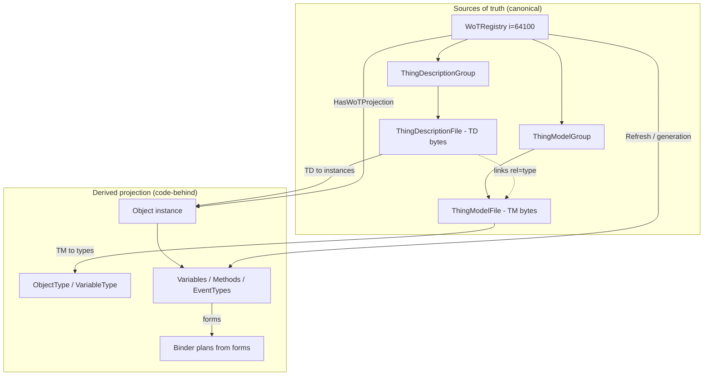
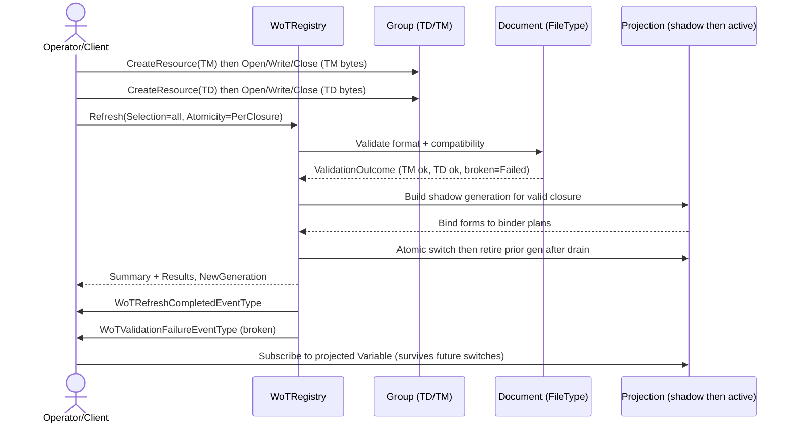

# OPC UA — WoT Connectivity V2

A complete, standalone draft revision of the OPC UA companion specification for Web of Things (WoT) connectivity. It is **registry-first**: instead of a flat asset-connection manager, it layers a W3C Thing Model / Thing Description **document registry** over the abstract [OPC UA — xRegistry](../../core-specs/xregistry/OPC-UA-xRegistry.md) base model, and treats the stored documents and their versions as the single source of truth from which the OPC UA AddressSpace and any code-behind are **derived**. It is not an addendum: this document can be read on its own.

> Experimental and non-normative. Nothing here is official or endorsed by the OPC Foundation or the W3C. The `opcfoundation.org` namespace URIs, including the provisional `http://opcfoundation.org/UA/WoT-Con/V2/`, and all numeric NodeIds are used for prototyping only; final identifiers are assigned by the OPC Foundation.

## 1 Scope

This specification defines **WoT Connectivity V2**: an OPC UA information model and normative behaviour for a server that stores, validates, versions and **projects** W3C Web of Things documents.

- A **Thing Model** (WoT-TM/1.1) describes a reusable class of Things; V2 projects it to OPC UA **types**.
- A **Thing Description** (WoT-TD/1.1) describes a concrete Thing instance; V2 projects it to OPC UA **instances** whose interaction affordances are bound to protocol bindings.

The registry files and versions are canonical. The AddressSpace that a client browses — types from Thing Models, instances from Thing Descriptions, References from links, and monitored values driven by binder plans built from forms — is a **derived projection** that a server refreshes, atomically and idempotently, from the stored documents.

V2 **subsumes** the published OPC 10100-1 v1.02 WoT Connectivity model (namespace `http://opcfoundation.org/UA/WoT-Con/`, model version 1.02.0). Every feature and scenario of that baseline — asset creation from a Thing Description file, discovery, connection test, the WoT file upload/parse flow, and the supported-bindings advertisement — remains available through a **legacy profile** (§13) that preserves the exact published namespace, types and method signatures. A server MAY implement the legacy profile, the V2 registry profile, or both.

Out of scope: the WoT vocabulary itself (defined by the revised [OPC UA — WoT Binding](../WoT-Binding/OPC-UA-WoT-Binding.md) JSON-LD vocabulary, a normative dependency of this specification), the xRegistry document/API semantics (defined by [OPC UA — xRegistry](../../core-specs/xregistry/OPC-UA-xRegistry.md)), and the concrete wire protocols of individual W3C binding templates.

## 2 Normative and informative references

- [OPC 10000-3](https://reference.opcfoundation.org/specs/OPC-10000-3/) — Address Space Model (model change, NodeVersion, DataTypes, References).
- [OPC 10000-5](https://reference.opcfoundation.org/specs/OPC-10000-5/) — Information Model (BaseObjectType, FolderType, PropertyType, BaseEventType, GeneralModelChangeEventType, structures).
- [OPC 10000-20](https://reference.opcfoundation.org/specs/OPC-10000-20/) — File Transfer (FileType).
- [OPC 11030](https://reference.opcfoundation.org/) — Compatibility and versioning rules for OPC UA information models (applied in §7.10 and §13).
- [OPC 10100-1 v1.02](https://reference.opcfoundation.org/specs/OPC-10100-1/) — the published WoT Connectivity baseline preserved by the legacy profile (§13).
- [OPC UA — xRegistry](../../core-specs/xregistry/OPC-UA-xRegistry.md) — the abstract registry base model V2 extends (RequiredModel).
- [OPC UA — WoT Binding](../WoT-Binding/OPC-UA-WoT-Binding.md) — the `uav` JSON-LD vocabulary and NodeSet↔WoT mapping (normative vocabulary dependency; not a NodeSet RequiredModel).
- [W3C WoT Thing Description 1.1](https://www.w3.org/TR/wot-thing-description11/) and [WoT Binding Templates](https://www.w3.org/TR/wot-binding-templates/).
- [WoT Registry (xRegistry WoT extension) 1.0-rc](https://github.com/varunpuranik/xregistry_spec/blob/WoT1/wot/spec.md) — the WoT document-registry model reconciled here (`thingdescriptiongroups`/`thingdescriptions`, `thingmodelgroups`/`thingmodels`, formats `WoT-TD/1.1` / `WoT-TM/1.1`).
- [xRegistry 1.0-rc3](https://github.com/xregistry/spec) — the core registry document/API specification.

## 3 Terms, definitions, and conventions

### 3.1 Normative keywords

The key words **shall**, **shall not**, **should**, **should not**, **may** and **optional** are used as defined in the OPC UA specifications. **shall** and **shall not** are absolute requirements; **should**/**should not** are strong recommendations; **may**/**optional** denote freedom.

### 3.2 Abbreviations

- **TD** — WoT Thing Description; **TM** — WoT Thing Model.
- **Affordance** — a WoT interaction affordance: a property, action or event.
- **Form** — a WoT `forms` entry binding an affordance to a protocol endpoint.
- **Projection** — the derived AddressSpace (and code-behind) materialized from stored documents.
- **Generation** — a monotonically increasing counter identifying one committed projection state of the registry.
- **Closure** — a document together with the transitive set of documents it depends on (the dependency DAG reachable from it).
- **Binder** — the component that turns a form into an executable read/write/observe/invoke/subscribe plan for a specific protocol binding.

### 3.3 Terms

- **Canonical document** — a stored TD or TM version; the authoritative source of truth. Everything a client browses is derived from it.
- **Desired version** vs **active version** — the version an operator wants projected vs the version whose projection is currently serving.
- **Shadow generation** — a fully materialized but not-yet-visible projection built beside the active one and switched in atomically.
- **Legacy profile** — the separately implementable profile that preserves OPC 10100-1 v1.02 unchanged (§13).

## 4 Overview and architecture

WoT Connectivity V2 is organised around a single principle: **the registry is the source of truth; the AddressSpace is a cache of it.** A server ingests TDs and TMs as registry documents, validates and versions them with xRegistry semantics, resolves their dependency graph, and **projects** the valid closure into OPC UA nodes. Clients interact with those projected nodes exactly as they would with any OPC UA model; the registry additionally exposes the documents, their lifecycle state, and a `Refresh` control surface.

**Layering.** V2 reuses the abstract xRegistry base (`RegistryType`/`GroupType`/`ResourceType`, namespace index 1) and adds the WoT-specific subtypes, DataTypes, events and the well-known `WoTRegistry` object (namespace index 2). The WoT vocabulary that governs how a document maps to nodes is the `uav` JSON-LD vocabulary of the revised WoT Binding; it is a **normative dependency but not a NodeSet RequiredModel**, because it is a JSON-LD vocabulary, not an OPC UA information model.

**Separation of concerns.** Routing/lifecycle metadata (load state, generation, desired/active version, validation outcomes, content digest, selected bindings) lives on the registry and document nodes; the *semantic* mapping of affordances to nodes is carried by the stored document and the `uav` vocabulary. This mirrors the xRegistry separation of registry metadata from resource content.

## 5 Namespace, model dependencies, and NodeId allocation

- **NamespaceUri (provisional):** `http://opcfoundation.org/UA/WoT-Con/V2/`. It is a deliberate `V2/` sub-path of the published baseline namespace `http://opcfoundation.org/UA/WoT-Con/`, signalling continuity with, and supersession of, OPC 10100-1 v1.02.
- **Namespace order in the NodeSet:** index 0 Core (`http://opcfoundation.org/UA/`), index 1 xRegistry (`http://opcfoundation.org/UA/xRegistry/`), index 2 this specification.
- **RequiredModels:** Core (`1.05.04`) and xRegistry (`0.1.0`). The WoT Binding vocabulary is **not** a RequiredModel.
- **NodeId allocation:** provisional numeric identifiers are drawn from a dedicated **64000+** block for types (ObjectTypes, event types, DataTypes and the reference type), with member declarations (properties, methods, arguments, enum strings, encodings and the well-known instance) allocated **append-only** from **64500**. The 64000 block was chosen to avoid the ranges already used by sibling drafts in this repository (Generators `1001-6xxx`, Schema Registry `62000`, xRegistry `63000`) and does not overlap any published OPC Foundation range. Because member allocation is append-only in source order, new declarations shall only be added at the end of their block; reordering or inserting declarations renumbers many nodes and is prohibited without an explicit NodeId-impact review.

The generated artifacts are the normative machine-readable form: `Opc.Ua.WoTConV2.NodeSet2.xml`, `Opc.Ua.WoTConV2.NodeIds.csv` and the Annex A reference (`tools/model-reference.md`), all emitted by `tools/build_model.py`. They shall not be hand-edited.

## 6 Information model

This section summarises the model; Annex A is the normative node reference generated from the same source.

### 6.1 Registry, groups and documents

- **`WoTRegistryType`** (`i=64000`, subtype of xRegistry `RegistryType`) is the registry root. It holds `ThingDescriptionGroupType` and `ThingModelGroupType` groups (constrained placeholders `<ThingDescriptionGroup>` / `<ThingModelGroup>`), and adds registry-wide lifecycle state (`RefreshGeneration`, `AutoRefresh`, `RefreshMode`, `RefreshInterval`, `LastRefreshTime`, `LastRefreshSummary`, `DefaultAtomicity`, `DeletePolicy`), validation policy (`ValidateFormat`, `ValidateCompatibility`, `StrictValidation`, `VocabularyVersion`), the `Refresh` Method and the binding surface (`SupportedBindings`, `SelectedBindings`).
- **`ThingDescriptionGroupType`** (`i=64001`) and **`ThingModelGroupType`** (`i=64002`) are xRegistry `GroupType` subtypes carrying the WoT-registry group policies (`ValidateFormat`, `ValidateCompatibility`, `ConsistentFormat`) and a constrained `<ThingDescription>` / `<ThingModel>` placeholder.
- **`WoTDocumentType`** (`i=64003`, **abstract**, subtype of xRegistry `ResourceType`) is the base of a stored WoT document. Because `ResourceType` is a `FileType`, the document bytes are read and written with the inherited `Open`/`Read`/`Write`/`Close` Methods; the subtype adds the derived-projection metadata (`DocumentKind`, `Enabled`, `LoadState`, `DesiredVersionId`, `ActiveVersionId`, `IsDefault`, `Ancestor`, `Compatibility`, `AutoRefresh`, `RefreshGeneration`, `LastRefreshTime`, `ContentDigest`, `ValidationOutcome`, `MaterializedNodeCount`, `RootNodeId`, `SelectedBindings`) and the `Validate`/`SetEnabled`/`SetDefaultVersion` Methods.
- **`ThingDescriptionFileType`** (`i=64004`) and **`ThingModelFileType`** (`i=64005`) are the concrete document subtypes. They fix the document kind and add the TD instance identity (`ThingId`, `ThingTitle`, `BaseUri`, `ModelReference`) or TM type identity (`ModelTitle`, `ModelVersion`, `DerivedTypeNodeId`).

### 6.2 Bindings

**`WoTBindingType`** (`i=64006`) is a browseable protocol-binding descriptor: its `BindingUri`, `Title`, `ProfileVersion`, `DraftMaturity`, `Enabled`, `ContentTypes` and a `Capabilities` snapshot are individual, browseable nodes. The registry's `SupportedBindings` folder holds one `WoTBindingType` per binding the server can realise. Immutable *snapshots* of the selected binding set are additionally exposed as arrays of `WoTBindingCapabilityDataType` (`SelectedBindings` on the registry and on each document). Browseable policy/identity is always exposed as Objects/Properties; arrays are used **only** for immutable snapshots. No credentials or secrets are ever exposed on a binding node.

### 6.3 DataTypes

Enumerations: `WoTDocumentKindEnum`, `WoTLoadStateEnum`, `WoTRefreshModeEnum`, `WoTAtomicityEnum`, `WoTDeletePolicyEnum`, `WoTOutcomeEnum`, `WoTPhaseEnum`, `WoTBindingCapabilityEnum`. Structures (each an **immutable versioned snapshot**, read as a single Variant and never mutated in place): `WoTValidationOutcomeDataType`, `WoTBindingCapabilityDataType`, `WoTRefreshOptionsDataType`, `WoTResourceSelectorDataType`, `WoTResourceLoadResultDataType`, `WoTRefreshSummaryDataType`, `WoTDependencyDataType`. Each structure carries `Default Binary` and `Default JSON` encodings.

### 6.4 Events and the notifier chain

- **`WoTResourceEventType`** (`i=64010`, **abstract**, subtype of `BaseEventType`) is the common WoT resource event; it carries the affected identity (`Xid`, `ResourceId`, `VersionId`), `DocumentKind`, `Generation`, `Phase` and `Outcome`.
- **`WoTValidationFailureEventType`** (`i=64011`), **`WoTLoadFailureEventType`** (`i=64012`) and **`WoTBindingFailureEventType`** (`i=64013`) are the concrete failure subtypes; the failing **resource** is the event source.
- **`WoTRefreshCompletedEventType`** (`i=64014`, subtype of `BaseEventType`) carries the `Summary` and committed `Generation`; the **registry** is the event source.

The notifier chain is **Server → WoTRegistry → groups → resources**. The well-known `WoTRegistry` object declares `EventNotifier = SubscribeToEvents` and is a `HasNotifier` target of the `Server` object (`i=2253`); groups are `HasNotifier` targets of the registry, and resources of their group. A subscriber on `WoTRegistry` therefore receives the failure events raised by any contained resource and the `WoTRefreshCompletedEventType` raised by the registry itself.

### 6.5 Reference type and projection correlation

**`HasWoTProjection`** (`i=64060`, subtype of `NonHierarchicalReferences`, inverse `WoTProjectionOf`) links a stored document resource to the root node of its derived projection. It lets a client find the projected node behind a document and the document behind a projected node, and it anchors `NodeVersion` correlation (§7.9).

### 6.6 Well-known instance

`WoTRegistry` (`i=64100`, type definition `WoTRegistryType`) is a `HasComponent` of the `Server` object and materialises a functional `Refresh` Method, so loading the NodeSet yields a callable registry. A server binds the concrete handlers.

## 7 Registry semantics and lifecycle (normative)

### 7.1 Canonical files, derived projection

The stored TD/TM files and their versions are canonical. The projected AddressSpace and any generated code-behind are **derived**: a server shall be able to rebuild them entirely from the stored documents, the pinned `uav` vocabulary version and the registry's model, without any additional hidden state. A client shall not rely on projected nodes surviving a change to the underlying document except as governed by the generation and retirement rules below.

### 7.2 Projection mapping

A valid document is projected using the WoT Binding `uav` vocabulary:

- A **Thing Model** projects to a **type**: `uav:objectType` → an `ObjectType`, `uav:variableType` → a `VariableType`; its affordances become **member declarations** with the declared modelling rule (`uav:modellingRule`), unit (`uav:unitProperty` / QUDT), scaling (`uav:scaleFactor`, `uav:decimalPlaces`) and grouping (`uav:memberOf`, `uav:propertyGroups`/`eventGroups`/`actionGroups`). The materialized type NodeId is exposed as `ThingModelFileType.DerivedTypeNodeId`.
- A **Thing Description** projects to an **instance**: `uav:object` → an `Object` whose affordances become **Variables** (properties), **Methods** (actions) and **event sources** (events → subtypes of an event type, per the TD's `uav:isEvent`/`data`).
- **Affordances** map to nodes as above; **links** map to OPC UA **References** (`uav:componentModel`/`uav:typedReference` → `HasComponent`/typed references, `uav:reference`/`uav:capability` → non-hierarchical references) or, when no native reference fits, to an explicit link representation carried on the projected node.
- **Forms** do not become nodes; each form is compiled into a **binder plan** (§8) that the server executes to read/write/observe/invoke/subscribe the affordance over the form's protocol binding.

### 7.3 No mandatory flat root

V2 does **not** impose a mandatory flat "Assets" root as a container for every projected instance. The authored hierarchy and references of the stored documents determine exposure: a TD MAY be projected under `Objects`, under an author-chosen parent, or referenced from an existing model node. A server MAY offer an organising folder for convenience, but conformance shall not require it and clients shall not assume it.

### 7.4 Dependency DAG and closure atomicity

Documents form a **dependency DAG**: a TD depends on the TMs it derives from (`links` `rel=type`); a TM depends on the TMs it extends or references (`tm:extends`, `tm:ref`). A refresh resolves this graph into `WoTDependencyDataType` edges. A document and its transitive dependencies form a **closure**. When atomicity is `PerClosure` (or coarser), the whole closure is projected into a shadow generation and committed together or not at all: a closure with any unresolved or invalid dependency does not partially activate.

### 7.5 Invalid documents stay stored; last valid projection stays active

Validation failure never destroys data. An invalid document (format or compatibility) remains stored, its `LoadState` becomes `Failed`, its `ValidationOutcome` records the failing phase and reason, and a `WoTValidationFailureEventType` is raised from the resource. Critically, the **previously active valid projection of that resource remains active and unchanged**. A refresh that would activate an invalid document instead keeps the prior generation of that closure serving.

### 7.6 Shadow-switch generations and retirement

Projection is generational. A refresh builds the new nodes as a **shadow generation** beside the active one, validates and binds them, then **switches atomically** so a client never observes a half-built model. The superseded generation is not deleted immediately: it enters `Superseded`/`Retiring` and is retired only **after its monitored items and subscriptions have drained** onto the new generation, so active subscriptions are not disrupted by the switch. This drain-then-retire proof point follows the approach validated in [PR #4015](https://github.com/OPCFoundation/UA-.NETStandard/pull/4015): monitored items are migrated/settled against the new nodes before the old nodes are removed. `RefreshGeneration` increments on each committed switch; retirement counts are reported in the refresh summary.

### 7.7 Automatic and explicit refresh; idempotence; desired vs active

- **Automatic refresh:** when `AutoRefresh` is true, the registry re-projects per `RefreshMode` (`Periodic` on `RefreshInterval`, `EventDriven` on a stored-document change, or `Scheduled`).
- **Explicit refresh:** the `Refresh` Method re-projects a selection on demand.
- **Idempotence:** a document whose `ContentDigest` is unchanged since its last projection at the current vocabulary version is reported `Unchanged` and is **not** re-materialized, unless `Options.Force` is set. Re-running an unchanged refresh produces the same active generation and node set.
- **Desired vs active version:** `DesiredVersionId` records the version an operator wants projected; `ActiveVersionId` records the version currently serving. They differ transiently during a switch, or persistently when the desired version is invalid (the last valid active version keeps serving) — this divergence is observable and drives operator tooling.

### 7.8 Version switch, unload, delete, federation

- **Version switch:** setting `DesiredVersionId` (or `SetDefaultVersion`) and refreshing shadow-switches the resource's projection to the selected version; the prior generation retires after drain.
- **Unload:** `SetEnabled(false)` requests unloading the projection while keeping the stored document; dependents are treated per the registry/refresh `DeletePolicy` (`Reject`, `Retire`, `Cascade`, `Force`).
- **Delete:** the inherited xRegistry `Delete` removes the stored resource/version; its projection is retired first, subject to the delete policy.
- **Federation:** a document MAY be served by reference through the inherited `ExternalReference` (`ExpandedNodeId`) / `ResourceUrl`; V2 resolves and projects a federated document the same way as a local one, and a federated TM MAY satisfy a local TD's dependency closure.

### 7.9 Model change events and NodeVersion correlation

A committed generation switch changes the AddressSpace graph. The server shall emit OPC UA **model change events** (`GeneralModelChangeEventType`) for the committed node additions/removals/reference changes, and shall stamp affected nodes' `NodeVersion` so a client can correlate a node's version with the `RefreshGeneration` that produced it (the `HasWoTProjection` reference ties the node back to its document). Model change events are emitted for **committed** graph changes only — never for shadow-generation scratch work.

### 7.10 Semantic change events (optional)

When a refresh changes the *meaning* of a type or instance (for example a DataType, EngineeringUnit or semantic identifier changes in a way governed by the Part 3/Part 5 model-change rules and the OPC 11030 compatibility rules), the server MAY additionally emit an OPC UA **semantic change event** (`SemanticChangeEventType`) for the affected nodes. Concrete subtypes of the abstract model/semantic change event types are defined only where required for emission; V2 relies on the Core types unless a WoT-specific subtype is needed.

### 7.11 Security

Fetching a document's `@context`, external JSON schemas and federated referents shall use transport security and honour the registry's configured trust; credentials for those fetches and for protocol-binding endpoints are held out of band and **never** exposed on registry or binding nodes (binding nodes carry policy and identity only). Management Methods (`Refresh`, `Validate`, `SetEnabled`, `SetDefaultVersion`, and the inherited xRegistry create/delete Methods) are subject to OPC UA role-based access control; read access to a group MAY be restricted to authorise discovery of the Things it contains. Operators should be aware that a TD can expose device endpoints and security schemes and should scope group read access accordingly.

## 8 Protocol binder (normative)

The **binder** turns a form into an executable plan. It has a protocol-independent **core** and a set of **per-binding** modules.

- **Core:** parses a form, resolves its `href` against the TD `base`, selects the binding by the form's protocol vocabulary, maps the WoT `op` set to OPC UA service semantics (readproperty→Read, writeproperty→Write, observeproperty→MonitoredItem, invokeaction→Call, subscribeevent→event MonitoredItem), and produces a plan whose capabilities are recorded in the document's `SelectedBindings` snapshot.
- **Per-binding:** each W3C binding template (OPC UA, HTTP, Modbus, MQTT, CoAP, …) is a module advertised as a `WoTBindingType` with its `Capabilities` (`WoTBindingCapabilityEnum` set) and content types.
- **Version pinning and maturity:** each binding is pinned to a specific W3C binding-document version (`ProfileVersion`) and exposes that document's **draft maturity** (`DraftMaturity`: WD/CR/PR/REC). A server shall bind a form only with a binding whose pinned document it implements, and shall surface the maturity so consumers can judge stability. A form that names an unknown binding or an operation the binding does not support raises a `WoTBindingFailureEventType`.

## 9 Refresh Method and results (normative)

`WoTRegistryType.Refresh(Selection, Options, ExpectedGeneration, RequestId) → (Summary, Results, NewGeneration)`:

- **Selection** — an array of `WoTResourceSelectorDataType`; empty selects the whole registry. Selectors filter by kind, group, resource, version or a single `Xid`.
- **Options** — `WoTRefreshOptionsDataType`: `Atomicity`, `Force`, `DryRun`, `IncludeDependents`, `DeletePolicy`, `MaxParallelism`, `Timeout`.
- **ExpectedGeneration** — optimistic concurrency: if non-zero and unequal to `RefreshGeneration`, the call fails `Bad_InvalidState` and changes nothing.
- **RequestId** — echoed into `Summary.RequestId` and the completion event for correlation.
- **Summary** — `WoTRefreshSummaryDataType`: overall outcome, applied atomicity, counts (total/succeeded/unchanged/failed/skipped/retired), timing and the committed generation.
- **Results** — an array of `WoTResourceLoadResultDataType`, one per considered resource: identity, kind, per-resource outcome and phase, resulting load state, generation, materialized-node count and root, content digest and a message.
- **NewGeneration** — the committed generation; unchanged on a dry run or a full failure.

A dry run validates and computes `Summary`/`Results` without committing any projection change. `Validate` (on a document) performs format/compatibility validation only and returns a `WoTValidationOutcomeDataType`. A representative JSON projection of these outputs is `examples/04-refresh-results.json`.

## 10 Events and change notifications (normative)

A conformant registry raises: `WoTValidationFailureEventType` on format/compatibility failure; `WoTLoadFailureEventType` when a validated document fails to materialize or a shadow generation cannot be activated; `WoTBindingFailureEventType` when a form cannot be bound; and `WoTRefreshCompletedEventType` on every completed refresh (including automatic ones). Committed graph changes additionally raise Core model change events, and — where required by §7.10 — semantic change events. Failure events name the failing resource as the source; the refresh-completed event names the registry.

## 11 Security (normative)

See §7.11. In summary: context/schema/federation fetches use transport security; credentials are never exposed on nodes; management and create/delete Methods use role-based access control; group read access is an authorisation boundary for Thing discoverability.

## 12 Worked examples (informative)

- `examples/01-thing-model-pump.tm.jsonld` — a WoT-TM/1.1 Thing Model (`PumpType`) stored as a `thingmodel` resource; projects to an ObjectType.
- `examples/02-thing-description-pump.td.jsonld` — a matching WoT-TD/1.1 Thing Description (`Pump 01`) that derives from the Thing Model (`links rel=type`) and binds its forms to the OPC UA binding; projects to an Object instance.
- `examples/03-invalid-thing-description.td.jsonld` — an intentionally invalid TD that stays stored and drives a validation failure.
- `examples/04-refresh-results.json` — a representative `Refresh` result set for a whole-registry refresh over the three documents above.

## 13 Legacy profile — OPC 10100-1 v1.02 (normative)

The **legacy profile** preserves every feature and scenario of the published OPC 10100-1 v1.02 WoT Connectivity model, with its **exact** published namespace, types and method signatures. A server that implements the legacy profile is byte-for-byte compatible with existing 1.02 clients. The V2 NodeSet (`http://opcfoundation.org/UA/WoT-Con/V2/`) **does not redefine or renumber** any 1.02 node; the legacy model is referenced from its own published namespace and NodeSet.

### 13.1 Preserved 1.02 model (unchanged)

Model namespace `http://opcfoundation.org/UA/WoT-Con/`, version `1.02.0` (published 2025-12-05). The entry point is the `WoTAssetConnectionManagement` object (an instance of `WoTAssetConnectionManagementType`) under the `Objects` folder.

| Element | Kind | Preserved definition |
|---|---|---|
| `WoTAssetConnectionManagementType` | ObjectType (BaseObjectType) | `<WoTAssetName>` Object placeholder (BaseObjectType, `HasInterface` IWoTAssetType); `SupportedWoTBindings` `UriString[]` Property; Methods below; `Configuration` (WoTAssetConfigurationType). |
| `CreateAsset` | Method (Mandatory) | `CreateAsset([in] String AssetName, [out] NodeId AssetId)`. |
| `DeleteAsset` | Method (Mandatory) | `DeleteAsset([in] NodeId AssetId)`. |
| `DiscoverAssets` | Method (Optional) | `DiscoverAssets([out] String[] AssetEndpoints)`. |
| `CreateAssetForEndpoint` | Method (Optional) | `CreateAssetForEndpoint([in] String AssetName, [in] String AssetEndpoint, [out] NodeId AssetId)`. |
| `ConnectionTest` | Method (Optional) | `ConnectionTest([in] String AssetEndpoint, [out] Boolean Success, [out] String Status)`. |
| `WoTAssetConfigurationType` | ObjectType | Vendor `<WoTConfigurationParameterName>` Properties; `License` String. |
| `IWoTAssetType` | Interface (abstract) | `<WoTPropertyName>` Variables via `HasWoTComponent`; `AssetEndpoint` String; `WoTFile` (WoTAssetFileType, Mandatory). |
| `WoTAssetFileType` | ObjectType (FileType) | `CloseAndUpdate([in] UInt32 FileHandle)` (Mandatory). |
| `HasWoTComponent` | ReferenceType | Subtype of `HasComponent`; InverseName `WoTComponentOf`. |

Every 1.02 scenario is preserved: create-from-existing-TD (`CreateAsset` + `WoTFile` upload + `CloseAndUpdate`), discovery (`DiscoverAssets` → `ConnectionTest` → `CreateAssetForEndpoint` with an auto-generated TD file), deletion (`DeleteAsset`), and the supported-bindings advertisement (`SupportedWoTBindings`).

### 13.2 Adaptation to the registry (signatures unchanged)

A dual-profile server MAY back the legacy surface with the V2 registry so that both views stay consistent, **without changing any 1.02 signature**:

- **`CreateAsset(AssetName) → AssetId`** — the server creates (or reuses) a default `ThingDescriptionGroup`, creates a `ThingDescriptionFileType` resource for the asset (xRegistry `CreateResource`), and returns the NodeId of the *projected* Object as `AssetId`. The `<WoTAssetName>` object is the projected Object.
- **`WoTFile` / `WoTAssetFileType`** — the legacy `WoTFile` maps onto the `ThingDescriptionFileType` resource's inherited FileType (`Open`/`Read`/`Write`/`Close`): uploading the TD writes the resource's document bytes.
- **`CloseAndUpdate(FileHandle)`** — maps onto write-close of the resource followed by an implicit single-resource `Refresh` (validate + project). The 1.02 result codes are preserved: `Bad_DecodingError`/`Bad_NotSupported`/`Bad_NotFound` correspond to the V2 format-validation and projection failures; on success the projected Variables appear exactly as in 1.02.
- **`DeleteAsset(AssetId)`** — maps onto `SetEnabled(false)` (unload projection) and the inherited xRegistry `Delete` of the backing resource, subject to the delete policy.
- **`DiscoverAssets` / `ConnectionTest` / `CreateAssetForEndpoint`** — preserved unchanged; a discovered/auto-generated TD is stored as a `ThingDescriptionFileType` resource, so discovery-created assets become first-class registry documents.
- **`SupportedWoTBindings` (`UriString[]`)** — surfaces the same binding set the V2 registry advertises through `SupportedBindings` / `SelectedBindings`.
- **`HasWoTComponent`** — the legacy per-property reference remains valid on legacy-projected assets; V2-projected instances additionally carry `HasWoTProjection` back to their document.

Because the adaptation keeps the 1.02 namespace, types, node numbering and method signatures intact, a legacy client cannot tell whether a registry backs the asset manager; a V2 client sees the same assets as registry documents.

## 14 Conformance units and profiles

Conformance is composed from independently implementable **conformance units (CUs)**, grouped into **profiles**.

| CU | Requires |
|---|---|
| `WoTV2 Registry Discovery` | Well-known `WoTRegistry` under Server; browse registry/groups; read xRegistry + WoT metadata. |
| `WoTV2 Document Read` | Read a stored TD/TM via the inherited FileType `Open`/`Read`/`Close`. |
| `WoTV2 Document Write` | Create/write TD/TM resources via xRegistry `CreateResource` + FileType write. |
| `WoTV2 TD Validation` | Format + compatibility validation of TDs; `ValidationOutcome`; validation-failure events. |
| `WoTV2 TM Validation` | Format + compatibility validation of TMs. |
| `WoTV2 Type Materialization` | Project a TM to a type (`DerivedTypeNodeId`). |
| `WoTV2 Instance Materialization` | Project a TD to an instance with Variables/Methods/EventTypes. |
| `WoTV2 Reference Materialization` | Project links to References / explicit link representation. |
| `WoTV2 Refresh` | `Refresh` Method with selection/options/expected-generation and detailed results. |
| `WoTV2 Events` | Resource lifecycle + refresh-completed events with the Server→registry→group→resource notifier chain. |
| `WoTV2 Model Change` | Model change events + NodeVersion correlation for committed generations. |
| `WoTV2 Semantic Change` | Optional semantic change events per §7.10. |
| `WoTV2 Version Lifecycle` | Desired/active version, version switch, unload, delete. |
| `WoTV2 Federation` | Resolve/project federated documents via `ExternalReference`/`ResourceUrl`. |
| `WoTV2 Binder Core` | Compile forms to binder plans; op→service mapping. |
| `WoTV2 Binder <Protocol>` | A specific per-binding module (OPC UA, HTTP, Modbus, …) with capabilities + version pinning. |
| `WoTV2 Atomicity Modes` | Per-resource / per-group / per-closure / per-registry atomicity with shadow switch + drain-retire. |
| `WoT Connectivity Base Functionality` (legacy) | The full OPC 10100-1 v1.02 model and scenarios (§13). |

**Profiles.** *WoT V2 Registry Server* = Discovery + Document Read/Write + TD/TM Validation + Type/Instance/Reference Materialization + Refresh + Events + Version Lifecycle + Binder Core + at least one Binder module. *WoT V2 Full* adds Model/Semantic Change, Federation and Atomicity Modes. *WoT Connectivity Legacy* = the legacy CU (§13), separately implementable and independently conformant.

## 15 Acceptance scenarios

Each scenario is an end-to-end acceptance test for the CUs it exercises.

1. **Discover and read** — Browse `Server → WoTRegistry`, enumerate groups and resources, and read a stored TD's bytes via `Open`/`Read`/`Close`. *(Discovery, Document Read)*
2. **Ingest and validate a TM** — Create a `thingmodel` resource, write the `PumpType` TM, `Validate`; expect `FormatOutcome=Success`; `Refresh`; expect a projected ObjectType and `DerivedTypeNodeId` set. *(Document Write, TM Validation, Type Materialization)*
3. **Ingest a derived TD** — Create a `thingdescription` resource, write `Pump 01`, `Refresh` with `Atomicity=PerClosure`; expect the TD's closure (TD + PumpType TM) to activate atomically, an Object with `PumpSpeed`/`SpeedSetpoint`/`Reset`, forms bound to the OPC UA binder, and `HasWoTProjection` from the resource to the Object. *(Instance/Reference Materialization, Binder Core, Atomicity)*
4. **Invalid TD stays stored** — Write `pump-broken`, `Refresh`; expect `LoadState=Failed`, a `WoTValidationFailureEventType`, the document still readable, and any prior valid projection of that resource unchanged. *(TD Validation, Events)*
5. **Idempotent refresh** — Re-run scenario 3's `Refresh` unchanged; expect every result `Unchanged`, no node churn, `RefreshGeneration` unchanged. *(Refresh idempotence)*
6. **Version switch with live subscriptions** — Subscribe to `PumpSpeed`; publish `pump-01` v1.1.0; set `DesiredVersionId=1.1.0`; `Refresh`; expect a shadow switch, model change events for the committed change, `NodeVersion` updated, the old generation retired only after the subscription drains, and no lost notifications. *(Version Lifecycle, Model Change, Atomicity)*
7. **Unload with dependents** — `SetEnabled(false)` on the `PumpType` TM with `DeletePolicy=Reject` while `Pump 01` depends on it; expect rejection; retry with `Cascade`; expect the dependent TD's projection to unload. *(Version Lifecycle)*
8. **Federated dependency** — Point `Pump 01`'s TM dependency at a federated TM via `ResourceUrl`; `Refresh`; expect the closure to resolve and activate across the federation link. *(Federation)*
9. **Legacy round-trip** — Via `WoTAssetConnectionManagement`, `CreateAsset("Pump01")`, `Open`/`Write`/`CloseAndUpdate` the TD, browse the mapped Variables; on a dual-profile server, expect the same asset to appear as a `thingdescription` registry document with an identical projection. *(Legacy CU)*

## 16 NodeSet validation

The NodeSet, CSV and Annex A are generated from `tools/build_model.py`; they shall not be hand-edited. `tools/validate_local.py` checks XML well-formedness, unique NodeIds in the 64000+ block, CSV↔NodeSet consistency, that every reference resolves against the own namespace, the loaded xRegistry base `NodeIds.csv` and (when the gitignored `tools/ref/UA.NodeIds.csv` aid is present) the base UA ids, that each type carries a `HasSubtype` inverse and each Structure its encodings, that the well-known `WoTRegistry` instance is a component and `HasNotifier` target of the `Server` object with `EventNotifier` set, that the registry and document types generate the required events, and that the generated Annex A is embedded verbatim in this document.

---

## Annex A — Information model

This annex is the normative node reference. It is generated from `tools/build_model.py` and always matches `Opc.Ua.WoTConV2.NodeSet2.xml`. All nodes are proposed additions in the companion namespace `http://opcfoundation.org/UA/WoT-Con/V2/` (namespace index `2` in this NodeSet, after the required `http://opcfoundation.org/UA/xRegistry/` base model at index `1`). The WoT Connectivity V2 registry types **extend the abstract [OPC UA — xRegistry](https://github.com/marcschier/opcua-drafts/blob/main/core-specs/xregistry/OPC-UA-xRegistry.md) base types** (`RegistryType`/`GroupType`/`ResourceType`). The numeric NodeIds shown are **provisional** (final IDs are assigned by the OPC Foundation). The **Declared in** column marks members inherited from a supertype.

### Type overview

| NodeId | BrowseName | NodeClass | Subtype of |
|---|---|---|---|
| ns=2;i=64000 | [WoTRegistryType](#type-WoTRegistryType) | ObjectType | [RegistryType](https://github.com/marcschier/opcua-drafts/blob/main/core-specs/xregistry/OPC-UA-xRegistry.md#type-RegistryType) |
| ns=2;i=64001 | [ThingDescriptionGroupType](#type-ThingDescriptionGroupType) | ObjectType | [GroupType](https://github.com/marcschier/opcua-drafts/blob/main/core-specs/xregistry/OPC-UA-xRegistry.md#type-GroupType) |
| ns=2;i=64002 | [ThingModelGroupType](#type-ThingModelGroupType) | ObjectType | [GroupType](https://github.com/marcschier/opcua-drafts/blob/main/core-specs/xregistry/OPC-UA-xRegistry.md#type-GroupType) |
| ns=2;i=64003 | [WoTDocumentType](#type-WoTDocumentType) | ObjectType | [ResourceType](https://github.com/marcschier/opcua-drafts/blob/main/core-specs/xregistry/OPC-UA-xRegistry.md#type-ResourceType) |
| ns=2;i=64004 | [ThingDescriptionFileType](#type-ThingDescriptionFileType) | ObjectType | [WoTDocumentType](#type-WoTDocumentType) |
| ns=2;i=64005 | [ThingModelFileType](#type-ThingModelFileType) | ObjectType | [WoTDocumentType](#type-WoTDocumentType) |
| ns=2;i=64006 | [WoTBindingType](#type-WoTBindingType) | ObjectType | [BaseObjectType](https://reference.opcfoundation.org/specs/OPC-10000-5/6.2) |
| ns=2;i=64010 | [WoTResourceEventType](#type-WoTResourceEventType) | ObjectType | [BaseEventType](https://reference.opcfoundation.org/specs/OPC-10000-5/6.4.2) |
| ns=2;i=64011 | [WoTValidationFailureEventType](#type-WoTValidationFailureEventType) | ObjectType | [WoTResourceEventType](#type-WoTResourceEventType) |
| ns=2;i=64012 | [WoTLoadFailureEventType](#type-WoTLoadFailureEventType) | ObjectType | [WoTResourceEventType](#type-WoTResourceEventType) |
| ns=2;i=64013 | [WoTBindingFailureEventType](#type-WoTBindingFailureEventType) | ObjectType | [WoTResourceEventType](#type-WoTResourceEventType) |
| ns=2;i=64014 | [WoTRefreshCompletedEventType](#type-WoTRefreshCompletedEventType) | ObjectType | [BaseEventType](https://reference.opcfoundation.org/specs/OPC-10000-5/6.4.2) |
| ns=2;i=64020 | [WoTDocumentKindEnum](#type-WoTDocumentKindEnum) | DataType | [Enumeration](https://reference.opcfoundation.org/specs/OPC-10000-3/8.40) |
| ns=2;i=64021 | [WoTLoadStateEnum](#type-WoTLoadStateEnum) | DataType | [Enumeration](https://reference.opcfoundation.org/specs/OPC-10000-3/8.40) |
| ns=2;i=64022 | [WoTRefreshModeEnum](#type-WoTRefreshModeEnum) | DataType | [Enumeration](https://reference.opcfoundation.org/specs/OPC-10000-3/8.40) |
| ns=2;i=64023 | [WoTAtomicityEnum](#type-WoTAtomicityEnum) | DataType | [Enumeration](https://reference.opcfoundation.org/specs/OPC-10000-3/8.40) |
| ns=2;i=64024 | [WoTDeletePolicyEnum](#type-WoTDeletePolicyEnum) | DataType | [Enumeration](https://reference.opcfoundation.org/specs/OPC-10000-3/8.40) |
| ns=2;i=64025 | [WoTOutcomeEnum](#type-WoTOutcomeEnum) | DataType | [Enumeration](https://reference.opcfoundation.org/specs/OPC-10000-3/8.40) |
| ns=2;i=64026 | [WoTPhaseEnum](#type-WoTPhaseEnum) | DataType | [Enumeration](https://reference.opcfoundation.org/specs/OPC-10000-3/8.40) |
| ns=2;i=64027 | [WoTBindingCapabilityEnum](#type-WoTBindingCapabilityEnum) | DataType | [Enumeration](https://reference.opcfoundation.org/specs/OPC-10000-3/8.40) |
| ns=2;i=64040 | [WoTValidationOutcomeDataType](#type-WoTValidationOutcomeDataType) | DataType | [Structure](https://reference.opcfoundation.org/specs/OPC-10000-5/8.24) |
| ns=2;i=64041 | [WoTBindingCapabilityDataType](#type-WoTBindingCapabilityDataType) | DataType | [Structure](https://reference.opcfoundation.org/specs/OPC-10000-5/8.24) |
| ns=2;i=64042 | [WoTRefreshOptionsDataType](#type-WoTRefreshOptionsDataType) | DataType | [Structure](https://reference.opcfoundation.org/specs/OPC-10000-5/8.24) |
| ns=2;i=64043 | [WoTResourceSelectorDataType](#type-WoTResourceSelectorDataType) | DataType | [Structure](https://reference.opcfoundation.org/specs/OPC-10000-5/8.24) |
| ns=2;i=64044 | [WoTResourceLoadResultDataType](#type-WoTResourceLoadResultDataType) | DataType | [Structure](https://reference.opcfoundation.org/specs/OPC-10000-5/8.24) |
| ns=2;i=64045 | [WoTRefreshSummaryDataType](#type-WoTRefreshSummaryDataType) | DataType | [Structure](https://reference.opcfoundation.org/specs/OPC-10000-5/8.24) |
| ns=2;i=64046 | [WoTDependencyDataType](#type-WoTDependencyDataType) | DataType | [Structure](https://reference.opcfoundation.org/specs/OPC-10000-5/8.24) |
| ns=2;i=64060 | [HasWoTProjection](#type-HasWoTProjection) | ReferenceType | [NonHierarchicalReferences](https://reference.opcfoundation.org/specs/OPC-10000-5/11.3) |

### Object types

#### WoTRegistryType  (ns=2;i=64000)

*Inherits from:* [RegistryType](https://github.com/marcschier/opcua-drafts/blob/main/core-specs/xregistry/OPC-UA-xRegistry.md#type-RegistryType)

The WoT Connectivity V2 registry root - an xRegistry RegistryType (a FolderType) that holds ThingDescriptionGroupType and ThingModelGroupType groups. The stored Thing Description / Thing Model files and their versions are canonical; the projected AddressSpace (types from Thing Models, instances from Thing Descriptions) is derived code-behind. Exposed as a well-known WoTRegistry object under the Server object (i=2253). Adds registry-wide refresh, generation and validation-policy state and the Refresh Method.

| BrowseName | NodeClass | DataType | ModellingRule | Declared in | Description |
|---|---|---|---|---|---|
| AutoRefresh | Variable | Boolean | Optional | WoTRegistryType | True if the registry automatically re-projects stored documents (per RefreshMode); false if only explicit Refresh calls re-project. |
| RefreshMode | Variable | [WoTRefreshModeEnum](#type-WoTRefreshModeEnum) | Optional | WoTRegistryType | How automatic refresh is triggered when AutoRefresh is true. |
| RefreshInterval | Variable | Duration | Optional | WoTRegistryType | The interval used when RefreshMode is Periodic. |
| RefreshGeneration | Variable | UInt32 | Mandatory | WoTRegistryType | The current committed projection generation; incremented on every committed refresh. Materialized nodes carry the generation in their NodeVersion for correlation. |
| LastRefreshTime | Variable | DateTime | Optional | WoTRegistryType | UTC time of the last completed refresh. |
| LastRefreshSummary | Variable | [WoTRefreshSummaryDataType](#type-WoTRefreshSummaryDataType) | Optional | WoTRegistryType | An immutable snapshot summarizing the last completed refresh. |
| DefaultAtomicity | Variable | [WoTAtomicityEnum](#type-WoTAtomicityEnum) | Optional | WoTRegistryType | The commit granularity applied when a Refresh omits an explicit atomicity. |
| DeletePolicy | Variable | [WoTDeletePolicyEnum](#type-WoTDeletePolicyEnum) | Optional | WoTRegistryType | The default policy for treating dependents on unload/delete. |
| ValidateFormat | Variable | Boolean | Optional | WoTRegistryType | Registry-wide default: validate document format on ingest/refresh. |
| ValidateCompatibility | Variable | Boolean | Optional | WoTRegistryType | Registry-wide default: validate version compatibility on ingest/refresh. |
| StrictValidation | Variable | Boolean | Optional | WoTRegistryType | If true, a validation warning is treated as a failure. |
| VocabularyVersion | Variable | String | Optional | WoTRegistryType | The version-pinned WoT Binding JSON-LD vocabulary this registry validates and projects against. |
| SelectedBindings | Variable | [WoTBindingCapabilityDataType](#type-WoTBindingCapabilityDataType)\[\] | Optional | WoTRegistryType | An immutable snapshot array of the protocol bindings currently selected/active registry-wide. |
| SupportedBindings | Object |  | Optional | WoTRegistryType | A folder of browseable WoTBindingType binding descriptors the server can realize (the live, per-field form of the selected-bindings snapshot). |
| <ThingDescriptionGroup> | Object |  | OptionalPlaceholder | WoTRegistryType | A Thing Description Group held by this registry (constrained to the ThingDescriptionGroupType subtype). |
| <ThingModelGroup> | Object |  | OptionalPlaceholder | WoTRegistryType | A Thing Model Group held by this registry (constrained to the ThingModelGroupType subtype). |
| Refresh | Method |  | Optional | WoTRegistryType | Re-project selected stored documents into the AddressSpace. Idempotent: a document whose content digest is unchanged is reported Unchanged and not re-materialized unless Options.Force is set. Projects into a shadow generation and switches atomically per Options.Atomicity; superseded generations are retired after their monitored items drain. If ExpectedGeneration is non-zero and does not equal RefreshGeneration, the call fails with Bad_InvalidState and changes nothing (optimistic concurrency). An empty Selection selects the whole registry. |

*Generates events:* [WoTRefreshCompletedEventType](#type-WoTRefreshCompletedEventType)

#### ThingDescriptionGroupType  (ns=2;i=64001)

*Inherits from:* [GroupType](https://github.com/marcschier/opcua-drafts/blob/main/core-specs/xregistry/OPC-UA-xRegistry.md#type-GroupType)

An xRegistry GroupType that collects related ThingDescriptionFileType resources (a Thing Description Group per the WoT xRegistry model). Adds the group-level format/compatibility validation policy. Its <ThingDescription> placeholder constrains members to the Thing Description subtype.

| BrowseName | NodeClass | DataType | ModellingRule | Declared in | Description |
|---|---|---|---|---|---|
| ValidateFormat | Variable | Boolean | Optional | ThingDescriptionGroupType | Group-level policy: validate Thing Description format (WoT-TD/1.1) on ingest. |
| ValidateCompatibility | Variable | Boolean | Optional | ThingDescriptionGroupType | Group-level policy: validate version compatibility on ingest. |
| ConsistentFormat | Variable | Boolean | Optional | ThingDescriptionGroupType | Group-level policy: require all versions of a resource to share one format. |
| <ThingDescription> | Object |  | OptionalPlaceholder | ThingDescriptionGroupType | A Thing Description resource held by this group (constrained to the ThingDescriptionFileType subtype). |

#### ThingModelGroupType  (ns=2;i=64002)

*Inherits from:* [GroupType](https://github.com/marcschier/opcua-drafts/blob/main/core-specs/xregistry/OPC-UA-xRegistry.md#type-GroupType)

An xRegistry GroupType that collects related ThingModelFileType resources (a Thing Model Group per the WoT xRegistry model). Adds the group-level format/compatibility validation policy. Its <ThingModel> placeholder constrains members to the Thing Model subtype.

| BrowseName | NodeClass | DataType | ModellingRule | Declared in | Description |
|---|---|---|---|---|---|
| ValidateFormat | Variable | Boolean | Optional | ThingModelGroupType | Group-level policy: validate Thing Model format (WoT-TM/1.1) on ingest. |
| ValidateCompatibility | Variable | Boolean | Optional | ThingModelGroupType | Group-level policy: validate version compatibility on ingest. |
| ConsistentFormat | Variable | Boolean | Optional | ThingModelGroupType | Group-level policy: require all versions of a resource to share one format. |
| <ThingModel> | Object |  | OptionalPlaceholder | ThingModelGroupType | A Thing Model resource held by this group (constrained to the ThingModelFileType subtype). |

#### WoTDocumentType  (ns=2;i=64003) *(abstract)*

*Inherits from:* [ResourceType](https://github.com/marcschier/opcua-drafts/blob/main/core-specs/xregistry/OPC-UA-xRegistry.md#type-ResourceType)

The abstract base of a stored WoT document resource - an xRegistry ResourceType (a FileType) whose content bytes are the JSON-LD document, read/written with the inherited Open/Read/Write/Close Methods. Adds the derived-projection metadata (load state, desired/active version, validation and compatibility outcomes, content digest, materialized-node count and root, selected bindings) and the Validate, SetEnabled and SetDefaultVersion Methods. Concrete subtypes fix the document kind.

| BrowseName | NodeClass | DataType | ModellingRule | Declared in | Description |
|---|---|---|---|---|---|
| DocumentKind | Variable | [WoTDocumentKindEnum](#type-WoTDocumentKindEnum) | Mandatory | WoTDocumentType | Whether this document is a Thing Description or a Thing Model. Fixed by the concrete subtype. |
| Enabled | Variable | Boolean | Mandatory | WoTDocumentType | The desired enabled state: true requests that the document be validated and projected; false requests unload. |
| LoadState | Variable | [WoTLoadStateEnum](#type-WoTLoadStateEnum) | Mandatory | WoTDocumentType | The actual lifecycle state of this document's derived projection. |
| DesiredVersionId | Variable | String | Optional | WoTDocumentType | The versionid the operator wants active for this resource (the desired/pinned version). |
| ActiveVersionId | Variable | String | Optional | WoTDocumentType | The versionid whose projection is currently active. |
| IsDefault | Variable | Boolean | Optional | WoTDocumentType | xRegistry isdefault: true when this version is the resource's default (sticky) version. |
| Ancestor | Variable | String | Optional | WoTDocumentType | xRegistry ancestor: the versionid this version derives from (version lineage). |
| Compatibility | Variable | String | Optional | WoTDocumentType | The compatibility policy all versions of this resource adhere to (for example NONE, BACKWARD, FULL). |
| AutoRefresh | Variable | Boolean | Optional | WoTDocumentType | Per-document override of the registry AutoRefresh setting. |
| RefreshGeneration | Variable | UInt32 | Optional | WoTDocumentType | The registry generation at which this document was last projected. |
| LastRefreshTime | Variable | DateTime | Optional | WoTDocumentType | UTC time this document was last projected. |
| ContentDigest | Variable | ByteString | Optional | WoTDocumentType | The content digest (hash) of the stored document bytes; used to make refresh idempotent. |
| ValidationOutcome | Variable | [WoTValidationOutcomeDataType](#type-WoTValidationOutcomeDataType) | Optional | WoTDocumentType | An immutable snapshot of this document's format and compatibility validation result. |
| MaterializedNodeCount | Variable | UInt32 | Optional | WoTDocumentType | The number of AddressSpace nodes materialized from this document's active projection. |
| RootNodeId | Variable | [NodeId](https://reference.opcfoundation.org/specs/OPC-10000-3/8.2.1) | Optional | WoTDocumentType | The root node of this document's active projection (the type or instance root). |
| SelectedBindings | Variable | [WoTBindingCapabilityDataType](#type-WoTBindingCapabilityDataType)\[\] | Optional | WoTDocumentType | An immutable snapshot array of the protocol bindings selected for this document's forms. |
| Validate | Method |  | Optional | WoTDocumentType | Validate the stored document (format and, when enabled, compatibility) without changing its projection. Returns the outcome snapshot; also refreshes the ValidationOutcome Property. |
| SetEnabled | Method |  | Optional | WoTDocumentType | Set the desired Enabled state of this document. Enabling requests validation and projection; disabling requests unload per the registry DeletePolicy. If ExpectedEpoch is non-zero and does not equal the resource's current Epoch the call fails with Bad_InvalidState and changes nothing. |
| SetDefaultVersion | Method |  | Optional | WoTDocumentType | Make a specific version of this resource its default (sticky) version, so that resolvers selecting the resource without a versionid resolve to it. If ExpectedEpoch is non-zero and does not equal the resource's current Epoch the call fails with Bad_InvalidState and changes nothing. |

*Generates events:* [WoTValidationFailureEventType](#type-WoTValidationFailureEventType), [WoTLoadFailureEventType](#type-WoTLoadFailureEventType), [WoTBindingFailureEventType](#type-WoTBindingFailureEventType)

#### ThingDescriptionFileType  (ns=2;i=64004)

*Inherits from:* [WoTDocumentType](#type-WoTDocumentType)

A concrete WoTDocumentType whose content is a W3C WoT Thing Description (WoT-TD/1.1, application/td+json). Projects to OPC UA instances: affordances become Variables, Methods and event sources; forms become binder plans. Adds the Thing instance identity (ThingId, base URI) and the link to the Thing Model it derives from.

| BrowseName | NodeClass | DataType | ModellingRule | Declared in | Description |
|---|---|---|---|---|---|
| ThingId | Variable | String | Optional | ThingDescriptionFileType | The Thing Description id (a URI/URN identifying the concrete Thing instance). |
| ThingTitle | Variable | String | Optional | ThingDescriptionFileType | The Thing Description human-readable title. |
| BaseUri | Variable | String | Optional | ThingDescriptionFileType | The Thing Description base URI used to resolve relative form hrefs. |
| ModelReference | Variable | String | Optional | ThingDescriptionFileType | The xid or href of the Thing Model this Thing Description derives from (links rel=type), when present. |

#### ThingModelFileType  (ns=2;i=64005)

*Inherits from:* [WoTDocumentType](#type-WoTDocumentType)

A concrete WoTDocumentType whose content is a W3C WoT Thing Model (WoT-TM/1.1, application/tm+json). Projects to OPC UA types: it materializes an ObjectType or VariableType and the affordance member declarations and modelling rules. Adds the derived type NodeId and model version.

| BrowseName | NodeClass | DataType | ModellingRule | Declared in | Description |
|---|---|---|---|---|---|
| ModelTitle | Variable | String | Optional | ThingModelFileType | The Thing Model human-readable title. |
| ModelVersion | Variable | String | Optional | ThingModelFileType | The Thing Model version (WoT version.model), when present. |
| DerivedTypeNodeId | Variable | [NodeId](https://reference.opcfoundation.org/specs/OPC-10000-3/8.2.1) | Optional | ThingModelFileType | The ObjectType or VariableType materialized from this Thing Model. |

#### WoTBindingType  (ns=2;i=64006)

*Inherits from:* [BaseObjectType](https://reference.opcfoundation.org/specs/OPC-10000-5/6.2)

A browseable protocol-binding descriptor: the live, per-field representation of one W3C WoT protocol binding the server can realize (its URI, title, version-pinned W3C document, draft maturity, enabled state, content types and a capability snapshot). Selected/active binding sets are additionally exposed as immutable WoTBindingCapabilityDataType array snapshots. Policy and identity are browseable; no credentials or secrets are ever exposed here.

| BrowseName | NodeClass | DataType | ModellingRule | Declared in | Description |
|---|---|---|---|---|---|
| BindingUri | Variable | String | Mandatory | WoTBindingType | The WoT protocol-binding vocabulary URI this descriptor represents. |
| Title | Variable | String | Optional | WoTBindingType | Human-readable binding title. |
| ProfileVersion | Variable | String | Optional | WoTBindingType | The version-pinned W3C binding document version. |
| DraftMaturity | Variable | String | Optional | WoTBindingType | The W3C maturity of the pinned binding document (for example WD, CR, PR, REC). |
| Enabled | Variable | Boolean | Optional | WoTBindingType | True if the server currently realizes forms of this binding. |
| ContentTypes | Variable | String\[\] | Optional | WoTBindingType | The content types this binding produces/consumes. |
| Capabilities | Variable | [WoTBindingCapabilityDataType](#type-WoTBindingCapabilityDataType) | Optional | WoTBindingType | An immutable capability snapshot for this binding. |

### Event types

#### WoTResourceEventType  (ns=2;i=64010) *(abstract)*

*Subtype of:* [BaseEventType](https://reference.opcfoundation.org/specs/OPC-10000-5/6.4.2)

The common base event for a WoT resource lifecycle notification. Carries the identity of the affected resource/version, the document kind, the refresh generation, the phase reached and the outcome. Abstract; servers emit one of its concrete subtypes.

| Field | DataType | ModellingRule | Declared in | Description |
|---|---|---|---|---|
| Xid | String | Mandatory | WoTResourceEventType | The xRegistry xid of the affected resource/version. |
| ResourceId | String | Mandatory | WoTResourceEventType | The resourceid of the affected resource. |
| VersionId | String | Mandatory | WoTResourceEventType | The versionid of the affected version. |
| DocumentKind | [WoTDocumentKindEnum](#type-WoTDocumentKindEnum) | Mandatory | WoTResourceEventType | Whether the document is a Thing Description or a Thing Model. |
| Generation | UInt32 | Mandatory | WoTResourceEventType | The refresh generation the notification relates to. |
| Phase | [WoTPhaseEnum](#type-WoTPhaseEnum) | Mandatory | WoTResourceEventType | The phase reached (the failing phase on a failure event). |
| Outcome | [WoTOutcomeEnum](#type-WoTOutcomeEnum) | Mandatory | WoTResourceEventType | The outcome the notification reports. |

#### WoTValidationFailureEventType  (ns=2;i=64011)

*Subtype of:* [WoTResourceEventType](#type-WoTResourceEventType)

Raised when a document fails format or compatibility validation. The failing resource is the event source; the stored document is retained and any previous valid projection stays active.

| Field | DataType | ModellingRule | Declared in | Description |
|---|---|---|---|---|
| ValidationOutcome | [WoTValidationOutcomeDataType](#type-WoTValidationOutcomeDataType) | Mandatory | WoTValidationFailureEventType | The full validation outcome snapshot for the failure. |

#### WoTLoadFailureEventType  (ns=2;i=64012)

*Subtype of:* [WoTResourceEventType](#type-WoTResourceEventType)

Raised when a validated document fails to project (materialize) into the AddressSpace, or when its shadow generation cannot be activated. The failing resource is the event source.

| Field | DataType | ModellingRule | Declared in | Description |
|---|---|---|---|---|
| LoadState | [WoTLoadStateEnum](#type-WoTLoadStateEnum) | Mandatory | WoTLoadFailureEventType | The load state after the failed projection/activation. |
| FailedNodeId | [NodeId](https://reference.opcfoundation.org/specs/OPC-10000-3/8.2.1) | Mandatory | WoTLoadFailureEventType | The node whose materialization failed, if identifiable. |
| Reason | String | Mandatory | WoTLoadFailureEventType | Human-readable failure reason. |

#### WoTBindingFailureEventType  (ns=2;i=64013)

*Subtype of:* [WoTResourceEventType](#type-WoTResourceEventType)

Raised when a form cannot be bound to its protocol binding (unknown binding, unsupported operation or a runtime binder error). The failing resource is the event source.

| Field | DataType | ModellingRule | Declared in | Description |
|---|---|---|---|---|
| BindingUri | String | Mandatory | WoTBindingFailureEventType | The binding URI that could not be bound. |
| Reason | String | Mandatory | WoTBindingFailureEventType | Human-readable binding failure reason. |

#### WoTRefreshCompletedEventType  (ns=2;i=64014)

*Subtype of:* [BaseEventType](https://reference.opcfoundation.org/specs/OPC-10000-5/6.4.2)

Raised by the registry when a Refresh completes (including automatic refreshes). Carries the refresh summary and the committed generation. The registry object is the event source.

| Field | DataType | ModellingRule | Declared in | Description |
|---|---|---|---|---|
| Summary | [WoTRefreshSummaryDataType](#type-WoTRefreshSummaryDataType) | Mandatory | WoTRefreshCompletedEventType | The refresh summary snapshot. |
| RequestId | String | Mandatory | WoTRefreshCompletedEventType | The caller-supplied request identifier echoed from the Refresh call. |
| Generation | UInt32 | Mandatory | WoTRefreshCompletedEventType | The committed generation. |

### DataTypes

#### WoTDocumentKindEnum  (ns=2;i=64020)

*Subtype of:* [Enumeration](https://reference.opcfoundation.org/specs/OPC-10000-3/8.40)

The kind of WoT document a resource carries: a Thing Description (a concrete instance) or a Thing Model (a reusable type template).

| Name | Value | Description |
|---|---|---|
| ThingDescription | 0 | A W3C WoT Thing Description (WoT-TD/1.1); projects to OPC UA instances. |
| ThingModel | 1 | A W3C WoT Thing Model (WoT-TM/1.1); projects to OPC UA types. |

#### WoTLoadStateEnum  (ns=2;i=64021)

*Subtype of:* [Enumeration](https://reference.opcfoundation.org/specs/OPC-10000-3/8.40)

The lifecycle state of a WoT document's derived projection in the AddressSpace. The registry file always remains stored; this enum reflects only the state of the code-behind projection.

| Name | Value | Description |
|---|---|---|
| Unloaded | 0 | Stored but not projected into the AddressSpace. |
| Validating | 1 | Format and compatibility validation is in progress. |
| Loading | 2 | The projection is being materialized under a shadow generation. |
| Active | 3 | The projection is committed and serving as the active generation. |
| Failed | 4 | Validation or projection failed; the last valid projection (if any) stays active. |
| Superseded | 5 | A newer generation has replaced this one; retained until monitored items drain. |
| Retiring | 6 | Being retired; awaiting monitored-item drain before node removal. |
| Retired | 7 | The projection has been removed from the AddressSpace. |

#### WoTRefreshModeEnum  (ns=2;i=64022)

*Subtype of:* [Enumeration](https://reference.opcfoundation.org/specs/OPC-10000-3/8.40)

How a registry or document triggers refresh of its derived projection.

| Name | Value | Description |
|---|---|---|
| Manual | 0 | Only an explicit Refresh Method call re-projects. |
| Periodic | 1 | The registry re-projects on a fixed interval (RefreshInterval). |
| EventDriven | 2 | The registry re-projects when a stored document changes (write/CloseAndUpdate). |
| Scheduled | 3 | The registry re-projects on an implementation-defined schedule. |

#### WoTAtomicityEnum  (ns=2;i=64023)

*Subtype of:* [Enumeration](https://reference.opcfoundation.org/specs/OPC-10000-3/8.40)

The commit granularity applied when a refresh projects one or more documents.

| Name | Value | Description |
|---|---|---|
| PerResource | 0 | Each resource commits independently; a failure isolates to that resource. |
| PerGroup | 1 | All resources of a group commit together or not at all. |
| PerClosure | 2 | A document and its full dependency closure (DAG) commit atomically. |
| PerRegistry | 3 | All selected documents commit as a single all-or-nothing transaction. |

#### WoTDeletePolicyEnum  (ns=2;i=64024)

*Subtype of:* [Enumeration](https://reference.opcfoundation.org/specs/OPC-10000-3/8.40)

How the registry treats dependents when a document version is unloaded or deleted.

| Name | Value | Description |
|---|---|---|
| Reject | 0 | Reject the operation while any other loaded document still depends on it. |
| Retire | 1 | Retire the projection but keep the stored document for dependents to resolve. |
| Cascade | 2 | Unload dependents that resolve only through this document. |
| Force | 3 | Force-unload the projection even while dependents remain, marking them Failed. |

#### WoTOutcomeEnum  (ns=2;i=64025)

*Subtype of:* [Enumeration](https://reference.opcfoundation.org/specs/OPC-10000-3/8.40)

The outcome of a validation, projection or refresh operation on a document or the registry.

| Name | Value | Description |
|---|---|---|
| Success | 0 | The operation completed and changed the projection. |
| Unchanged | 1 | The operation was idempotent; the content digest matched and nothing changed. |
| Warning | 2 | The operation completed with non-fatal warnings. |
| Skipped | 3 | The operation was not applicable and was skipped. |
| Rejected | 4 | The operation was rejected by policy (for example concurrency or delete policy). |
| Failed | 5 | The operation failed; the previous valid projection (if any) remains active. |

#### WoTPhaseEnum  (ns=2;i=64026)

*Subtype of:* [Enumeration](https://reference.opcfoundation.org/specs/OPC-10000-3/8.40)

The processing phase a document reached, used to locate where an outcome was produced.

| Name | Value | Description |
|---|---|---|
| Fetch | 0 | Fetching the document bytes and its @context/schema references. |
| Parse | 1 | Parsing the JSON-LD document. |
| FormatValidation | 2 | Validating the document against its WoT-TD/WoT-TM format. |
| CompatibilityValidation | 3 | Validating the version against the resource compatibility policy. |
| DependencyResolution | 4 | Resolving the dependency closure (tm:extends, tm:ref, links rel=type). |
| Projection | 5 | Materializing types/instances into a shadow generation. |
| Activation | 6 | Committing the shadow generation as active. |
| Retirement | 7 | Retiring a superseded generation after monitored items drain. |

#### WoTBindingCapabilityEnum  (ns=2;i=64027)

*Subtype of:* [Enumeration](https://reference.opcfoundation.org/specs/OPC-10000-3/8.40)

A single interaction operation a protocol binding supports, aligned with the WoT form op vocabulary.

| Name | Value | Description |
|---|---|---|
| ReadProperty | 0 | Read a property affordance. |
| WriteProperty | 1 | Write a property affordance. |
| ObserveProperty | 2 | Observe (subscribe to) a property affordance. |
| InvokeAction | 3 | Invoke an action affordance. |
| SubscribeEvent | 4 | Subscribe to an event affordance. |
| UnsubscribeEvent | 5 | Unsubscribe from an event affordance. |

#### WoTValidationOutcomeDataType  (ns=2;i=64040)

*Subtype of:* [Structure](https://reference.opcfoundation.org/specs/OPC-10000-5/8.24)

An immutable snapshot of a document's format and compatibility validation result. Read as a single Variant value; a new snapshot is produced on each validation and never mutated in place.

| Field | DataType | Description |
|---|---|---|
| FormatValidated | Boolean | True if format validation was performed. |
| FormatOutcome | [WoTOutcomeEnum](#type-WoTOutcomeEnum) | Outcome of format validation (WoT-TD/WoT-TM conformance). |
| FormatReason | String | Human-readable reason for the format outcome (empty on success). |
| CompatibilityValidated | Boolean | True if compatibility validation was performed. |
| CompatibilityOutcome | [WoTOutcomeEnum](#type-WoTOutcomeEnum) | Outcome of compatibility validation against the resource policy. |
| CompatibilityReason | String | Human-readable reason for the compatibility outcome (empty on success). |
| CompatibilityPolicy | String | The compatibility policy in force (for example NONE, BACKWARD, FULL). |
| ValidatedAt | DateTime | UTC time the validation completed. |
| VocabularyVersion | String | The pinned WoT Binding JSON-LD vocabulary version used for validation. |

#### WoTBindingCapabilityDataType  (ns=2;i=64041)

*Subtype of:* [Structure](https://reference.opcfoundation.org/specs/OPC-10000-5/8.24)

An immutable snapshot of a protocol binding's identity, version-pinned W3C document, maturity and supported operations. Held as an array element only for immutable snapshots; browseable binding objects (WoTBindingType) carry the live, per-field form.

| Field | DataType | Description |
|---|---|---|
| BindingUri | String | The WoT protocol-binding vocabulary URI (for example the OPC UA, HTTP or Modbus binding). |
| Title | String | Human-readable binding title. |
| ProfileVersion | String | The version-pinned W3C binding document version this capability snapshot was built against. |
| DraftMaturity | String | The W3C maturity of the pinned binding document (for example WD, CR, PR, REC). |
| Capabilities | [WoTBindingCapabilityEnum](#type-WoTBindingCapabilityEnum)\[\] | The interaction operations this binding supports. |
| ContentTypes | String\[\] | The content types this binding produces/consumes. |

#### WoTRefreshOptionsDataType  (ns=2;i=64042)

*Subtype of:* [Structure](https://reference.opcfoundation.org/specs/OPC-10000-5/8.24)

Immutable options controlling a single Refresh invocation.

| Field | DataType | Description |
|---|---|---|
| Atomicity | [WoTAtomicityEnum](#type-WoTAtomicityEnum) | Commit granularity for this refresh. |
| Force | Boolean | Re-project even when the content digest is unchanged. |
| DryRun | Boolean | Validate and compute results without committing any projection change. |
| IncludeDependents | Boolean | Also refresh documents that depend on the selected documents. |
| DeletePolicy | [WoTDeletePolicyEnum](#type-WoTDeletePolicyEnum) | How to treat dependents when a selected document is unloaded/retired. |
| MaxParallelism | UInt32 | Maximum number of documents projected concurrently; 0 lets the server decide. |
| Timeout | Duration | Overall time budget for the refresh; 0 lets the server decide. |

#### WoTResourceSelectorDataType  (ns=2;i=64043)

*Subtype of:* [Structure](https://reference.opcfoundation.org/specs/OPC-10000-5/8.24)

An immutable selector identifying which stored documents a Refresh applies to. An empty selector array selects the whole registry.

| Field | DataType | Description |
|---|---|---|
| Kind | [WoTDocumentKindEnum](#type-WoTDocumentKindEnum) | Restrict to Thing Descriptions or Thing Models; omit to select both. |
| GroupId | String | Restrict to a group by groupid; empty selects all groups. |
| ResourceId | String | Restrict to a resource by resourceid; empty selects all resources. |
| VersionId | String | Restrict to a version by versionid; empty selects the resource's default version. |
| Xid | String | Select a single entity by its xRegistry xid; overrides the other fields when set. |

#### WoTResourceLoadResultDataType  (ns=2;i=64044)

*Subtype of:* [Structure](https://reference.opcfoundation.org/specs/OPC-10000-5/8.24)

An immutable per-resource result row of a Refresh. Never mutated; the array is a point-in-time snapshot for one generation.

| Field | DataType | Description |
|---|---|---|
| Xid | String | The xRegistry xid of the affected resource/version. |
| GroupId | String | The groupid of the resource's group. |
| ResourceId | String | The resourceid of the affected resource. |
| VersionId | String | The versionid that was projected. |
| Kind | [WoTDocumentKindEnum](#type-WoTDocumentKindEnum) | Whether the document is a Thing Description or a Thing Model. |
| Outcome | [WoTOutcomeEnum](#type-WoTOutcomeEnum) | The per-resource outcome. |
| Phase | [WoTPhaseEnum](#type-WoTPhaseEnum) | The phase the resource reached (the failing phase on failure). |
| LoadState | [WoTLoadStateEnum](#type-WoTLoadStateEnum) | The resulting load state of the projection. |
| Generation | UInt32 | The refresh generation this result belongs to. |
| MaterializedNodeCount | UInt32 | Number of AddressSpace nodes materialized for this resource. |
| RootNodeId | [NodeId](https://reference.opcfoundation.org/specs/OPC-10000-3/8.2.1) | The root node of the materialized projection, if any. |
| ContentDigest | ByteString | The content digest (hash) of the projected document bytes. |
| Message | String | Human-readable detail for the outcome. |

#### WoTRefreshSummaryDataType  (ns=2;i=64045)

*Subtype of:* [Structure](https://reference.opcfoundation.org/specs/OPC-10000-5/8.24)

An immutable summary of one Refresh invocation, also carried by the WoTRefreshCompletedEventType and cached on the registry as LastRefreshSummary.

| Field | DataType | Description |
|---|---|---|
| RequestId | String | The caller-supplied request identifier echoed back for correlation. |
| Generation | UInt32 | The committed refresh generation (0 on a dry run or full failure). |
| Outcome | [WoTOutcomeEnum](#type-WoTOutcomeEnum) | The overall outcome of the refresh. |
| Atomicity | [WoTAtomicityEnum](#type-WoTAtomicityEnum) | The commit granularity that was applied. |
| StartTime | DateTime | UTC start time of the refresh. |
| EndTime | DateTime | UTC end time of the refresh. |
| Total | UInt32 | Total number of resources considered. |
| Succeeded | UInt32 | Number of resources that changed successfully. |
| Unchanged | UInt32 | Number of resources that were idempotently unchanged. |
| Failed | UInt32 | Number of resources that failed. |
| Skipped | UInt32 | Number of resources skipped by selection or policy. |
| Retired | UInt32 | Number of superseded generations retired. |

#### WoTDependencyDataType  (ns=2;i=64046)

*Subtype of:* [Structure](https://reference.opcfoundation.org/specs/OPC-10000-5/8.24)

An immutable edge of the document dependency DAG, used to describe closures in results and diagnostics.

| Field | DataType | Description |
|---|---|---|
| SourceXid | String | The xid of the dependent document. |
| TargetXid | String | The xid of the document depended upon (empty if unresolved). |
| TargetUri | String | The raw href/URI of the dependency as authored in the document. |
| RefType | String | The dependency kind (for example tm:extends, tm:ref, links.rel=type). |
| Resolved | Boolean | True if the dependency resolved to a stored document. |

### Reference types

| NodeId | BrowseName | InverseName | Subtype of | Description |
|---|---|---|---|---|
| ns=2;i=64060 | HasWoTProjection | WoTProjectionOf | [NonHierarchicalReferences](https://reference.opcfoundation.org/specs/OPC-10000-5/11.3) | Links a stored WoT document resource (source) to the root node of its derived AddressSpace projection (target). Used to correlate materialized nodes and their NodeVersion with the canonical document, and to find the document behind a projected node. |

### Methods

| Method | Owning type | Input arguments | Output arguments |
|---|---|---|---|
| Refresh | [WoTRegistryType](#type-WoTRegistryType) | Selection, Options, ExpectedGeneration, RequestId | Summary, Results, NewGeneration |
| Validate | [WoTDocumentType](#type-WoTDocumentType) | (none) | Outcome |
| SetEnabled | [WoTDocumentType](#type-WoTDocumentType) | Enabled, ExpectedEpoch | (none) |
| SetDefaultVersion | [WoTDocumentType](#type-WoTDocumentType) | VersionId, ExpectedEpoch | (none) |

### Well-known instances

| BrowseName | NodeId | TypeDefinition | Note |
|---|---|---|---|
| WoTRegistry | ns=2;i=64100 | [WoTRegistryType](#type-WoTRegistryType) | The server-wide WoT Connectivity V2 registry, a well-known component of the Server object. Its stored Thing Description / Thing Model files are canonical; the projected AddressSpace is derived. It is the notifier for the WoT resource lifecycle events raised by its groups and resources. |

## Annex B — Legacy 1.02 to V2 crosswalk (informative)

This annex maps each OPC 10100-1 v1.02 element to its V2 registry equivalent. The legacy signatures and node numbering are unchanged (Section 13); the mapping shows how a dual-profile server backs the legacy surface with the registry.

| 1.02 element | 1.02 signature / shape | V2 registry equivalent |
|---|---|---|
| WoTAssetConnectionManagement | Well-known Object under Objects | Coexists with the well-known WoTRegistry (ns=2;i=64100) under Server. |
| CreateAsset | (in String AssetName, out NodeId AssetId) | CreateResource of a ThingDescriptionFileType in a default group; AssetId is the projected Object NodeId. |
| WoTFile / WoTAssetFileType | FileType with CloseAndUpdate | The ThingDescriptionFileType resource's inherited FileType (Open/Read/Write/Close). |
| CloseAndUpdate | (in UInt32 FileHandle) | Write-close of the resource + implicit single-resource Refresh (validate + project). |
| DeleteAsset | (in NodeId AssetId) | SetEnabled(false) + inherited xRegistry Delete of the backing resource. |
| DiscoverAssets | (out String[] AssetEndpoints) | Preserved unchanged; discovered TDs become thingdescription resources. |
| CreateAssetForEndpoint | (in String AssetName, in String AssetEndpoint, out NodeId AssetId) | Preserved unchanged; the auto-generated TD is stored as a resource. |
| ConnectionTest | (in String AssetEndpoint, out Boolean Success, out String Status) | Preserved unchanged. |
| SupportedWoTBindings | UriString[] Property | Surfaces the registry SupportedBindings / SelectedBindings set. |
| IWoTAssetType.<WoTPropertyName> | HasWoTComponent Variables | Legacy references preserved; V2 instances also carry HasWoTProjection to their document. |
| HasWoTComponent | Subtype of HasComponent, inverse WoTComponentOf | Preserved; V2 adds HasWoTProjection (ns=2;i=64060) for document correlation. |

## Annex C — Example ingest-to-subscribe flow (informative)

The worked examples in `examples/` (a Thing Model, a matching Thing Description, an invalid Thing Description and a representative refresh-results document) exercise the registry-first lifecycle. The sequence below shows the canonical ingest, validate, refresh (shadow switch) and subscribe flow.

The invalid Thing Description (`03-invalid-thing-description.td.jsonld`) stays stored, reports `LoadState=Failed`, and does not disturb the active projection of any other resource; the refresh results (`04-refresh-results.json`) record its failing phase and reason alongside the two successful projections.
